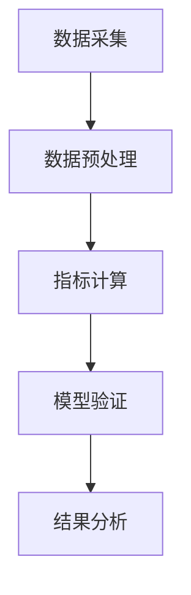
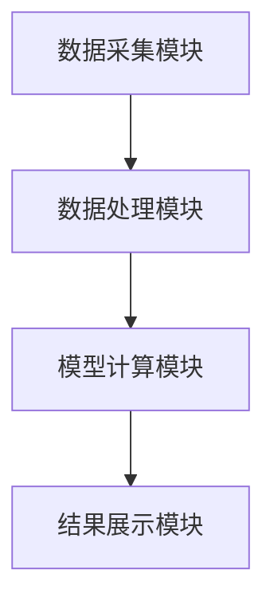
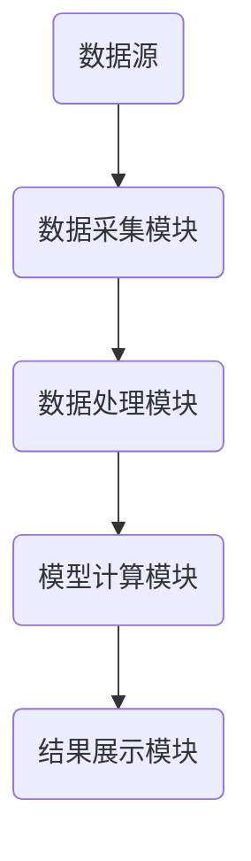
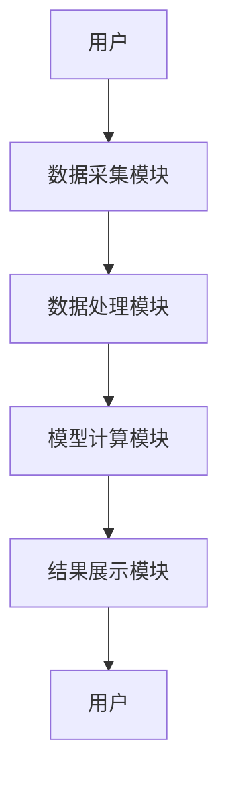

                 


# 《企业估值中的研发效率评估》

## 关键词：企业估值，研发效率，研发效率评估，研发效率模型，企业价值评估，研发项目管理

## 摘要：企业估值中的研发效率评估是企业在科技竞争中保持优势的关键因素。研发效率决定了企业将技术转化为实际价值的速度和质量，影响着企业的市场竞争力和长期发展潜力。本文章从研发效率评估的核心概念、数学模型、系统设计、项目实战等多维度展开，详细阐述研发效率评估在企业估值中的重要性、方法和应用，帮助企业更好地理解和提升研发效率，从而在竞争激烈的市场环境中脱颖而出。

---

# 第1章 研发效率评估的背景与问题背景

## 1.1 研发效率评估的背景

### 1.1.1 研发效率评估的定义与概念
研发效率评估是指通过量化和分析研发过程中的各项指标，评估企业在研发活动中的效率和效果。研发效率是企业技术竞争力和创新能力的直接体现，也是企业估值的重要依据之一。

### 1.1.2 研发效率评估的重要性
- **技术竞争力**：研发效率高的企业能够更快地推出新产品，满足市场需求。
- **成本控制**：高效的研发过程可以降低研发成本，提升企业的盈利能力。
- **企业估值**：研发效率是企业估值的重要参考指标，影响投资者对企业未来发展的预期。

### 1.1.3 研发效率评估的边界与外延
- **边界**：研发效率评估主要关注研发过程中的效率，不涉及生产或销售环节。
- **外延**：研发效率评估可以延伸到技术转化效率、团队协作效率等方面。

## 1.2 企业估值与研发效率的关系

### 1.2.1 企业估值的核心要素
企业估值的核心要素包括收入、利润、市场份额、技术创新能力等，其中技术创新能力是研发效率的重要体现。

### 1.2.2 研发效率对估值的影响
研发效率高的企业通常具有更强的技术创新能力，能够更快地推出新产品，从而提升企业估值。

### 1.2.3 研发效率评估的行业背景
在科技竞争日益激烈的今天，研发效率已经成为企业核心竞争力的重要组成部分。尤其是在高科技行业，研发效率是企业估值的关键因素之一。

## 1.3 研发效率评估的核心问题

### 1.3.1 研发效率评估的关键问题
- 如何量化研发过程中的各项指标？
- 如何建立科学的研发效率评估模型？
- 如何将研发效率与企业估值有效结合？

### 1.3.2 研发效率评估的难点与挑战
- 数据采集困难：研发过程中的数据往往分散且不完整。
- 模型复杂性：研发效率评估涉及多维度的指标，模型构建难度大。
- 行业差异：不同行业对研发效率的定义和评估标准不同。

### 1.3.3 研发效率评估的解决方案
- 建立统一的研发效率评估体系。
- 引入先进的数据分析技术，如机器学习和大数据分析。
- 结合行业特点，制定个性化的评估标准。

## 1.4 本章小结
本章从研发效率评估的背景出发，分析了研发效率评估的重要性及其在企业估值中的作用，提出了研发效率评估的核心问题和解决方案。

---

# 第2章 研发效率评估的核心概念与理论基础

## 2.1 研发效率的定义与属性

### 2.1.1 研发效率的定义
研发效率是指企业在单位时间内完成研发任务的数量和质量的综合体现。

### 2.1.2 研发效率的属性特征
- **数量效率**：单位时间内完成的研发任务数量。
- **质量效率**：研发成果的质量和创新性。
- **资源利用效率**：研发资源（人力、资金、时间）的利用效率。

### 2.1.3 研发效率的核心要素
- 研发团队能力
- 技术复杂度
- 资源配置效率
- 管理效率

## 2.2 研发效率评估的理论基础

### 2.2.1 研发效率评估的理论模型
研发效率评估的理论模型包括资源基础观、创新过程模型等。

### 2.2.2 研发效率评估的数学模型
- 研发效率指数模型
- 研发资源分配模型
- 研发成果预测模型

### 2.2.3 研发效率评估的实践框架
- 数据采集与整理
- 指标选择与权重分配
- 模型构建与验证
- 结果分析与应用

## 2.3 研发效率与企业估值的关系

### 2.3.1 研发效率对估值的影响机制
- 提高研发效率可以缩短产品开发周期，加快市场进入速度。
- 高效的研发过程可以降低研发成本，提升企业盈利能力。
- 高质量的创新成果可以提升企业的市场竞争力和品牌价值。

### 2.3.2 研发效率评估的指标体系
- 研发周期
- 研发成本
- 研发成果数量与质量
- 研发团队效率

### 2.3.3 研发效率评估的行业案例
- 高科技企业（如科技公司）
- 制药企业
- 软件开发企业

## 2.4 本章小结
本章详细阐述了研发效率的核心概念和理论基础，分析了研发效率与企业估值的关系，并提出了研发效率评估的指标体系和行业案例。

---

# 第3章 研发效率评估的数学模型

## 3.1 研发效率评估的数学模型

### 3.1.1 研发效率指数模型
$$
\text{研发效率指数} = \frac{\text{研发成果数量} \times \text{研发成果质量}}{\text{研发时间} \times \text{研发成本}}
$$

### 3.1.2 研发资源分配模型
$$
\text{资源分配效率} = \frac{\text{实际使用资源}}{\text{理论最优资源}}
$$

### 3.1.3 研发成果预测模型
$$
\text{预测成果数量} = a \times \text{研发团队数量} + b \times \text{技术复杂度} + c \times \text{管理效率}
$$

## 3.2 研发效率评估的算法原理

### 3.2.1 算法步骤
1. 数据采集：收集研发过程中的各项数据，包括时间、成本、成果数量等。
2. 数据预处理：对数据进行清洗和标准化处理。
3. 指标计算：根据数学模型计算各项指标。
4. 模型验证：通过实际案例验证模型的准确性。
5. 结果分析：根据模型结果提出改进建议。

### 3.2.2 算法流程图



## 3.3 研发效率评估的代码实现

### 3.3.1 环境安装
- Python 3.8+
- NumPy
- Pandas
- Matplotlib

### 3.3.2 核心代码实现

```python
import numpy as np
import pandas as pd
import matplotlib.pyplot as plt

def calculate_research_efficiency(research_data):
    # 计算研发效率指数
    efficiency = (research_data['成果数量'] * research_data['成果质量']) / (research_data['研发时间'] * research_data['研发成本'])
    return efficiency

def main():
    # 数据加载
    research_data = pd.read_csv('研发数据.csv')
    # 计算效率
    efficiency = calculate_research_efficiency(research_data)
    # 可视化
    plt.figure(figsize=(10,6))
    plt.plot(research_data['项目编号'], efficiency, 'b-', marker='o')
    plt.xlabel('项目编号')
    plt.ylabel('研发效率指数')
    plt.title('研发效率指数变化趋势')
    plt.show()

if __name__ == "__main__":
    main()
```

## 3.4 本章小结
本章详细介绍了研发效率评估的数学模型和算法原理，并通过代码示例展示了模型的应用过程。

---

# 第4章 研发效率评估的系统架构设计

## 4.1 系统功能设计

### 4.1.1 系统功能模块
- 数据采集模块
- 数据处理模块
- 模型计算模块
- 结果展示模块

### 4.1.2 系统功能流程图



## 4.2 系统架构设计

### 4.2.1 系统架构图



### 4.2.2 系统接口设计
- 数据接口：提供数据导入和导出功能。
- 计算接口：提供模型计算的API。
- 展示接口：提供结果展示的可视化界面。

## 4.3 系统交互设计

### 4.3.1 系统交互流程图



## 4.4 本章小结
本章详细介绍了研发效率评估系统的架构设计和交互流程，为实际应用提供了理论基础。

---

# 第5章 研发效率评估的项目实战

## 5.1 环境安装与数据准备

### 5.1.1 环境安装
- 安装Python和必要的库（NumPy、Pandas、Matplotlib）。
- 数据准备：收集研发过程中的各项数据，存储为CSV文件。

## 5.2 核心代码实现

### 5.2.1 数据加载与预处理

```python
import pandas as pd

# 加载数据
data = pd.read_csv('研发数据.csv')
# 数据预处理
data = data.dropna()
data['研发效率'] = (data['成果数量'] * data['成果质量']) / (data['研发时间'] * data['研发成本'])
```

### 5.2.2 模型计算与结果展示

```python
import matplotlib.pyplot as plt

# 计算效率
efficiency = data['研发效率']
# 可视化
plt.figure(figsize=(10,6))
plt.plot(data['项目编号'], efficiency, 'b-', marker='o')
plt.xlabel('项目编号')
plt.ylabel('研发效率')
plt.title('研发效率变化趋势')
plt.show()
```

## 5.3 案例分析与结果解读

### 5.3.1 案例分析
- 数据分析：通过图表展示研发效率的变化趋势。
- 结果解读：分析影响研发效率的主要因素。

### 5.3.2 改进建议
- 提高研发团队的能力。
- 优化资源分配效率。
- 引入先进的研发管理方法。

## 5.4 本章小结
本章通过实际案例展示了研发效率评估的项目实战过程，包括数据准备、模型计算和结果分析。

---

# 第6章 总结与展望

## 6.1 本章总结
本文章从研发效率评估的核心概念、数学模型、系统设计和项目实战等多维度展开，详细阐述了研发效率评估在企业估值中的重要性、方法和应用。

## 6.2 未来展望
未来，研发效率评估将更加注重数据驱动和智能化，结合人工智能和大数据分析技术，进一步提升评估的准确性和实用性。

## 6.3 注意事项
- 数据的准确性和完整性是研发效率评估的基础。
- 模型的选择和优化需要结合企业的实际情况。
- 研发效率评估的结果需要与企业的战略目标相结合。

## 6.4 拓展阅读
- 《软件工程：实践者的研究方法》
- 《企业估值与金融分析》

---

# 作者

作者：AI天才研究院/AI Genius Institute & 禅与计算机程序设计艺术 /Zen And The Art of Computer Programming

---

感谢您的阅读！如需进一步了解，请关注我们的公众号或访问官方网站获取更多深度技术内容。

