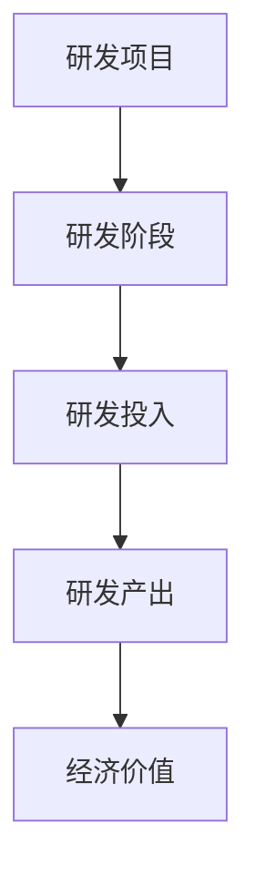
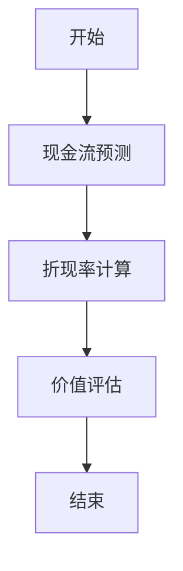
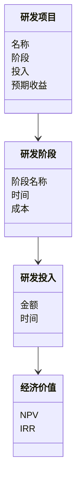
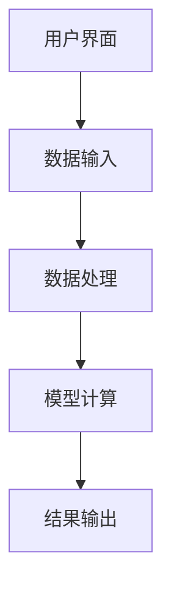
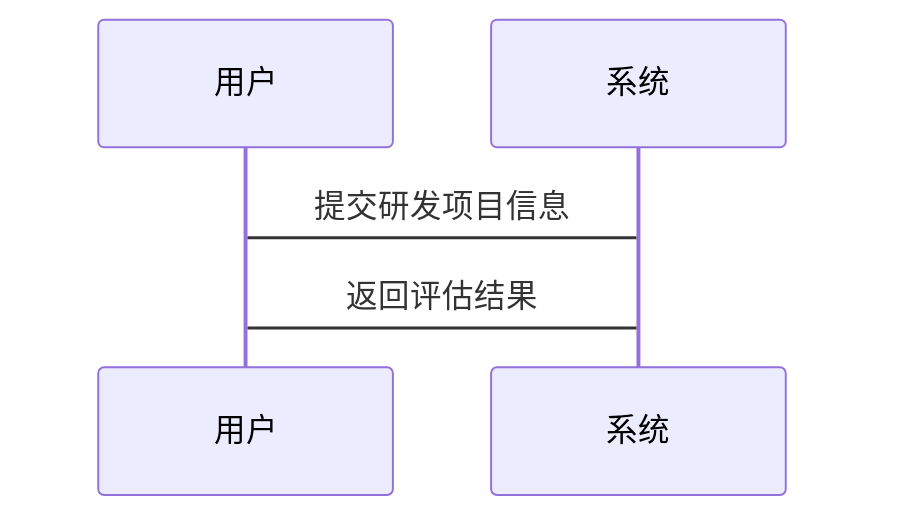

                 


# 企业估值中的研发管线价值评估

---

## 关键词  
企业估值, 研发管线, 研发项目, 研发价值, 研发评估

---

## 摘要  
研发管线是企业核心竞争力的重要组成部分，其价值直接影响企业的整体估值。本文从研发管线的背景、核心概念、算法原理、系统设计、项目实战等多维度进行详细分析，探讨如何科学评估研发管线的价值，为企业的估值提供有力支持。通过贴现现金流模型、相对估值法等方法，结合实际案例，帮助读者理解研发管线在企业估值中的重要性，并掌握具体的评估方法和技巧。

---

## 第一部分: 研发管线价值评估的背景与核心概念

### 第1章: 研发管线价值评估的背景与意义

#### 1.1 研发管线的基本概念
- **研发管线的定义**：研发管线是指企业在研发过程中，从初期创意到最终商业化的一系列项目和阶段。它涵盖了从基础研究到产品开发的全过程。
- **核心要素**：
  - 项目阶段：如概念阶段、开发阶段、测试阶段等。
  - 投入资源：包括资金、人力、时间等。
  - 预期产出：如新产品、技术突破、市场收益等。
- **研发管线与企业价值的关系**：研发管线的健康与否直接影响企业的未来收益和成长潜力，进而影响企业估值。

#### 1.2 研发管线价值评估的必要性
- **企业估值的关键因素**：除了财务表现，研发管线的价值是技术创新型企业估值的核心。
- **研发管线对企业未来收益的影响**：成功的研发项目能够为企业带来长期的收益增长。
- **行业差异**：不同行业的研发周期和风险不同，评估方法需针对性调整。

### 第2章: 研发管线价值评估的核心概念与联系

#### 2.1 研发管线价值评估的原理
- **研发管线的生命周期与价值分布**：从早期阶段到商业化，价值逐步体现。
- **研发管线的阶段划分与价值权重**：不同阶段的项目对整体价值的贡献不同。
- **研发管线的不确定性与风险评估**：通过概率模型评估项目成功的可能性。

#### 2.2 研发管线价值评估的关键指标
- **市场潜力评估**：市场规模、增长速度、竞争情况等。
- **技术可行性分析**：技术成熟度、专利情况、技术团队能力等。
- **经济收益预测**：销售收入、成本、利润等的预测。

#### 2.3 研发管线价值评估的数学模型与公式
- **贴现现金流模型**：计算未来现金流的现值，评估当前价值。
  $$ V = \sum_{t=1}^{n} \frac{CF_t}{(1 + r)^t} $$
  其中，\( CF_t \) 为第 \( t \) 年的现金流，\( r \) 为折现率，\( n \) 为项目周期。
- **风险调整模型**：考虑项目失败的概率，调整预期现金流。
  $$ V = E[ \text{NPV} ] = E[ \sum_{t=1}^{n} \frac{CF_t}{(1 + r)^t} ] $$

#### 2.4 研发管线价值评估的ER实体关系图


---

## 第3章: 研发管线价值评估的算法原理

### 3.1 贴现现金流模型的实现
- **现金流预测**：基于研发项目的阶段和市场情况，预测各阶段的现金流。
- **折现率计算**：根据项目的特有风险和市场利率，确定合适的折现率。
- **价值评估**：将未来现金流贴现，计算当前价值。

### 3.2 算法原理的mermaid流程图


### 3.3 算法实现的Python代码
```python
def discounted_cash_flow(cash_flows, discount_rate):
    present_value = 0
    for t, cf in enumerate(cash_flows):
        present_value += cf / (1 + discount_rate) ** t
    return present_value

# 示例：评估一个研发项目，假设现金流为 [100, 200, 300]，折现率为 10%
cf = [100, 200, 300]
rate = 0.1
print(discounted_cash_flow(cf, rate))  # 输出现值
```

---

## 第4章: 研发管线价值评估的系统分析与架构设计

### 4.1 问题场景介绍
- **研发管线评估系统的需求**：企业需要一个系统化的工具来评估研发管线的价值。
- **系统功能设计**：包括数据输入、模型计算、结果输出等功能。

### 4.2 系统功能设计（领域模型类图）


### 4.3 系统架构设计（架构图）


### 4.4 系统接口设计
- **输入接口**：接收研发项目的详细信息。
- **输出接口**：展示评估结果，如NPV、IRR等。

### 4.5 系统交互设计（序列图）


---

## 第5章: 研发管线价值评估的项目实战

### 5.1 环境配置
- **工具安装**：安装Python和必要的库（如numpy、pandas）。
- **数据准备**：收集研发项目的现金流数据和相关参数。

### 5.2 核心实现代码
```python
import numpy as np

def calculate_npv(cash_flows, discount_rate):
    return np.npv(discount_rate, *cash_flows[::-1])

def calculate_irr(cash_flows):
    return np.irr(cash_flows)

# 示例数据
cf = [-100, 200, 300]
rate = 0.1

npv = calculate_npv(cf, rate)
irr = calculate_irr(cf)

print(f"NPV: {npv}, IRR: {irr}")
```

### 5.3 实际案例分析
- **案例背景**：某科技公司有两个研发项目，A和B，现金流分别为 [200, 300] 和 [100, 400]，折现率为10%。
- **评估结果**：
  - 项目A的NPV为 $200/(1.1) + 300/(1.1)^2 ≈ 420.16
  - 项目B的NPV为 $100/(1.1) + 400/(1.1)^2 ≈ 363.64
- **结论**：项目A的价值高于项目B。

---

## 第6章: 研发管线价值评估的最佳实践

### 6.1 总结与经验分享
- **总结**：研发管线的价值评估是企业估值的重要部分，需要结合项目阶段、市场潜力和经济收益。
- **经验分享**：使用多种方法（如NPV和IRR）进行综合评估，降低单一方法的局限性。

### 6.2 注意事项
- **数据准确性**：确保输入数据的准确性和完整性。
- **模型假设**：合理假设折现率和项目周期，避免偏差。
- **风险管理**：考虑项目的不确定性，建立风险调整机制。

### 6.3 拓展阅读
- 推荐书籍：《企业价值评估》、《研发管理》。
- 推荐工具：Excel、Python（Pandas、NumPy）。

---

## 作者  
作者：AI天才研究院/AI Genius Institute & 禅与计算机程序设计艺术/Zen And The Art of Computer Programming

---

以上是《企业估值中的研发管线价值评估》的详细目录和内容概述。希望这篇文章能为读者提供清晰的思路和实用的方法，帮助他们在企业估值中更好地评估研发管线的价值。

