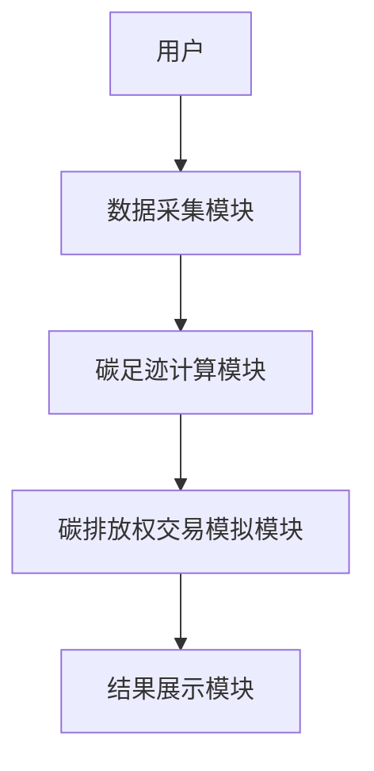

                 

# 企业估值中的碳中和战略评估

> 关键词：碳中和、企业估值、碳足迹、绿色金融、碳排放权、可持续发展

> 摘要：随着全球气候变化问题的加剧，碳中和已成为企业和国家实现可持续发展的重要战略目标。本文将从碳中和的定义、企业估值中的碳中和战略、碳中和战略评估的方法与模型、碳中和对资产价值的影响以及碳中和战略的数学模型与公式等方面展开详细分析。通过结合实际案例和系统架构设计，本文旨在为企业提供一个全面的碳中和战略评估框架，帮助企业在实现碳中和目标的同时，提升企业估值和竞争力。

---

## 第一部分：碳中和的背景与意义

### 第1章：碳中和的定义与目标

#### 1.1 碳中和的定义
- 1.1.1 碳中和的定义：碳中和是指在一定时间内，通过减少温室气体排放和增加碳汇，使二氧化碳的净排放量为零。
- 1.1.2 碳中和的目标：实现全球气候变化的缓解，推动可持续发展。
- 1.1.3 碳中和与企业发展的关系：企业通过实现碳中和，提升品牌形象和竞争力。

#### 1.2 碳中和对全球经济的影响
- 1.2.1 碳中和对全球经济的正面影响：推动绿色技术发展，创造新的经济增长点。
- 1.2.2 碳中和对全球经济的负面影响：短期内可能增加企业的运营成本。
- 1.2.3 碳中和的全球趋势：各国政府和企业纷纷制定碳中和目标，推动全球绿色转型。

---

## 第二部分：碳中和战略与企业估值

### 第2章：企业估值中的碳中和战略

#### 2.1 碳中和战略对企业估值的核心影响
- 2.1.1 碳中和对企业财务表现的影响：通过减少碳排放，降低运营成本。
- 2.1.2 碳中和对企业资产价值的影响：碳中和相关资产（如可再生能源）的价值上升。
- 2.1.3 碳中和对风险管理的影响：降低因碳排放问题导致的法律和声誉风险。

#### 2.2 碳中和战略的实施路径
- 2.2.1 设定碳中和目标：企业需明确自身的碳中和时间表。
- 2.2.2 制定碳减排计划：通过技术创新和管理优化减少碳排放。
- 2.2.3 投资碳中和项目：企业可通过投资绿色能源、碳汇项目等方式实现碳中和。

---

## 第三部分：碳中和战略评估的方法与模型

### 第3章：碳中和战略评估的核心方法

#### 3.1 碳足迹分析方法
- 3.1.1 碳足迹的定义：企业或产品在整个生命周期内产生的温室气体排放的总和。
- 3.1.2 碳足迹的计算步骤：
  1. 确定企业或产品的生命周期。
  2. 识别每个阶段的温室气体排放源。
  3. 计算各阶段的温室气体排放量。
  4. 总结并分析结果。
- 3.1.3 碳足迹分析的工具与方法：使用生命周期评估（LCA）方法。

#### 3.2 碳排放权交易模型
- 3.2.1 碳排放权的定义：企业获得的一定时期内的碳排放配额。
- 3.2.2 碳排放权交易的机制：
  1. 政府分配碳排放配额。
  2. 企业通过交易市场买卖碳排放配额。
  3. 超额排放的企业需购买配额或支付罚款。
- 3.2.3 碳排放权交易对企业估值的影响：企业通过减少碳排放或出售配额获得经济收益。

---

## 第四部分：碳中和战略评估的数学模型与公式

### 第4章：碳中和战略评估的数学模型

#### 4.1 碳排放总量计算公式
$$ \text{碳排放总量} = \sum_{i=1}^{n} \text{活动}_i \times \text{排放因子}_i $$

#### 4.2 碳足迹计算模型
$$ \text{碳足迹} = \sum_{j=1}^{m} \text{过程}_j \times \text{排放强度}_j $$

#### 4.3 碳排放权交易的经济价值评估
$$ \text{经济价值} = \sum_{k=1}^{p} \text{配额}_k \times \text{碳价格}_k $$

---

## 第五部分：系统架构与项目实战

### 第5章：系统架构设计

#### 5.1 碳中和战略评估系统的功能模块
- 5.1.1 碳排放数据采集模块：收集企业的生产过程中的碳排放数据。
- 5.1.2 碳足迹计算模块：基于数据计算企业的碳足迹。
- 5.1.3 碳排放权交易模拟模块：模拟碳排放权交易的经济价值。

#### 5.2 碳中和战略评估系统的架构图

---

## 第六部分：最佳实践与未来展望

### 第6章：最佳实践与小结

#### 6.1 碳中和战略评估的注意事项
- 6.1.1 数据的准确性和完整性：确保碳排放数据的可靠性和可追溯性。
- 6.1.2 模型的适用性：选择适合企业实际情况的碳中和评估模型。
- 6.1.3 风险管理：制定应对碳中和过程中可能出现的风险的策略。

#### 6.2 碳中和战略的未来趋势
- 6.2.1 绿色金融工具的创新：发展碳债券、碳基金等金融工具。
- 6.2.2 数字化技术的应用：利用大数据和人工智能技术优化碳中和战略评估。
- 6.2.3 全球合作与交流：各国企业加强合作，共同推动碳中和目标的实现。

---

## 作者：AI天才研究院/AI Genius Institute & 禅与计算机程序设计艺术 /Zen And The Art of Computer Programming

---

以上是《企业估值中的碳中和战略评估》的目录大纲。接下来，我会根据这个大纲逐步展开撰写完整文章。

