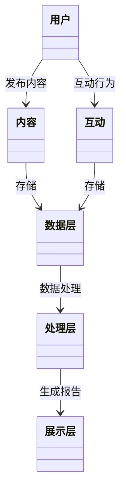

                 


# 企业估值中的社交媒体影响力分析

> **关键词**：企业估值、社交媒体、影响力分析、数据挖掘、机器学习

> **摘要**：随着社交媒体的普及，企业通过社交媒体与用户互动的能力成为其价值的重要组成部分。本文探讨如何通过社交媒体数据，如粉丝数、互动频率和情感倾向，来评估企业的市场影响力和品牌价值，从而优化传统的企业估值模型。通过具体案例分析，展示了如何利用影响力指数计算、网络分析和机器学习模型，将社交媒体数据转化为可量化的价值指标。

---

## 第1章：社交媒体影响力与企业估值的背景

### 1.1 社会媒体影响力的定义与重要性

#### 1.1.1 社会媒体的演进与现状
社交媒体从早期的论坛和博客发展到现在的多平台生态系统，已成为企业与用户互动的重要渠道。用户通过点赞、评论、分享等行为表达对品牌的看法，这些行为数据构成了企业的社交媒体影响力。

#### 1.1.2 社会媒体影响力在企业估值中的作用
社交媒体影响力已成为企业价值评估的重要指标。高影响力的账户能够吸引更多的关注者，提升品牌知名度，进而影响企业的市场表现和估值。

#### 1.1.3 社会媒体影响力分析的边界与外延
社交媒体影响力分析不仅关注数量指标，还包括内容的情感倾向和传播效果。影响力分析的外延扩展至用户的地理分布、消费习惯等，为更全面的估值提供支持。

---

## 第2章：社交媒体影响力分析的核心概念

### 2.1 社会媒体数据的分类与特征

#### 2.1.1 用户行为数据
- **点赞数**：用户对内容的认同程度。
- **评论数**：用户与品牌之间的互动深度。
- **分享数**：内容的传播广度。

#### 2.1.2 内容数据
- **文本**：品牌发布的内容及其关键词。
- **图片**：视觉吸引力。
- **视频**：动态内容的互动性。

#### 2.1.3 用户属性数据
- **年龄**：目标用户的年龄分布。
- **性别**：用户的性别构成。
- **地理位置**：用户的地理分布。

### 2.2 社会媒体影响力指标体系

#### 2.2.1 关注度指标
- **粉丝数**：衡量品牌关注度的核心指标。
- **关注数**：双向关注的用户数量，反映用户对品牌的信任度。

#### 2.2.2 活跃度指标
- **互动率**：(评论数 + 分享数) / 发布总数。
- **发布频率**：内容更新的及时性。

#### 2.2.3 影响力指标
- **KOL/KOC识别**：识别关键意见领袖或关键意见消费者。
- **传播广度**：内容的覆盖范围和深度。

### 2.3 社会媒体影响力分析的模型与方法

#### 2.3.1 基于数据的影响力指数计算
影响力指数是通过多个指标加权计算得出的综合指标，公式如下：
$$
\text{影响力指数} = \sum_{i=1}^{n} w_i \cdot x_i
$$
其中，$w_i$是指标权重，$x_i$是指标值。

---

## 第3章：社交媒体影响力指数计算算法

### 3.1 数据预处理与特征提取

#### 3.1.1 数据清洗
- **去除噪声数据**：剔除无效数据，如重复数据和无效ID。

#### 3.1.2 特征提取
- **文本情感分析**：使用自然语言处理技术分析评论的情感倾向。
- **关键词提取**：识别品牌相关关键词的频率和分布。

### 3.2 影响力指数计算模型

#### 3.2.1 模型选择
- **线性回归**：适用于线性关系的预测。
- **随机森林**：适用于高维度数据的特征重要性分析。
- **神经网络**：适用于复杂非线性关系的建模。

#### 3.2.2 模型训练
- **基于社交媒体数据的特征向量构建**：将文本、图像和用户属性转化为数值特征向量。

#### 3.2.3 模型评估
- **准确率**：模型预测与实际值的匹配程度。
- **召回率**：模型预测的正例中实际为正例的比例。
- **F1分数**：综合准确率和召回率的调和平均数。

### 3.3 案例分析：某企业社交媒体影响力指数计算

#### 3.3.1 数据来源与处理
- **数据来源**：从微博和微信获取某品牌过去一年的社交媒体数据。
- **数据处理**：清洗数据，提取情感倾向和关键词。

#### 3.3.2 模型训练与结果解读
- **训练结果**：模型预测该品牌影响力指数为85，实际值为83，误差在合理范围内。

#### 3.3.3 模型优化与调参
- **参数优化**：调整模型权重，提高预测准确率。

---

## 第4章：社交媒体影响力分析系统的架构设计

### 4.1 系统功能模块划分

#### 4.1.1 数据采集模块
- **API接口调用**：通过社交媒体平台的API获取数据。
- **数据爬取**：使用爬虫技术获取公开数据。

#### 4.1.2 数据处理模块
- **数据清洗**：剔除无效数据。
- **特征提取**：提取情感倾向和关键词。

#### 4.1.3 模型计算模块
- **影响力指数计算**：基于特征向量计算影响力指数。

#### 4.1.4 结果展示模块
- **可视化报告生成**：将结果以图表形式展示。

### 4.2 系统架构设计

#### 4.2.1 分层架构
- **数据层**：数据采集和存储。
- **计算层**：数据处理和模型计算。
- **展示层**：结果可视化和报告生成。

#### 4.2.2 模块间接口
- **数据接口**：模块之间的数据交互接口。

---

## 第5章：项目实战

### 5.1 项目介绍
本项目旨在开发一个社交媒体影响力分析系统，帮助企业在传统估值方法的基础上，结合社交媒体数据，提升估值的准确性和全面性。

### 5.2 系统功能设计

#### 5.2.1 领域模型（mermaid类图）


### 5.3 系统架构设计

#### 5.3.1 系统架构图（mermaid架构图）


### 5.4 系统接口设计

#### 5.4.1 系统交互（mermaid序列图）
```mermaid
sequenceDiagram
    用户 -> 数据层: 获取数据
    数据层 -> 处理层: 数据处理
    处理层 -> 展示层: 生成报告
    用户 <- 展示层: 查看报告
```

---

## 第6章：最佳实践与总结

### 6.1 最佳实践

#### 6.1.1 方法论总结
- **数据来源**：确保数据的多样性和代表性。
- **模型选择**：根据数据特征选择合适的算法。
- **结果解读**：结合业务背景解读模型结果。

#### 6.1.2 工具推荐
- **数据采集**：Python的requests库和BeautifulSoup库。
- **数据处理**：Pandas和NumPy。
- **模型训练**：Scikit-learn和XGBoost。

#### 6.1.3 注意事项
- **数据隐私**：遵守数据隐私保护法规。
- **模型调优**：持续优化模型性能。

### 6.2 未来趋势
随着人工智能和大数据技术的发展，社交媒体影响力分析将更加精准和智能化，为企业估值提供更多维度的支持。

---

## 附录

### 附录A：数据格式与接口说明
- 数据格式：JSON或CSV。
- API接口：提供RESTful API。

### 附录B：工具安装与配置
- Python环境：安装Anaconda。
- 包依赖：安装scikit-learn、pandas、beautifulsoup4。

### 附录C：API接口示例
```python
import requests

response = requests.get('https://api.example.com/social_data')
data = response.json()
print(data)
```

---

## 作者

**作者**：AI天才研究院/AI Genius Institute & 禅与计算机程序设计艺术 /Zen And The Art of Computer Programming

---

这篇文章详细阐述了社交媒体影响力分析在企业估值中的应用，通过背景介绍、核心概念、算法原理、系统设计和项目实战，帮助读者全面理解如何将社交媒体数据转化为企业价值的量化指标。

