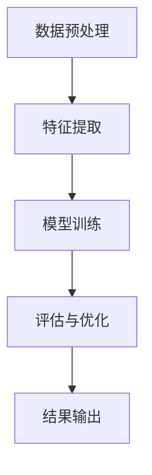

                 


# 企业估值中的社交媒体影响力评估

## 关键词
企业估值、社交媒体、影响力评估、数据驱动、算法原理、系统架构

## 摘要
在当今数字化时代，社交媒体已经成为企业与用户互动的重要渠道，企业的社交媒体影响力不仅影响其品牌形象，还直接影响其市场价值。本文从企业估值的视角，系统性地探讨社交媒体影响力评估的核心概念、方法、算法和系统架构，旨在为企业提供一种全新的估值维度。

---

# 第一部分: 企业估值与社交媒体影响力概述

## 第1章: 背景介绍

### 1.1 问题背景
#### 1.1.1 传统企业估值方法的局限性
传统的企业估值方法主要依赖财务数据（如收入、利润、资产等），但这些方法难以全面反映企业的市场影响力和品牌价值。特别是在数字时代，社交媒体上的用户互动、内容传播等数据能够提供额外的估值维度。

#### 1.1.2 社交媒体对企业价值的影响
社交媒体上的用户互动、内容传播和品牌曝光直接影响企业的市场影响力。例如，一个品牌的社交媒体粉丝数、互动率和内容传播速度可以反映其品牌知名度和用户忠诚度。

#### 1.1.3 社交媒体影响力评估的必要性
企业需要通过社交媒体影响力评估来补充传统估值方法的不足，从而更全面地反映企业的市场价值。

### 1.2 问题描述
#### 1.2.1 什么是社交媒体影响力
社交媒体影响力是指企业在社交媒体平台上通过内容传播、用户互动等方式所形成的市场影响力和品牌价值。

#### 1.2.2 社交媒体影响力与企业估值的关系
社交媒体影响力是企业市场价值的重要组成部分。通过分析社交媒体数据，可以更准确地评估企业的品牌价值和市场潜力。

#### 1.2.3 社交媒体影响力评估的核心问题
如何量化社交媒体上的用户互动、内容传播和品牌曝光，以及如何将这些数据与企业的市场价值结合起来。

### 1.3 问题解决
#### 1.3.1 社交媒体影响力评估的目标
量化企业在社交媒体上的影响力，为企业的市场估值提供数据支持。

#### 1.3.2 评估指标的选择与权重分配
选择关键指标（如粉丝数、互动率、内容传播速度等），并根据行业特点和企业目标分配权重。

#### 1.3.3 数据收集与处理方法
通过社交媒体API获取数据，并对数据进行清洗和预处理。

### 1.4 边界与外延
#### 1.4.1 社交媒体影响力评估的适用范围
适用于所有通过社交媒体进行品牌推广的企业。

#### 1.4.2 与其他估值方法的结合
社交媒体影响力评估可以与财务指标、市场占有率等其他估值方法结合，形成更全面的估值模型。

#### 1.4.3 行业差异对评估的影响
不同行业的社交媒体影响力评估指标和权重可能不同，需要根据具体行业特点进行调整。

### 1.5 概念结构与核心要素
#### 1.5.1 核心概念框架
社交媒体影响力评估框架包括用户行为数据、内容传播数据和品牌曝光数据。

#### 1.5.2 核心要素的定义与属性
- 用户行为数据：粉丝数、活跃用户数、互动次数等。
- 内容传播数据：内容传播速度、覆盖范围、用户参与度等。
- 品牌曝光数据：品牌提及量、情感分析结果等。

#### 1.5.3 框架的逻辑关系
通过分析用户行为、内容传播和品牌曝光，可以量化企业的社交媒体影响力，并将其与市场价值结合起来。

---

## 第2章: 核心概念与联系

### 2.1 核心概念原理
#### 2.1.1 社交媒体影响力评估的基本原理
通过分析社交媒体上的用户行为和内容传播数据，量化企业的市场影响力。

#### 2.1.2 数据驱动的影响力分析
利用大数据技术，对社交媒体上的用户行为和内容传播数据进行分析，提取关键指标。

#### 2.1.3 多维度评估模型的构建
构建一个多维度的评估模型，综合考虑用户行为、内容传播和品牌曝光等因素。

### 2.2 概念属性特征对比
#### 2.2.1 不同社交媒体平台的特征对比
- 微博：用户活跃度高，适合品牌曝光。
- 微信：用户群体较为稳定，适合深度互动。
- Facebook：适合品牌全球化传播。

#### 2.2.2 不同用户群体的行为特征对比
- 年轻用户：更倾向于互动和内容分享。
- 中老年用户：更倾向于阅读和点赞。

#### 2.2.3 不同内容类型的传播效果对比
- 文本内容：传播速度较慢，但互动率高。
- 视频内容：传播速度快，覆盖范围广。

### 2.3 ER实体关系图
```mermaid
er
    actor: 用户
    content: 内容
    interaction: 互动
    platform: 平台
    actor --> content: 发布
    actor --> interaction: 产生
    content --> interaction: 引发
    actor --> platform: 使用
    content --> platform: 存储
    interaction --> platform: 记录
```

---

## 第3章: 算法原理讲解

### 3.1 算法流程


### 3.2 源代码实现
```python
# 示例代码：社交媒体影响力评估模型
import pandas as pd
from sklearn.linear_model import LinearRegression

# 数据预处理
data = pd.read_csv('social_media_data.csv')
data = data.dropna()
data['粉丝数'] = data['粉丝数'].astype(int)
data['互动次数'] = data['互动次数'].astype(int)

# 特征提取
X = data[['粉丝数', '互动次数', '内容传播速度']]
y = data['品牌价值']

# 模型训练
model = LinearRegression()
model.fit(X, y)

# 评估与优化
print(model.score(X, y))
print(model.coef_)
```

### 3.3 数学模型与公式
社交媒体影响力评估模型可以表示为：
$$
\text{品牌价值} = \beta_0 + \beta_1 \times \text{粉丝数} + \beta_2 \times \text{互动次数} + \beta_3 \times \text{内容传播速度} + \epsilon
$$

---

## 第4章: 系统分析与架构设计

### 4.1 问题场景介绍
企业需要通过社交媒体数据，评估其品牌价值，并将其与传统估值方法结合，形成更全面的企业估值模型。

### 4.2 项目介绍
本项目旨在构建一个社交媒体影响力评估系统，通过数据采集、处理、分析和可视化，帮助企业更准确地评估品牌价值。

### 4.3 系统功能设计
- 数据采集模块：通过API获取社交媒体数据。
- 数据处理模块：清洗和预处理数据。
- 数据分析模块：提取特征并训练模型。
- 数据可视化模块：生成报告和图表。

### 4.4 系统架构设计


### 4.5 系统接口设计
- 数据采集接口：提供API接口，用于获取社交媒体数据。
- 数据处理接口：接收原始数据，返回处理后的数据。
- 数据分析接口：接收处理后的数据，返回评估结果。

### 4.6 系统交互
```mermaid
sequenceDiagram
    actor 用户
    system 系统
    用户->系统: 提交社交媒体数据
    系统->用户: 返回品牌价值评估报告
```

---

## 第5章: 项目实战

### 5.1 环境安装
安装Python和相关库：
```
pip install pandas scikit-learn matplotlib
```

### 5.2 核心实现
```python
# 示例代码：社交媒体影响力评估模型实现
import pandas as pd
from sklearn.linear_model import LinearRegression
import matplotlib.pyplot as plt

# 数据预处理
data = pd.read_csv('social_media_data.csv')
data = data.dropna()
data['粉丝数'] = data['粉丝数'].astype(int)
data['互动次数'] = data['互动次数'].astype(int)

# 特征提取
X = data[['粉丝数', '互动次数', '内容传播速度']]
y = data['品牌价值']

# 模型训练
model = LinearRegression()
model.fit(X, y)

# 可视化
plt.scatter(y, model.predict(X))
plt.xlabel('实际品牌价值')
plt.ylabel('预测品牌价值')
plt.show()
```

### 5.3 案例分析
以某品牌为例，分析其社交媒体数据，训练模型，并生成品牌价值评估报告。

### 5.4 代码解读与分析
- 数据预处理：清洗和转换数据。
- 特征提取：选择关键指标。
- 模型训练：使用线性回归模型。
- 可视化：绘制实际值与预测值的散点图。

### 5.5 项目小结
通过项目实战，验证了社交媒体影响力评估模型的有效性，并为企业提供了一种新的估值方法。

---

## 第6章: 总结与展望

### 6.1 最佳实践 tips
- 数据质量是关键，确保数据的准确性和完整性。
- 根据行业特点调整评估指标和权重。
- 结合传统估值方法，形成更全面的评估模型。

### 6.2 小结
社交媒体影响力评估为企业提供了一种新的估值维度，通过分析社交媒体数据，可以更准确地评估企业的市场价值。

### 6.3 注意事项
- 数据隐私和安全问题需要注意。
- 模型需要定期更新，以适应社交媒体环境的变化。

### 6.4 拓展阅读
- 《社交网络分析》
- 《大数据与企业估值》

---

## 作者：AI天才研究院/AI Genius Institute & 禅与计算机程序设计艺术/Zen And The Art of Computer Programming

