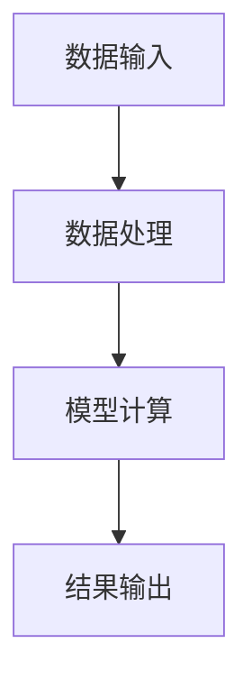

                 


# 《企业估值中的税收影响分析》

---

## 关键词

- 企业估值
- 税收影响
- 税收调整模型
- 税率敏感性分析
- 税后现金流折现法

---

## 摘要

本文详细探讨了税收在企业估值中的重要影响，分析了不同税种对企业价值的具体影响机制。通过数学模型和算法原理，本文提出了税收调整模型，并结合实际案例，展示了如何将这些模型应用于企业估值的实践中。文章还详细介绍了系统架构设计和项目实战，为读者提供了全面的分析框架和实用工具。

---

## 1. 引言

企业在进行估值时，税收是一个不可忽视的重要因素。税收直接影响企业的净利润和现金流，进而影响企业的整体价值。本文将从企业所得税、增值税等税种入手，分析它们如何影响企业估值，并提出相应的数学模型和算法，帮助读者更好地理解和应用这些模型。

---

## 2. 企业所得税与估值影响

### 2.1 企业所得税的基本概念

企业所得税是企业缴纳的主要税种之一，其计算公式为：

$$\text{企业所得税} = \text{净利润} \times \text{税率}$$

企业所得税的税率和优惠政策直接影响企业的税后利润，进而影响企业的估值。

### 2.2 企业所得税对估值的影响

#### 2.2.1 税后现金流折现法

税后现金流折现法是将企业的未来现金流按税后金额进行折现，计算现值。公式如下：

$$\text{企业价值} = \sum_{t=1}^{n} \frac{\text{现金流}_t}{(1 + r)^t}$$

其中，\( r \) 是折现率，通常包括风险溢价和税率调整因素。

#### 2.2.2 税率变化的影响

税率的变化直接影响企业的税后利润，从而影响企业的估值。例如，税率从20%提高到25%，企业的净利润将减少5%，从而影响企业的整体估值。

#### 2.2.3 税收优惠政策的优化作用

税收优惠政策可以降低企业的税负，增加现金流，进而提高企业的估值。例如，高新技术企业享受15%的所得税率，比标准税率25%低10个百分点，显著提高企业利润。

---

## 3. 其他税种对估值的影响

### 3.1 增值税与企业估值

增值税是对商品和服务在每个环节的增值部分征税，其计算公式为：

$$\text{增值税} = \text{销售额} \times \text{税率} - \text{进项税额}$$

增值税影响企业的现金流，进而影响企业的估值。例如，增值税率的变化会直接影响企业的净利润和现金流。

### 3.2 其他税种的影响

消费税、资源税等其他税种也会影响企业的估值。消费税主要影响企业的销售收入，资源税则影响企业的生产成本。这些税种的变化都会通过影响企业的利润和现金流，进而影响企业的估值。

---

## 4. 税收影响的数学模型与算法原理

### 4.1 税收调整模型

#### 4.1.1 现金流折现法中的税收调整

在现金流折现法中，需要将税率调整为税后现金流。公式如下：

$$\text{税后现金流} = \text{净利润} \times (1 - \text{税率})$$

#### 4.1.2 税率敏感性分析

税率敏感性分析用于评估税率变化对企业估值的影响。公式如下：

$$\frac{\Delta \text{企业价值}}{\Delta \text{税率}} = -\frac{\text{企业价值}}{\text{税率}^2}$$

---

## 5. 系统架构设计

### 5.1 功能设计

系统功能包括数据输入、模型计算、结果输出等。

### 5.2 架构图

以下是系统的架构图：



### 5.3 接口设计

系统接口包括数据输入接口、模型计算接口和结果输出接口。

---

## 6. 项目实战

### 6.1 环境安装

需要安装Python和相关库，如numpy、pandas、scipy。

### 6.2 核心实现

以下是核心代码：

```python
import numpy as np
import pandas as pd
from scipy import optimize

def tax_adjusted_cash_flow(tax_rate, revenue, cost):
   净利润 = revenue - cost
    tax = 净利润 * tax_rate
    税后现金流 = 净利润 - tax
    return 税后现金流

# 示例计算
revenue = 1000
cost = 600
tax_rate = 0.25

现金流 = tax_adjusted_cash_flow(tax_rate, revenue, cost)
print("税后现金流:", 现金流)
```

---

## 7. 总结与展望

本文详细探讨了税收对企业估值的影响，提出了数学模型和算法，并结合实际案例进行了分析。未来的研究可以进一步探讨更多税种的影响，以及如何在复杂经济环境中优化税收调整模型。

---

## 作者

作者：AI天才研究院 & 禅与计算机程序设计艺术

---

希望这篇文章能为您提供有价值的信息和启发。

