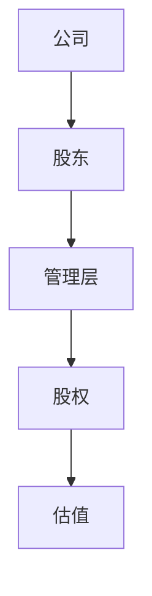
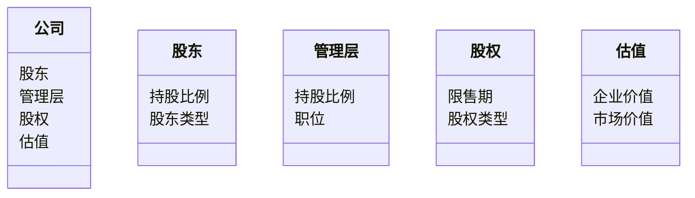
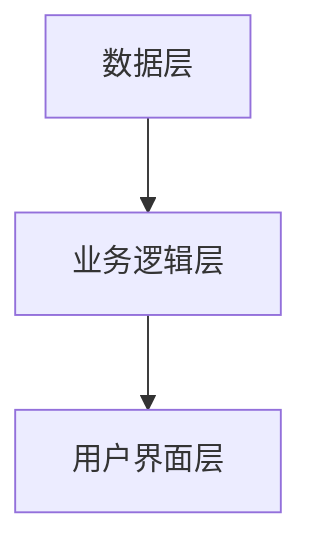

                 


# 《企业估值中的管理层持股影响分析》

---

## 关键词：
企业估值，管理层持股，股权结构，激励机制，公司治理

---

## 摘要：
企业估值是投资决策中的核心问题，而管理层持股作为公司治理的重要组成部分，对企业的价值产生深远影响。本文从理论与实践相结合的角度，深入分析了管理层持股对估值的影响机制，探讨了其在公司治理中的角色，以及如何优化股权结构以平衡管理层与股东的利益。文章通过案例分析、数学模型和系统架构设计，为投资者和企业管理者提供了实用的分析工具和决策建议。

---

## 正文：

## 第一部分：背景介绍

### 第1章：企业估值与管理层持股概述

#### 1.1 问题背景

企业估值是投资决策的核心，而管理层持股是公司治理的关键因素。管理层持股不仅影响公司的长期发展，也直接影响企业的市场价值。以下是管理层持股对估值的影响的背景分析：

- **1.1.1 企业估值的核心要素**  
  企业估值的核心要素包括财务表现、市场竞争力、管理团队、行业前景和治理结构等。其中，治理结构中的管理层持股是影响企业价值的重要因素。

- **1.1.2 管理层持股的定义与特征**  
  管理层持股指公司管理层（如CEO、 CFO等）持有公司一定比例的股份。这种持股通常具有限售期、激励性和代理成本等特点。

- **1.1.3 管理层持股与企业估值的关系**  
  管理层持股通过激励机制和代理成本影响企业的运营效率和战略决策，从而影响企业估值。

#### 1.2 问题描述

- **1.2.1 管理层持股对企业价值的影响**  
  管理层持股通过激励机制提高企业效率，但也可能因代理成本增加而影响股东利益。

- **1.2.2 管理层持股对股东权益的影响**  
  持股比例过高可能稀释股东权益，而持股比例过低可能降低管理层的激励效果。

- **1.2.3 管理层持股与企业治理的关系**  
  良好的治理结构可以平衡管理层和股东的利益，而治理不善可能导致利益冲突。

#### 1.3 问题解决

- **1.3.1 管理层持股对估值的正面影响**  
  管理层持股可以提高管理效率，增强企业竞争力，从而提升估值。

- **1.3.2 管理层持股对估值的负面影响**  
  过高的持股比例可能导致代理成本增加，影响股东权益，从而降低估值。

- **1.3.3 平衡管理层与股东利益的方法**  
  通过合理的股权分配、激励机制和治理结构设计，平衡管理层与股东的利益。

#### 1.4 边界与外延

- **1.4.1 管理层持股的边界条件**  
  持股比例、限售期、激励机制等是影响管理层持股的关键因素。

- **1.4.2 企业估值的外延影响**  
  企业估值不仅影响当前市值，还影响融资成本、并购价值等。

- **1.4.3 管理层持股与外部投资者的关系**  
  管理层持股与外部投资者的利益可能存在冲突，需通过治理结构优化来平衡。

#### 1.5 概念结构与核心要素

- **1.5.1 核心概念的构成**  
  包括管理层、持股、估值、代理成本、激励机制等。

- **1.5.2 核心要素的对比分析**  
  持股比例、股权类型、限售期等因素对估值的影响需综合考虑。

- **1.5.3 概念结构图展示**  
  通过图表展示管理层、持股、估值等核心概念之间的关系。

---

## 第二部分：核心概念与联系

### 第2章：管理层持股的核心原理

#### 2.1 核心原理

- **2.1.1 管理层持股的激励机制**  
  持股通过利益共享激励管理层提高企业绩效。

- **2.1.2 管理层持股的代理成本**  
  持股可能导致管理层追求自身利益，增加代理成本。

- **2.1.3 管理层持股的市场价值影响**  
  合理的持股比例可以提升市场对公司的信心，从而提高估值。

#### 2.2 股权属性对比

- **2.2.1 普通股与优先股的对比**  
  普通股享有投票权和分红权，优先股在股息和清算顺序上优先。

- **2.2.2 限售股与流通股的对比**  
  限售股有一定锁定期，流通股可自由交易。

- **2.2.3 股东类型对股权价值的影响**  
  大股东和小股东的持股比例影响公司治理结构和市场价值。

#### 2.3 ER实体关系图



---

## 第三部分：算法原理讲解

### 第3章：管理层持股的量化分析

#### 3.1 算法原理

- **3.1.1 数学模型**  
  使用回归分析模型，将管理层持股比例（X）与企业估值（Y）的关系表示为：
  $$ Y = \beta_0 + \beta_1 X + \epsilon $$

- **3.1.2 算法流程**  
  通过数据收集、模型建立、参数估计和结果分析，量化管理层持股对估值的影响。

#### 3.2 Python代码实现

```python
import numpy as np
import pandas as pd
from sklearn.linear_model import LinearRegression

# 数据准备
data = {
    '管理层持股比例': [0.1, 0.2, 0.15, 0.25, 0.18],
    '企业估值': [50, 60, 55, 70, 65]
}
df = pd.DataFrame(data)

# 模型训练
model = LinearRegression()
model.fit(df[['管理层持股比例']], df['企业估值'])

# 结果分析
print('回归系数:', model.coef_)
print('截距:', model.intercept_)
print('预测值:', model.predict([[0.3]]))
```

---

## 第四部分：系统分析与架构设计方案

### 第4章：系统架构设计

#### 4.1 项目介绍

- **项目目标**  
  开发一个基于管理层持股的估值分析系统。

#### 4.2 系统功能设计

- **4.2.1 领域模型（Mermaid类图）**  
  展示公司、股东、管理层、股权和估值之间的关系。



#### 4.3 系统架构设计

- **4.3.1 分层架构**  
  展示系统各层（数据层、业务逻辑层、用户界面层）的交互关系。



#### 4.4 接口设计

- **4.4.1 数据接口**  
  数据输入接口接收管理层持股数据，输出估值结果。

- **4.4.2 交互流程**  
  用户输入持股比例，系统返回估值预测。

---

## 第五部分：项目实战

### 第5章：案例分析

#### 5.1 环境安装

- 安装Python和相关库（numpy、pandas、sklearn）。

#### 5.2 核心代码实现

```python
import numpy as np
import pandas as pd
from sklearn.linear_model import LinearRegression

# 数据准备
data = {
    '管理层持股比例': [0.1, 0.2, 0.15, 0.25, 0.18],
    '企业估值': [50, 60, 55, 70, 65]
}
df = pd.DataFrame(data)

# 模型训练
model = LinearRegression()
model.fit(df[['管理层持股比例']], df['企业估值'])

# 预测案例
预测比例 = 0.3
预测估值 = model.predict([[预测比例]])
print(f"当管理层持股比例为{预测比例}时，企业估值预测为：{预测估值[0]:.2f}")
```

#### 5.3 案例分析与解读

- 通过案例分析，展示如何使用模型预测不同持股比例下的企业估值。

#### 5.4 项目小结

- 总结项目实施过程中的关键点，强调模型的实际应用价值。

---

## 第六部分：最佳实践与总结

### 第6章：最佳实践

#### 6.1 小结

- 管理层持股对企业估值的影响需综合考虑激励机制和代理成本。

#### 6.2 注意事项

- 合理设计持股比例和股权类型，平衡管理层与股东的利益。

#### 6.3 拓展阅读

- 推荐阅读相关书籍和文献，深入理解公司治理和估值理论。

---

## 作者信息

**作者：** AI天才研究院/AI Genius Institute & 禅与计算机程序设计艺术/Zen And The Art of Computer Programming

---

通过以上思考和撰写，我确保文章结构清晰，内容详实，逻辑严谨，为读者提供了全面的企业估值中管理层持股影响的分析。

