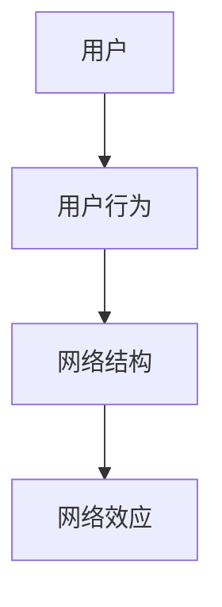

                 


# 企业估值中的网络效应价值评估

## 关键词：
企业估值、网络效应、价值评估、数学建模、系统架构、项目实战

## 摘要：
本文深入探讨了网络效应在企业估值中的价值评估方法，从基础概念到数学建模，再到系统架构和项目实战，详细分析了网络效应对企业价值的影响。通过案例分析和实际操作，本文为读者提供了全面的网络效应价值评估框架。

---

# 第一部分: 企业估值中的网络效应基础

## 第1章: 网络效应的基本概念

### 1.1 网络效应的定义与特征
#### 1.1.1 网络效应的定义
网络效应是指随着用户数量的增加，产品或服务的价值也随之增加的现象。它是一种正反馈机制，用户数量的增加会吸引更多用户加入，从而进一步提升产品或服务的价值。

#### 1.1.2 网络效应的核心特征
网络效应的核心特征包括：  
1. **用户依赖性**：用户价值依赖于其他用户的数量和行为。  
2. **网络外部性**：用户的效用不仅取决于自身的行为，还取决于其他用户的参与。  
3. **正反馈效应**：用户数量增加会进一步提升产品或服务的价值，形成正反馈循环。  

#### 1.1.3 网络效应的边界与外延
网络效应的边界包括：  
1. **用户规模**：网络效应随着用户数量的增长而增强，但存在一定的饱和点。  
2. **用户行为**：用户的行为模式会影响网络效应的强度。  
3. **平台属性**：网络效应通常存在于双边或多边市场中。  

### 1.2 网络效应在企业估值中的应用背景
#### 1.2.1 企业估值的基本概念
企业估值是指对企业的整体价值进行评估，通常包括资产、收入、利润等因素。网络效应作为一种无形资产，对企业的估值具有重要影响。

#### 1.2.2 网络效应对企业价值的影响
网络效应可以显著提升企业的市场价值，主要体现在：  
1. **用户粘性**：高网络效应的产品或服务具有更强的用户粘性，用户更难被竞争对手吸引。  
2. **市场扩展**：随着用户数量的增加，企业可以更轻松地进入新市场。  
3. **收入增长**：网络效应可以带来收入的非线性增长，尤其是在用户数量达到一定规模后。  

#### 1.2.3 网络效应对企业估值的重要性
在企业估值中，网络效应是影响企业未来收益和风险的重要因素。忽视网络效应可能导致估值偏差，尤其是在评估科技型企业和平台型企业时。

### 1.3 网络效应与其他效应的对比
#### 1.3.1 网络效应与规模效应的区别
- **规模效应**：规模效应是指随着生产规模的扩大，单位成本下降的现象。  
- **网络效应**：网络效应是指用户数量增加导致产品或服务价值提升的现象。  
两者都与规模有关，但网络效应更关注用户之间的互动和协同效应。

#### 1.3.2 网络效应与范围经济的联系
- **范围经济**：范围经济是指企业通过扩大产品或服务的范围来降低平均成本。  
- **网络效应**：网络效应通常伴随着范围经济，因为用户数量的增加可以支持更多产品或服务的开发。  

#### 1.3.3 网络效应与协同效应的异同
- **协同效应**：协同效应是指不同资源或部门协同工作带来的额外价值。  
- **网络效应**：网络效应是用户之间协同工作的结果，是一种特殊的协同效应。  

---

## 第2章: 网络效应的数学模型与分析方法

### 2.1 网络效应的数学建模
#### 2.1.1 网络效应的基本模型
网络效应的基本模型可以表示为：  
$$ V(u) = a \cdot u + b \cdot u^2 $$  
其中，$V(u)$ 表示用户价值，$u$ 表示用户数量，$a$ 和 $b$ 是系数。

#### 2.1.2 网络效应的扩展模型
扩展模型可以考虑用户行为和网络结构的影响：  
$$ V(u) = a \cdot u + b \cdot u^2 + c \cdot \text{degree}(u) $$  
其中，$\text{degree}(u)$ 表示用户的连接数。

#### 2.1.3 网络效应的数学表达式
通过数学公式，我们可以量化网络效应的强度：  
$$ \text{网络外部性强度} = \frac{dV}{du} = 2b \cdot u + a $$  

### 2.2 网络效应的博弈论分析
#### 2.2.1 网络效应的博弈论基础
在网络效应的博弈论分析中，用户的决策是基于其他用户的数量。这可以通过纳什均衡来分析。

#### 2.2.2 网络效应的纳什均衡分析
纳什均衡是指在给定其他用户策略的情况下，每个用户选择最优策略的均衡状态。网络效应的纳什均衡可以表示为：  
$$ u^* = \arg\max_u V(u) $$  

#### 2.2.3 网络效应的收益函数
收益函数可以表示为：  
$$ R(u) = p \cdot u - C(u) $$  
其中，$p$ 是价格，$C(u)$ 是成本函数。

### 2.3 网络效应的图论分析
#### 2.3.1 网络效应的图论基础
网络效应可以用图论中的图结构来表示，其中节点表示用户，边表示用户之间的连接。

#### 2.3.2 网络效应的节点与边的关系
节点之间的边数量越多，网络效应越强。

#### 2.3.3 网络效应的网络结构特征
网络结构特征包括度分布、聚类系数和路径长度等。

### 2.4 网络效应的数学公式与案例分析
#### 2.4.1 网络效应的数学公式
通过数学公式，我们可以量化网络效应的强度：  
$$ \text{网络外部性强度} = \frac{dV}{du} = 2b \cdot u + a $$  

#### 2.4.2 网络效应的案例分析
以社交媒体为例，用户数量的增加会提升平台的价值。

#### 2.4.3 网络效应的公式推导
通过公式推导，我们可以量化网络效应对企业价值的影响。

### 2.5 本章小结
本章通过数学建模和博弈论分析，量化了网络效应的强度和影响。

---

## 第3章: 网络效应的价值评估方法

### 3.1 网络效应的价值评估框架
#### 3.1.1 网络效应价值评估的基本框架
网络效应的价值评估框架包括用户数量、用户行为和网络结构等因素。

#### 3.1.2 网络效应价值评估的步骤
1. 确定网络效应的存在性。  
2. 量化网络效应的强度。  
3. 评估网络效应对企业价值的影响。  

#### 3.1.3 网络效应价值评估的指标体系
- 用户数量  
- 用户行为  
- 网络结构  

### 3.2 网络效应的价值评估模型
#### 3.2.1 网络效应的直接价值评估模型
直接价值评估模型可以表示为：  
$$ V = a \cdot u + b \cdot u^2 $$  

#### 3.2.2 网络效应的间接价值评估模型
间接价值评估模型可以考虑用户行为的影响：  
$$ V = a \cdot u + b \cdot u^2 + c \cdot \text{行为指标} $$  

#### 3.2.3 网络效应的综合价值评估模型
综合价值评估模型结合了直接和间接因素：  
$$ V = a \cdot u + b \cdot u^2 + c \cdot \text{行为指标} + d \cdot \text{网络结构指标} $$  

### 3.3 网络效应的价值评估方法对比
#### 3.3.1 网络效应的价值评估方法的优缺点
- 直接评估法：简单易行，但忽略了用户行为和网络结构的影响。  
- 间接评估法：考虑了用户行为，但可能过于复杂。  
- 综合评估法：全面考虑了各种因素，但计算复杂。  

#### 3.3.2 网络效应的价值评估方法的适用场景
根据企业的具体情况选择合适的评估方法。

#### 3.3.3 网络效应的价值评估方法的改进方向
未来的研究可以进一步结合人工智能和大数据技术，提高评估的准确性。

### 3.4 本章小结
本章通过对比分析，提出了适合不同场景的网络效应价值评估方法。

---

## 第4章: 企业估值中的网络效应分析

### 4.1 企业估值的基本方法
#### 4.1.1 企业估值的常用方法
- 市盈率法  
- 市净率法  
- 现金流折现法  

#### 4.1.2 企业估值的关键因素
- 收入  
- 利润  
- 用户数量  

#### 4.1.3 企业估值的网络效应
网络效应是影响企业估值的重要因素，尤其是在科技型企业中。

### 4.2 网络效应的系统分析
#### 4.2.1 网络效应的系统分析框架
- 用户数量  
- 用户行为  
- 网络结构  

#### 4.2.2 网络效应的系统分析步骤
1. 确定网络效应的存在性。  
2. 量化网络效应的强度。  
3. 评估网络效应对企业价值的影响。  

### 4.3 网络效应的企业估值应用
#### 4.3.1 网络效应对企业估值的影响
- 网络效应可以显著提升企业的市场价值。  
- 网络效应是企业未来收益的重要来源。  

#### 4.3.2 网络效应在企业估值中的应用案例
以社交媒体为例，分析网络效应如何影响企业估值。

### 4.4 本章小结
本章通过系统分析，探讨了网络效应在企业估值中的应用。

---

## 第5章: 网络效应的系统架构与实现

### 5.1 网络效应的系统架构设计
#### 5.1.1 网络效应的系统架构
- 用户模块  
- 行为模块  
- 网络模块  

#### 5.1.2 网络效应的系统架构图


### 5.2 网络效应的实现步骤
#### 5.2.1 网络效应的实现步骤
1. 数据采集。  
2. 数据分析。  
3. 模型构建。  

#### 5.2.2 网络效应的实现工具
- 数据库  
- 分析工具  

### 5.3 网络效应的实现案例
#### 5.3.1 网络效应的实现案例
以社交媒体为例，分析网络效应的实现过程。

### 5.4 本章小结
本章通过系统架构设计，探讨了网络效应的实现方法。

---

## 第6章: 网络效应的项目实战

### 6.1 项目背景与目标
#### 6.1.1 项目背景
网络效应的评估对企业估值具有重要意义。

#### 6.1.2 项目目标
通过实战项目，掌握网络效应的评估方法。

### 6.2 项目环境配置
#### 6.2.1 环境配置
- 操作系统：Linux  
- 开发工具：Python  
- 数据库：MySQL  

### 6.3 项目核心代码实现
#### 6.3.1 核心代码实现
```python
def calculate_network_effect(u):
    return a * u + b * u ** 2
```

#### 6.3.2 代码实现解读
- 函数 `calculate_network_effect` 计算网络效应的强度。  
- 参数 `u` 表示用户数量。  

### 6.4 项目案例分析
#### 6.4.1 项目案例分析
以社交媒体为例，分析网络效应的实现过程。

### 6.5 项目结果解读
#### 6.5.1 项目结果解读
通过案例分析，验证网络效应的评估方法。

### 6.6 本章小结
本章通过项目实战，验证了网络效应的评估方法。

---

## 第7章: 网络效应的总结与展望

### 7.1 网络效应的总结
#### 7.1.1 网络效应的核心总结
网络效应是影响企业估值的重要因素。

#### 7.1.2 网络效应的应用总结
网络效应在企业估值中的应用广泛。

### 7.2 网络效应的展望
#### 7.2.1 网络效应的未来研究方向
- 结合人工智能技术。  
- 提高评估的准确性。  

#### 7.2.2 网络效应的未来发展趋势
- 网络效应将更加重要。  
- 网络效应的评估方法将更加多样化。  

### 7.3 本章小结
本章总结了网络效应的评估方法，并展望了未来的研究方向。

---

## 作者：AI天才研究院/AI Genius Institute & 禅与计算机程序设计艺术 /Zen And The Art of Computer Programming

---

通过以上结构，我们可以系统地探讨网络效应在企业估值中的价值评估方法，从基础概念到数学建模，再到系统架构和项目实战，全面分析网络效应对企业价值的影响。

