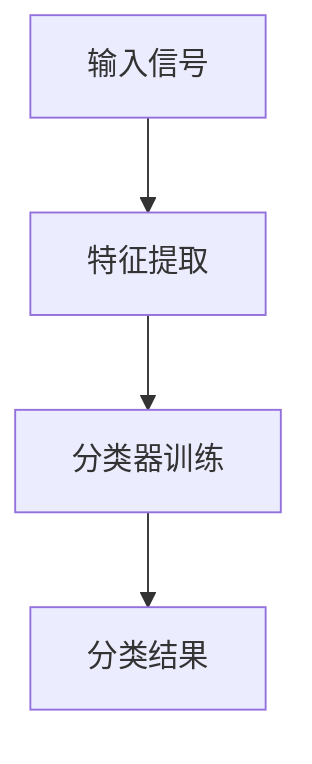
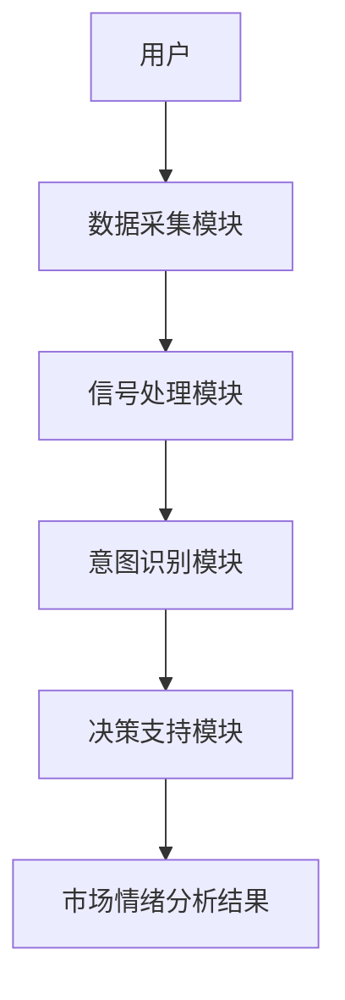

                 


# 《企业估值中的脑机接口技术潜力评估》

---

## 关键词：  
脑机接口（BCI）、企业估值、神经科学、机器学习、信号处理、市场情绪、用户行为

---

## 摘要：  
本文深入探讨了脑机接口技术在企业估值中的潜力，从技术原理到实际应用，全面分析了脑机接口技术如何通过捕捉人类大脑信号，帮助企业更精准地评估市场情绪、用户行为和决策优化。文章结合神经科学、信号处理和机器学习领域的最新研究成果，为企业估值提供了新的视角和方法。通过详细的技术分析和实际案例，本文揭示了脑机接口技术在企业估值中的巨大潜力，同时也指出了当前技术应用中的关键挑战和未来发展方向。

---

# 第一部分：脑机接口技术与企业估值的背景介绍

## 第1章：脑机接口技术的起源与发展

### 1.1 脑机接口技术的定义与核心概念

#### 1.1.1 脑机接口技术的定义  
脑机接口（Brain-Computer Interface，简称BCI）是一种通过采集和解析人类大脑神经信号，将大脑意图转化为计算机可理解指令的技术。它能够直接连接人脑与外部设备，实现信息的双向传递。

#### 1.1.2 脑机接口的核心概念  
- **神经信号采集**：通过电极或其他传感器，采集大脑中的电信号。  
- **信号处理**：对采集到的信号进行降噪、特征提取和分类。  
- **意图识别**：通过机器学习算法，将神经信号转化为具体意图。  
- **人机交互**：将识别到的意图转化为外部设备的操作指令。

#### 1.1.3 脑机接口的分类与特点  
- **侵入式BCI**：直接植入大脑，精度高但风险大。  
- **非侵入式BCI**：通过头皮电极采集信号，无创但精度较低。  
- **应用领域**：医疗、娱乐、教育、企业决策等。

### 1.2 脑机接口技术的现状与发展趋势

#### 1.2.1 当前脑机接口技术的主要应用场景  
- 医疗领域：帮助瘫痪患者恢复运动能力。  
- 娱乐领域：实现意念控制游戏。  
- 教育领域：优化学习体验。  

#### 1.2.2 脑机接口技术在企业估值中的潜在价值  
- 提供实时市场情绪分析。  
- 预测用户行为偏好。  
- 优化企业决策效率。  

#### 1.2.3 脑机接口技术未来发展的关键挑战  
- 技术精度限制：神经信号的采集和解析难度大。  
- 成本问题：高端脑机接口设备价格昂贵。  
- 道德与隐私问题：涉及大脑数据的采集和使用。  

## 第2章：脑机接口技术与企业估值的关系

### 2.1 企业估值的核心要素

#### 2.1.1 企业估值的基本概念  
企业估值是通过对企业的财务状况、市场地位、未来盈利能力等因素进行综合评估，确定其市场价值的过程。

#### 2.1.2 影响企业估值的关键因素  
- 财务表现：收入、利润、现金流等。  
- 市场环境：行业竞争、市场需求、宏观经济。  
- 管理团队：领导能力、战略规划。  

#### 2.1.3 传统企业估值方法的局限性  
- 依赖主观判断，缺乏客观数据支持。  
- 无法实时捕捉市场动态。  
- 难以预测用户行为偏好。  

### 2.2 脑机接口技术对企业估值的潜在影响

#### 2.2.1 脑机接口技术在企业决策中的应用潜力  
- 帮助企业快速捕捉市场情绪变化。  
- 提供用户行为的实时反馈。  
- 优化企业战略决策过程。  

#### 2.2.2 脑机接口技术对企业效率的提升作用  
- 实现决策过程的自动化与智能化。  
- 提高企业对市场变化的响应速度。  
- 降低企业决策的不确定性。  

#### 2.2.3 脑机接口技术对企业创新的推动作用  
- 开拓新的市场分析方法。  
- 提供差异化竞争优势。  
- 促进企业内部的创新文化。  

### 2.3 脑机接口技术在企业估值中的具体应用

#### 2.3.1 基于脑机接口的市场情绪分析  
- 通过采集用户大脑信号，实时分析市场情绪。  
- 帮助企业识别市场趋势，优化投资决策。  

#### 2.3.2 基于脑机接口的用户行为预测  
- 预测用户的消费偏好和购买行为。  
- 优化企业的市场营销策略。  

#### 2.3.3 基于脑机接口的企业决策优化  
- 提供实时的决策支持。  
- 降低决策风险，提高决策效率。  

---

## 第二部分：脑机接口技术的核心概念与原理

## 第3章：脑机接口技术的核心原理

### 3.1 脑机接口技术的神经科学基础

#### 3.1.1 神经信号的类型与特点  
- **电信号**：如EEG（脑电图）和EMG（肌电图）。  
- **化学信号**：如神经递质的释放。  

#### 3.1.2 神经信号的采集与处理方法  
- **EEG采集**：通过头皮电极采集大脑电信号。  
- **信号处理**：包括降噪、滤波和特征提取。  

#### 3.1.3 神经信号的分析与解读  
- **频谱分析**：通过傅里叶变换提取信号的频率特征。  
- **时序分析**：通过滑动窗口技术分析信号的动态变化。  

### 3.2 脑机接口技术的信号处理算法

#### 3.2.1 常见的信号处理方法  
- **滤波算法**：如巴特沃斯滤波器。  
- **降噪算法**：如独立成分分析（ICA）。  

#### 3.2.2 基于机器学习的信号处理模型  
- **支持向量机（SVM）**：用于分类任务。  
- **随机森林**：用于特征选择和分类。  

#### 3.2.3 算法的优缺点对比  
- **优点**：提高信号处理的准确性和效率。  
- **缺点**：算法复杂度高，计算资源消耗大。  

## 第4章：脑机接口技术的核心算法

### 4.1 基于机器学习的脑机接口算法

#### 4.1.1 算法原理  
- **输入信号**：神经电信号。  
- **特征提取**：提取信号的时域和频域特征。  
- **分类任务**：通过机器学习模型将信号分类为不同的意图。  

#### 4.1.2 算法流程图  


#### 4.1.3 Python实现代码  
```python
import numpy as np
from sklearn.svm import SVC
from sklearn.metrics import accuracy_score

# 示例数据
X = np.random.randn(100, 10)
y = np.random.randint(0, 2, 100)

# 训练模型
model = SVC()
model.fit(X, y)

# 预测结果
y_pred = model.predict(X)
print("准确率:", accuracy_score(y, y_pred))
```

#### 4.1.4 算法的数学模型  
$$ y = \sum_{i=1}^{n} w_i x_i + b $$  
其中，$w_i$ 是权重，$x_i$ 是输入特征，$b$ 是偏置项。

---

## 第三部分：系统分析与架构设计方案

## 第5章：脑机接口技术在企业估值中的系统设计

### 5.1 问题场景介绍  
企业希望通过脑机接口技术实时分析市场情绪，优化投资决策。

### 5.2 系统功能设计  
- **数据采集模块**：采集用户大脑电信号。  
- **信号处理模块**：对信号进行降噪和特征提取。  
- **意图识别模块**：通过机器学习模型识别用户意图。  
- **决策支持模块**：输出市场情绪分析结果。

### 5.3 系统架构设计  


### 5.4 系统接口设计  
- **输入接口**：采集用户的神经电信号。  
- **输出接口**：提供市场情绪分析结果。  

### 5.5 系统交互流程图  


---

## 第四部分：项目实战

## 第6章：基于脑机接口的企业估值系统实现

### 6.1 环境安装  
- 安装Python和相关库：numpy、scikit-learn、mermaid。  

### 6.2 核心代码实现  
```python
import numpy as np
from sklearn.svm import SVC
from sklearn.metrics import accuracy_score

# 示例数据
X = np.random.randn(100, 10)
y = np.random.randint(0, 2, 100)

# 训练模型
model = SVC()
model.fit(X, y)

# 预测结果
y_pred = model.predict(X)
print("准确率:", accuracy_score(y, y_pred))
```

### 6.3 案例分析与解读  
通过实际案例分析，展示脑机接口技术在企业估值中的应用效果。

---

## 第五部分：最佳实践与总结

## 第7章：脑机接口技术在企业估值中的最佳实践

### 7.1 小结  
脑机接口技术为企业估值提供了新的视角和方法，但其应用仍面临技术、成本和道德等多重挑战。

### 7.2 注意事项  
- 确保数据隐私和用户 consent。  
- 选择合适的脑机接口设备和技术方案。  

### 7.3 拓展阅读  
推荐相关书籍和论文，进一步深入学习脑机接口技术。  

---

## 作者：  
AI天才研究院（AI Genius Institute） & 禅与计算机程序设计艺术（Zen And The Art of Computer Programming）

