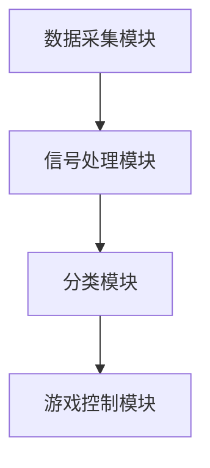

                 


# 企业估值中的脑机接口游戏开发平台评估

> 关键词：脑机接口、游戏开发平台、企业估值、神经信号处理、用户体验评估

> 摘要：本文探讨了脑机接口技术在游戏开发平台中的应用及其对企业估值的影响。通过分析脑机接口的原理、游戏开发平台的评估指标以及企业估值模型，结合实际案例，展示了如何利用这些技术提升企业的市场竞争力和估值。

---

## 第1章：脑机接口与游戏开发平台概述

### 1.1 脑机接口（BCI）的基本概念

#### 1.1.1 脑机接口的定义与核心原理
脑机接口（Brain-Computer Interface, BCI）是一种通过采集和解析大脑神经信号，将人的意图转化为计算机指令的技术。其核心原理包括数据采集、信号处理和意图识别三个步骤。

#### 1.1.2 脑机接口在游戏开发中的应用背景
随着技术进步，BCI在游戏中的应用逐渐增多，主要用于增强游戏互动性和用户体验。例如，玩家可以通过思维控制角色动作，提升沉浸感。

#### 1.1.3 脑机接口与企业估值的关系
BCI技术可提高游戏的市场竞争力，间接影响企业估值。更好的用户体验和技术创新能提升企业市场价值。

---

## 第2章：脑机接口的神经科学基础

### 2.1 神经信号的采集与处理

#### 2.1.1 EEG信号的采集方法
通过头皮电极采集EEG信号，常见的采集方法包括湿电极和干电极。湿电极灵敏度高，但需要皮肤准备；干电极方便但灵敏度较低。

#### 2.1.2 神经信号的特征提取与分析
常用的方法包括时域分析（如均值、标准差）和频域分析（如功率谱分析）。特征提取有助于提高信号处理的准确性。

#### 2.1.3 神经网络模型在脑机接口中的应用
深度学习模型，如卷积神经网络（CNN），常用于EEG信号分类。模型训练需要大量标注数据。

### 2.2 脑机接口的信号处理算法

#### 2.2.1 常见的信号处理技术
- **滤波方法**：如巴特沃斯滤波器，用于去除EEG信号中的噪声。
- **降噪技术**：使用独立成分分析（ICA）分离有用信号。

#### 2.2.2 基于机器学习的分类算法
- **支持向量机（SVM）**：常用于二分类任务。
- **随机森林**：适用于多分类问题，鲁棒性强。

#### 2.2.3 算法的优缺点对比
| 算法 | 优点 | 缺点 |
|------|------|------|
| SVM  | 高精度 | 参数敏感 |
| 随机森林 | 鲁棒性好 | 训练时间长 |

### 2.3 脑机接口的实现流程

#### 2.3.1 数据采集与预处理
1. 采集EEG信号。
2. 去除噪声，提取特征。

#### 2.3.2 特征提取与分类
1. 使用主成分分析（PCA）降维。
2. 应用SVM进行分类。

#### 2.3.3 输出控制指令
将分类结果转化为游戏控制指令，如移动角色或触发动作。

---

## 第3章：游戏开发平台的评估指标

### 3.1 评估维度的定义

#### 3.1.1 技术性能
- 响应速度：系统处理信号的速度。
- 准确性：分类算法的准确率。

#### 3.1.2 用户体验
- 易用性：用户操作的难易程度。
- 舒适度：设备的佩戴体验。

#### 3.1.3 市场潜力
- 用户需求：目标市场对BCI技术的接受度。
- 商业价值：技术带来的经济效益。

### 3.2 评估框架的设计

#### 3.2.1 评估指标的权重分配
根据企业目标，合理分配各指标的权重。例如，技术性能占60%，用户体验占30%，市场潜力占10%。

#### 3.2.2 评估模型的构建与优化
使用层次分析法（AHP）确定权重，构建评估模型。模型需不断优化，以提高评估准确性。

#### 3.2.3 评估结果的可视化展示
通过雷达图或柱状图展示各维度的评估结果，帮助决策者直观理解。

---

## 第4章：企业估值模型与案例分析

### 4.1 估值模型的构建

#### 4.1.1 模型的输入变量
- 技术性能指标：如响应速度、准确性。
- 用户体验指标：如易用性、舒适度。
- 市场潜力指标：如用户需求、商业价值。

#### 4.1.2 估值模型的数学表达
企业估值公式：
$$
V = \sum_{i=1}^{n} w_i \times S_i
$$
其中，$w_i$是第i个指标的权重，$S_i$是对应的评估得分。

#### 4.1.3 案例分析
假设某公司开发的BCI游戏平台，技术性能得分为85，用户体验得分为75，市场潜力得分为80。权重分别为0.6、0.3、0.1。则企业估值为：
$$
V = 0.6 \times 85 + 0.3 \times 75 + 0.1 \times 80 = 81.5
$$

---

## 第5章：系统架构与实现

### 5.1 系统架构设计

#### 5.1.1 系统功能模块
- 数据采集模块：采集EEG信号。
- 信号处理模块：预处理和特征提取。
- 分类模块：识别用户意图。
- 游戏控制模块：执行游戏指令。

#### 5.1.2 系统架构图


---

## 第6章：项目实战

### 6.1 环境搭建

#### 6.1.1 工具选择
- 数据采集：使用OpenBCI采集器。
- 开发环境：Python，框架如TensorFlow、PyTorch。

#### 6.1.2 数据集准备
收集EEG信号数据，标注用户意图。

### 6.2 核心代码实现

#### 6.2.1 数据预处理代码
```python
import numpy as np
from scipy.signal import butterworth
def preprocess_eeg(data, fs):
    # 设计滤波器
    cutoff = 30
    order = 5
    nyq = fs / 2
    cutoff_freq = cutoff / nyq
    b, a = butterworth(order, cutoff_freq, btype='low')
    filtered_data = np.zeros_like(data)
    for i in range(data.shape[1]):
        filtered_data[:, i] = butterworth_filter(b, a, data[:, i])
    return filtered_data
```

#### 6.2.2 分类算法实现
```python
from sklearn.svm import SVC
def train_svm(X_train, y_train):
    svm_model = SVC(kernel='rbf', C=1)
    svm_model.fit(X_train, y_train)
    return svm_model
```

#### 6.2.3 游戏控制模块
```python
def control_game(action):
    if action == 'forward':
        print("角色前进")
    elif action == 'backward':
        print("角色后退")
```

### 6.3 测试与优化

#### 6.3.1 测试结果
记录系统响应时间，优化分类算法参数，提高准确率。

### 6.4 案例分析与优化

#### 6.4.1 实际案例分析
分析某游戏平台的用户反馈，找出系统瓶颈，针对性优化。

---

## 第7章：最佳实践与未来趋势

### 7.1 最佳实践

#### 7.1.1 系统优化建议
- 提高信号处理效率，优化用户体验。
- 定期更新算法模型，适应用户需求变化。

#### 7.1.2 技术发展与趋势
- 高精度传感器技术的发展。
- AI算法的不断进步，提高分类准确率。

### 7.2 未来展望

脑机接口技术在游戏开发中的应用将更加广泛，用户体验将更个性化和智能化。未来，可能会出现基于脑机接口的多人协作游戏，进一步提升游戏的社交属性。

---

## 作者：AI天才研究院/AI Genius Institute & 禅与计算机程序设计艺术 /Zen And The Art of Computer Programming

---

本文通过详细分析脑机接口技术在游戏开发中的应用，结合企业估值模型，展示了如何利用这一技术提升企业的市场竞争力和估值。希望本文能为相关领域的研究和实践提供有价值的参考。

