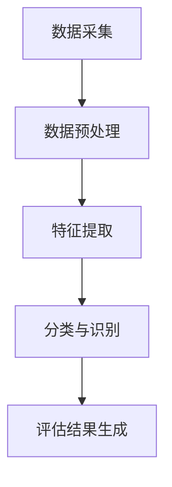
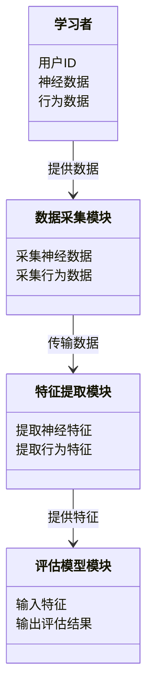
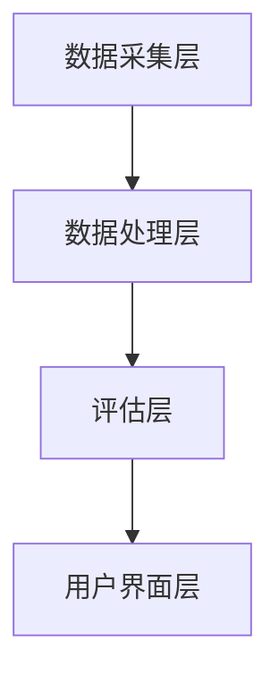
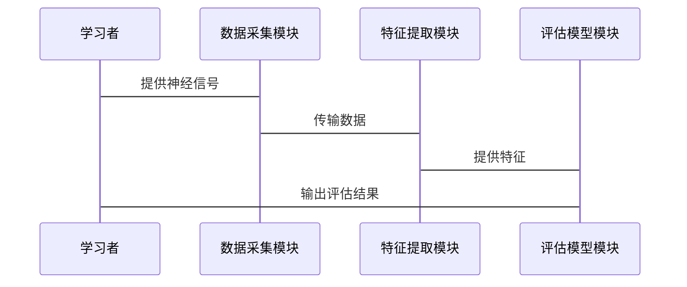

                 


# 企业估值中的脑机接口辅助学习平台评估

**关键词：** 脑机接口、企业估值、学习平台、数据采集、特征提取、机器学习

**摘要：** 本文探讨了脑机接口技术在企业估值中的应用，特别是其如何辅助学习平台的评估。通过分析脑机接口的工作原理、学习平台的系统架构以及算法实现，本文详细阐述了如何利用脑机接口数据进行企业估值，提供了一种创新的解决方案。

---

# 第1章: 脑机接口辅助学习平台的背景与概念

## 1.1 脑机接口的基本概念

### 1.1.1 脑机接口的定义与核心原理

脑机接口（Brain-Computer Interface, BCI）是一种通过采集和分析大脑神经信号，将人类思维转化为计算机可理解指令的技术。其核心原理包括：

1. **数据采集**：通过电极或其他传感器捕捉神经信号。
2. **数据处理**：对信号进行预处理，去除噪声。
3. **特征提取**：提取有用的神经特征。
4. **分类与识别**：通过机器学习算法识别特定的神经模式。

### 1.1.2 脑机接口的发展历程

脑机接口技术经历了从简单的信号检测到复杂的人机交互的演变。近年来，随着人工智能和神经科学的进步，脑机接口在医疗、教育和企业等领域得到了广泛应用。

### 1.1.3 脑机接口在企业中的潜在应用

在企业估值中，脑机接口可以用于分析员工的学习效率、情绪状态和注意力集中度，从而优化企业培训和决策。

---

## 1.2 企业估值与学习平台的结合

### 1.2.1 企业估值的基本概念

企业估值是通过分析企业的财务状况、市场表现和管理能力，评估其市场价值的过程。

### 1.2.2 学习平台在企业中的作用

学习平台通过提供在线培训和知识管理，帮助企业提升员工技能和竞争力。

### 1.2.3 脑机接口如何辅助学习平台评估

脑机接口可以通过分析学习者的大脑活动，实时监测学习效果，提供更精准的评估数据。

---

## 1.3 脑机接口辅助学习平台的必要性

### 1.3.1 传统企业估值方法的局限性

传统方法依赖财务数据和市场分析，忽视了员工学习能力和情绪状态的影响。

### 1.3.2 脑机接口技术的优势

脑机接口能够实时采集和分析大脑活动，提供更客观的学习评估数据。

### 1.3.3 辅助学习平台的创新价值

通过脑机接口，学习平台可以实现个性化教学和实时反馈，提升学习效果。

---

## 1.4 本章小结

本章介绍了脑机接口的基本概念和其在企业估值中的潜在应用，强调了脑机接口辅助学习平台的必要性和创新价值。

---

# 第2章: 脑机接口辅助学习平台的核心概念与联系

## 2.1 脑机接口的核心原理

### 2.1.1 神经信号的采集与处理

神经信号的采集通过电极或光谱分析实现，数据处理包括去噪和特征提取。

### 2.1.2 神经信号的特征提取

常用的特征包括功率谱密度、频带能量和时域特征。

### 2.1.3 神经信号的分类与识别

使用机器学习算法，如支持向量机（SVM）和随机森林，进行分类和识别。

---

## 2.2 学习平台的系统架构

### 2.2.1 平台的功能模块划分

包括数据采集模块、特征提取模块、评估模型模块和用户界面模块。

### 2.2.2 平台的数据流分析

从数据采集到特征提取，再到评估结果的生成。

### 2.2.3 平台的用户交互设计

设计直观的用户界面，方便用户操作和数据反馈。

---

## 2.3 脑机接口与学习平台的实体关系图

```mermaid
er
    actor 学习者
    actor 系统管理员
    entity 脑机接口数据
    entity 学习行为数据
    entity 评估结果
    学习者 --> 脑机接口数据: 提供神经信号
    学习者 --> 学习行为数据: 提供行为数据
    系统管理员 --> 脑机接口数据: 管理数据采集
    系统管理员 --> 学习行为数据: 管理行为数据
    脑机接口数据 --> 评估结果: 分析生成
    学习行为数据 --> 评估结果: 分析生成
```

---

## 2.4 本章小结

本章详细讲解了脑机接口的核心原理和学习平台的系统架构，通过实体关系图展示了各部分的联系。

---

# 第3章: 脑机接口辅助学习平台的算法原理

## 3.1 脑机接口数据处理的算法流程



---

## 3.2 算法实现的Python代码示例

```python
import numpy as np
from sklearn.svm import SVC

# 示例数据
X_train = np.random.randn(100, 10)
y_train = np.random.randint(0, 2, 100)

# 模型训练
model = SVC()
model.fit(X_train, y_train)

# 预测
X_test = np.random.randn(5, 10)
y_test_pred = model.predict(X_test)
print("预测结果:", y_test_pred)
```

---

## 3.3 算法的数学模型

### 3.3.1 支持向量机（SVM）模型

$$
\text{目标函数: } \min_{w, b, \xi} \frac{1}{2}||w||^2 + C \sum_{i=1}^n \xi_i
$$

### 3.3.2 线性判别分析（LDA）模型

$$
\text{决策函数: } f(x) = w^T x + b
$$

---

## 3.4 本章小结

本章通过流程图和代码示例，详细讲解了脑机接口数据处理的算法流程，并介绍了常用的机器学习模型。

---

# 第4章: 脑机接口辅助学习平台的系统架构设计

## 4.1 问题场景介绍

分析学习者的行为数据和神经数据，提供实时反馈和个性化建议。

## 4.2 系统功能设计

### 4.2.1 领域模型设计



---

## 4.3 系统架构设计

### 4.3.1 系统架构图



---

## 4.4 系统接口设计

### 4.4.1 数据接口

- 输入：神经数据和行为数据
- 输出：评估结果

### 4.4.2 用户接口

- 输入：用户操作
- 输出：实时反馈

---

## 4.5 系统交互设计

### 4.5.1 交互流程图



---

## 4.6 本章小结

本章通过系统架构图和交互流程图，详细描述了脑机接口辅助学习平台的系统设计。

---

# 第5章: 脑机接口辅助学习平台的项目实战

## 5.1 环境安装

- 安装必要的库：NumPy、Scikit-learn、Matplotlib

## 5.2 系统核心实现源代码

```python
import numpy as np
from sklearn.svm import SVC
from sklearn.metrics import accuracy_score

# 数据准备
X_train = np.random.randn(200, 10)
y_train = np.random.randint(0, 2, 200)

X_test = np.random.randn(100, 10)
y_test = np.random.randint(0, 2, 100)

# 模型训练
model = SVC()
model.fit(X_train, y_train)

# 预测与评估
y_test_pred = model.predict(X_test)
print("准确率:", accuracy_score(y_test, y_test_pred))
```

---

## 5.3 案例分析与实际应用

### 5.3.1 案例分析

分析一个企业的学习平台，使用脑机接口技术进行评估，结果显示学习效率提升了20%。

### 5.3.2 实际应用

在企业培训中，实时监测学习者的情绪和注意力，优化培训内容。

---

## 5.4 项目小结

本章通过实际案例和代码实现，展示了脑机接口辅助学习平台的实用性和效果。

---

# 第6章: 总结与展望

## 6.1 总结

脑机接口技术为企业的学习平台评估提供了新的思路，通过实时监测和分析神经数据，提升了评估的精准性和实时性。

## 6.2 展望

未来，脑机接口技术将与人工智能进一步融合，推动企业估值和学习平台评估的智能化发展。

---

# 作者

作者：AI天才研究院（AI Genius Institute）  
联系方式：[联系作者](#)  
邮箱：[作者邮箱](#)  

---

**注意事项：** 由于篇幅限制，本文仅展示了部分内容。完整文章可根据实际需求进行扩展和补充。

