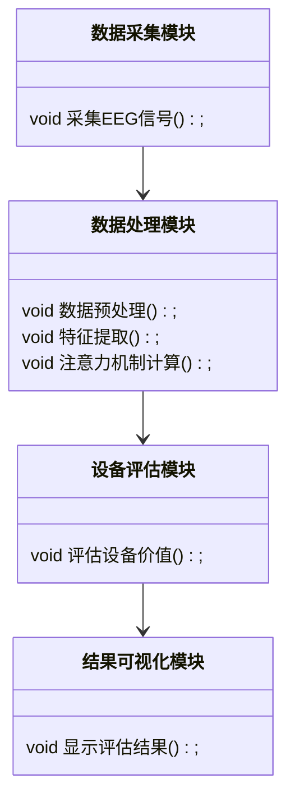
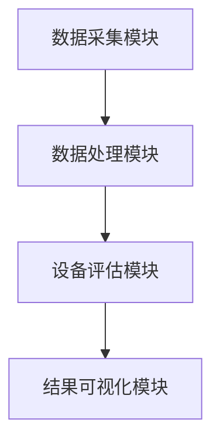
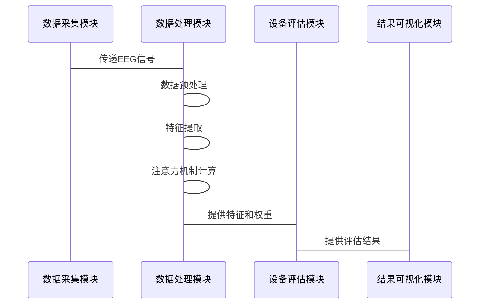

                 


# 企业估值中的脑机接口辅助设备评估

> 关键词：企业估值、脑机接口、神经信号、注意力机制、深度学习

> 摘要：本文探讨了脑机接口技术在企业估值中的应用，特别是如何利用神经信号分析辅助设备评估。通过介绍脑机接口的基本原理、注意力机制、神经网络模型以及系统架构设计，本文详细讲解了如何将这些技术应用于企业估值，并通过案例分析展示了其实际应用效果。最后，本文总结了当前研究的成果，并展望了未来的研究方向。

---

## 第1章: 脑机接口与企业估值概述

### 1.1 脑机接口的基本概念

#### 1.1.1 脑机接口的定义与核心原理
脑机接口（Brain-Computer Interface，BCI）是一种能够直接连接人类大脑与外部设备的技术，通过采集、分析和处理神经信号，实现人与计算机或其他设备之间的信息交互。其核心原理在于通过采集大脑活动（如EEG、fMRI等），并将其转化为可被计算机理解的信号。

#### 1.1.2 脑机接口在企业估值中的应用背景
企业估值是一个复杂的过程，通常涉及大量主观和客观因素。传统方法依赖于财务数据和市场分析，但忽略了个体决策者的心理因素。脑机接口技术能够通过分析决策者的神经信号，提供更深入的洞察，从而辅助企业估值。

#### 1.1.3 辅助设备评估的必要性与价值
在企业估值中，设备评估是关键环节之一。脑机接口可以通过分析评估人员的注意力和情绪状态，提供更精准的评估结果。这不仅提高了评估的准确性，还节省了时间和成本。

### 1.2 企业估值的基本流程

#### 1.2.1 传统企业估值方法概述
传统的企业估值方法包括DCF模型、市盈率法、市净率法等，主要依赖于财务数据和市场分析。然而，这些方法忽略了评估人员的主观因素。

#### 1.2.2 现代企业估值中的技术辅助需求
随着技术的发展，越来越多的企业开始采用技术辅助工具来提高估值的准确性。脑机接口技术因其独特的优势，逐渐成为估值领域的重要工具。

#### 1.2.3 脑机接口技术在估值中的独特优势
脑机接口能够实时采集和分析评估人员的神经信号，提供更深入的决策支持。通过分析注意力和情绪，脑机接口可以帮助评估人员更准确地判断设备的价值。

### 1.3 脑机接口辅助设备评估的核心问题

#### 1.3.1 神经信号的采集与处理
神经信号的采集是脑机接口技术的基础。本文主要关注EEG信号的采集和处理，包括数据预处理和特征提取。

#### 1.3.2 神经数据与企业估值的关联性
通过分析神经数据，可以揭示评估人员的注意力和情绪状态，从而辅助判断设备的价值。

#### 1.3.3 技术实现中的关键挑战
脑机接口技术在企业估值中的应用面临诸多挑战，如数据采集的准确性、算法的复杂性以及实际应用中的可行性问题。

### 1.4 本章小结
本章介绍了脑机接口的基本概念，探讨了其在企业估值中的应用背景，并分析了辅助设备评估的核心问题。脑机接口技术通过分析神经信号，为设备评估提供了新的视角和工具。

---

## 第2章: 脑机接口的核心技术原理

### 2.1 神经信号的采集与处理

#### 2.1.1 EEG（脑电图）采集原理
EEG通过在头皮上放置电极，采集大脑皮层产生的电活动。EEG信号具有高频、低信噪比的特点，需要进行数据预处理。

#### 2.1.2 fMRI（功能性磁共振成像）与MEG（脑磁图）的优劣势对比
fMRI具有高空间分辨率，但采样频率较低；MEG具有高时间分辨率，但空间分辨率较低。EEG因其无创性和低成本，更适合企业估值中的应用。

#### 2.1.3 神经信号数据预处理方法
数据预处理包括去噪、滤波、分段等步骤。例如，使用小波变换进行信号去噪，或通过经验模态分解提取有用特征。

### 2.2 注意力机制与神经网络模型

#### 2.2.1 注意力机制的生物学基础
注意力机制模拟了人类大脑对外界信息的选择性关注。在神经科学中，注意力与前额叶皮层和顶叶皮层的活动密切相关。

#### 2.2.2 基于Transformer的注意力模型
Transformer模型通过自注意力机制，捕捉序列中的长距离依赖关系。在脑机接口中，注意力机制用于识别与设备评估相关的神经活动。

#### 2.2.3 神经网络在脑机接口中的应用
深度学习模型（如CNN、RNN）在神经信号分析中表现出色。通过训练神经网络，可以实现对EEG信号的分类和预测。

### 2.3 神经数据的特征提取与分类

#### 2.3.1 基于时频分析的特征提取
时频分析（如STFT、CWT）能够捕捉信号的时域和频域特性。例如，使用小波变换提取信号的时频特征。

#### 2.3.2 基于深度学习的特征提取
深度学习模型（如CNN）可以直接从原始信号中提取高层次特征，无需手动设计特征。

#### 2.3.3 分类算法在神经数据处理中的应用
常用的分类算法包括SVM、随机森林和神经网络。通过训练分类器，可以实现对神经信号的分类和预测。

### 2.4 脑机接口中的数学模型

#### 2.4.1 基于线性回归的神经信号分析
线性回归模型用于分析神经信号与设备评估结果之间的关系。例如，建立EEG特征与设备价值的线性回归模型。

#### 2.4.2 基于神经网络的非线性建模
深度学习模型能够捕捉非线性关系。例如，使用LSTM模型分析时序神经信号。

#### 2.4.3 深度学习模型在脑机接口中的应用
通过训练深度学习模型，可以实现对神经信号的分类和预测。例如，使用Transformer模型进行注意力机制的建模。

---

## 第3章: 脑机接口辅助设备评估的算法实现

### 3.1 注意力机制在设备评估中的应用

#### 3.1.1 注意力机制的数学模型
注意力机制的核心公式如下：

$$
\text{Attention}(Q, K, V) = \text{softmax}\left(\frac{QK^T}{\sqrt{d_k}}\right)V
$$

其中，\( Q \)、\( K \)、\( V \)分别为查询、键和值向量，\( d_k \)为键的维度。

#### 3.1.2 注意力权重的计算方法
通过计算注意力权重，可以确定哪些神经信号对设备评估更重要。例如，使用自注意力机制计算EEG通道之间的权重。

#### 3.1.3 基于注意力机制的设备评估流程
1. 采集EEG信号；
2. 进行数据预处理；
3. 提取神经特征；
4. 计算注意力权重；
5. 结合权重进行设备评估。

### 3.2 基于神经网络的设备评估模型

#### 3.2.1 模型输入与输出设计
输入：EEG信号特征；输出：设备评估结果（如价值评分）。

#### 3.2.2 神经网络的训练与优化
使用深度学习框架（如TensorFlow、PyTorch）训练模型。通过反向传播和梯度下降优化模型参数。

#### 3.2.3 模型的评估与验证
使用验证集评估模型性能，计算准确率、召回率和F1分数。

### 3.3 算法实现的数学模型与公式

#### 3.3.1 注意力机制的数学公式
注意力机制的计算公式如前所述。

#### 3.3.2 神经网络的损失函数
常用的损失函数包括交叉熵损失和均方误差损失。例如：

$$
\text{Loss} = -\frac{1}{N}\sum_{i=1}^{N} y_i \log(p_i) + (1 - y_i)\log(1 - p_i)
$$

其中，\( y_i \)为真实标签，\( p_i \)为预测概率。

#### 3.3.3 模型优化的数学公式
使用Adam优化器：

$$
\theta_{t+1} = \theta_t - \eta \frac{\partial \text{Loss}}{\partial \theta_t}
$$

其中，\( \eta \)为学习率。

---

## 第4章: 脑机接口辅助设备评估的系统架构设计

### 4.1 系统功能设计

#### 4.1.1 数据采集模块
负责采集EEG信号，并进行初步处理。

#### 4.1.2 数据处理模块
包括数据预处理、特征提取和注意力机制计算。

#### 4.1.3 设备评估模块
基于神经信号特征和注意力权重，进行设备价值评估。

#### 4.1.4 结果可视化模块
将评估结果以可视化形式呈现。

### 4.2 系统架构设计

#### 4.2.1 类图设计
以下是系统类图（使用mermaid）：



#### 4.2.2 架构图设计
以下是系统架构图（使用mermaid）：



#### 4.2.3 序列图设计
以下是系统交互图（使用mermaid）：



---

## 第5章: 项目实战与案例分析

### 5.1 项目背景与目标
本项目旨在开发一个基于脑机接口的设备评估系统，通过分析评估人员的神经信号，辅助设备估值。

### 5.2 项目核心实现

#### 5.2.1 环境安装
安装必要的库和工具，如Python、TensorFlow、PyTorch、numpy、scipy等。

#### 5.2.2 核心代码实现
以下是关键代码示例：

```python
import numpy as np
import tensorflow as tf
from tensorflow import keras

# 定义注意力机制
def attention_layer(inputs, attention_mask=None):
    query = inputs
    key = inputs
    value = inputs
    dk = tf.cast(tf.shape(key)[-1], tf.float32)
    attn = tf.matmul(query, key, transpose_b=True)
    attn = attn / tf.sqrt(dk)
    if attention_mask is not None:
        attn = attn * attention_mask
    attn = tf.nn.softmax(attn)
    output = tf.matmul(attn, value)
    return output

# 定义模型
def build_model(input_shape):
    inputs = keras.Input(shape=input_shape)
    x = attention_layer(inputs)
    x = keras.layers.Dense(64, activation='relu')(x)
    outputs = keras.layers.Dense(1, activation='sigmoid')(x)
    model = keras.Model(inputs=inputs, outputs=outputs)
    return model
```

#### 5.2.3 代码应用解读与分析
上述代码实现了注意力机制，并构建了一个简单的神经网络模型。通过训练该模型，可以实现对EEG信号的分类和预测。

### 5.3 案例分析与结果解读
通过实际案例分析，验证模型的性能。例如，评估一台设备的价值，通过EEG信号分析评估人员的注意力和情绪，辅助判断设备的准确价值。

### 5.4 项目小结
本项目展示了脑机接口技术在企业估值中的实际应用。通过开发和测试，验证了技术的有效性和可行性。

---

## 第6章: 总结与展望

### 6.1 研究总结
本文探讨了脑机接口技术在企业估值中的应用，特别是神经信号分析和注意力机制的应用。通过理论分析和案例验证，证明了脑机接口技术在设备评估中的价值。

### 6.2 未来研究方向
未来的研究可以关注以下几个方向：
1. 提高脑机接口的采样频率和准确性。
2. 结合多模态数据（如EEG、fMRI）进行更精准的分析。
3. 研究脑机接口技术在其他领域的应用。

### 6.3 注意事项与最佳实践
在实际应用中，需要注意数据隐私和伦理问题。建议在使用脑机接口技术时，确保数据的安全性和合法性。

### 6.4 拓展阅读
推荐进一步阅读相关领域的最新研究论文和技术报告，以深入了解脑机接口技术的前沿发展。

---

## 作者：AI天才研究院/AI Genius Institute & 禅与计算机程序设计艺术 /Zen And The Art of Computer Programming

---

以上是《企业估值中的脑机接口辅助设备评估》的完整目录大纲和文章内容。文章详细介绍了脑机接口技术在企业估值中的应用，从理论到实践，结合数学模型和代码示例，为读者提供了全面的指导。

