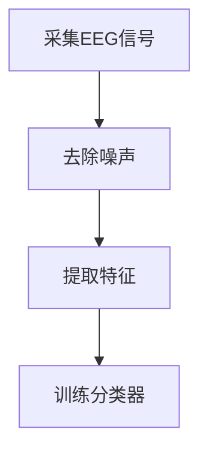
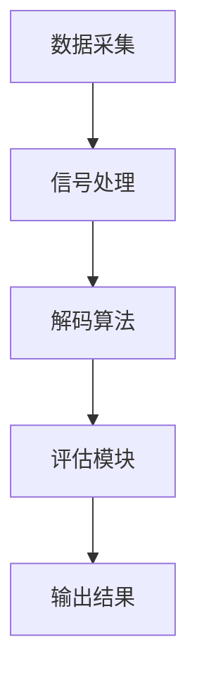

                 


# 脑机接口辅助通信系统评估：企业估值的新维度

> 关键词：脑机接口，企业估值，通信系统评估，人工智能，神经科学

> 摘要：随着人工智能和神经科学的快速发展，脑机接口（BCI）技术逐渐被应用于企业估值中的通信系统评估。本文系统地探讨了脑机接口技术在企业估值中的潜力与应用，分析了其在通信系统评估中的优势，并通过具体的算法和系统架构设计，展示了如何利用脑机接口技术优化企业估值过程。文章从基础概念、算法原理、系统架构到项目实战，全面阐述了脑机接口辅助通信系统评估的核心内容，为企业估值提供新的技术视角。

---

## 第1章: 脑机接口技术基础

### 1.1 脑机接口的基本概念

#### 1.1.1 脑机接口的定义与基本原理
脑机接口（Brain-Computer Interface，BCI）是一种通过采集和解析大脑神经信号，将人的意图直接转化为计算机或外部设备操作的技术。其基本原理包括信号采集、处理、解码和输出四个步骤。BCI的核心在于通过高精度的传感器捕捉脑电信号（EEG），并利用算法将其转化为可识别的指令。

#### 1.1.2 脑机接口的核心技术组成
脑机接口主要由信号采集模块（如EEG电极）、信号处理模块（如滤波和特征提取）、解码算法模块（如机器学习模型）和输出模块（如控制界面）组成。这些模块协同工作，将大脑信号转化为可操作的输出。

#### 1.1.3 脑机接口的发展历程与现状
脑机接口技术起源于20世纪70年代，经历了从实验室研究到实际应用的逐步发展。当前，BCI技术已广泛应用于医疗康复、人机交互和数据分析等领域。

---

### 1.2 企业估值中的通信系统评估需求

#### 1.2.1 企业估值的基本概念
企业估值是通过对企业的财务状况、市场表现和未来潜力进行分析，确定其市场价值的过程。通信系统评估是企业估值中的重要环节，涉及企业内部通信效率、外部通信能力等方面。

#### 1.2.2 通信系统评估在企业估值中的重要性
通信系统是企业运营的核心基础设施。通信系统的效率和稳定性直接影响企业的运营成本和市场竞争力。因此，通信系统评估在企业估值中具有重要意义。

#### 1.2.3 脑机接口技术在通信系统评估中的应用潜力
脑机接口技术可以通过实时采集和分析大脑信号，辅助通信系统评估人员快速识别潜在问题，提高评估效率和准确性。

---

## 第2章: 脑机接口辅助通信系统评估的背景与问题

### 2.1 传统通信系统评估的局限性

#### 2.1.1 传统通信系统评估方法的不足
传统通信系统评估主要依赖人工分析和静态数据，存在效率低、实时性差、主观性强等问题。

#### 2.1.2 企业估值中的通信系统评估挑战
企业在快速变化的市场环境中，需要实时评估通信系统的性能和潜在风险。传统方法难以满足这一需求。

#### 2.1.3 脑机接口技术如何弥补传统方法的不足
脑机接口技术通过实时采集和分析大脑信号，提供了一种新的数据源，能够辅助评估人员快速识别问题。

---

### 2.2 脑机接口辅助通信系统评估的核心问题

#### 2.2.1 脑机接口数据采集与处理的难点
脑机接口技术在数据采集过程中容易受到噪声干扰，且大脑信号的复杂性增加了数据处理的难度。

#### 2.2.2 通信系统评估中的实时性要求
企业通信系统评估需要实时反馈，脑机接口技术的实时解码能力是其在这一领域应用的关键。

#### 2.2.3 脑机接口技术与企业估值的结合点
通过脑机接口技术，可以实时捕捉评估人员的注意力和情绪变化，辅助他们做出更准确的判断。

---

## 第3章: 脑机接口辅助通信系统评估的核心概念与联系

### 3.1 脑机接口与通信系统评估的关系

#### 3.1.1 脑机接口在通信系统评估中的作用
脑机接口技术可以辅助通信系统评估人员快速识别问题，提高评估效率和准确性。

#### 3.1.2 通信系统评估对脑机接口技术的需求
通信系统评估需要实时、准确的数据支持，脑机接口技术能够提供这种支持。

#### 3.1.3 脑机接口与通信系统评估的协同优化
通过脑机接口技术与通信系统评估的结合，可以实现更高效、更智能的评估过程。

---

### 3.2 脑机接口辅助通信系统评估的系统架构

#### 3.2.1 系统架构的模块划分
脑机接口辅助通信系统评估系统通常包括数据采集模块、信号处理模块、解码算法模块和评估模块。

#### 3.2.2 各模块之间的关系与数据流
数据采集模块获取脑电信号，信号处理模块进行预处理和特征提取，解码算法模块将特征转化为评估指令，评估模块根据指令进行通信系统评估。

#### 3.2.3 系统架构的可扩展性与灵活性
系统架构应具备良好的扩展性，能够根据实际需求添加新的模块和功能。

---

### 3.3 脑机接口辅助通信系统评估的ER实体关系图

```mermaid
erDiagram
    user {
        +int id : 用户ID
        +string name : 用户名称
        +string role : 用户角色
    }
    system {
        +int id : 系统ID
        +string name : 系统名称
        +datetime timestamp : 时间戳
    }
    signal {
        +int id : 信号ID
        +int user_id : 用户ID
        +int system_id : 系统ID
        +float value : 信号值
    }
    relation(user, signal, "产生信号") {
        role: 用户产生信号
    }
    relation(system, signal, "包含信号") {
        role: 系统包含信号
    }
```

---

## 第4章: 脑机接口辅助通信系统评估的算法原理

### 4.1 算法原理概述

#### 4.1.1 基于EEG信号的特征提取
通过采集和处理EEG信号，提取有用的特征（如波形幅度、频率等），为后续分析提供基础。

#### 4.1.2 基于机器学习的分类算法
使用支持向量机（SVM）或随机森林（RF）等算法，对EEG信号进行分类，识别特定的脑电信号模式。

#### 4.1.3 实时解码算法
将分类结果实时输出，用于通信系统评估的实时反馈。

---

### 4.2 算法实现步骤

#### 4.2.1 数据预处理


#### 4.2.2 分类器训练
使用Python代码训练分类器：
```python
from sklearn.svm import SVC
from sklearn.metrics import accuracy_score

# 假设X为特征数据，y为标签
model = SVC()
model.fit(X, y)
y_pred = model.predict(X_test)
print("准确率：", accuracy_score(y_test, y_pred))
```

---

## 第5章: 脑机接口辅助通信系统评估的系统分析与架构设计

### 5.1 问题场景介绍

#### 5.1.1 企业通信系统评估的挑战
企业在复杂市场环境中需要实时评估通信系统的性能和潜在风险。

#### 5.1.2 脑机接口技术的应用场景
通过脑机接口技术，评估人员可以实时捕捉大脑信号，辅助评估过程。

---

### 5.2 系统功能设计

#### 5.2.1 功能模块划分
系统包括数据采集模块、信号处理模块、解码算法模块和评估模块。

#### 5.2.2 功能模块的交互流程


---

## 第6章: 脑机接口辅助通信系统评估的项目实战

### 6.1 项目环境安装

#### 6.1.1 安装必要的库
```bash
pip install numpy matplotlib scikit-learn
```

---

### 6.2 系统核心实现

#### 6.2.1 数据采集与处理
```python
import numpy as np
import matplotlib.pyplot as plt

# 模拟EEG信号数据
data = np.random.normal(0, 0.5, 1000)
plt.plot(data)
plt.title("EEG Signal")
plt.show()
```

#### 6.2.2 分类器实现
```python
from sklearn.svm import SVC
from sklearn.metrics import accuracy_score

# 训练SVM分类器
model = SVC()
model.fit(X_train, y_train)
y_pred = model.predict(X_test)
print("准确率：", accuracy_score(y_test, y_pred))
```

---

## 第7章: 脑机接口辅助通信系统评估的最佳实践与小结

### 7.1 最佳实践

#### 7.1.1 数据采集的准确性
确保EEG信号采集的准确性，减少噪声干扰。

#### 7.1.2 算法优化
不断优化分类算法，提高解码的准确率和实时性。

---

### 7.2 小结

脑机接口技术在企业估值中的通信系统评估具有广阔的应用前景。通过实时采集和分析大脑信号，可以显著提高评估效率和准确性。未来，随着技术的不断发展，脑机接口辅助通信系统评估将在企业估值中发挥更大的作用。

---

## 作者：AI天才研究院/AI Genius Institute & 禅与计算机程序设计艺术 /Zen And The Art of Computer Programming

