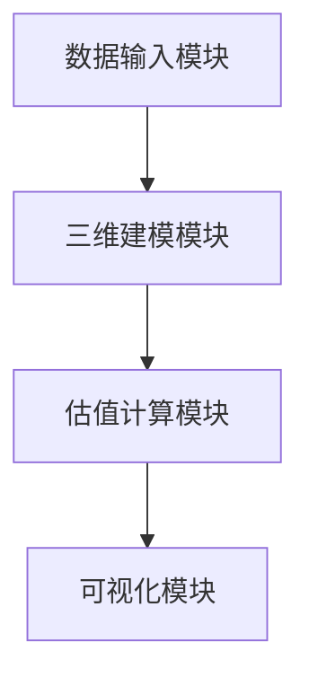

                 


# 企业估值中的虚拟现实应用评估

**关键词**：虚拟现实、企业估值、三维建模、数据融合、人工智能

**摘要**：  
随着虚拟现实（VR）技术的快速发展，其在企业估值中的应用潜力逐渐显现。本文系统地探讨了虚拟现实技术在企业估值中的应用，分析了其核心概念、算法原理、系统架构设计以及实际项目中的应用。通过结合虚拟现实技术的可视化能力和企业估值的传统方法，本文提出了一种创新的企业估值模型，并通过实际案例展示了其可行性和优势。

---

# 第一部分：虚拟现实技术与企业估值的结合

## 第1章：虚拟现实技术概述

### 1.1 虚拟现实技术的定义与特点  
虚拟现实（Virtual Reality，VR）是一种能够提供沉浸式体验的技术，通过计算机生成的三维环境，让用户与虚拟世界进行交互。其核心特点包括：  
- **沉浸性**：用户完全沉浸在虚拟环境中，感受逼真的视觉、听觉和触觉。  
- **交互性**：用户可以通过手柄、头显等设备与虚拟环境进行实时交互。  
- **实时性**：虚拟环境能够实时响应用户的操作，提供流畅的体验。  

### 1.2 虚拟现实技术的发展历程  
虚拟现实技术的起源可以追溯到20世纪60年代，但真正的发展始于21世纪初。随着计算机图形学、传感器技术和人工智能的进步，VR技术逐渐从实验室走向商业化应用。当前，VR技术已广泛应用于游戏、教育培训、医疗、建筑等领域。

### 1.3 虚拟现实技术在企业估值中的应用前景  
企业估值是一个复杂的过程，传统方法依赖于财务数据和市场分析，但缺乏直观的可视化支持。虚拟现实技术可以通过三维建模、数据融合等手段，将企业的资产、市场和财务数据转化为可视化模型，帮助投资者更直观地理解和评估企业价值。

---

## 第2章：企业估值的核心概念与虚拟现实技术的结合

### 2.1 企业估值的基本原理  
企业估值是通过对企业的资产、收入、利润等财务数据的分析，评估其市场价值的过程。传统方法包括资产基础法、收益法和市场法，但这些方法往往依赖于假设和主观判断，存在一定的局限性。

### 2.2 虚拟现实技术在企业估值中的核心应用  
虚拟现实技术可以通过以下方式提升企业估值的准确性：  
- **可视化资产分布**：通过三维建模，直观展示企业的资产分布和规模。  
- **模拟市场环境**：构建虚拟市场环境，模拟企业的市场表现。  
- **实时数据交互**：通过传感器采集企业实时数据，动态更新估值模型。  

### 2.3 虚拟现实技术与企业估值的结合模型  
结合模型包括以下几个部分：  
- **输入层**：企业的财务数据、市场数据和资产数据。  
- **处理层**：通过三维建模和数据融合算法，将输入数据转化为可视化模型。  
- **输出层**：生成企业的估值结果和市场分析报告。  

---

## 第3章：虚拟现实技术在企业估值中的算法原理

### 3.1 虚拟现实空间建模算法  
三维空间建模是虚拟现实技术的核心之一。常见的建模算法包括：  
- **点云数据处理算法**：通过激光扫描获取物体表面的点云数据，生成三维模型。  
- **网格化建模算法**：将三维空间划分为网格，通过计算每个网格的属性生成模型。  

#### 点云数据处理算法示例  
以下是点云数据处理的Python代码示例：  
```python
import numpy as np
from sklearn.cluster import KMeans

# 生成点云数据
points = np.random.rand(1000, 3)

# 使用K-means算法进行聚类
kmeans = KMeans(n_clusters=10, random_state=42).fit(points)
labels = kmeans.labels_
clusters = kmeans.cluster_centers_

# 可视化结果
import matplotlib.pyplot as plt
from mpl_toolkits.mplot3d import Axes3D

fig = plt.figure()
ax = fig.add_subplot(111, projection='3d')
ax.scatter(points[:, 0], points[:, 1], points[:, 2], c=labels, cmap='viridis')
ax.scatter(clusters[:, 0], clusters[:, 1], clusters[:, 2], marker='x', color='red', s=100)
plt.show()
```

### 3.2 虚拟现实数据融合算法  
数据融合是将来自不同传感器的数据进行整合，提升模型的准确性和鲁棒性。常用算法包括：  
- **基于加权平均的数据融合算法**：根据传感器的可信度对数据进行加权平均。  
- **基于协方差的数据融合算法**：通过协方差矩阵描述数据的不确定性，进行最优估计。  

### 3.3 虚拟现实场景交互算法  
场景交互算法通过用户的实时操作，动态更新虚拟环境中的数据。例如，用户可以通过手势识别操作三维模型，查看企业的实时财务数据。

---

## 第4章：虚拟现实技术在企业估值中的系统架构设计

### 4.1 系统架构设计概述  
系统架构设计包括以下几个部分：  
- **前端**：虚拟现实设备（如头显、手柄）和三维建模工具。  
- **后端**：数据处理模块和估值算法模块。  
- **接口**：数据输入接口和结果输出接口。  

### 4.2 系统功能设计  
- **数据输入模块**：接收企业的财务数据和市场数据。  
- **三维建模模块**：生成企业的三维资产模型。  
- **估值计算模块**：通过算法计算企业的估值。  
- **可视化模块**：将估值结果以虚拟现实形式展示。  

#### 系统功能模块交互图  


### 4.3 系统实现  
- **环境安装**：需要安装虚拟现实开发框架（如Unity或Unreal Engine）和相关传感器驱动。  
- **核心代码实现**：以下是三维建模的Python代码示例：  
```python
import numpy as np
import matplotlib.pyplot as plt
from mpl_toolkits.mplot3d import Axes3D

# 生成三维点云数据
x = np.random.rand(100)
y = np.random.rand(100)
z = np.random.rand(100)

# 可视化点云数据
fig = plt.figure()
ax = fig.add_subplot(111, projection='3d')
ax.scatter(x, y, z, c='blue', marker='o')
plt.show()
```

---

## 第5章：虚拟现实技术在企业估值中的项目实战

### 5.1 项目背景与目标  
本项目旨在通过虚拟现实技术，构建一个企业估值的可视化系统，提升估值的准确性和效率。

### 5.2 项目实施步骤  
1. **数据收集**：收集企业的财务数据和市场数据。  
2. **三维建模**：通过点云数据处理算法生成企业的三维资产模型。  
3. **数据融合**：将三维模型与企业数据进行融合，生成估值结果。  
4. **系统展示**：通过虚拟现实设备展示估值结果和市场分析报告。  

### 5.3 实际案例分析  
以下是一个实际案例的分析：  
某企业通过虚拟现实技术构建了三维资产模型，并结合市场数据进行估值。结果显示，虚拟现实技术能够显著提升估值的准确性和直观性。

---

# 总结

虚拟现实技术在企业估值中的应用前景广阔。通过三维建模、数据融合和实时交互等技术，虚拟现实能够将复杂的财务数据转化为直观的可视化模型，帮助企业更准确地评估价值。未来，随着技术的进一步发展，虚拟现实将在企业估值中发挥更大的作用。

**作者：AI天才研究院/AI Genius Institute & 禅与计算机程序设计艺术 /Zen And The Art of Computer Programming**

