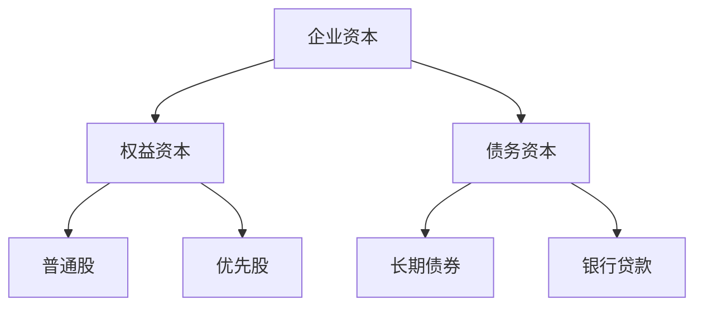

                 

# 《企业估值中的资本结构分析》

> 关键词：资本结构分析、企业估值、WACC模型、APV模型、财务杠杆、资本成本、企业价值最大化

> 摘要：资本结构是企业在经营过程中至关重要的决策之一，它直接影响企业的价值和财务风险。本文从资本结构的基本概念出发，详细分析了资本结构对企业估值的影响，重点介绍了两种经典的资本结构分析模型——加权平均资本成本（WACC）模型和调整现值（APV）模型，并通过实际案例展示了如何在企业估值中应用这些模型。文章还探讨了资本结构优化的策略和方法，为企业在资本结构管理中提供了实践指导。

---

## 第一部分：资本结构分析基础

### 第1章：资本结构的基本概念与理论基础

#### 1.1 资本结构的定义与构成

资本结构是指企业各种长期资本的构成及其比例关系。企业的资本主要由权益资本和债务资本两部分组成。权益资本包括普通股和优先股，债务资本包括长期债券、银行贷款等。资本结构的核心在于如何合理配置权益资本和债务资本的比例，以实现企业价值的最大化。

**关键概念对比表：**

| 资本类型 | 权益资本 | 债务资本 |
|----------|----------|----------|
| 定义     | 企业所有者投入的资金，所有者承担企业的经营风险。 | 企业通过借入资金获得的资本，债权人承担的是偿债风险。 |
| 成本     | 权益资本成本较高，因为所有者承担更大的风险。 | 债务资本成本较低，因为债权人承担的风险较小，通常有固定的利息支付。 |
| 杠杆效应 | 无杠杆，权益资本承担企业全部的风险。 | 高杠杆，债务资本通过固定利息支付转移部分风险到债权人。 |

**Mermaid流程图：资本结构的基本构成**

#### 1.2 资本结构分析的理论基础

资本结构分析的理论基础主要包括现代资本结构理论和传统资本结构理论。以下是两种理论的核心观点：

1. **传统资本结构理论（MM定理）**  
   MM定理（Modigliani-Miller定理）指出，在无税情况下，企业的价值与资本结构无关；在有税情况下，适度的债务会使企业价值增加，因为债务利息可以在税前列支，从而减少企业的税负。

2. **现代资本结构理论**  
   现代资本结构理论强调市场势力、信息不对称、代理成本等因素对资本结构的影响。企业最优资本结构是使加权平均资本成本（WACC）最小化的资本结构。

**公式对比：**

- **MM定理（无税情况）**  
  $$ V_{U} = V_{L} $$
  
  其中，\( V_{U} \) 表示无杠杆企业的价值，\( V_{L} \) 表示有杠杆企业的价值。

- **MM定理（有税情况）**  
  $$ V_{L} = V_{U} + T_{c} \times D $$
  
  其中，\( T_{c} \) 表示企业所得税率，\( D \) 表示债务价值。

#### 1.3 资本结构与企业财务风险

资本结构与企业财务风险密切相关。适度的债务可以增加企业杠杆，提高企业收益，但也增加了企业的财务风险。以下是财务杠杆对企业价值的影响：

1. **财务杠杆的定义与作用**  
   财务杠杆是指企业通过债务融资来放大权益收益的过程。财务杠杆越高，企业的收益波动性越大，财务风险也越高。

2. **财务风险对企业价值的影响**  
   过高的财务杠杆可能导致企业陷入财务困境，甚至破产。因此，企业需要在杠杆收益和杠杆风险之间找到平衡点。

---

## 第二部分：企业估值的核心方法

### 第2章：加权平均资本成本（WACC）模型

#### 2.1 WACC模型的原理与公式

WACC模型是企业估值中最常用的模型之一。其核心思想是：企业的价值等于其未来现金流的现值，而折现率就是企业的加权平均资本成本。

**公式：**

$$ WACC = w_{d} \times r_{d} \times (1 - T_{c}) + w_{e} \times r_{e} $$

其中：
- \( w_{d} \)：债务资本占比
- \( r_{d} \)：债务资本成本
- \( T_{c} \)：企业所得税率
- \( w_{e} \)：权益资本占比
- \( r_{e} \)：权益资本成本

#### 2.2 WACC模型的计算步骤

**步骤一：确定企业的资本结构**

假设某企业目标资本结构为债务占比40%，权益占比60%。

**步骤二：计算债务资本成本和权益资本成本**

- 假设债务资本成本为6%，权益资本成本为10%。

**步骤三：计算加权平均资本成本**

$$ WACC = 0.4 \times 6\% \times (1 - T_{c}) + 0.6 \times 10\% $$

假设企业所得税率为25%，则：

$$ WACC = 0.4 \times 6\% \times 0.75 + 0.6 \times 10\% = 2.16\% + 6\% = 8.16\% $$

**步骤四：应用WACC进行企业估值**

假设企业未来现金流为1000万元，持续时间永续，则企业价值为：

$$ 企业价值 = \frac{1000}{WACC} = \frac{1000}{0.0816} \approx 12250.81 \text{万元} $$

#### 2.3 WACC模型的优缺点

**优点：**
- 考虑了债务税盾效应。
- 适用于大多数企业估值。

**缺点：**
- 假设企业处于稳定增长阶段，忽视了企业实际经营中的不确定性。
- 对资本结构的假设可能与实际情况不符。

### 第3章：调整现值（APV）模型

#### 3.1 APV模型的原理与公式

APV模型是另一种常用的资本结构分析模型。其核心思想是：企业的价值等于无杠杆价值加上杠杆带来的额外价值。

**公式：**

$$ APV = U + T_{c} \times D \times \frac{r_{d}}{r_{d}} $$

其中：
- \( U \) 表示无杠杆企业的价值
- \( D \) 表示债务价值
- \( T_{c} \) 表示企业所得税率
- \( r_{d} \) 表示债务资本成本

#### 3.2 APV模型的计算步骤

**步骤一：计算无杠杆企业的价值**

假设无杠杆企业的价值为5000万元。

**步骤二：计算杠杆企业的价值**

假设债务价值为2000万元，所得税率为25%，债务资本成本为6%。

$$ APV = 5000 + 0.25 \times 2000 \times 0.06 = 5000 + 30 = 5030 \text{万元} $$

**步骤三：应用APV进行企业估值**

假设企业未来现金流为5030万元，持续时间永续，则企业价值为：

$$ 企业价值 = \frac{5030}{WACC} $$

---

## 第三部分：资本结构优化与企业价值最大化

### 第4章：资本结构优化的理论与方法

#### 4.1 资本结构优化的目标

资本结构优化的目标是使企业的加权平均资本成本最小化，从而实现企业价值最大化。

#### 4.2 资本结构优化的常用方法

1. **净现值法（NPV法）**  
   通过比较不同资本结构下的净现值，选择净现值最大的资本结构。

2. **内部收益率法（IRR法）**  
   通过比较不同资本结构下的内部收益率，选择内部收益率最高的资本结构。

3. **加权平均资本成本法（WACC法）**  
   通过比较不同资本结构下的加权平均资本成本，选择资本成本最小的资本结构。

#### 4.3 资本结构优化的实践应用

**案例分析：**

假设某企业有以下两种资本结构选择：

- **方案一**：债务占比40%，权益占比60%，WACC=8.16%
- **方案二**：债务占比50%，权益占比50%，WACC=8.5%

选择方案一作为最优资本结构，因为其WACC更低，企业价值更大。

---

## 第五部分：总结与展望

### 第5章：资本结构分析的总结与最佳实践

#### 5.1 资本结构分析的核心要点

- 资本结构影响企业价值和财务风险。
- WACC和APV是常用的资本结构分析模型。
- 资本结构优化是企业价值最大化的重要手段。

#### 5.2 资本结构分析的最佳实践

- 根据企业实际情况选择合适的资本结构。
- 定期评估和调整资本结构。
- 注意债务税盾效应和财务杠杆的双重作用。

#### 5.3 资本结构分析的未来展望

随着企业经营环境的变化，资本结构分析需要考虑更多因素，如市场不确定性、信息不对称等。未来，资本结构分析将更加注重动态调整和风险管理。

---

## 作者：AI天才研究院/AI Genius Institute & 禅与计算机程序设计艺术 /Zen And The Art of Computer Programming

---

**小结：** 本文从资本结构的基本概念出发，详细分析了资本结构对企业估值的影响，并通过WACC和APV模型展示了如何在企业估值中应用资本结构分析。同时，本文还探讨了资本结构优化的策略和方法，为企业在资本结构管理中提供了实践指导。

