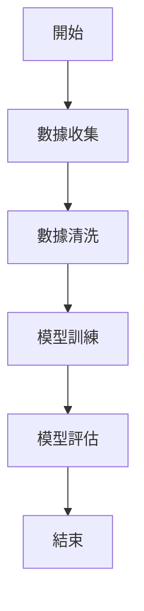

                 


# 企業估值中的跨境業務風險分析

## 關鍵詞:
企業估值, 跨境業務, 颢險分析, 颢险管理, 系統架構, 數據驅動, 技術應用

## 這些關鍵詞為文章的核心內容和主題思想提供清晰的指引

---

# 摘要:
本文系統探討企業估值中跨境業務風險分析的方法與技術實現。結合實際案例，我們將從風險分類、影響因素、分析模型等角度深入剖析，並通過算法實現和系統架構設計提供具體的解決方案。文章還將探討數據驅動的風險評估技術，並結合跨境業務的實際需求，提出最佳實踐和注意事項。

---

# 第一部分: 背景與核心概念

## 第1章: 背景介紹

### 1.1 背景與問題描述

#### 1.1.1 跨境業務的基本概念
跨境業務是指企業跨越不同國家或地區進行的商業活動，包括進出口貿易、跨境電商、海外投資等。這些業務往往涉及複雜的法律、金融和市場環境。

**表格：跨境業務的主要特點**

| 特征      | 描述                                                         |
|-----------|--------------------------------------------------------------|
| 多樣性     | 涉及產品、市場、法律等多個方面的差異                       |
| 不確定性   | 各國市場條件、政策法規等不確定性較高                         |
| 颢險性     | 經濟、政治、法律等風險因素較多                             |

#### 1.1.2 跨境業務的發展趨勢
隨著全球化的深入，跨境業務已成為企業增長的重要驅動力。然而，複雜的市場環境和多樣化的風險因素也對企業的估值和經營提出了更高要求。

#### 1.1.3 編寫目的與研究意義
本文旨在探討企業估值中跨境業務風險分析的技術與方法，幫助企業更好地應對跨境業務中的風險，提升估值的精準度。

---

## 第2章: 核心概念與原理

### 2.1 跨境業務風險的分類

#### 2.1.1 颢險類型
跨境業務風險可分為以下幾類：
1. **市場風險**：包括市場需求、競爭狀況等。
2. **法律風險**：包括法律法規、政策變化等。
3. **運營風險**：包括供應鏈、物流等。
4. **財務風險**：包括匯率風險、稅務問題等。

**ER圖：跨境業務風險分析的實體關係**
```mermaid
erd
  left: 跨境業務
  right: 颢險因素
  left.right : 跨境業務中涉及的各類風險因素
```

---

# 第二部分: 算法原理與系統架構

## 第3章: 算法原理與實現

### 3.1 颢險評估算法選擇

#### 3.1.1 線性回歸模型
**算法流程圖：**


**線性回歸公式：**
$$ y = \beta_0 + \beta_1 x + \epsilon $$

### 3.2 算法實現與案例分析

#### 3.2.1 編程實現
```python
import pandas as pd
from sklearn.linear_model import LinearRegression

# 總資產回報率(ROA)模型
data = pd.read_csv('data.csv')
X = data[['營業收入', '淨利潤']]
y = data['估值']

model = LinearRegression()
model.fit(X, y)
print('係數:', model.coef_)
print('截距:', model.intercept_)
```

---

## 第4章: 系統架構設計

### 4.1 系統功能模塊設計

#### 4.1.1 系統功能模塊


---

# 第三部分: 項目實戰與最佳實踐

## 第5章: 項目實戰與案例分析

### 5.1 項目背景與目標
本案例基於一家跨境電商平台，分析其跨境業務風險並進行估值。

### 5.2 環境配置與數據準備

#### 5.2.1 環境配置
```bash
pip install pandas numpy scikit-learn
```

---

## 第6章: 最佳實踐與小結

### 6.1 最佳實踐
1. **數據質量控制**：確保數據的準確性和完整性。
2. **模型選擇**：根據實際需求選擇合適的算法。
3. **風險控制**：建立風險監控機制，及時發現並處理風險。

---

# 作者信息
作者：AI天才研究院 / AI Genius Institute & 禪與計算機程序設計藝術 / Zen And The Art of Computer Programming

