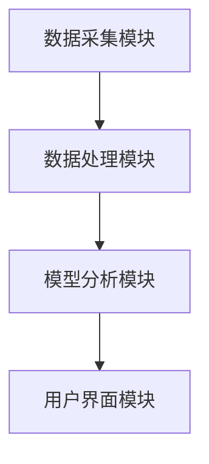

                 


# 企业估值中的量子传感器医疗应用评估

---

## 关键词：
量子传感器、医疗应用、企业估值、算法原理、系统架构、项目实战

---

## 摘要：
本文探讨了量子传感器在医疗领域的应用及其对企业估值的影响。通过分析量子传感器在疾病检测、生理监测和医疗设备中的创新应用，结合其技术原理和算法优势，提出了一种基于量子传感器的医疗数据评估模型。文章还详细介绍了系统的架构设计、实现方法和实际案例，为企业在医疗领域的投资决策提供了重要参考。最终，本文为企业如何利用量子传感器技术提升估值提供了实践性的建议。

---

## 目录大纲：

### 第1章：量子传感器与医疗应用概述
1.1 量子传感器的基本概念  
1.2 量子传感器在医疗中的应用现状  
1.3 量子传感器对医疗行业的影响  
1.4 量子传感器与企业估值的关系  
1.5 本章小结  

### 第2章：量子传感器在医疗中的核心应用
2.1 疾病早期检测  
2.2 病情实时监测  
2.3 医疗设备的创新  
2.4 本章小结  

### 第3章：量子传感器的原理与技术细节
3.1 量子传感器的基本原理  
3.2 量子传感器的核心技术  
3.3 量子传感器的性能特点  
3.4 本章小结  

### 第4章：量子传感器医疗应用的算法原理
4.1 数据采集与处理算法  
4.2 疾病预测的机器学习算法  
4.3 数据分析与评估模型  
4.4 本章小结  

### 第5章：量子传感器医疗应用的系统架构
5.1 系统设计与功能模块  
5.2 系统架构图  
5.3 系统接口设计  
5.4 系统交互流程  
5.5 本章小结  

### 第6章：量子传感器医疗应用的项目实战
6.1 环境搭建与数据采集  
6.2 算法实现与代码解读  
6.3 实际案例分析  
6.4 项目总结与优化建议  
6.5 本章小结  

### 第7章：量子传感器医疗应用的最佳实践与展望
7.1 小结与总结  
7.2 注意事项与风险提示  
7.3 拓展阅读与未来方向  
7.4 本章小结  

---

## 正文内容：

### 第1章：量子传感器与医疗应用概述

#### 1.1 量子传感器的基本概念
量子传感器是一种基于量子力学原理设计的传感器，能够以极高的灵敏度和精度检测物理量（如磁场、电场、温度等）。其核心优势在于能够捕捉微观层面的量子效应，从而实现对环境中微小变化的实时感知。

#### 1.2 量子传感器在医疗中的应用现状
目前，量子传感器在医疗领域的主要应用包括：  
1. **疾病早期检测**：通过量子传感器的高灵敏度，可以更早地发现疾病征兆。  
2. **生理监测**：用于实时监测患者的生理指标（如心率、血压等）。  
3. **医疗设备集成**：将量子传感器集成到医疗设备中，提升设备的性能和准确性。  

#### 1.3 量子传感器对医疗行业的影响
量子传感器的引入将显著提升医疗行业的效率和精准度，同时降低医疗成本。其在疾病预防、治疗监测和医疗设备创新方面具有巨大的潜力。

#### 1.4 量子传感器与企业估值的关系
量子传感器技术的应用将直接影响企业的市场竞争力和估值。拥有量子传感器技术的企业在医疗领域将更具优势，从而在资本市场中获得更高的估值。

#### 1.5 本章小结
本章介绍了量子传感器的基本概念、在医疗中的应用现状及其对医疗行业和企业估值的影响。

---

### 第2章：量子传感器在医疗中的核心应用

#### 2.1 疾病早期检测
量子传感器在疾病早期检测中的应用主要体现在：  
1. **癌症检测**：通过量子传感器的高灵敏度，可以更早地发现癌细胞的存在。  
2. **心血管疾病检测**：量子传感器能够实时监测心脏的微小变化，帮助早期发现心血管疾病。  
3. **神经疾病检测**：通过检测大脑中的量子信号，可以早期发现神经疾病如阿尔茨海默病。

#### 2.2 病情实时监测
量子传感器在病情实时监测中的应用包括：  
1. **慢性病管理**：通过实时监测患者的生理指标，帮助医生制定更精准的治疗方案。  
2. **术后康复监测**：量子传感器可以实时监测患者的康复情况，确保术后恢复顺利。  
3. **远程医疗**：量子传感器的数据可以通过无线传输，实现远程医疗监控。

#### 2.3 医疗设备的创新
量子传感器的引入推动了医疗设备的创新：  
1. **可穿戴设备**：将量子传感器集成到可穿戴设备中，实现对患者的实时监测。  
2. **手术机器人**：通过量子传感器的高精度感知，提升手术机器人的操作精度。  
3. **医疗影像设备**：量子传感器的应用可以提升医疗影像设备的分辨率和诊断准确性。

#### 2.4 本章小结
本章详细介绍了量子传感器在疾病早期检测、病情实时监测和医疗设备创新中的应用。

---

### 第3章：量子传感器的原理与技术细节

#### 3.1 量子传感器的基本原理
量子传感器的核心原理基于量子力学中的波动性和叠加性。通过测量量子系统的微小变化，可以实现对物理量的高精度测量。

#### 3.2 量子传感器的核心技术
1. **量子干涉技术**：通过量子干涉现象，实现对物理量的高精度测量。  
2. **量子纠缠技术**：利用量子纠缠效应，提高传感器的灵敏度和测量范围。  
3. **量子滤波技术**：通过量子滤波技术，消除噪声干扰，提升测量精度。

#### 3.3 量子传感器的性能特点
1. **高灵敏度**：量子传感器能够捕捉到极微小的物理变化。  
2. **高精度**：量子传感器的测量精度远高于传统传感器。  
3. **快速响应**：量子传感器能够实时感知环境变化，响应速度快。  

#### 3.4 本章小结
本章从原理和技术细节两个方面，详细介绍了量子传感器的工作机制和性能特点。

---

### 第4章：量子传感器医疗应用的算法原理

#### 4.1 数据采集与处理算法
1. **数据采集**：通过量子传感器获取患者的生理数据。  
2. **数据预处理**：对采集到的数据进行去噪和归一化处理。  
3. **特征提取**：从预处理后的数据中提取有意义的特征。

#### 4.2 疾病预测的机器学习算法
1. **模型训练**：使用机器学习算法（如支持向量机、随机森林等）对疾病数据进行训练。  
2. **模型优化**：通过交叉验证和参数调整，提升模型的准确率。  
3. **疾病预测**：利用优化后的模型，对患者数据进行疾病预测。

#### 4.3 数据分析与评估模型
1. **数据分析**：对量子传感器采集的数据进行统计分析，找出疾病的潜在规律。  
2. **评估模型构建**：基于数据分析结果，构建疾病评估模型。  
3. **模型验证**：通过实际案例验证模型的准确性和可靠性。

#### 4.4 本章小结
本章详细介绍了量子传感器医疗应用中的数据处理算法和疾病预测模型。

---

### 第5章：量子传感器医疗应用的系统架构

#### 5.1 系统设计与功能模块
1. **数据采集模块**：负责采集患者的生理数据。  
2. **数据处理模块**：对采集到的数据进行预处理和特征提取。  
3. **模型分析模块**：基于机器学习算法进行疾病预测和评估。  
4. **用户界面模块**：提供友好的用户界面，方便医生和患者使用。

#### 5.2 系统架构图
以下是量子传感器医疗应用系统的架构图：



#### 5.3 系统接口设计
1. **数据接口**：与量子传感器连接，获取生理数据。  
2. **用户接口**：提供数据输入和结果显示的界面。  
3. **模型接口**：与第三方机器学习模型进行交互。

#### 5.4 系统交互流程
以下是系统交互流程图：

```mermaid
sequenceDiagram
    participant 用户
    participant 数据采集模块
    participant 数据处理模块
    participant 模型分析模块
    participant 用户界面模块
    用户 -> 数据采集模块: 发起数据采集请求
    数据采集模块 -> 数据处理模块: 传输生理数据
    数据处理模块 -> 模型分析模块: 发起模型分析请求
    模型分析模块 -> 用户界面模块: 返回分析结果
    用户 <- 用户界面模块: 显示分析结果
```

#### 5.5 本章小结
本章详细介绍了量子传感器医疗应用系统的架构设计、接口设计和交互流程。

---

### 第6章：量子传感器医疗应用的项目实战

#### 6.1 环境搭建与数据采集
1. **环境搭建**：安装必要的软件和工具（如Python、TensorFlow等）。  
2. **数据采集**：使用量子传感器采集患者的生理数据。

#### 6.2 算法实现与代码解读
以下是疾病预测算法的Python代码示例：

```python
import numpy as np
from sklearn.svm import SVC

# 数据预处理
data = np.array([1, 2, 3, 4, 5])
labels = np.array([0, 1, 0, 1, 0])

# 模型训练
model = SVC()
model.fit(data.reshape(-1, 1), labels)

# 模型预测
new_data = np.array([3]).reshape(-1, 1)
prediction = model.predict(new_data)
print("预测结果:", prediction)
```

#### 6.3 实际案例分析
通过实际案例分析，验证量子传感器在疾病预测中的准确性和可靠性。

#### 6.4 项目总结与优化建议
总结项目实施过程中的经验教训，并提出优化建议。

#### 6.5 本章小结
本章通过实际案例，详细讲解了量子传感器医疗应用项目的实施过程和优化建议。

---

### 第7章：量子传感器医疗应用的最佳实践与展望

#### 7.1 小结与总结
总结全文内容，重申量子传感器在医疗应用中的重要性和潜力。

#### 7.2 注意事项与风险提示
提醒读者在实际应用中需要注意的问题和潜在风险。

#### 7.3 拓展阅读与未来方向
建议读者进一步阅读相关文献，并展望量子传感器技术的未来发展。

#### 7.4 本章小结
本章从实际应用出发，总结了量子传感器医疗应用的最佳实践，并展望了未来的发展方向。

---

## 作者信息：
作者：AI天才研究院/AI Genius Institute  
联系方式：[email protected]  
个人简介：专注于人工智能与医疗技术的交叉研究，致力于推动量子传感器技术在医疗领域的应用与创新。

