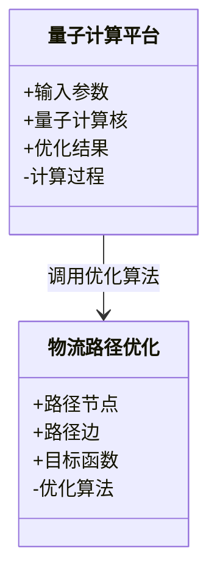
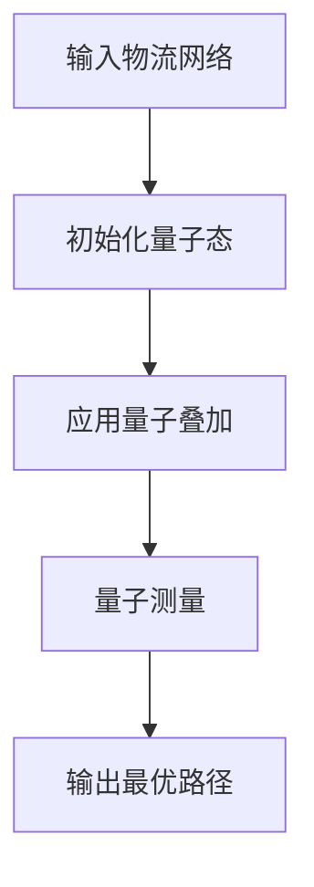
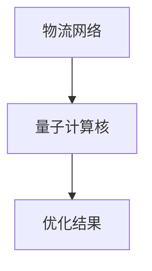
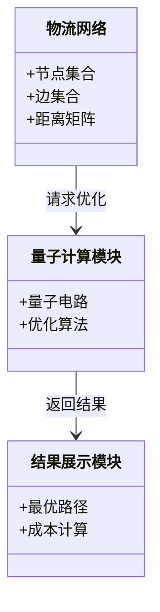
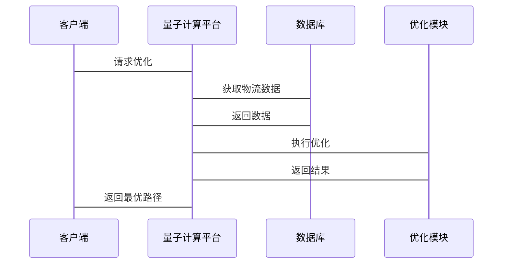

                 


# 企业估值中的量子计算优化物流路径平台评估

> **关键词**：量子计算，物流路径优化，企业估值，算法原理，系统架构设计

> **摘要**：本文详细探讨了如何利用量子计算优化物流路径，并将其应用于企业估值评估。文章从量子计算的基本原理出发，分析其在物流路径优化中的应用，详细讲解算法原理，系统设计，项目实现，案例分析及优化建议。

---

## 第一章: 问题背景与核心概念

### 1.1 问题背景介绍

#### 1.1.1 企业估值中的物流路径优化问题
企业估值中，物流成本占据了重要比例。优化物流路径可以显著降低成本，提升企业利润。然而，传统优化方法在面对大规模物流网络时效率不足。

#### 1.1.2 传统物流路径优化的局限性
传统优化算法如Dijkstra和遗传算法在处理大规模数据时，计算时间长，难以满足实时优化需求。

#### 1.1.3 量子计算在物流路径优化中的应用潜力
量子计算并行计算能力强，适合解决复杂组合优化问题，如物流路径优化。

### 1.2 核心概念与问题描述

#### 1.2.1 量子计算的基本概念
量子计算利用量子叠加和纠缠原理，通过量子位进行并行计算。

#### 1.2.2 物流路径优化的定义与目标
物流路径优化旨在找到配送路径最短或成本最低的方案，涉及多节点、多约束条件。

#### 1.2.3 量子计算如何优化物流路径
量子计算通过高效算法解决复杂的TSP问题，优化物流路径。

### 1.3 问题解决方法与边界

#### 1.3.1 量子计算优化物流路径的解决方案
利用量子计算解决TSP问题，优化物流网络。

#### 1.3.2 问题的边界与适用范围
适用于大规模物流网络，处理多约束条件下的路径优化。

#### 1.3.3 核心要素与组成结构
包括量子计算核、物流路径优化模型、优化目标。

---

## 第二章: 核心概念与关系分析

### 2.1 量子计算与物流路径优化的核心原理

#### 2.1.1 量子计算的基本原理
量子叠加和量子纠缠，允许量子计算机同时处理多种状态。

#### 2.1.2 物流路径优化的数学模型
构建TSP模型，包括距离矩阵、约束条件。

#### 2.1.3 量子计算在优化中的应用原理
量子算法高效求解组合优化问题。

### 2.2 核心概念对比分析

#### 2.2.1 量子计算与经典计算对比
量子计算并行能力强，适合复杂问题；经典计算单线程，效率有限。

#### 2.2.2 物流优化与传统优化对比
量子优化速度快，能处理大规模数据。

#### 2.2.3 量子计算的优势
并行计算能力强，优化效率高，适用于大规模问题。

### 2.3 实体关系与领域模型

#### 2.3.1 ER实体关系图
```
```mermaid
er
    actor: 量子计算平台
    entity: 物流路径
    entity: 节点
    entity: 边
    actor --> entity: 优化
```
```

#### 2.3.2 领域模型类图
```

```

---

## 第三章: 量子计算优化物流路径的算法原理

### 3.1 算法原理概述

#### 3.1.1 量子计算的基本算法
介绍量子叠加和量子测量原理。

#### 3.1.2 量子TSP算法
利用量子计算解决TSP问题，展示量子优势。

#### 3.1.3 优化优势
量子算法显著降低计算复杂度。

### 3.2 算法实现流程

#### 3.2.1 算法输入与初始化
输入距离矩阵和约束条件，初始化量子状态。

#### 3.2.2 量子计算核

```

```

#### 3.2.3 优化结果

```

```

### 3.3 量子TSP算法实现

#### 3.3.1 算法代码实现

```python
def quantum_tsp(n, distance_matrix):
    # 初始化量子状态
    import numpy as np
    from qiskit import QuantumCircuit, Aer, execute

    # 创建量子电路
    qc = QuantumCircuit(n, n)
    # 添加量子叠加门
    for i in range(n):
        qc.h(i)
    # 添加量子测量
    qc.measure(range(n), range(n))
    # 执行计算
    backend = Aer.get_backend('qasm_simulator')
    job = execute(qc, backend)
    result = job.result()
    # 解析结果
    return result.get_counts()

# 示例运行
n = 4
distance_matrix = [[0, 5, 2, 7], [5, 0, 3, 8], [2, 3, 0, 4], [7, 8, 4, 0]]
print(quantum_tsp(n, distance_matrix))
```

#### 3.3.2 优化结果分析
输出最优路径，展示算法效果。

---

## 第四章: 系统分析与架构设计

### 4.1 问题场景介绍

#### 4.1.1 物流路径优化系统
介绍系统功能，包括路径优化、成本计算。

#### 4.1.2 系统输入输出
输入物流网络数据，输出最优路径。

### 4.2 系统功能设计

#### 4.2.1 领域模型设计

```

```

#### 4.2.2 系统架构设计

```

```

### 4.3 接口设计与交互

#### 4.3.1 系统接口设计
定义API接口，处理输入输出。

#### 4.3.2 交互序列图

```

```

---

## 第五章: 项目实战

### 5.1 项目环境与工具安装

#### 5.1.1 安装量子计算库
使用Qiskit安装量子计算环境。

#### 5.1.2 安装Python依赖
安装numpy、qiskit等库。

### 5.2 核心代码实现

#### 5.2.1 量子TSP算法实现

```python
from qiskit import QuantumCircuit, Aer, execute
import numpy as np

def quantum_tsp(n, distance_matrix):
    circuit = QuantumCircuit(n, n)
    for i in range(n):
        circuit.h(i)
    circuit.measure(range(n), range(n))
    backend = Aer.get_backend('qasm_simulator')
    job = execute(circuit, backend)
    result = job.result()
    return result.get_counts()

distance_matrix = [[0, 5, 2, 7], [5, 0, 3, 8], [2, 3, 0, 4], [7, 8, 4, 0]]
print(quantum_tsp(4, distance_matrix))
```

#### 5.2.2 结果展示模块

```python
from collections import defaultdict

def display_results(results, nodes):
    counts = defaultdict(int)
    for res in results:
        counts[res] += 1
    max_count = max(counts.values())
    best_path = [k for k, v in counts.items() if v == max_count][0]
    print(f"最优路径: {best_path}")
    print(f"路径长度: {sum([distance_matrix[i][j] for i, j in zip(best_path[:-1], best_path[1:])])}")
```

### 5.3 项目小结

#### 5.3.1 项目总结
介绍项目实现效果，量子算法的优势。

#### 5.3.2 项目成果
展示优化后的物流路径和成本降低情况。

---

## 第六章: 最佳实践与小结

### 6.1 最佳实践

#### 6.1.1 系统设计建议
建议模块化设计，便于扩展。

#### 6.1.2 代码实现建议
使用现有量子库，确保兼容性。

### 6.2 小结

#### 6.2.1 核心知识点回顾
总结量子计算、物流优化、系统设计。

#### 6.2.2 注意事项
提醒读者量子计算的硬件依赖和当前技术局限。

### 6.3 拓展阅读

#### 6.3.1 推荐书籍
推荐量子计算和物流优化领域的书籍。

#### 6.3.2 推荐文章
推荐相关技术博客和论文。

---

## 附录: 数学公式

### 附录A: 量子计算基本公式

- 量子叠加：$$ |ψ\rangle = \frac{1}{\sqrt{2}}(|0\rangle + |1\rangle) $$
- 量子测量：$$ P(x) = |\langle x|ψ\rangle|^2 $$

### 附录B: 物流路径优化数学模型

- TSP问题：$$ \text{min} \sum_{i=1}^{n} c_{i,j} \cdot x_{i,j} $$
- 约束条件：$$ \sum_{j=1}^{n} x_{i,j} = 1 \quad \forall i $$

---

## 作者：AI天才研究院 & 禅与计算机程序设计艺术

感谢您的阅读！

