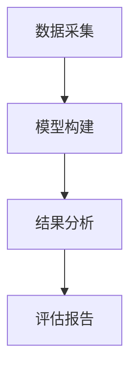
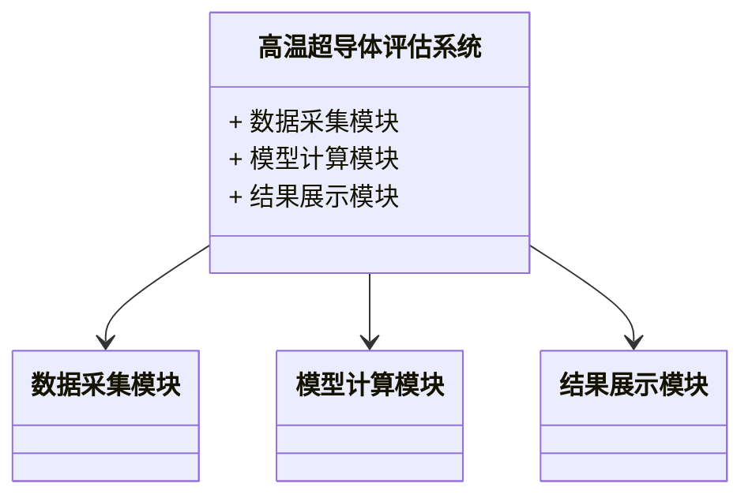

                 


# 企业估值中的高温超导体应用评估

## 关键词：
高温超导体，企业估值，应用评估，数学模型，系统架构，项目实战

## 摘要：
本文探讨了高温超导体在企业估值中的应用评估，涵盖高温超导体的背景、核心概念、评估算法、系统设计、项目实战及最佳实践。通过详细分析高温超导体的物理特性、数学模型和系统架构，结合实际案例，展示了如何有效评估其对企业价值的影响。

---

# 第一部分：高温超导体的基本概念与背景

## 第1章：高温超导体的定义与背景

### 1.1 高温超导体的定义
高温超导体是指在较高温度下（通常高于液氮温度）表现出完全超导性的材料。超导性是指材料在特定条件下电阻为零，同时完全排斥磁场。

### 1.2 高温超导体的发展历程
1986年，Bednorz和Müller发现Ba-La-Cu-O氧化物在35K（约-238°C）时呈现超导性，这是第一个高温超导体。随后，研究不断进步，发现了多种高温超导材料，如YBCO（钇钡铜氧）材料。

### 1.3 高温超导体的应用价值
高温超导体在企业中的应用包括：
- **电力传输**：减少能量损失，提高效率。
- **医疗设备**：如MRI，提高图像质量。
- **电子设备**：如超导电路，提升性能。

---

# 第二部分：高温超导体的核心概念与联系

## 第2章：高温超导体的物理原理

### 2.1 高温超导体的物理特性
高温超导体具有零电阻、完全抗磁性和临界电流密度特性。零电阻意味着电流流经时无能量损失，完全抗磁性意味着磁场无法穿透材料。

### 2.2 高温超导体的数学模型
高温超导体的临界电流密度公式为：
$$ J_c = \frac{I}{A} $$
其中，\( I \)为电流，\( A \)为横截面积。

### 2.3 高温超导体与传统导体的对比
| 特性            | 高温超导体       | 传统导体      |
|-----------------|------------------|---------------|
| 电阻            | 0                | 非零           |
| 磁场穿透性       | 完全抗磁性        | 可穿透         |
| 临界电流密度     | 较高             | 较低           |

## 第3章：高温超导体的数学模型与公式

### 3.1 超导体的数学模型
超导体的麦克斯韦方程组描述了电磁场的行为：
$$ \nabla \times \mathbf{B} = 0 $$
$$ \nabla \cdot \mathbf{E} = 0 $$

### 3.2 临界磁场强度公式
临界磁场强度 \( B_c \) 可通过以下公式计算：
$$ B_c = \frac{\mu_0 I}{\pi a^2} $$
其中，\( \mu_0 \)为真空磁导率，\( I \)为电流，\( a \)为导体半径。

---

# 第三部分：高温超导体的应用评估方法

## 第4章：高温超导体的评估算法

### 4.1 评估算法的原理
评估高温超导体对企业价值的影响需要考虑其物理特性、应用效果和经济效益。算法步骤如下：

1. **数据采集**：收集高温超导体的性能参数和企业的相关数据。
2. **模型构建**：建立评估模型，计算其对企业成本和效率的影响。
3. **结果分析**：评估高温超导体的应用对企业价值的提升。

### 4.2 评估算法的流程图（Mermaid）



## 第5章：高温超导体评估系统的架构设计

### 5.1 系统功能模块
- **数据采集模块**：收集高温超导体的性能数据。
- **模型计算模块**：计算其对企业价值的影响。
- **结果展示模块**：生成评估报告。

### 5.2 系统架构图（Mermaid）



---

# 第四部分：项目实战与案例分析

## 第6章：高温超导体评估系统的实现

### 6.1 环境配置
- **开发工具**：使用Python和Jupyter Notebook进行开发。
- **数据库**：采用MySQL存储数据。

### 6.2 核心代码实现
以下是评估系统的Python代码示例：

```python
def calculate_critical_current(material):
    # 计算临界电流
    I = material['current']
    A = material['area']
    J_c = I / A
    return J_c

def evaluate_value(material):
    J_c = calculate_critical_current(material)
    return J_c * material['value_factor']

# 示例数据
material = {
    'current': 100,
    'area': 0.05,
    'value_factor': 2
}

print(evaluate_value(material))
```

## 第7章：实际案例分析

### 7.1 案例背景
某企业引入高温超导体用于电力传输，目标是降低能耗，提高效率。

### 7.2 案例分析与解读
- **数据采集**：收集高温超导体的临界电流和传统导体的数据。
- **模型计算**：使用评估算法计算高温超导体的经济效益。
- **结果展示**：生成报告，展示高温超导体的应用对企业价值的提升。

---

# 第五部分：最佳实践、小结与拓展阅读

## 第8章：最佳实践

### 8.1 小结
高温超导体的应用评估需要结合其物理特性、数学模型和实际应用场景。通过科学的算法和系统的架构设计，可以有效评估其对企业价值的影响。

### 8.2 注意事项
- 确保数据的准确性和完整性。
- 在实际应用中考虑高温超导体的制备成本和维护成本。

### 8.3 拓展阅读
- 推荐阅读相关书籍《高温超导体的应用与挑战》。
- 关注高温超导体领域的最新研究进展。

---

# 作者：AI天才研究院 & 禅与计算机程序设计艺术

