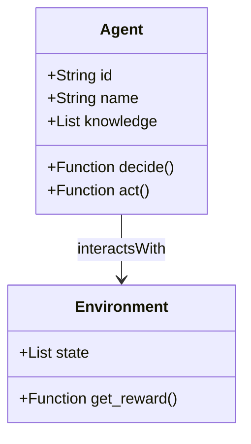
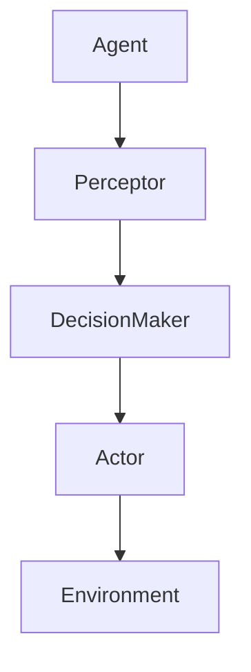

                 


# 企业数字化转型中的AI Agent角色

## 关键词：企业数字化转型, AI Agent, 人工智能, 企业效率, 数字化决策

## 摘要：  
本文详细探讨了AI Agent在企业数字化转型中的核心角色。通过分析AI Agent的定义、作用、算法原理、系统架构以及实际应用场景，揭示其在提升企业效率和决策能力中的巨大潜力。文章结合理论与实践，为企业技术决策者和IT架构师提供深度洞察，助力企业在数字化转型中实现智能化升级。

---

# 第一部分: 企业数字化转型中的AI Agent角色概述

## 第1章: AI Agent的定义与作用

### 1.1 AI Agent的基本概念

#### 1.1.1 什么是AI Agent
AI Agent（人工智能代理）是一种能够感知环境、自主决策并执行任务的智能实体。它结合了机器学习、自然语言处理和推理能力，能够处理复杂问题并提供解决方案。

#### 1.1.2 AI Agent的核心作用
- **自动化执行**：AI Agent能够自动完成重复性任务，减少人工干预。
- **智能决策**：通过分析数据，AI Agent可以做出最优决策，提高效率。
- **实时响应**：具备快速响应能力，适应动态变化的环境。

#### 1.1.3 AI Agent与传统自动化工具的区别
| 特性          | AI Agent                | 传统自动化工具          |
|---------------|-------------------------|-------------------------|
| 智能性         | 高                     | 低                     |
| 自主性         | 高                     | 低                     |
| 适应性         | 强                     | 弱                     |
| 数据处理能力   | 强                     | 有限                   |

### 1.2 AI Agent在企业数字化转型中的角色

#### 1.2.1 AI Agent在企业中的应用场景
- **客户服务**：智能客服系统通过自然语言处理技术解决客户问题。
- **流程优化**：AI Agent能够分析企业流程，提出优化建议。
- **预测分析**：利用机器学习模型预测市场趋势和风险。

#### 1.2.2 AI Agent对企业效率的提升
- **自动化处理**：减少人工操作，提高处理速度。
- **数据驱动决策**：基于实时数据做出更明智的决策。
- **24/7运行**：AI Agent可以全天候工作，不影响企业运行。

#### 1.2.3 AI Agent在决策支持中的作用
- **数据整合**：AI Agent能够整合多源数据，提供全面的决策支持。
- **预测与建议**：通过分析历史数据，预测未来趋势并提出建议。

### 1.3 企业数字化转型的背景与趋势

#### 1.3.1 数字化转型的定义与目标
数字化转型是指企业利用数字技术（如AI、大数据、云计算）改变业务模式、流程、文化，以提高效率和竞争力。

#### 1.3.2 AI技术在数字化转型中的地位
AI作为数字化转型的核心技术，为企业提供了智能化升级的可能。

#### 1.3.3 企业数字化转型中的挑战与机遇
- **挑战**：数据隐私、技术集成、人才短缺。
- **机遇**：提高效率、降低成本、创造新价值。

### 1.4 AI Agent与其他技术的关系

#### 1.4.1 AI Agent与大数据的关系
AI Agent依赖于大数据进行分析和决策，而大数据为AI Agent提供了丰富的数据源。

#### 1.4.2 AI Agent与云计算的关系
云计算为AI Agent提供了弹性计算资源，支持其大规模运行和处理。

---

## 第2章: AI Agent的核心概念与联系

### 2.1 AI Agent的结构与类型

#### 2.1.1 AI Agent的结构
AI Agent通常由感知层、决策层和执行层组成。

#### 2.1.2 AI Agent的类型
- **基于规则的AI Agent**：通过预定义规则进行决策。
- **基于学习的AI Agent**：通过机器学习模型自主学习和优化。

### 2.2 AI Agent与其他技术的对比

| 技术          | AI Agent                | 其他技术              |
|---------------|-------------------------|-----------------------|
| 数据依赖性     | 高                     | 中/低                |
| 智能性         | 高                     | 低/无                |
| 适应性         | 强                     | 弱                   |

---

## 第3章: AI Agent的算法原理

### 3.1 强化学习算法

#### 3.1.1 强化学习的基本原理
强化学习通过智能体与环境的交互，学习最优策略以最大化累积奖励。

#### 3.1.2 算法流程
1. 状态感知
2. 动作选择
3. 奖励反馈
4. 策略更新

#### 3.1.3 数学模型
$$ Q(s, a) = Q(s, a) + \alpha (r + \gamma \max Q(s', a') - Q(s, a)) $$

#### 3.1.4 Python代码示例
```python
class Agent:
    def __init__(self, state_space, action_space):
        self.state_space = state_space
        self.action_space = action_space
        self.Q = defaultdict(lambda: 0)

    def act(self, state):
        # 选择最优动作
        max_action = max(self.Q[state], key=lambda k: self.Q[state][k])
        return max_action

    def learn(self, state, action, reward, next_state):
        # 更新Q值
        self.Q[state][action] += 0.1 * (reward + 0.9 * max(self.Q[next_state].values()) - self.Q[state][action])
```

### 3.2 自然语言处理算法

#### 3.2.1 自然语言处理的基本原理
NLP技术使AI Agent能够理解并生成自然语言文本。

#### 3.2.2 算法流程
1. 文本预处理
2. 语义分析
3. 意图识别
4. 响应生成

#### 3.2.3 数学模型
$$ P(\text{intent} | \text{utterance}) = \frac{\exp(\text{similarity})}{\sum \exp(\text{similarity}_i)} $$

#### 3.2.4 Python代码示例
```python
import spacy

nlp = spacy.load("en_core_web_sm")
doc = nlp("What is the weather today?")
for token in doc:
    print(token.text, token.pos_)
```

---

## 第4章: AI Agent的系统架构设计

### 4.1 问题场景分析

#### 4.1.1 客户服务场景
企业需要一个智能客服系统来处理客户的咨询和投诉。

### 4.2 系统功能设计

#### 4.2.1 领域模型设计


#### 4.2.2 系统架构设计


#### 4.2.3 接口设计
- **输入接口**：接收用户请求
- **输出接口**：返回处理结果

#### 4.2.4 交互流程
```mermaid
sequenceDiagram
    User->Agent: 发送请求
    Agent->Perceptor: 分析请求
    Perceptor->DecisionMaker: 生成决策
    DecisionMaker->Actor: 执行操作
    Actor->User: 返回结果
```

---

## 第5章: AI Agent的项目实战

### 5.1 环境安装与配置

#### 5.1.1 安装Python
```bash
python --version
pip install --upgrade pip
```

#### 5.1.2 安装依赖
```bash
pip install numpy spacy transformers
```

### 5.2 核心代码实现

#### 5.2.1 强化学习实现
```python
def train_model(env, num_episodes=1000):
    for episode in range(num_episodes):
        state = env.reset()
        while not done:
            action = agent.act(state)
            next_state, reward, done = env.step(action)
            agent.learn(state, action, reward, next_state)
```

#### 5.2.2 自然语言处理实现
```python
from transformers import pipeline

nlp = pipeline("text-classification", model="snli")
result = nlp("What is your name?")
print(result)
```

### 5.3 项目总结

#### 5.3.1 实现成果
成功实现了基于强化学习和NLP的AI Agent系统。

#### 5.3.2 实践中的注意事项
- 数据质量至关重要
- 算法选择影响性能
- 系统架构需要灵活扩展

---

## 第6章: AI Agent的最佳实践与小结

### 6.1 最佳实践

#### 6.1.1 数据管理
确保数据的完整性和隐私性。

#### 6.1.2 技术选型
根据需求选择合适的AI技术。

### 6.2 小结

通过本文的分析，AI Agent在企业数字化转型中扮演着越来越重要的角色。企业应充分利用AI Agent提升效率和决策能力，抓住数字化转型的机遇。

---

## 作者：AI天才研究院 & 禅与计算机程序设计艺术

本文由AI天才研究院（AI Genius Institute）与“禅与计算机程序设计艺术”联合撰写，旨在为企业技术决策者和IT架构师提供深度技术洞察。

