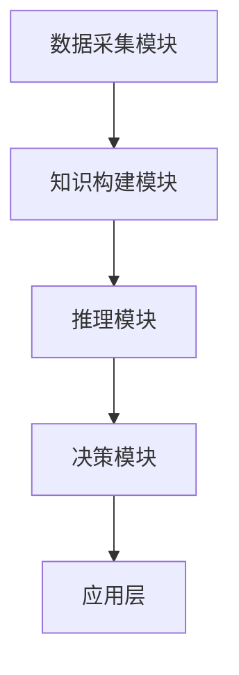
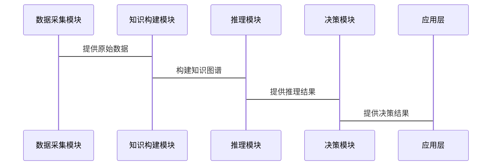

                 

# 企业知识图谱与AI Agent的深度融合应用

> 关键词：知识图谱、AI Agent、深度融合、企业应用、智能系统

> 摘要：本文探讨了企业知识图谱与AI Agent的深度融合应用，详细分析了知识图谱的构建方法、AI Agent的核心算法，以及它们在企业中的协同机制。通过系统架构设计和项目实战，展示了如何将知识图谱与AI Agent结合，提升企业的智能化水平。

---

## 第一部分：企业知识图谱与AI Agent的背景与基础

### 第1章：知识图谱与AI Agent的核心概念

#### 1.1 知识图谱的定义与特点

知识图谱是一种结构化的数据表示方式，用于描述实体及其之间的关系。它通过将知识表示为图结构（节点表示实体，边表示关系），能够有效地组织和检索大规模数据。

- **定义**：知识图谱是一个由实体和关系构成的网络，用于表示现实世界中的信息。
- **特点**：
  - **结构化**：通过图结构组织数据，便于计算机理解和推理。
  - **可扩展性**：支持大规模数据的存储和处理。
  - **动态性**：能够实时更新，适应数据变化。

#### 1.2 AI Agent的定义与特点

AI Agent（智能代理）是一种能够感知环境并采取行动以实现目标的智能实体。

- **定义**：AI Agent通过感知环境和采取行动来实现特定目标的智能系统。
- **特点**：
  - **自主性**：能够在没有外部干预的情况下运行。
  - **反应性**：能够实时感知环境并做出反应。
  - **目标导向**：所有行动都是为了实现特定目标。

#### 1.3 知识图谱与AI Agent的结合

知识图谱为AI Agent提供了丰富的知识表示，而AI Agent则利用这些知识进行推理和决策。

- **知识图谱在AI Agent中的作用**：提供结构化的知识，帮助AI Agent更好地理解问题和环境。
- **AI Agent如何利用知识图谱**：通过查询和推理知识图谱中的信息，AI Agent能够做出更智能的决策。

---

## 第2章：知识图谱的构建方法

### 2.1 知识图谱的构建流程

知识图谱的构建通常包括数据采集、预处理、建模和优化四个阶段。

- **数据采集**：从多种数据源（如数据库、网页爬取）获取原始数据。
- **数据预处理**：清洗数据，去除噪声，提取有用信息。
- **知识建模**：将数据转换为图结构，定义实体和关系。
- **知识图谱优化**：通过合并实体和关系，优化图的结构。

### 2.2 知识图谱的表示方法

知识图谱的表示方法决定了其存储和查询的效率。

- **实体与关系的表示**：实体用节点表示，关系用边表示。
- **知识图谱的存储与查询**：使用图数据库（如Neo4j）存储，并通过SPARQL查询语言进行检索。

### 2.3 知识图谱的可视化

知识图谱的可视化能够帮助用户更好地理解和分析数据。

- **可视化工具**：如Graphviz、Gephi等。
- **可视化方法**：节点和边的布局优化，颜色和大小的编码。

---

## 第3章：AI Agent的核心算法

### 3.1 知识图谱推理算法

AI Agent通过推理算法在知识图谱中找到答案。

- **基于规则的推理**：根据预定义的规则进行推理。
- **基于图的推理**：通过遍历图结构进行推理。
- **基于深度学习的推理**：利用神经网络模型进行推理。

### 3.2 基于知识图谱的强化学习

强化学习是一种通过试错方式优化决策的算法。

- **强化学习的基本原理**：通过与环境交互，学习最优策略。
- **知识图谱在强化学习中的应用**：利用知识图谱中的信息，增强强化学习的效果。

### 3.3 知识图谱与AI Agent的协同学习

协同学习是一种通过多个学习者协作来提高性能的方法。

- **协同学习的基本概念**：通过多个学习者的协作，提高整体性能。
- **知识图谱与AI Agent的协同学习方法**：通过知识图谱共享信息，提高AI Agent的学习能力。

---

## 第4章：知识图谱与AI Agent的系统架构设计

### 4.1 系统整体架构

知识图谱与AI Agent的系统架构通常包括数据层、知识层、算法层和应用层。

- **数据层**：存储原始数据。
- **知识层**：存储知识图谱。
- **算法层**：实现推理和决策算法。
- **应用层**：实现具体的应用功能。

### 4.2 系统功能设计

系统功能设计需要考虑系统的模块划分和功能实现。

- **模块划分**：数据采集模块、知识构建模块、推理模块、决策模块。
- **功能实现**：数据采集、知识构建、推理和决策。

### 4.3 系统架构图

以下是系统架构的mermaid图：

### 4.4 系统接口设计

系统接口设计需要考虑模块之间的交互。

- **接口设计**：模块之间的接口定义，如数据输入输出格式。
- **接口实现**：通过API实现模块之间的交互。

### 4.5 系统交互图

以下是系统交互的mermaid图：

---

## 第5章：知识图谱与AI Agent的项目实战

### 5.1 项目环境搭建

项目环境搭建需要安装必要的工具和库。

- **工具安装**：安装Python、Jupyter Notebook、Neo4j等工具。
- **库安装**：安装networkx、numpy、pandas等库。

### 5.2 数据准备

数据准备需要获取和处理数据。

- **数据获取**：从公开数据集获取数据。
- **数据预处理**：清洗数据，提取实体和关系。

### 5.3 模型训练

模型训练需要实现知识图谱构建和推理算法。

- **知识图谱构建**：使用Networkx库构建图结构。
- **推理算法实现**：实现基于规则的推理算法。

### 5.4 模型部署

模型部署需要将模型集成到系统中。

- **系统集成**：将知识图谱和AI Agent集成到系统中。
- **系统测试**：进行系统测试，确保系统的稳定性和可靠性。

---

## 第6章：总结与展望

### 6.1 总结

本文详细探讨了企业知识图谱与AI Agent的深度融合应用，分析了知识图谱的构建方法和AI Agent的核心算法，展示了它们在企业中的协同机制。

### 6.2 未来展望

未来，随着人工智能技术的不断发展，知识图谱与AI Agent的深度融合将在更多领域得到应用，为企业带来更大的价值。

---

作者：AI天才研究院/AI Genius Institute & 禅与计算机程序设计艺术 /Zen And The Art of Computer Programming

