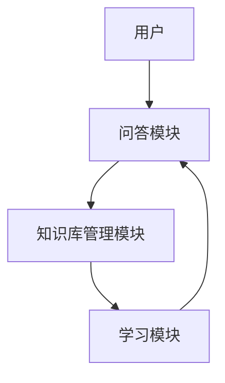

                 


# 企业知识管理：AI Agent的智能问答系统

> 关键词：企业知识管理，AI Agent，智能问答系统，知识图谱，自然语言处理，机器学习

> 摘要：本文探讨了AI Agent在企业知识管理中的应用，重点介绍了智能问答系统的原理与实现。通过详细分析知识表示、问答系统算法、系统架构设计等关键环节，结合实际案例，为读者提供了从理论到实践的全面指导。

---

# 目录

1. 企业知识管理概述
    - 1.1 企业知识管理的核心概念
    - 1.2 AI Agent的基本概念
    - 1.3 企业知识管理中的AI Agent

2. 智能问答系统的核心原理
    - 2.1 知识表示与知识图谱
    - 2.2 自然语言处理与问答系统
    - 2.3 AI Agent的推理与学习

3. 系统架构与设计
    - 3.1 系统功能设计
    - 3.2 系统架构设计
    - 3.3 系统接口设计

4. 项目实战：基于AI Agent的智能问答系统实现
    - 4.1 环境搭建
    - 4.2 核心代码实现
    - 4.3 系统测试与优化

5. 总结与展望
    - 5.1 应用案例分析
    - 5.2 未来发展趋势
    - 5.3 注意事项与最佳实践

---

# 1. 企业知识管理概述

## 1.1 企业知识管理的核心概念

### 1.1.1 企业知识管理的定义

企业知识管理（Enterprise Knowledge Management，EKM）是指通过系统化的方法，将企业内外部的知识、经验、技能和信息进行收集、整理、存储、共享和应用的过程，以提升企业的竞争力和创新能力。

### 1.1.2 知识管理的重要性

知识是企业的核心资产，有效的知识管理能够：

- 提高员工工作效率
- 促进知识共享与传承
- 支持决策制定
- 提升企业的核心竞争力

### 1.1.3 知识管理的边界与外延

知识管理的边界包括：

- **内部知识**：企业内部的文档、流程、经验等
- **外部知识**：市场信息、行业动态、法律法规等
- **隐性知识**：员工的技能、经验、直觉等
- **显性知识**：结构化的数据、文档、报告等

## 1.2 AI Agent的基本概念

### 1.2.1 AI Agent的定义

AI Agent（人工智能代理）是指能够感知环境、自主决策并执行任务的智能实体。它能够通过传感器获取信息，利用推理引擎进行分析，并通过执行器与环境交互。

### 1.2.2 AI Agent的核心特点

1. **自主性**：能够自主决策
2. **反应性**：能够实时感知并响应环境变化
3. **社会性**：能够与其他系统或人类交互
4. **学习能力**：能够通过经验改进性能

### 1.2.3 AI Agent与传统问答系统的区别

| **方面**       | **AI Agent**              | **传统问答系统**          |
|----------------|--------------------------|--------------------------|
| **智能性**      | 高，支持自主学习          | 低，依赖预设规则          |
| **交互方式**    | 支持多轮对话              | 通常为单轮问答            |
| **应用场景**    | 复杂问题解决              | 简单查询为主              |

---

## 1.3 企业知识管理中的AI Agent

### 1.3.1 提高知识检索效率

AI Agent通过自然语言处理技术，能够理解用户的意图，并从知识库中快速检索相关答案。

### 1.3.2 优化知识组织与存储

AI Agent能够自动整理和分类知识，构建知识图谱，便于后续的查询和分析。

### 1.3.3 支持决策制定

AI Agent结合知识库中的数据和信息，能够为决策者提供数据支持和建议。

---

# 2. 智能问答系统的核心原理

## 2.1 知识表示与知识图谱

### 2.1.1 知识表示方法

知识可以采用多种方式表示，常见的包括：

1. **概念网络**：通过节点和边表示概念及其关系。
2. **语义网络**：通过节点表示概念，边表示关系。
3. **知识图谱**：通过三元组（实体-关系-实体）表示知识。

### 2.1.2 知识图谱的构建

知识图谱的构建过程如下：

1. **数据收集**：从企业内外部获取相关数据。
2. **实体识别**：识别数据中的实体（如人名、组织名）。
3. **关系抽取**：抽取实体之间的关系。
4. **知识存储**：将抽取的知识存储为结构化的数据。

### 2.1.3 知识图谱的存储与管理

知识图谱通常存储在图数据库中，如Neo4j。通过图数据库，可以高效地进行知识查询和推理。

---

## 2.2 自然语言处理与问答系统

### 2.2.1 自然语言处理技术

自然语言处理（NLP）技术包括：

1. **分词与词性标注**：将文本分割为词，并标注词性。
2. **句法分析**：分析句子的语法结构。
3. **语义理解**：理解文本的含义。

### 2.2.2 问答系统的实现原理

问答系统的实现通常分为以下几个步骤：

1. **问题理解**：解析用户的问题，提取关键词和意图。
2. **知识检索**：从知识库中检索与问题相关的答案。
3. **答案生成**：根据检索结果生成自然语言的回答。

---

## 2.3 AI Agent的推理与学习

### 2.3.1 机器学习在问答系统中的应用

1. **监督学习**：通过标注的数据训练模型，使其能够识别问题类型。
2. **无监督学习**：通过聚类等技术，从无标签数据中学习模式。
3. **强化学习**：通过奖励机制，优化回答的准确性和流畅性。

### 2.3.2 知识推理机制

知识推理是通过逻辑推理引擎，基于知识图谱进行推理，得到新的知识或答案。

---

# 3. 系统架构与设计

## 3.1 系统功能设计

### 3.1.1 系统功能模块

1. **知识库管理模块**：负责知识的存储和管理。
2. **问答模块**：负责用户的提问和回答。
3. **学习模块**：负责模型的训练和优化。

### 3.1.2 系统功能流程

1. 用户提交问题。
2. 系统解析问题，提取关键词。
3. 系统从知识库中检索相关答案。
4. 系统生成回答并返回给用户。

---

## 3.2 系统架构设计

### 3.2.1 系统架构图



### 3.2.2 模块划分

1. **用户界面模块**：负责与用户的交互。
2. **问答模块**：负责处理用户的提问。
3. **知识库模块**：负责存储和检索知识。
4. **学习模块**：负责模型的训练和优化。

---

## 3.3 系统接口设计

### 3.3.1 系统接口

1. `submitQuestion(String question)`：提交问题。
2. `getAnswer(String question)`：获取答案。
3. `trainModel()`：训练模型。

---

# 4. 项目实战：基于AI Agent的智能问答系统实现

## 4.1 环境搭建

### 4.1.1 安装必要的库

```bash
pip install numpy
pip install tensorflow
pip install neo4j
```

---

## 4.2 核心代码实现

### 4.2.1 知识库管理模块

```python
class KnowledgeBase:
    def __init__(self, graph):
        self.graph = graph

    def get_answer(self, question):
        # 从知识图谱中检索答案
        pass
```

---

## 4.3 系统测试与优化

### 4.3.1 测试用例

1. 测试基本问题的查询。
2. 测试复杂问题的推理。
3. 测试系统性能。

---

# 5. 总结与展望

## 5.1 应用案例分析

### 5.1.1 案例1：企业内部问答系统

AI Agent帮助员工快速找到所需的知识，提升工作效率。

### 5.1.2 案例2：客户服务问答系统

AI Agent为客户提供24/7的在线支持，提升客户满意度。

---

## 5.2 未来发展趋势

1. **多轮对话支持**：支持更自然的对话方式。
2. **多语言处理**：支持多种语言的问答。
3. **模型可解释性**：提升模型的透明性和可解释性。

---

## 5.3 注意事项与最佳实践

1. **数据质量**：确保知识库中的数据准确无误。
2. **模型优化**：定期更新模型，提升性能。
3. **用户体验**：设计友好的用户界面，提升用户体验。

---

作者：AI天才研究院/AI Genius Institute & 禅与计算机程序设计艺术 /Zen And The Art of Computer Programming

