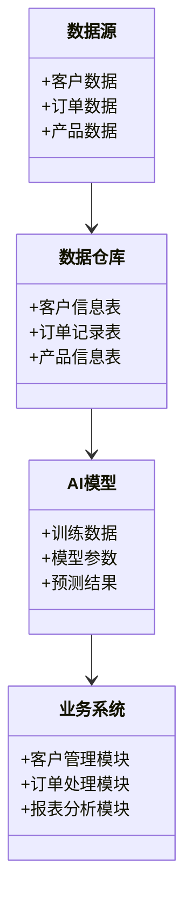
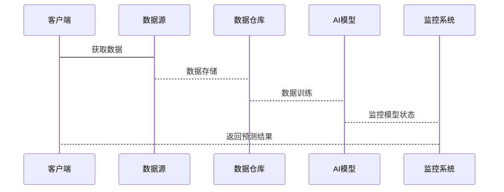

                 


# 企业系统中AI模型的集成与部署

> 关键词：AI模型，企业系统，集成，部署，机器学习，深度学习

> 摘要：本文将详细探讨AI模型在企业系统中的集成与部署过程。从背景介绍到核心算法原理，从系统架构设计到项目实战，再到最佳实践，逐步分析和讲解AI模型如何在企业系统中高效集成与部署。

---

## 第一章: 企业系统中AI模型的背景与挑战

### 1.1 AI模型的基本概念

#### 1.1.1 人工智能与机器学习的定义

人工智能（Artificial Intelligence, AI）是指计算机系统执行与人类智能相关的任务的能力，如视觉识别、语音识别、决策等。机器学习（Machine Learning, ML）是AI的核心技术之一，通过数据训练模型，使其能够从数据中学习并做出预测或决策。

#### 1.1.2 AI模型的分类与特点

AI模型可以分为监督学习、无监督学习、强化学习等。监督学习模型（如线性回归、随机森林）适用于有标签的数据，用于分类和回归任务；无监督学习模型（如聚类、降维）适用于无标签的数据，用于发现数据中的模式；强化学习模型（如深度强化学习）适用于需要决策和策略优化的任务。

#### 1.1.3 企业系统中的AI应用现状

目前，AI模型已在企业系统中得到广泛应用，如客户行为分析、风险评估、智能推荐等。然而，AI模型的集成与部署仍面临数据隐私、模型解释性、计算资源等挑战。

### 1.2 企业系统集成AI模型的必要性

#### 1.2.1 企业系统智能化的需求

随着市场竞争的加剧，企业需要通过智能化手段提高效率、降低成本。AI模型能够帮助企业自动化处理数据、优化决策、提升客户体验。

#### 1.2.2 AI模型在企业中的潜在价值

AI模型能够通过数据分析发现潜在规律，优化业务流程，提高预测准确性。例如，通过客户数据预测流失风险，提前制定应对策略。

#### 1.2.3 当前企业系统中AI模型的应用挑战

企业系统通常复杂且数据量大，AI模型的集成需要考虑数据兼容性、系统稳定性、性能优化等问题。此外，AI模型的可解释性和实时性也是企业在集成过程中需要解决的问题。

### 1.3 本章小结

本章介绍了AI模型的基本概念、分类及其在企业系统中的应用现状，并分析了集成AI模型的必要性和面临的挑战。

---

## 第二章: AI模型与企业系统的集成关系

### 2.1 AI模型在企业系统中的角色

#### 2.1.1 数据处理与分析

AI模型能够对企业系统中的数据进行清洗、转换和分析，提取有价值的信息，帮助决策者制定策略。

#### 2.1.2 业务流程优化

通过AI模型预测需求、优化库存管理、自动化审批流程等，提高业务流程的效率。

#### 2.1.3 智能决策支持

AI模型能够基于实时数据提供决策支持，如预测销售、评估风险、推荐产品等。

### 2.2 AI模型集成的关键环节

#### 2.2.1 数据准备

数据准备是AI模型集成的第一步，包括数据采集、清洗、转换和预处理。数据的准确性和完整性直接影响模型的性能。

#### 2.2.2 模型训练与优化

在企业系统中，模型训练需要考虑计算资源、数据规模和模型复杂度。优化模型参数、选择合适的算法能够提高模型的准确性和效率。

#### 2.2.3 模型部署与监控

将训练好的AI模型部署到企业系统中，并实时监控模型性能，及时调整和优化。

### 2.3 AI模型与企业系统的交互机制

#### 2.3.1 输入输出接口

AI模型需要与企业系统进行数据交互，通常通过API接口实现。输入数据经过模型处理后，输出结果返回给系统。

#### 2.3.2 数据流与业务流的整合

AI模型的输入数据和输出结果需要与企业的业务流程无缝衔接，确保数据流的顺畅。

#### 2.3.3 模型更新与迭代

模型需要定期更新以适应数据变化和业务需求，确保模型的持续有效。

### 2.4 本章小结

本章详细讲解了AI模型在企业系统中的角色、集成的关键环节及其与企业系统的交互机制。

---

## 第三章: 常见AI模型算法原理

### 3.1 线性回归模型

#### 3.1.1 线性回归的数学模型

线性回归是一种简单且常用的回归算法，其数学模型如下：

$$ y = \beta_0 + \beta_1 x + \epsilon $$

其中，$y$ 是目标变量，$x$ 是自变量，$\beta_0$ 和 $\beta_1$ 是模型参数，$\epsilon$ 是误差项。

#### 3.1.2 普通最小二乘法的实现

线性回归模型通常通过最小二乘法来优化参数。目标是最小化预测值与实际值之间的平方误差之和：

$$ \text{最小化} \sum_{i=1}^{n} (y_i - (\beta_0 + \beta_1 x_i))^2 $$

#### 3.1.3 线性回归的优缺点

优点：简单、易于解释、计算高效。缺点：仅适用于线性关系，对非线性数据表现较差。

---

## 第四章: AI模型集成的系统架构设计

### 4.1 问题场景介绍

以客户流失预测为例，企业希望通过AI模型预测客户流失情况，提前制定挽留策略。

### 4.2 系统功能设计

系统功能模块包括数据采集、模型训练、模型部署和监控管理。

### 4.3 领域模型设计

使用mermaid类图展示领域模型：



### 4.4 系统架构设计

使用mermaid架构图展示系统架构：

```mermaid
docker {
    server HTTP
    server.AIModel
    server.Manager

    client --> HTTP
    HTTP --> AIModel
    AIModel --> Manager
}
```

### 4.5 系统接口设计

API接口设计示例：

- POST /api/train-model
- GET /api/predict
- PUT /api/update-model

### 4.6 系统交互设计

使用mermaid序列图展示系统交互流程：



### 4.7 本章小结

本章通过客户流失预测案例，详细讲解了系统功能设计、领域模型设计、系统架构设计、接口设计和交互设计。

---

## 第五章: 项目实战 - 客户流失预测

### 5.1 环境搭建

安装所需库：

```bash
pip install numpy pandas scikit-learn flask
```

### 5.2 数据预处理

代码实现：

```python
import pandas as pd

# 读取数据
data = pd.read_csv('customer_churn.csv')

# 查看数据摘要
print(data.info())
print(data.describe())
```

### 5.3 模型训练

使用线性回归模型训练：

```python
from sklearn.linear_model import LinearRegression
from sklearn.model_selection import train_test_split

# 数据分割
X = data[['age', 'subscriptions', 'usage']]
y = data['churn']

X_train, X_test, y_train, y_test = train_test_split(X, y, test_size=0.2)

# 训练模型
model = LinearRegression()
model.fit(X_train, y_train)

# 预测
y_pred = model.predict(X_test)
```

### 5.4 模型部署

使用Flask部署API：

```python
from flask import Flask, jsonify

app = Flask(__name__)

@app.route('/predict', methods=['POST'])
def predict():
    # 获取输入数据
    data = request.get_json()
    X = [[data['age'], data['subscriptions'], data['usage']]]
    # 预测结果
    prediction = model.predict(X)
    return jsonify({'预测流失概率': prediction[0][0]})

if __name__ == '__main__':
    app.run(debug=True)
```

### 5.5 模型监控

监控指标包括准确率、召回率、F1分数等。

### 5.6 本章小结

本章通过客户流失预测案例，详细讲解了AI模型从环境搭建到数据预处理、模型训练、部署和监控的全过程。

---

## 第六章: 最佳实践与注意事项

### 6.1 最佳实践

- 数据预处理：确保数据的准确性和完整性。
- 模型选择：根据业务需求选择合适的模型。
- 模型部署：考虑系统的扩展性和稳定性。

### 6.2 小结

AI模型的集成与部署需要综合考虑技术、业务和系统多方面因素，通过不断优化和调整，才能在企业系统中发挥最大价值。

---

## 作者：AI天才研究院/AI Genius Institute & 禅与计算机程序设计艺术 /Zen And The Art of Computer Programming

---

感谢您的阅读！希望本文能为您提供关于企业系统中AI模型集成与部署的深入见解。

