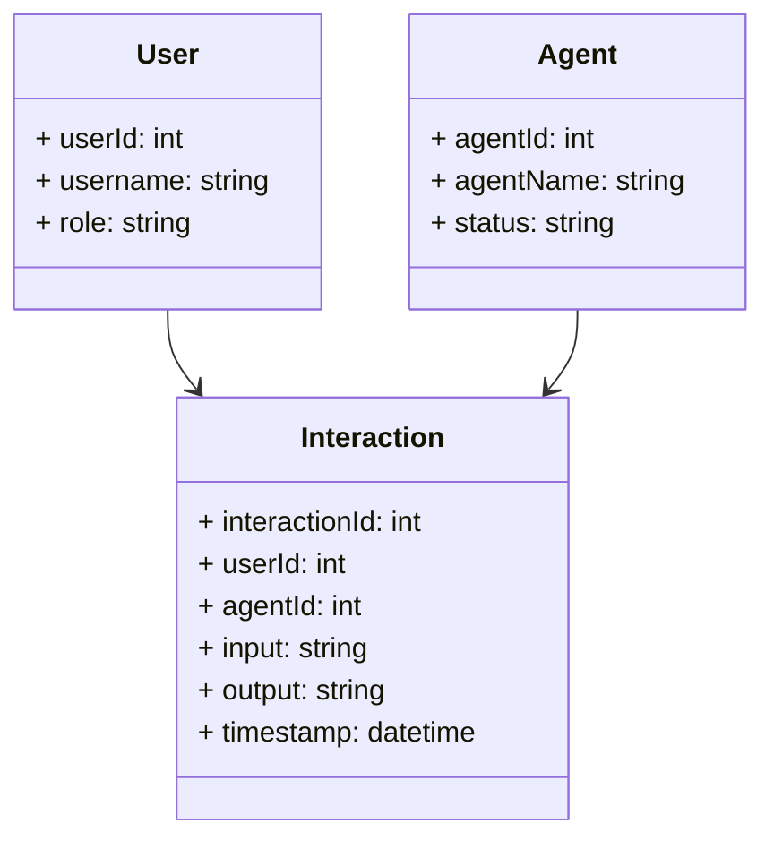
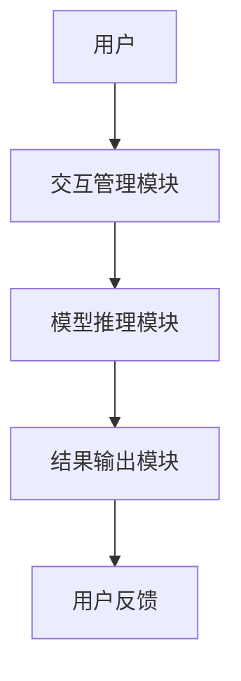

                 

# 企业级AI Agent开发：从需求分析到部署的全流程指南

> 关键词：企业级AI Agent，大语言模型，AI Agent开发，系统架构，算法原理，项目实战，部署策略

> 摘要：企业级AI Agent的开发是一个复杂而系统的过程，涉及从需求分析到部署的多个环节。本文将从AI Agent的核心概念出发，逐步分析其算法原理、系统架构设计、项目实战以及部署策略，为企业开发者提供一份完整的开发指南。

---

# 第一部分: 企业级AI Agent开发概述

# 第1章: 企业级AI Agent开发概述

## 1.1 AI Agent的基本概念

### 1.1.1 AI Agent的定义
AI Agent（人工智能代理）是指能够感知环境并采取行动以实现特定目标的智能实体。企业级AI Agent是专门为企业场景设计的AI代理，具备高可用性、稳定性和智能性。

### 1.1.2 企业级AI Agent的特点
- **多模态交互能力**：支持文本、语音、图像等多种交互方式。
- **智能决策能力**：基于上下文和历史数据，能够做出智能决策。
- **高可用性和稳定性**：确保在企业级应用中稳定运行，支持高并发请求。

### 1.1.3 企业级AI Agent的应用场景
- **客户服务**：智能客服、销售助手。
- **内部效率提升**：自动化任务处理、流程优化。
- **数据分析与决策支持**：辅助企业决策。

## 1.2 AI Agent的发展历程

### 1.2.1 AI Agent的起源
AI Agent的概念起源于20世纪60年代，早期主要应用于专家系统和机器人领域。

### 1.2.2 大语言模型对AI Agent的推动
随着大语言模型（如GPT系列）的兴起，AI Agent的能力得到了显著提升，能够处理复杂的自然语言任务。

### 1.2.3 企业级AI Agent的演进
从早期的简单规则引擎到现在的基于大语言模型的智能代理，企业级AI Agent在功能和性能上实现了质的飞跃。

## 1.3 企业级AI Agent的核心特点

### 1.3.1 多模态交互能力
AI Agent能够通过多种方式与用户交互，包括文本、语音和图像。

### 1.3.2 智能决策能力
基于上下文和历史数据，AI Agent能够做出智能决策，而不是简单的规则匹配。

### 1.3.3 高可用性和稳定性
企业级AI Agent需要在高并发和复杂环境中稳定运行，具备容错和自我修复能力。

## 1.4 企业级AI Agent的应用前景

### 1.4.1 企业级AI Agent的潜在应用领域
- **客户服务**：智能客服、销售助手。
- **内部效率提升**：自动化任务处理、流程优化。
- **数据分析与决策支持**：辅助企业决策。

### 1.4.2 企业采用AI Agent的优势
- **提升效率**：自动化处理重复性任务。
- **降低成本**：减少人工干预，降低运营成本。
- **增强客户体验**：提供个性化的服务。

### 1.4.3 AI Agent应用的挑战与机遇
- **挑战**：数据隐私、模型解释性、多模态集成。
- **机遇**：智能化转型、效率提升、创新商业模式。

## 1.5 本章小结
本章从企业级AI Agent的基本概念出发，分析了其发展历程、核心特点和应用前景，为后续章节的深入分析奠定了基础。

---

# 第2章: 企业级AI Agent的核心概念

## 2.1 AI Agent的核心概念

### 2.1.1 AI Agent的定义与分类
AI Agent可以根据功能和应用场景分为多种类型，包括基于规则的代理、基于模型的代理和基于大语言模型的代理。

### 2.1.2 企业级AI Agent的特点
- **复杂性**：涉及多模态数据处理和智能决策。
- **实时性**：需要快速响应和处理请求。
- **安全性**：确保数据隐私和系统安全。

### 2.1.3 企业级AI Agent与传统AI的区别
- **智能化程度**：企业级AI Agent具备更强的智能决策能力。
- **应用场景**：专注于企业级复杂场景。

## 2.2 AI Agent的架构与工作原理

### 2.2.1 AI Agent的架构模型
AI Agent的架构通常包括感知层、决策层和执行层。

### 2.2.2 大语言模型在AI Agent中的作用
大语言模型为AI Agent提供了强大的自然语言处理能力，使其能够理解和生成自然语言文本。

### 2.2.3 AI Agent的交互流程
1. 用户输入请求。
2. AI Agent解析请求并生成响应。
3. 响应返回给用户。

## 2.3 AI Agent的核心要素

### 2.3.1 数据输入与处理
AI Agent需要处理多种类型的数据，包括文本、语音和图像。

### 2.3.2 模型推理与决策
基于大语言模型，AI Agent能够进行复杂的推理和决策。

### 2.3.3 结果输出与反馈
AI Agent将处理结果返回给用户，并根据反馈不断优化自身的响应策略。

## 2.4 本章小结
本章详细介绍了企业级AI Agent的核心概念、架构和工作原理，为后续章节的系统设计和实现提供了理论基础。

---

# 第3章: 企业级AI Agent的需求分析

## 3.1 需求分析的基本流程

### 3.1.1 明确用户需求
通过与用户和业务部门的沟通，明确AI Agent的具体需求。

### 3.1.2 分析业务目标
结合企业的业务目标，确定AI Agent的功能和性能要求。

### 3.1.3 设计系统目标
基于用户需求和业务目标，设计系统的总体目标和关键指标。

## 3.2 领域模型的构建

### 3.2.1 领域模型的定义
领域模型是对业务领域中的核心概念和关系的建模。

### 3.2.2 领域模型的构建
通过与业务部门的沟通，构建领域模型，并通过Mermaid图展示。

## 3.3 系统功能设计

### 3.3.1 系统功能模块划分
系统功能模块通常包括用户管理、交互管理、模型管理等。

### 3.3.2 功能模块的交互流程
通过Mermaid图展示系统功能模块的交互流程。

## 3.4 本章小结
本章从需求分析的角度，详细介绍了企业级AI Agent的系统目标、领域模型和功能设计，为后续的系统架构设计奠定了基础。

---

# 第4章: 企业级AI Agent的算法原理

## 4.1 AI Agent的核心算法

### 4.1.1 大语言模型的算法原理
大语言模型通常基于Transformer架构，通过自注意力机制和前馈网络实现文本生成。

### 4.1.2 基于Transformer的文本生成
通过数学公式和代码示例，详细讲解Transformer模型的算法原理。

### 4.1.3 对话管理算法
通过数学公式和代码示例，详细讲解对话管理的算法原理。

## 4.2 算法实现细节

### 4.2.1 模型训练
通过代码示例，详细讲解模型训练的过程。

### 4.2.2 模型推理
通过代码示例，详细讲解模型推理的过程。

## 4.3 算法优化与调优

### 4.3.1 模型优化策略
通过数学公式和代码示例，详细讲解模型优化策略。

### 4.3.2 参数调优
通过数学公式和代码示例，详细讲解参数调优的策略。

## 4.4 本章小结
本章详细介绍了企业级AI Agent的核心算法原理、实现细节和优化策略，为后续的系统架构设计提供了技术支持。

---

# 第5章: 企业级AI Agent的系统架构设计

## 5.1 系统架构概述

### 5.1.1 系统架构模型
通过Mermaid图展示系统架构模型。

### 5.1.2 模块划分
系统模块通常包括前端、后端、模型服务和数据库。

## 5.2 系统架构设计

### 5.2.1 前端设计
通过Mermaid图展示前端交互流程。

### 5.2.2 后端设计
通过Mermaid图展示后端交互流程。

## 5.3 系统接口设计

### 5.3.1 接口定义
通过表格形式展示系统接口的定义。

### 5.3.2 接口实现
通过代码示例，详细讲解接口实现的细节。

## 5.4 本章小结
本章详细介绍了企业级AI Agent的系统架构设计，包括模块划分、接口设计和系统交互流程。

---

# 第6章: 企业级AI Agent的项目实战

## 6.1 环境搭建

### 6.1.1 系统环境要求
列出项目实战所需的系统环境和依赖库。

### 6.1.2 环境搭建步骤
通过代码示例，详细讲解环境搭建的步骤。

## 6.2 核心代码实现

### 6.2.1 代码结构
通过代码示例，详细讲解代码结构。

### 6.2.2 核心功能实现
通过代码示例，详细讲解核心功能的实现细节。

## 6.3 案例分析与优化

### 6.3.1 案例分析
通过实际案例分析，详细讲解项目实战的经验和教训。

### 6.3.2 优化建议
通过代码示例，详细讲解优化建议的实现细节。

## 6.4 本章小结
本章通过项目实战，详细介绍了企业级AI Agent的环境搭建、核心代码实现和优化策略。

---

# 第7章: 企业级AI Agent的部署与优化

## 7.1 部署策略

### 7.1.1 部署方案选择
通过对比分析，选择适合企业的部署方案。

### 7.1.2 部署实施步骤
通过代码示例，详细讲解部署实施的步骤。

## 7.2 系统优化与维护

### 7.2.1 性能优化
通过代码示例，详细讲解性能优化的策略。

### 7.2.2 系统维护
通过代码示例，详细讲解系统维护的步骤。

## 7.3 部署案例分析

### 7.3.1 部署案例
通过实际案例分析，详细讲解部署经验。

### 7.3.2 部署总结
总结部署过程中的经验和教训。

## 7.4 本章小结
本章详细介绍了企业级AI Agent的部署策略、优化与维护方法，为企业级AI Agent的顺利运行提供了保障。

---

# 作者

作者：AI天才研究院/AI Genius Institute & 禅与计算机程序设计艺术 /Zen And The Art of Computer Programming

