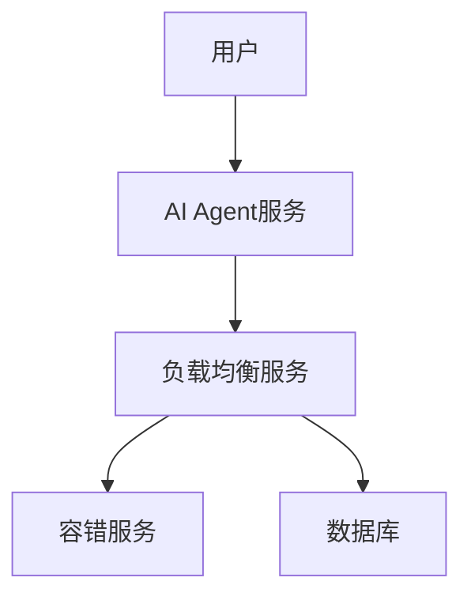
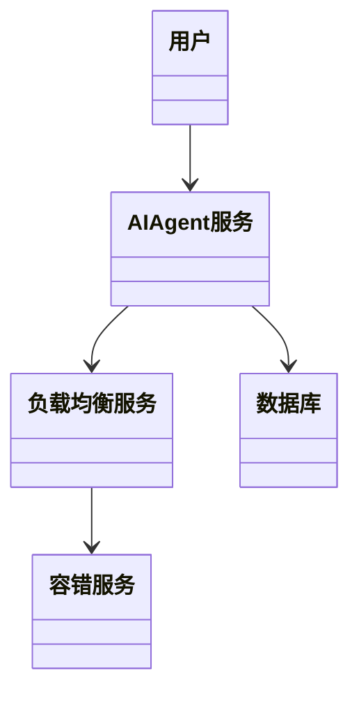
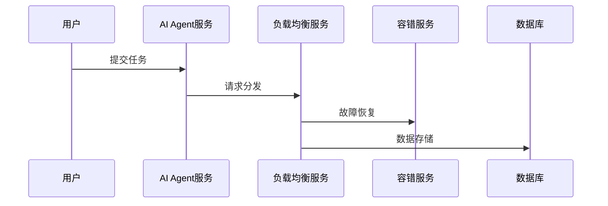

                 


# 企业级AI Agent的可扩展性设计

> 关键词：企业级AI Agent、可扩展性设计、分布式系统、负载均衡、容错机制、系统架构、算法原理

> 摘要：随着人工智能技术的快速发展，企业级AI Agent的应用场景越来越广泛。为了应对复杂的业务需求和高并发场景，AI Agent的可扩展性设计成为关键。本文从AI Agent的基本概念出发，深入探讨其可扩展性设计的核心原理、系统架构、算法实现以及项目实战，为企业级AI Agent的开发和优化提供理论支持和实践指导。

---

## 第1章: AI Agent的基本概念与问题背景

### 1.1 AI Agent的定义与特点

AI Agent（人工智能代理）是一种能够感知环境、自主决策并执行任务的智能实体。其特点包括：

- **智能性**：基于数据和模型进行自主决策。
- **自主性**：无需外部干预，自主完成任务。
- **交互性**：能够与人、系统或其他AI Agent进行交互。
- **适应性**：能够根据环境变化动态调整行为。

### 1.2 企业级AI Agent的可扩展性问题

#### 1.2.1 问题背景与挑战

随着企业规模的扩大和业务复杂度的增加，AI Agent需要处理的任务类型和规模也在不断增长。常见的扩展性问题包括：

- **性能瓶颈**：单点系统在高并发场景下容易出现性能瓶颈。
- **资源分配**：如何高效分配计算资源以满足动态任务需求。
- **容错性**：系统在部分节点故障时仍需保持正常运行。
- **可维护性**：系统扩展后，如何保持可维护性和可管理性。

#### 1.2.2 可扩展性需求的分析

企业级AI Agent的可扩展性需求主要体现在以下几个方面：

- **水平扩展**：通过增加节点来提高系统的处理能力。
- **垂直扩展**：通过升级硬件或算法优化来提升单点性能。
- **动态扩展**：根据实时负载自动调整资源分配。

#### 1.2.3 问题解决的思路与方法

- **分布式架构**：将任务分解为多个子任务，分布式处理。
- **负载均衡**：通过算法动态分配任务到不同的节点。
- **容错机制**：采用冗余设计和故障恢复机制，确保系统高可用性。

### 1.3 企业级AI Agent的应用场景

#### 1.3.1 智能客服与自动化处理

AI Agent可以用于处理客户的咨询、订单处理和售后支持，提高服务效率。

#### 1.3.2 企业流程自动化

通过AI Agent实现企业内部流程的自动化，例如审批流程、数据处理等。

#### 1.3.3 数据分析与决策支持

AI Agent可以分析企业数据，提供决策支持，优化业务流程。

### 1.4 本章小结

本章从AI Agent的基本概念出发，分析了其在企业级应用中的可扩展性问题，并提出了初步的解决思路。为后续章节的深入探讨奠定了基础。

---

## 第2章: 可扩展性设计的核心概念与联系

### 2.1 可扩展性设计的核心原理

#### 2.1.1 分布式系统设计

分布式系统通过将任务分发到多个节点，提高系统的处理能力。其核心原理包括：

- **节点通信**：通过网络通信协议实现节点之间的交互。
- **任务分配**：使用负载均衡算法将任务分发到合适的节点。
- **数据一致性**：通过一致性算法确保数据在各节点之间一致。

#### 2.1.2 并行与并行处理机制

并行处理通过同时执行多个任务来提高系统效率。其关键在于任务分解和资源调度。

#### 2.1.3 动态资源分配策略

动态资源分配根据实时负载自动调整资源分配，确保系统在不同场景下都能高效运行。

### 2.2 可扩展性设计的关键技术

#### 2.2.1 负载均衡算法

负载均衡是实现系统可扩展性的关键技术之一。常见的负载均衡算法包括：

- **轮询算法**：按顺序将任务分发到各个节点。
- **随机算法**：随机选择节点进行任务分配。
- **基于权重的算法**：根据节点的处理能力分配任务。

#### 2.2.2 容错机制

容错机制通过冗余设计和故障恢复机制，确保系统在部分节点故障时仍能正常运行。

#### 2.2.3 高可用性设计

高可用性设计通过冗余和故障恢复，确保系统在故障发生时仍能提供服务。

### 2.3 核心概念对比分析

#### 2.3.1 扩展性与可伸缩性的区别

- **扩展性**：指系统在增加资源时能够提高性能的能力。
- **可伸缩性**：指系统在不同规模下都能保持性能的能力。

#### 2.3.2 分布式与集中式系统的对比

- **分布式系统**：任务分发到多个节点，提高处理能力。
- **集中式系统**：所有任务集中在单个节点，容易出现性能瓶颈。

#### 2.3.3 事务处理机制的对比

- **集中式事务管理**：所有事务处理集中在单个节点，容易成为瓶颈。
- **分布式事务管理**：通过分布式事务管理器确保事务一致性。

---

## 第3章: 可扩展性设计的系统架构

### 3.1 系统架构设计概述

#### 3.1.1 分层架构

分层架构将系统分为多个层次，每一层负责特定的功能。例如：

- **数据层**：处理数据存储和检索。
- **业务逻辑层**：处理业务逻辑。
- **表现层**：与用户交互。

#### 3.1.2 微服务架构

微服务架构将系统分解为多个小型服务，每个服务独立运行，通过API进行通信。

#### 3.1.3 事件驱动架构

事件驱动架构通过事件触发任务执行，适用于异步处理场景。

### 3.2 系统架构的可扩展性实现

#### 3.2.1 模块化设计

模块化设计通过将系统分解为多个独立模块，提高系统的可扩展性。

#### 3.2.2 异构系统集成

通过适配器实现不同系统之间的集成，确保系统兼容性和可扩展性。

#### 3.2.3 系统间的通信机制

通过消息队列或RPC（远程过程调用）实现系统间的高效通信。

### 3.3 实体关系与系统架构图

#### 3.3.1 实体关系图（ER图）

```mermaid
erDiagram
    actor 用户
    actor 系统管理员
    actor 外部系统
    database 数据库
    service AI Agent服务
    service 负载均衡服务
    service 容错服务

    用户 --> AI Agent服务: 提交请求
    AI Agent服务 --> 负载均衡服务: 请求分发
    负载均衡服务 --> 容错服务: 故障恢复
    AI Agent服务 --> 数据库: 数据存储
```

#### 3.3.2 系统架构图



---

## 第4章: 可扩展性设计的算法原理

### 4.1 负载均衡算法与实现

#### 4.1.1 轮询算法

轮询算法按顺序将任务分发到各个节点。

```python
def round_robin_load_balancing(tasks, nodes):
    node_index = 0
    while tasks:
        node = nodes[node_index % len(nodes)]
        node.take_task(tasks.pop(0))
        node_index += 1
```

#### 4.1.2 基于权重的算法

基于权重的算法根据节点的处理能力分配任务。

```python
def weighted_load_balancing(tasks, nodes, weights):
    total_weight = sum(weights)
    for task in tasks:
        node_index = (task.id % len(nodes)) * weights[task.id] / total_weight
        nodes[node_index].take_task(task)
```

#### 4.1.3 算法优化策略

- **动态调整权重**：根据节点的实时负载动态调整权重。
- **负载预测**：通过历史数据预测未来负载，提前分配任务。

---

## 第5章: 系统分析与架构设计方案

### 5.1 项目介绍与系统功能设计

#### 5.1.1 项目背景

项目目标是开发一个可扩展的企业级AI Agent系统，能够处理大规模的业务请求。

#### 5.1.2 系统功能设计

系统功能包括：

- **任务分发**：将任务分发到多个节点。
- **负载均衡**：动态分配任务，避免节点过载。
- **容错机制**：节点故障时自动切换到备用节点。

#### 5.1.3 领域模型类图



### 5.2 系统架构设计

#### 5.2.1 系统架构图


#### 5.2.2 接口设计

系统接口包括：

- **提交任务接口**：用户提交任务到AI Agent服务。
- **任务分发接口**：AI Agent服务将任务分发到负载均衡服务。
- **故障恢复接口**：容错服务在节点故障时进行故障恢复。

#### 5.2.3 交互流程图



---

## 第6章: 项目实战

### 6.1 环境安装

安装必要的软件和依赖：

```bash
pip install requests
pip install mermaid
pip install redis
```

### 6.2 系统核心实现源代码

#### 6.2.1 负载均衡服务代码

```python
class LoadBalancer:
    def __init__(self, nodes):
        self.nodes = nodes
        self.current_node = 0

    def distribute_task(self, task):
        node = self.nodes[self.current_node % len(self.nodes)]
        node.handle_task(task)
        self.current_node += 1
```

#### 6.2.2 容错服务代码

```python
class FailureDetector:
    def __init__(self, nodes):
        self.nodes = nodes
        self.health_check_interval = 60

    def check_health(self):
        for node in self.nodes:
            if not node.is_healthy():
                node.mark_as_unhealthy()
```

### 6.3 代码应用解读与分析

- **负载均衡服务**：通过轮询算法将任务分发到各个节点。
- **容错服务**：定期检查节点健康状态，及时发现并处理故障节点。

### 6.4 实际案例分析

以智能客服系统为例，展示如何通过可扩展性设计提高系统的处理能力。

### 6.5 项目小结

本章通过实际项目实战，展示了可扩展性设计的具体实现和应用。

---

## 第7章: 最佳实践与总结

### 7.1 最佳实践 tips

- **模块化设计**：将系统分解为多个独立模块，提高可扩展性。
- **负载均衡算法**：选择合适的负载均衡算法，动态分配任务。
- **容错机制**：通过冗余设计和故障恢复机制，确保系统高可用性。

### 7.2 本章小结

本章总结了企业级AI Agent的可扩展性设计的核心内容，并提出了实际应用中的最佳实践。

---

## 作者：AI天才研究院/AI Genius Institute & 禅与计算机程序设计艺术 /Zen And The Art of Computer Programming

