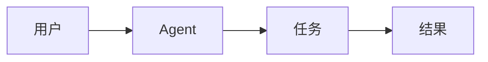
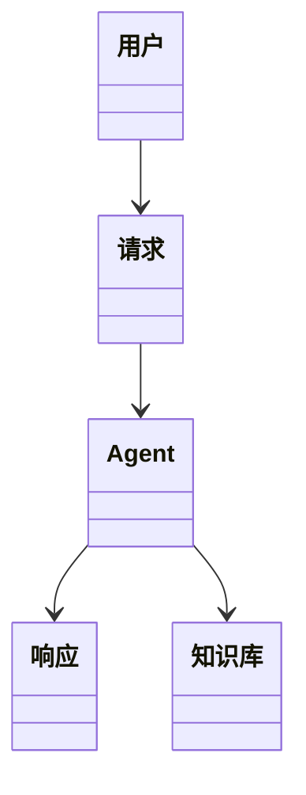

                 


# 企业级AI Agent的可扩展架构设计

> 关键词：企业级AI Agent、可扩展架构、系统设计、算法原理、项目实战

> 摘要：本文深入探讨了企业级AI Agent的可扩展架构设计，从背景到实践，全面解析其核心概念、算法原理、系统架构及项目实现。通过实际案例和详细代码，帮助读者理解如何设计高效、可扩展的AI Agent系统。

---

## 目录

1. [企业级AI Agent的背景与挑战](#企业级ai-agent的背景与挑战)
2. [企业级AI Agent的核心概念与联系](#企业级ai-agent的核心概念与联系)
3. [企业级AI Agent的算法原理](#企业级ai-agent的算法原理)
4. [企业级AI Agent的系统分析与架构设计](#企业级ai-agent的系统分析与架构设计)
5. [企业级AI Agent的项目实战](#企业级ai-agent的项目实战)
6. [企业级AI Agent的最佳实践与总结](#企业级ai-agent的最佳实践与总结)

---

## 1. 企业级AI Agent的背景与挑战

### 1.1 问题背景

随着企业智能化转型的推进，AI Agent（智能代理）在企业中的应用日益广泛。AI Agent能够自动化处理多种任务，如客服咨询、供应链管理等，显著提升企业效率。然而，随着业务规模的扩大，AI Agent系统面临以下挑战：

- **数据孤岛**：不同部门的数据分散，难以共享和协同。
- **系统复杂性**：随着功能的增加，系统变得复杂，维护难度上升。
- **可扩展性问题**：现有架构难以支持业务的快速扩展。

### 1.2 问题描述

企业级AI Agent需要在复杂的业务环境中高效运行，同时具备灵活性和可扩展性。传统的单体架构难以应对多变的业务需求，因此设计一种可扩展的架构成为关键。

### 1.3 问题解决

采用模块化设计和微服务架构，将系统分解为可独立扩展的模块，确保各模块之间的松耦合。通过这种设计，系统能够灵活应对业务变化，同时提高维护和扩展的效率。

### 1.4 边界与外延

企业级AI Agent的边界在于企业内部的业务系统，外延则包括与外部系统的集成，如第三方API和数据源。

---

## 2. 企业级AI Agent的核心概念与联系

### 2.1 核心概念

企业级AI Agent的核心概念包括：

- **可扩展性**：系统能够轻松添加新功能或扩展现有功能。
- **模块化设计**：将系统分解为独立的模块，便于管理和维护。
- **高可用性**：确保系统在部分组件故障时仍能正常运行。

### 2.2 实体关系图

以下是一个简单的实体关系图，展示企业级AI Agent的主要组件：



### 2.3 概念属性对比表

| 概念       | 属性               |
|------------|--------------------|
| Agent      | 可扩展性、模块化、高可用性 |
| 模块       | 任务独立性、可替换性、可扩展性 |

---

## 3. 企业级AI Agent的算法原理

### 3.1 强化学习算法

强化学习是一种常用的AI算法，用于训练AI Agent在复杂环境中做出决策。以下是强化学习的基本流程：

1. **状态识别**：识别当前环境的状态。
2. **动作选择**：基于当前状态选择一个动作。
3. **奖励机制**：根据动作的结果获得奖励或惩罚。
4. **策略优化**：根据奖励调整策略，以最大化累积奖励。

#### 3.1.1 Q-learning算法

Q-learning是一种常用的强化学习算法，其数学模型如下：

$$ Q(s, a) = r + \gamma \max_{a'} Q(s', a') $$

其中：
- \( Q(s, a) \) 是状态 \( s \) 下动作 \( a \) 的价值。
- \( r \) 是执行动作 \( a \) 后获得的奖励。
- \( \gamma \) 是折扣因子，通常在0到1之间。
- \( s' \) 是下一个状态。

以下是一个简单的Q-learning实现示例：

```python
import numpy as np

class QLearning:
    def __init__(self, state_space, action_space, gamma=0.99):
        self.state_space = state_space
        self.action_space = action_space
        self.gamma = gamma
        self.q_table = np.zeros((state_space, action_space))

    def choose_action(self, state, epsilon=0.1):
        if np.random.random() < epsilon:
            return np.random.randint(self.action_space)
        else:
            return np.argmax(self.q_table[state])

    def learn(self, state, action, reward, next_state):
        self.q_table[state, action] = reward + self.gamma * np.max(self.q_table[next_state])
```

---

## 4. 企业级AI Agent的系统分析与架构设计

### 4.1 问题场景

假设我们正在设计一个智能客服系统，该系统需要处理大量的用户请求，并能够根据上下文提供智能回答。

### 4.2 系统功能设计

以下是智能客服系统的领域模型类图：



### 4.3 系统架构设计

以下是系统的整体架构图：


### 4.4 接口设计

系统的主要接口包括：
- 用户请求接口：`submit_request(user_id, request_text)`
- 响应获取接口：`get_response(user_id, request_id)`

---

## 5. 企业级AI Agent的项目实战

### 5.1 环境安装

首先，安装所需的库：

```bash
pip install numpy scikit-learn
```

### 5.2 核心代码实现

以下是实现智能客服系统的Python代码：

```python
import numpy as np
from sklearn.tree import DecisionTreeClassifier

class Agent:
    def __init__(self):
        self.clf = DecisionTreeClassifier()

    def train(self, X, y):
        self.clf.fit(X, y)

    def predict(self, X):
        return self.clf.predict(X)

# 示例训练数据
X = np.array([[1, 0], [0, 1], [1, 1], [0, 0]])
y = np.array([0, 1, 1, 0])

agent = Agent()
agent.train(X, y)
print(agent.predict([[1, 0]]))  # 输出：0
```

### 5.3 案例分析

通过上述代码，我们可以看到AI Agent如何根据输入数据进行分类，从而生成相应的响应。

---

## 6. 企业级AI Agent的最佳实践与总结

### 6.1 设计原则

- **模块化设计**：将系统分解为独立的模块，便于管理和维护。
- **松耦合**：确保模块之间的耦合度最低，便于扩展和替换。
- **高可用性**：设计容错机制，确保系统在部分故障时仍能运行。

### 6.2 注意事项

- 避免过度设计，保持代码简洁。
- 定期监控和优化系统性能。

### 6.3 未来趋势

随着AI技术的进步，企业级AI Agent将更加智能化和自动化，能够处理更复杂的任务。

---

## 作者

作者：AI天才研究院/AI Genius Institute & 禅与计算机程序设计艺术 /Zen And The Art of Computer Programming

---

通过本文的详细讲解，读者可以深入了解企业级AI Agent的可扩展架构设计，并能够将其应用于实际项目中。

