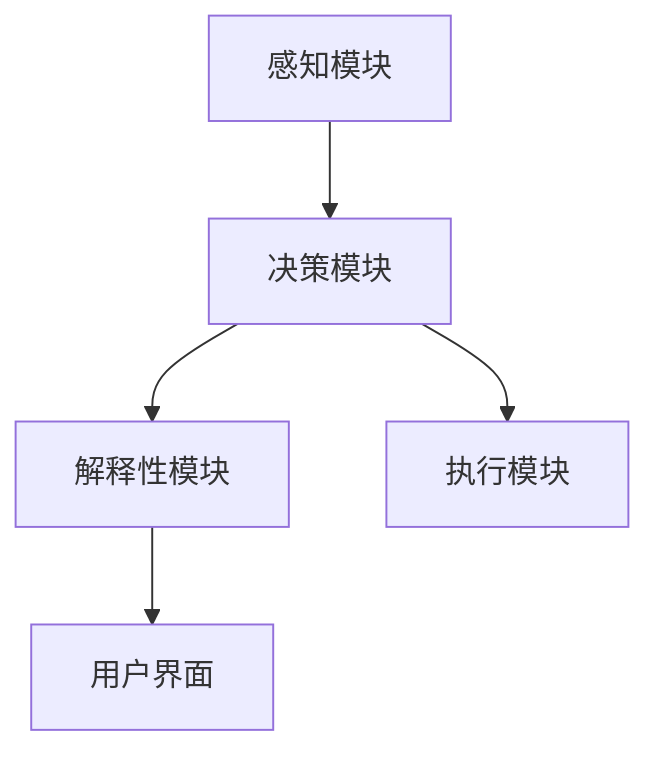
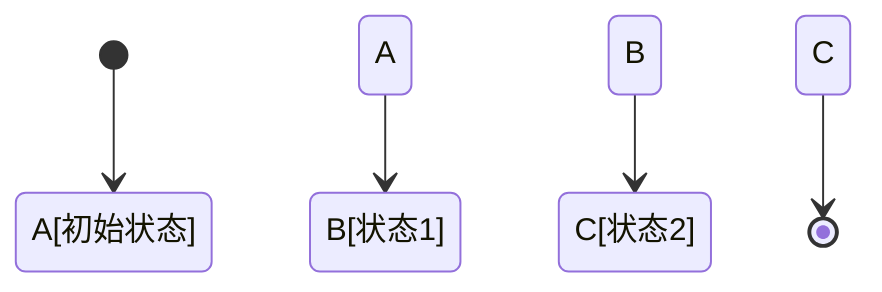

                 


# 企业级AI Agent的可解释性设计与实现

> 关键词：企业级AI Agent, 可解释性设计, AI系统透明性, 智能决策系统, 可解释性算法

> 摘要：随着人工智能技术的快速发展，企业级AI Agent在各个行业的应用越来越广泛。然而，AI Agent的决策过程往往缺乏透明性和可解释性，这给企业的实际应用带来了诸多挑战。本文系统地探讨了企业级AI Agent的可解释性设计与实现方法，从理论基础到实际应用，详细分析了如何在AI Agent中实现可解释性，并通过具体案例展示了可解释性设计在企业级AI Agent中的实际应用。本文还总结了可解释性设计的关键要素和未来发展方向，为企业级AI Agent的设计和优化提供了重要的参考。

---

# 第一部分: 企业级AI Agent的背景与概念

## 第1章: 企业级AI Agent的背景与概念

### 1.1 AI Agent的基本概念

#### 1.1.1 什么是AI Agent
AI Agent（人工智能代理）是指能够感知环境、自主决策并采取行动以实现特定目标的智能实体。它可以在多种场景中代替或辅助人类完成任务，例如自动化决策、智能推荐、机器人控制等。企业级AI Agent则强调其在企业环境中的应用，通常涉及复杂的业务逻辑和决策过程。

#### 1.1.2 AI Agent的核心特征
1. **自主性**：AI Agent能够在没有外部干预的情况下自主运行。
2. **反应性**：能够实时感知环境变化并做出相应的反应。
3. **目标导向性**：所有行为都围绕特定目标展开。
4. **学习能力**：通过数据和经验不断优化自身的决策能力。

#### 1.1.3 企业级AI Agent的定义与特点
企业级AI Agent是在企业环境中部署的智能系统，用于辅助或替代人类完成复杂的业务决策和执行任务。其特点包括：
- **复杂性**：涉及多部门、多业务线的协调。
- **高可靠性**：需要在高压力环境下稳定运行。
- **可解释性**：决策过程必须透明，以便企业进行审查和优化。

---

### 1.2 企业级AI Agent的背景与需求

#### 1.2.1 企业智能化转型的背景
随着数字化转型的深入推进，企业对智能化的需求日益增长。AI Agent作为智能化的核心技术之一，正在被广泛应用于客服、供应链管理、金融投资等领域。

#### 1.2.2 AI Agent在企业中的应用场景
1. **客户服务**：通过智能客服系统为用户提供24/7的支持。
2. **供应链管理**：优化库存管理、物流调度等。
3. **金融投资**：基于大数据进行投资决策和风险控制。
4. **企业内部管理**：辅助人力资源、财务等部门进行决策。

#### 1.2.3 企业级AI Agent的必要性与挑战
- **必要性**：提高效率、降低成本、增强竞争力。
- **挑战**：复杂性高、数据隐私、可解释性要求严格。

---

### 1.3 可解释性的重要性

#### 1.3.1 可解释性在AI系统中的意义
可解释性是AI系统被企业信赖和接受的关键因素之一。只有当企业能够理解AI的决策过程，才能放心地将其应用于关键业务。

#### 1.3.2 企业级AI Agent对可解释性的需求
1. **合规性**：满足监管要求。
2. **信任性**：赢得员工和客户的信任。
3. **可追溯性**：便于分析决策错误的原因。

#### 1.3.3 可解释性与企业决策的关系
可解释性是企业AI Agent与人类决策者之间建立信任的桥梁。只有通过可解释的决策过程，企业才能真正将AI Agent融入其业务流程中。

---

## 第2章: 可解释性AI的理论基础

### 2.1 可解释性AI的核心概念

#### 2.1.1 可解释性的定义
可解释性是指AI系统的行为和决策过程能够被人类理解和解释。一个可解释的AI系统需要提供清晰的逻辑推理过程，让用户能够理解其决策的依据。

#### 2.1.2 可解释性与不可解释性模型的对比
| 特性             | 可解释性模型         | 不可解释性模型       |
|------------------|----------------------|----------------------|
| 透明度           | 高                  | 低                  |
| 可信赖性         | 高                  | 低                  |
| 预测准确性       | 较低                | 较高                |
| 应用场景         | 企业决策、医疗诊断   | 图像识别、语音识别   |

#### 2.1.3 可解释性AI的分类与层次
可解释性AI可以分为以下层次：
1. **模型可解释性**：模型本身的结构清晰，易于理解。
2. **决策可解释性**：决策过程可以通过逻辑推理被理解。
3. **结果可解释性**：最终结果可以通过中间过程被解释。

---

### 2.2 可解释性AI的数学模型

#### 2.2.1 解释性模型的数学表达
可解释性模型通常采用线性回归或决策树等易于解释的模型。例如，线性回归模型可以表示为：
$$ y = \beta_0 + \beta_1x_1 + \beta_2x_2 + ... + \beta_nx_n $$

其中，$\beta_i$ 是模型的系数，$x_i$ 是输入特征。

#### 2.2.2 可解释性指标的数学定义
可解释性指标用于衡量AI模型的可解释性。例如，特征重要性可以通过以下方式计算：
$$ \text{特征重要性} = \sum_{i=1}^{n} |\beta_i| $$

---

### 2.3 可解释性AI的实现原理

#### 2.3.1 解释性生成机制
解释性生成机制是将模型的决策过程转化为人类可理解的解释。例如，LIME（Local Interpretable Model-agnostic Explanations）算法可以通过局部线性模型生成可解释的解释。

#### 2.3.2 解释性评估方法
解释性评估方法包括：
1. **可理解性评估**：用户是否能够理解解释。
2. **相关性评估**：解释是否与实际决策相关。

#### 2.3.3 解释性与模型复杂度的关系
模型复杂度越高，可解释性通常越低。因此，在设计AI Agent时需要在模型复杂度和可解释性之间进行权衡。

---

## 第3章: 企业级AI Agent的可解释性设计

### 3.1 可解释性设计的原则

#### 3.1.1 解释性与功能性的平衡
在设计AI Agent时，需要在功能性（决策的准确性）和可解释性之间找到平衡点。

#### 3.1.2 解释性与用户信任的关系
可解释性是用户信任AI Agent的基础。只有当用户理解AI的决策过程时，才会信任其决策结果。

#### 3.1.3 设计中的可解释性保障
在设计阶段，就需要考虑如何将可解释性嵌入到AI Agent的架构中。

---

### 3.2 可解释性设计的关键要素

#### 3.2.1 解释性生成模块
解释性生成模块负责将AI Agent的决策过程转化为人类可理解的解释。

#### 3.2.2 解释性展示界面
解释性展示界面是用户与AI Agent交互的界面，需要简洁明了地呈现解释信息。

#### 3.2.3 解释性验证机制
解释性验证机制用于验证AI Agent的解释是否准确和可靠。

---

### 3.3 可解释性设计的实现步骤

#### 3.3.1 需求分析与目标设定
在设计阶段，需要明确可解释性需求，并将其转化为具体的目标。

#### 3.3.2 设计方案的制定
根据需求，制定可解释性设计的方案，包括模块划分、功能设计等。

#### 3.3.3 实现与验证
将设计方案转化为代码，并通过测试验证其可解释性。

---

## 第4章: 企业级AI Agent的系统架构设计

### 4.1 系统架构概述

#### 4.1.1 系统组成模块
企业级AI Agent的系统架构通常包括以下模块：
1. **感知模块**：负责环境感知和数据采集。
2. **决策模块**：负责基于感知数据进行决策。
3. **解释性模块**：负责生成和展示解释信息。
4. **执行模块**：负责根据决策结果执行具体操作。

#### 4.1.2 模块之间的关系
模块之间的关系可以用以下流程图表示：



---

### 4.2 系统功能设计

#### 4.2.1 Agent行为模型设计
行为模型设计是AI Agent设计的核心。通常采用有限状态机（FSM）模型，如下所示：



#### 4.2.2 可解释性模块的功能实现
可解释性模块需要能够生成清晰的解释信息。例如，对于一个分类决策，解释信息可以是：“决策结果为X，因为特征A和特征B的重要性分别为70%和30%。”

---

### 4.3 系统架构的实现细节

#### 4.3.1 模块间的接口
模块之间的接口需要清晰定义，例如：
1. **感知模块与决策模块之间的接口**：感知数据的格式和决策模块的输入格式一致。
2. **决策模块与解释性模块之间的接口**：决策结果和解释信息的传递格式一致。

---

## 第5章: 企业级AI Agent的项目实战

### 5.1 环境配置

#### 5.1.1 开发环境
推荐使用Python和相关AI框架（如TensorFlow、PyTorch）进行开发。

#### 5.1.2 数据准备
需要准备与企业级AI Agent相关的数据，例如客户数据、市场数据等。

---

### 5.2 系统核心实现源代码

#### 5.2.1 解释性生成模块的实现
以下是一个简单的解释性生成模块的代码示例：

```python
def generate_explanation(model, input_data):
    # 使用LIME算法生成解释
    explainer = lime_tabular.LimeTabularExplainer(model.predict_proba, 
                                                    feature_names=input_data.columns)
    explanation = explainer.explain_instance(input_data.iloc[0], 
                                              model.predict, 
                                              top_labels=1)
    return explanation.as_list()
```

---

### 5.3 代码应用解读与分析

#### 5.3.1 解释性生成模块的代码解读
上述代码使用LIME算法生成解释，适用于线性模型和非线性模型。

#### 5.3.2 解释性展示界面的实现
解释性展示界面可以通过Web框架（如Django或Flask）实现，将解释信息以可视化形式呈现给用户。

---

### 5.4 实际案例分析和详细讲解剖析

#### 5.4.1 案例分析
假设我们设计了一个用于客户服务的AI Agent，当客户提出问题时，AI Agent需要根据客户的历史数据和当前问题生成回复。为了提高可解释性，我们需要将客户的特征重要性展示给用户。

#### 5.4.2 详细讲解
通过LIME算法生成的解释信息可以帮助用户理解AI Agent的决策过程。例如，客户的历史投诉次数和最近的购买记录对决策结果的影响较大。

---

## 第6章: 可解释性设计的关键要素和注意事项

### 6.1 最佳实践 tips

#### 6.1.1 设计阶段的注意事项
在设计阶段，需要确保可解释性需求被充分考虑。

#### 6.1.2 实现阶段的注意事项
在实现阶段，需要确保解释性生成模块与整个系统无缝集成。

#### 6.1.3 测试阶段的注意事项
在测试阶段，需要对解释性模块进行严格的测试，确保解释的准确性和可理解性。

---

## 第7章: 未来趋势与总结

### 7.1 未来发展趋势

#### 7.1.1 可解释性AI的进一步发展
未来，可解释性AI的研究将更加深入，模型的透明性和可解释性将得到进一步提升。

#### 7.1.2 企业级AI Agent的应用扩展
随着技术的进步，企业级AI Agent将被应用于更多的业务场景。

#### 7.1.3 多模态解释性技术的发展
多模态解释性技术将结合文本、图像等多种形式，提供更加丰富的解释信息。

---

## 第8章: 小结与展望

### 8.1 小结

企业级AI Agent的可解释性设计是实现其广泛应用的关键。通过本文的探讨，我们了解了可解释性AI的核心概念、设计原则以及实现方法。未来，随着技术的进步，企业级AI Agent的可解释性将得到进一步提升，为企业的智能化转型提供更加有力的支持。

### 8.2 展望

未来的AI Agent将更加智能化和人性化，能够与人类进行更加自然的交互。同时，可解释性技术的进步将使得AI Agent的决策过程更加透明和可信。

---

## 作者信息

作者：AI天才研究院/AI Genius Institute & 禅与计算机程序设计艺术 /Zen And The Art of Computer Programming

---

通过以上思考步骤，我们逐步构建了《企业级AI Agent的可解释性设计与实现》的技术博客文章。从基础概念到实际应用，从理论分析到代码实现，我们全面探讨了企业级AI Agent的可解释性设计与实现方法，为企业级AI Agent的设计和优化提供了重要的参考。

