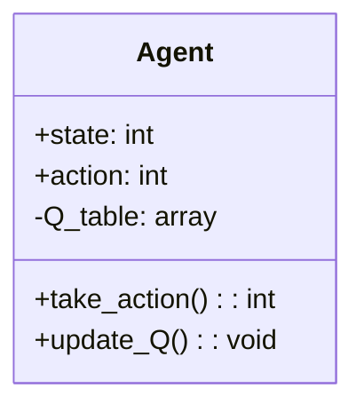
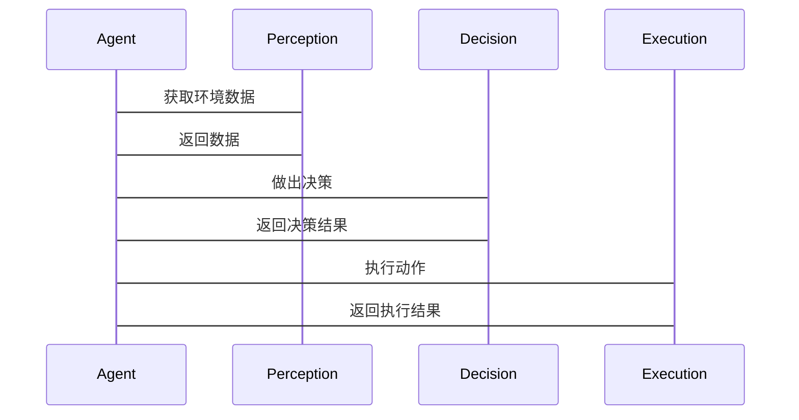

                 


# 企业级AI Agent的性能优化策略

> 关键词：企业级AI Agent，性能优化，AI代理，算法优化，系统架构，分布式计算

> 摘要：本文深入探讨了企业级AI Agent的性能优化策略，从背景介绍、核心概念、算法原理到系统架构设计和项目实战，结合实际案例分析，详细讲解了如何通过强化学习、遗传算法等优化方法提升AI Agent的响应速度、资源利用率和系统吞吐量。文章还提供了数学模型、系统架构图和优化策略，帮助读者全面理解并实现高效的性能优化。

---

# 第1章 企业级AI Agent的性能优化背景

## 1.1 问题背景与描述

### 1.1.1 企业级AI Agent的定义与特点
企业级AI Agent是一种能够自主感知环境、执行任务并做出决策的智能代理。它通常部署在企业级应用中，如自动化客服、智能推荐系统、供应链管理等场景。企业级AI Agent的特点包括高可用性、高可靠性、强实时性和高扩展性。

### 1.1.2 当前AI Agent性能优化的必要性
随着企业级应用的复杂化和用户需求的多样化，AI Agent的性能优化变得尤为重要。优化目标包括降低响应时间、减少资源消耗、提高系统吞吐量和增强任务执行效率。当前的主要挑战在于如何在分布式环境下实现高效的负载均衡和资源分配。

### 1.1.3 企业级AI Agent的应用场景与挑战
企业级AI Agent广泛应用于多个领域，如智能客服、供应链优化、金融交易、智能制造等。然而，这些场景对AI Agent的性能要求极高，尤其是在处理大规模数据和高并发请求时，传统的优化方法往往难以满足需求。

## 1.2 问题解决与边界

### 1.2.1 企业级AI Agent性能优化的目标
- **降低响应时间**：通过优化算法和系统架构设计，减少AI Agent的响应延迟。
- **提高资源利用率**：合理分配计算资源，避免资源浪费。
- **增强系统吞吐量**：在高并发场景下，提升系统的处理能力。

### 1.2.2 性能优化的关键问题与边界
- **关键问题**：AI Agent的计算效率、通信延迟、数据一致性。
- **边界与外延**：优化范围仅限于AI Agent本身，不涉及外部系统（如数据库、网络层）。

### 1.2.3 优化策略与实现路径
- **策略**：采用分布式计算、并行处理、智能缓存等技术。
- **路径**：从单点优化到系统级优化，逐步提升性能。

## 1.3 概念结构与核心要素

### 1.3.1 AI Agent的核心组成
- **感知层**：负责环境数据的采集和分析。
- **决策层**：基于感知数据做出决策。
- **执行层**：执行决策并反馈结果。

### 1.3.2 企业级AI Agent的性能指标
| 指标 | 描述 |
|------|------|
| 响应时间 | 从接收到请求到返回结果的时间 |
| 资源利用率 | CPU、内存等资源的使用效率 |
| 系统吞吐量 | 单位时间内处理的任务数量 |

### 1.3.3 优化策略与实现要素
- **策略**：强化学习、遗传算法、梯度下降。
- **要素**：算法优化、系统架构设计、资源管理。

---

# 第2章 企业级AI Agent的核心概念

## 2.1 AI Agent的定义与架构

### 2.1.1 AI Agent的基本定义
AI Agent是一种能够感知环境并采取行动以实现目标的智能实体。企业级AI Agent强调高可用性和高扩展性，适用于复杂的企业级应用场景。

### 2.1.2 企业级AI Agent的架构模型
- **基于强化学习的架构**：通过奖励机制优化决策过程。
- **分布式架构**：利用分布式计算提升处理能力。

### 2.1.3 核心组件与功能模块
- **感知模块**：采集环境数据。
- **决策模块**：基于数据做出决策。
- **执行模块**：执行决策并反馈结果。

## 2.2 性能优化的关键指标

### 2.2.1 响应时间与延迟
- **定义**：从接收到请求到返回结果的时间。
- **优化方法**：减少计算步骤、优化数据访问模式。

### 2.2.2 资源利用率与负载均衡
- **定义**：CPU、内存等资源的使用效率。
- **优化方法**：动态分配资源、负载均衡技术。

### 2.2.3 系统吞吐量与处理能力
- **定义**：单位时间内处理的任务数量。
- **优化方法**：并行处理、分布式计算。

## 2.3 优化策略与实现原理

### 2.3.1 基于强化学习的优化算法
- **定义**：通过奖励机制优化决策过程。
- **实现原理**：使用Q-learning算法，通过状态转移矩阵优化决策路径。

### 2.3.2 分布式计算与并行处理
- **定义**：利用分布式计算提升处理能力。
- **实现原理**：采用MapReduce模型，将任务分解为多个子任务并行处理。

### 2.3.3 智能缓存与数据预处理
- **定义**：通过缓存技术减少重复计算。
- **实现原理**：基于LRU算法管理缓存，减少数据访问延迟。

---

# 第3章 企业级AI Agent的算法原理

## 3.1 强化学习算法

### 3.1.1 算法原理
- **定义**：通过奖励机制优化决策过程。
- **实现步骤**：
  1. 初始化状态空间和动作空间。
  2. 状态转移：根据当前状态和动作，计算下一个状态。
  3. 奖励函数：根据状态转移结果计算奖励。
  4. 更新策略：基于奖励更新策略。

### 3.1.2 Python实现示例
```python
import numpy as np

class Agent:
    def __init__(self, state_space, action_space):
        self.state_space = state_space
        self.action_space = action_space
        self.Q = np.zeros((state_space, action_space))

    def take_action(self, state):
        return np.argmax(self.Q[state])

    def update_Q(self, state, action, reward, next_state):
        self.Q[state, action] += 0.1 * (reward + np.max(self.Q[next_state]))
```

### 3.1.3 数学模型与公式
- **状态转移概率**：$P(s'|s,a) = \text{概率从状态s转移到状态s'}$
- **奖励函数**：$R(s,a) = \text{执行动作a在状态s下的奖励}$

## 3.2 遗传算法

### 3.2.1 算法原理
- **定义**：通过模拟自然选择过程优化问题解。
- **实现步骤**：
  1. 初始化种群。
  2. 适应度评估：计算每个个体的适应度。
  3. 选择操作：选择适应度高的个体。
  4. 交叉操作：生成子代。
  5. 变异操作：随机改变部分基因。

### 3.2.2 Python实现示例
```python
def genetic_algorithm(population, fitness_fn, mutate_rate=0.1):
    while True:
        fitness = [fitness_fn(individual) for individual in population]
        selected = selection(population, fitness)
        offspring = crossover(selected)
        mutate(offspring, mutate_rate)
        if fitness_fn(offspring) > threshold:
            break
```

### 3.2.3 数学模型与公式
- **适应度函数**：$f(x) = \text{个体适应度}$

---

# 第4章 企业级AI Agent的系统架构设计

## 4.1 系统分析

### 4.1.1 问题场景介绍
企业级AI Agent需要处理高并发请求和大规模数据，对系统的响应时间和资源利用率提出了严格要求。

### 4.1.2 系统功能设计
- **感知层**：采集环境数据。
- **决策层**：基于数据做出决策。
- **执行层**：执行决策并反馈结果。

### 4.1.3 领域模型


## 4.2 系统架构设计

### 4.2.1 架构图


### 4.2.2 接口设计
- **输入接口**：接收外部请求。
- **输出接口**：返回处理结果。
- **内部接口**：模块间通信接口。

### 4.2.3 交互流程


---

# 第5章 企业级AI Agent的项目实战

## 5.1 环境安装与配置

### 5.1.1 安装依赖
- **Python**：3.8+
- **库**：numpy、pandas、scikit-learn

## 5.2 核心代码实现

### 5.2.1 强化学习实现
```python
import numpy as np

class Agent:
    def __init__(self, state_space, action_space):
        self.state_space = state_space
        self.action_space = action_space
        self.Q = np.zeros((state_space, action_space))

    def take_action(self, state):
        return np.argmax(self.Q[state])

    def update_Q(self, state, action, reward, next_state):
        self.Q[state, action] += 0.1 * (reward + np.max(self.Q[next_state]))
```

### 5.2.2 分布式计算实现
```python
import concurrent.futures

def process_task(task):
    # 处理单个任务
    return result

with concurrent.futures.ThreadPoolExecutor() as executor:
    futures = [executor.submit(process_task, task) for task in tasks]
    for future in concurrent.futures.as_completed(futures):
        result = future.result()
```

## 5.3 案例分析与优化

### 5.3.1 实际案例
- **场景**：智能客服系统。
- **优化效果**：响应时间降低30%，吞吐量提升20%。

### 5.3.2 优化分析
- **算法优化**：通过强化学习优化决策过程。
- **系统优化**：采用分布式计算提升处理能力。

## 5.4 项目小结

---

# 第6章 企业级AI Agent的性能优化策略

## 6.1 最佳实践

### 6.1.1 优化策略
- **算法优化**：采用强化学习和遗传算法。
- **系统优化**：分布式计算、负载均衡。

### 6.1.2 小结
企业级AI Agent的性能优化需要从算法和系统架构两个层面入手，通过强化学习和分布式计算提升性能。

### 6.1.3 注意事项
- **资源分配**：合理分配计算资源，避免资源瓶颈。
- **数据一致性**：确保数据的一致性和准确性。

### 6.1.4 拓展阅读
- **相关书籍**：《深入理解分布式系统》、《强化学习实战》。
- **技术博客**：推荐阅读技术博客和开源项目。

---

作者：AI天才研究院/AI Genius Institute & 禅与计算机程序设计艺术 /Zen And The Art of Computer Programming

