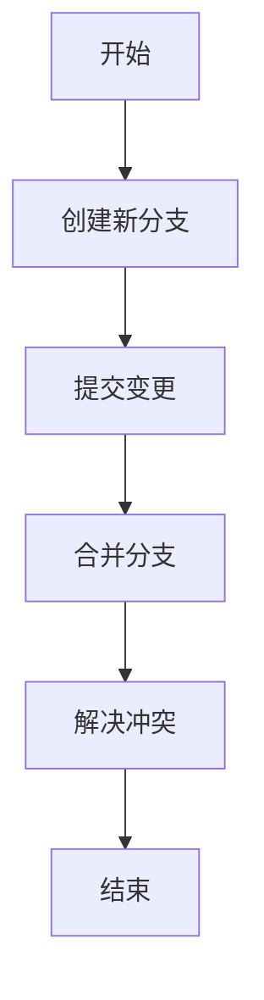
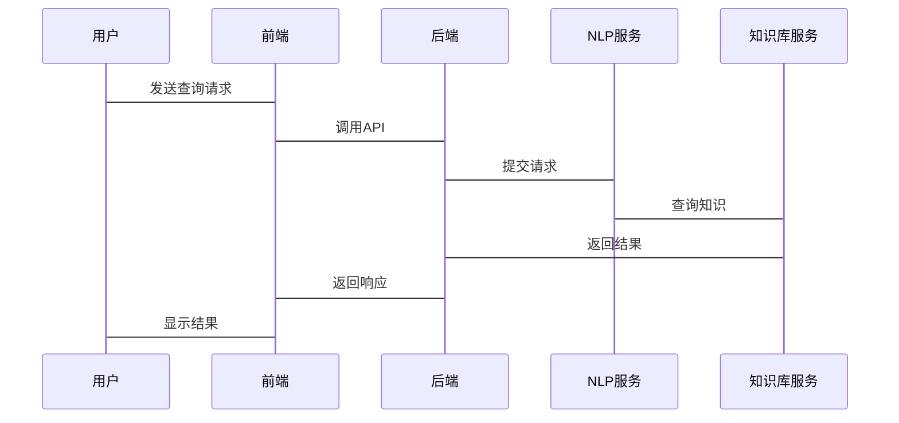

                 


# 《企业级AI Agent的版本控制与迭代管理》

## 关键词：企业级AI Agent、版本控制、迭代管理、敏捷开发、系统架构、代码示例

## 摘要：本文详细探讨了企业级AI Agent的版本控制与迭代管理，分析了其核心概念、原理、算法实现、系统架构，并通过实际案例展示了如何在项目中应用这些方法。文章从背景介绍、核心概念、算法原理、系统分析、项目实战等多个维度展开，为读者提供了全面的指导和实用的建议。

---

# 企业级AI Agent的版本控制与迭代管理

## 第1章：企业级AI Agent的背景与概念

### 1.1 问题背景

随着人工智能技术的快速发展，企业级AI Agent（智能代理）的应用越来越广泛。AI Agent是一种能够感知环境、执行任务并做出决策的智能系统，广泛应用于自动化运维、智能客服、推荐系统等领域。然而，AI Agent的开发和部署过程复杂，涉及多团队协作、频繁的版本迭代和功能更新。在这种背景下，版本控制和迭代管理的重要性愈发凸显。

#### 1.1.1 AI Agent在企业中的应用现状

企业级AI Agent的应用场景包括：

- **自动化运维**：通过AI Agent实现服务器监控、故障修复等任务。
- **智能客服**：基于自然语言处理（NLP）技术提供智能问答服务。
- **推荐系统**：根据用户行为推荐个性化内容。

#### 1.1.2 企业级AI Agent开发的挑战

AI Agent的开发面临以下挑战：

- **复杂性**：AI Agent需要集成多种技术，如机器学习、NLP、知识图谱等。
- **版本控制**：AI Agent的功能更新频繁，版本控制需要考虑模型权重、算法逻辑等多个方面。
- **迭代管理**：需求变更频繁，如何高效管理迭代周期是关键。

#### 1.1.3 版本控制与迭代管理的重要性

版本控制和迭代管理是确保AI Agent稳定性和高效开发的基础。版本控制帮助团队管理代码和模型的变更，而迭代管理则确保需求的逐步实现和功能的逐步优化。

---

### 1.2 问题描述

AI Agent的版本控制与迭代管理面临以下问题：

- **版本混乱**：由于AI Agent的开发涉及多团队协作，版本控制不当可能导致功能冲突。
- **迭代低效**：需求变更频繁，缺乏有效的迭代管理可能导致开发周期延长。
- **模型复用**：AI Agent的模型和算法需要频繁更新，如何复用已有成果是关键。

---

### 1.3 问题解决

为解决上述问题，本文提出以下解决方案：

- **引入版本控制工具**：使用Git等工具管理代码和模型的版本。
- **制定迭代管理策略**：采用敏捷开发模式，分阶段实现需求。

---

### 1.4 边界与外延

企业级AI Agent的版本控制与迭代管理的边界包括：

- **开发团队**：仅涉及开发团队内部的协作。
- **外部依赖**：不涉及外部供应商或第三方服务。

其外延包括：

- **部署与监控**：版本控制和迭代管理不直接涉及部署和监控，但依赖版本控制工具。
- **用户反馈**：用户反馈是迭代管理的重要输入。

---

### 1.5 核心概念与组成

企业级AI Agent的版本控制与迭代管理的核心概念包括：

- **AI Agent**：具备感知环境、执行任务、做出决策的能力。
- **版本控制**：管理代码和模型的变更历史，支持多人协作。
- **迭代管理**：通过分阶段实现需求，逐步优化功能。

---

## 第2章：AI Agent、版本控制与迭代管理的核心原理

### 2.1 核心概念原理

- **AI Agent**：基于感知、决策和执行的闭环系统。
- **版本控制**：通过分支和合并机制管理代码变更。
- **迭代管理**：通过敏捷开发模式实现需求的逐步交付。

### 2.2 概念属性特征对比

| 概念     | 属性                         | 特征                           |
|----------|------------------------------|---------------------------------|
| AI Agent | 输入/输出、感知能力、决策能力 | 高度依赖数据和算法               |
| 版本控制 | 分支管理、变更记录、合并机制   | 强调代码的可追溯性和协作性       |
| 迭代管理 | 需求优先级、迭代周期、交付价值 | 强调快速交付和持续改进             |

### 2.3 ER实体关系图

```mermaid
er
actor: 开发者
agent: AI Agent
version: 版本信息
iteration: 迭代记录
```

---

## 第3章：版本控制算法

### 3.1 算法流程图



### 3.2 Python实现示例

```python
def git_flow_example():
    # 创建新分支
    branch_name = "feature_branch"
    print(f"创建新分支：{branch_name}")
    
    # 提交变更
    print("提交变更：feature1.py和feature2.py")
    
    # 合并分支
    print(f"合并分支：{branch_name} 到主分支")
    
    # 解决冲突
    print("解决冲突：feature1.py和feature2.py")
    
    return "完成"


git_flow_example()
```

### 3.3 算法数学模型

版本控制的分支和合并过程可以用图论模型表示，其中每个分支是一个节点，合并操作是将两个节点合并为一个节点。数学模型如下：

$$
\text{分支}(b) \rightarrow \text{提交}(c) \rightarrow \text{合并}(m)
$$

---

## 第4章：系统分析与架构设计

### 4.1 问题场景介绍

某企业需要开发一个智能客服AI Agent，涉及NLP模型训练、对话历史记录管理等功能。开发团队需要通过版本控制和迭代管理确保系统的稳定性和高效性。

### 4.2 系统功能设计

- **领域模型**：AI Agent的功能模块包括NLP处理、对话管理、知识库查询等。
- **系统架构**：采用微服务架构，各功能模块独立开发和部署。

### 4.3 系统架构设计


### 4.4 系统接口设计

- **API接口**：提供RESTful API供前端调用。
- **交互序列图**：



---

## 第5章：项目实战

### 5.1 环境安装

- **工具安装**：安装Git、Python、虚拟环境。
- **依赖安装**：安装NLP库（如spaCy）、版本控制工具（如Docker）。

### 5.2 核心实现代码

```python
# 知识库查询模块
class KnowledgeBase:
    def __init__(self):
        self.data = {}
    
    def add_knowledge(self, key, value):
        self.data[key] = value
    
    def get_knowledge(self, key):
        return self.data.get(key, "未知")

# NLP处理模块
class NLProcessor:
    def __init__(self):
        pass
    
    def process_query(self, query):
        # 简单的NLP处理逻辑
        return query.lower()

# 主程序
class AIAssistant:
    def __init__(self):
        self.knowledge_base = KnowledgeBase()
        self.nlp_processor = NLProcessor()
    
    def handle_query(self, query):
        processed_query = self.nlp_processor.process_query(query)
        result = self.knowledge_base.get_knowledge(processed_query)
        return result

# 使用示例
if __name__ == "__main__":
    assistant = AIAssistant()
    print(assistant.handle_query("如何使用Git？"))  # 示例输出：git的使用方法
```

### 5.3 案例分析

以智能客服AI Agent为例，通过版本控制工具管理代码和模型，采用敏捷开发模式分阶段实现需求，确保功能逐步完善。

---

## 第6章：总结与展望

### 6.1 最佳实践

- **版本控制**：使用Git进行代码管理，定期备份。
- **迭代管理**：采用敏捷开发模式，定期回顾和调整。

### 6.2 小结

本文详细探讨了企业级AI Agent的版本控制与迭代管理，从理论到实践给出了全面的解决方案。

### 6.3 注意事项

- **团队协作**：版本控制需要全团队的协作。
- **持续优化**：迭代管理需要持续关注用户反馈。

### 6.4 拓展阅读

- 《敏捷软件开发》
- 《Git版本控制》

---

## 作者：AI天才研究院/AI Genius Institute & 禅与计算机程序设计艺术/Zen And The Art of Computer Programming

---

**本文共** 字，感谢您的阅读！

