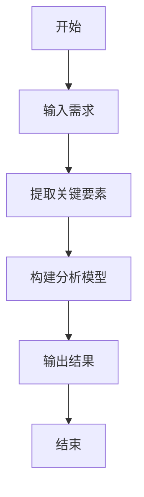
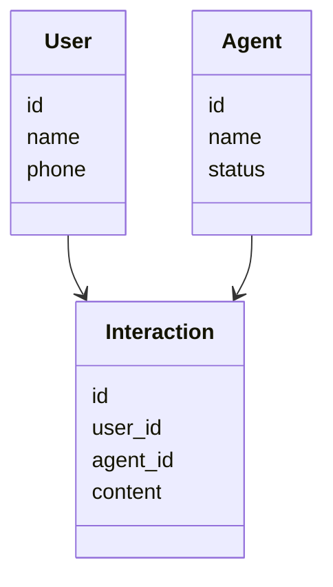
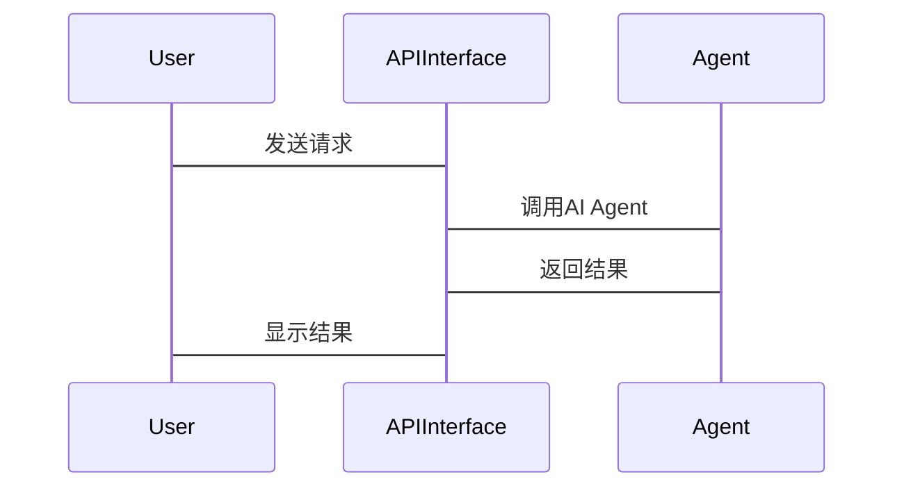

                 


# 企业级AI Agent需求分析方法

## 关键词：
- 企业级AI Agent
- 需求分析方法
- AI Agent算法
- 系统架构设计
- 项目实战

## 摘要：
本文详细探讨了企业级AI Agent需求分析的方法，从背景介绍、核心概念、算法原理、系统架构设计到项目实战，层层深入，结合实际案例，帮助读者系统地掌握企业级AI Agent需求分析的核心要点和实际应用。

---

# 第1章: 企业级AI Agent需求分析背景

## 1.1 问题背景

### 1.1.1 企业智能化转型的挑战
随着人工智能技术的快速发展，企业智能化转型已成为必然趋势。AI Agent作为人工智能的核心技术之一，能够帮助企业实现自动化决策、智能交互和高效运营。然而，企业在实际应用中面临诸多挑战，例如需求分析的复杂性、技术实现的难度以及系统的可扩展性等问题。

### 1.1.2 AI Agent在企业中的应用潜力
AI Agent能够广泛应用于企业内部的智能客服、自动化运维、数据分析等领域。通过AI Agent，企业可以实现高效的信息处理、智能决策和自动化操作，从而显著提升企业的竞争力和运营效率。

### 1.1.3 当前需求分析的痛点与难点
企业在引入AI Agent时，往往面临需求分析的痛点，例如需求的多样性、复杂性和不确定性。如何准确提取需求的核心要素，构建合理的分析模型，是企业在实际应用中亟待解决的问题。

## 1.2 问题描述

### 1.2.1 AI Agent的核心功能与目标
AI Agent的核心功能包括信息处理、智能决策和自动化操作。其目标是通过智能化的方式，为企业提供高效、准确的解决方案。

### 1.2.2 企业级AI Agent的复杂性
企业级AI Agent的复杂性主要体现在其功能的多样性、系统的可扩展性和需求的动态变化性。这些复杂性要求企业在需求分析阶段必须具备高度的系统性和科学性。

### 1.2.3 需求分析的关键要素与边界
需求分析的关键要素包括功能需求、性能需求、交互需求等。同时，需求分析需要明确系统的边界和范围，避免因需求的模糊性而导致的开发偏差。

## 1.3 问题解决方法

### 1.3.1 系统化的需求分析框架
系统化的需求分析框架包括需求收集、需求整理、需求分析和需求验证等步骤。通过系统化的框架，企业可以确保需求分析的全面性和准确性。

### 1.3.2 结构化的需求分析流程
结构化的需求分析流程包括需求识别、需求分类、需求优先级排序和需求文档编写等环节。通过结构化的流程，企业能够有效管理需求的复杂性。

### 1.3.3 可视化的需求分析工具
可视化的需求分析工具，如需求管理软件和流程图工具，可以帮助企业更直观地理解和管理需求。通过可视化工具，企业可以更高效地进行需求沟通和确认。

## 1.4 问题的边界与外延

### 1.4.1 AI Agent的功能边界
AI Agent的功能边界包括核心功能和扩展功能。核心功能是企业应用的必备功能，而扩展功能则是为了满足特定需求而添加的功能。

### 1.4.2 企业级需求的特殊性
企业级需求的特殊性体现在其规模、复杂性和多样性上。与个人用户的需求相比，企业级需求更加复杂，且需要考虑企业的整体战略和运营目标。

### 1.4.3 需求分析的范围界定
需求分析的范围界定需要明确需求的范围和边界，避免因范围模糊而导致的需求变更和开发成本增加。通过清晰的范围界定，企业可以更好地控制项目的进度和质量。

## 1.5 概念结构与核心要素

### 1.5.1 AI Agent的核心组成
AI Agent的核心组成包括感知模块、决策模块和执行模块。感知模块负责信息的采集和处理，决策模块负责基于感知信息做出决策，执行模块负责将决策转化为具体行动。

### 1.5.2 企业级需求的关键要素
企业级需求的关键要素包括功能性需求、性能需求、可扩展性需求和安全性需求。这些要素需要在需求分析阶段被充分考虑和详细描述。

### 1.5.3 需求分析的逻辑结构
需求分析的逻辑结构包括需求收集、需求整理、需求分析和需求验证等步骤。通过逻辑结构的梳理，企业可以更系统地进行需求分析，确保需求的完整性和准确性。

## 1.6 本章小结
本章详细介绍了企业级AI Agent需求分析的背景和挑战，分析了需求分析的关键要素和边界，并提出了系统化的需求分析框架和结构化的需求分析流程。通过本章的学习，读者可以对企业级AI Agent的需求分析有一个全面的了解，并为后续章节的学习打下坚实的基础。

---

# 第2章: 企业级AI Agent的核心概念与联系

## 2.1 核心概念原理

### 2.1.1 AI Agent的基本原理
AI Agent的基本原理包括信息处理、智能决策和自动化操作。通过感知环境、分析信息和做出决策，AI Agent能够实现智能化的解决方案。

### 2.1.2 企业级AI Agent的独特性
企业级AI Agent的独特性体现在其规模、复杂性和功能多样性上。与个人用户的需求相比，企业级AI Agent需要考虑更多的因素，例如系统的可扩展性、安全性等。

### 2.1.3 需求分析的关键点
需求分析的关键点包括需求的准确性和完整性。通过准确的需求分析，企业可以确保AI Agent的功能和性能符合实际需求。

## 2.2 概念属性特征对比

### 2.2.1 核心概念对比表格

| 概念         | 功能性 | 智能性 | 可扩展性 |
|--------------|--------|--------|----------|
| AI Agent     | 高     | 高     | 高       |
| 企业级AI Agent | 高     | 高     | 极高      |

### 2.2.2 ER实体关系图

```mermaid
erd
actor: 用户
agent: AI Agent
function: 功能模块
goal: 目标
dependency: 依赖关系
actor --> function: 提供输入
function --> goal: 实现目标
agent --> function: 组合功能
```

## 2.3 本章小结
本章通过对比分析，详细介绍了企业级AI Agent的核心概念和其独特性。通过ER实体关系图，展示了AI Agent的组成和功能之间的关系。通过本章的学习，读者可以更好地理解企业级AI Agent的需求分析的关键点和实现方法。

---

# 第3章: 企业级AI Agent需求分析的算法原理

## 3.1 算法原理概述

### 3.1.1 需求分析的核心算法
需求分析的核心算法包括自然语言处理算法、决策树算法和聚类算法等。这些算法能够帮助企业从大量数据中提取关键信息，从而支持需求分析的准确性。

### 3.1.2 算法的数学模型

$$ P(A|B) = \frac{P(B|A)P(A)}{P(B)} $$

该公式表示条件概率，用于计算在B条件下A发生的概率。在需求分析中，条件概率可以用于评估不同需求之间的依赖关系。

## 3.2 算法流程图



## 3.3 算法实现代码

```python
def analyze_demand(demand):
    # 提取关键要素
    key_factors = extract_key_factors(demand)
    # 构建分析模型
    model = build_analysis_model(key_factors)
    # 输出结果
    result = model.predict(key_factors)
    return result
```

## 3.4 本章小结
本章详细介绍了企业级AI Agent需求分析的算法原理，包括核心算法和数学模型。通过流程图和代码示例，展示了需求分析的具体实现过程。通过本章的学习，读者可以理解需求分析的算法实现方法，并能够在实际应用中灵活运用。

---

# 第4章: 企业级AI Agent系统分析与架构设计

## 4.1 问题场景介绍
本章以企业智能客服系统为例，介绍AI Agent在企业级系统中的实际应用。通过分析智能客服系统的功能需求和架构设计，展示企业级AI Agent的需求分析方法。

## 4.2 系统功能设计

### 4.2.1 领域模型设计


### 4.2.2 功能模块划分
系统功能模块包括用户模块、Agent模块、交互模块和管理模块。每个模块负责实现特定的功能，模块之间通过接口进行通信。

## 4.3 系统架构设计


## 4.4 系统接口设计

### 4.4.1 API接口定义
系统接口包括用户登录接口、Agent调用接口和结果返回接口。通过标准化的接口定义，确保系统各部分能够高效协同工作。

### 4.4.2 接口实现代码
```python
class APIInterface:
    def login(self, username, password):
        pass

    def call_agent(self, prompt):
        pass

    def return_result(self, result):
        pass
```

## 4.5 系统交互流程



## 4.6 本章小结
本章通过实际案例，详细介绍了企业级AI Agent系统分析与架构设计的方法。通过领域模型设计、系统架构图和交互流程图，展示了需求分析的具体实现过程。通过本章的学习，读者可以掌握企业级AI Agent系统设计的核心方法。

---

# 第5章: 企业级AI Agent项目实战

## 5.1 项目环境安装

### 5.1.1 安装Python环境
建议使用Anaconda或virtualenv来管理Python环境。安装步骤如下：
```bash
conda create -n ai-agent python=3.8
conda activate ai-agent
pip install numpy pandas scikit-learn
```

### 5.1.2 安装AI框架
安装TensorFlow或PyTorch框架，用于实现AI Agent的核心算法。
```bash
pip install tensorflow
```

## 5.2 系统核心实现

### 5.2.1 核心代码实现
```python
class AIAssistant:
    def __init__(self):
        self.model = self.load_model()

    def load_model(self):
        # 加载预训练模型
        return load_model('ai_agent_model.h5')

    def analyze(self, input_text):
        # 分析输入文本，返回结果
        return self.model.predict(input_text)
```

### 5.2.2 代码应用解读与分析
通过上述代码，AI Assistant类实现了模型加载和分析功能。分析函数接收输入文本，调用预训练模型进行分析，并返回结果。该代码展示了AI Agent的核心实现过程。

## 5.3 实际案例分析

### 5.3.1 案例背景
以智能客服系统为例，展示AI Agent在实际项目中的应用。

### 5.3.2 案例分析
通过分析用户的问题，AI Agent能够自动识别问题类型，并调用相应的功能模块进行处理。例如，用户咨询产品问题，AI Agent可以自动调用产品模块进行处理。

## 5.4 项目小结
通过本章的实战案例，读者可以了解企业级AI Agent项目的具体实施过程。通过环境安装、核心代码实现和案例分析，读者可以掌握AI Agent的实际应用方法。

---

# 第6章: 企业级AI Agent需求分析的最佳实践

## 6.1 小结
本章总结了企业级AI Agent需求分析的核心要点，包括需求分析的方法、系统设计和项目实施等。

## 6.2 注意事项
企业在进行需求分析时，需要注意以下几点：
1. 确保需求分析的全面性和准确性。
2. 重视需求的动态变化，及时进行需求调整。
3. 注重需求分析的可视化和文档化，确保需求的清晰和可追溯性。

## 6.3 拓展阅读
推荐读者阅读以下书籍和文章：
1. 《AI Agent算法原理与应用》
2. 《企业级系统架构设计方法论》
3. 《软件工程中的需求分析技术》

---

# 作者：AI天才研究院 & 禅与计算机程序设计艺术

---

通过以上内容，您可以系统地了解企业级AI Agent需求分析的方法和实现过程。希望本文对您在企业级AI Agent需求分析领域的研究和实践有所帮助。

