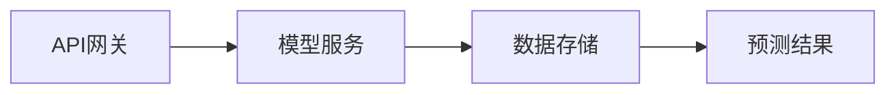

                 


# 企业级AI模型的集成与部署策略

> 关键词：企业级AI模型、模型集成、模型部署、系统架构、机器学习、深度学习

> 摘要：随着人工智能技术的快速发展，企业级AI模型的集成与部署成为企业智能化转型的关键环节。本文从企业级AI模型的背景、核心概念、算法原理、系统架构设计、项目实战等多个方面展开，详细阐述了企业在集成与部署AI模型过程中面临的挑战与解决方案，为企业提供实用的技术指导。

---

# 第一部分: 企业级AI模型的集成与部署背景

## 第1章: 企业级AI模型集成与部署概述

### 1.1 企业级AI模型的背景与意义

#### 1.1.1 人工智能技术的演进历程
人工智能技术经历了从规则驱动到数据驱动的转变，从简单的专家系统到如今的深度学习模型，AI技术在各个领域的应用越来越广泛。

#### 1.1.2 企业级AI模型的核心价值
企业级AI模型能够帮助企业实现业务流程的自动化、智能化，提升决策效率和准确性，降低运营成本。

#### 1.1.3 当前AI模型集成与部署的挑战
企业在集成与部署AI模型时面临技术复杂性高、模型可解释性差、资源消耗大等问题。

### 1.2 企业级AI模型的定义与特点

#### 1.2.1 企业级AI模型的定义
企业级AI模型是指能够在企业环境中独立或协同其他系统运行，解决特定业务问题的AI模型。

#### 1.2.2 企业级AI模型的关键特点
- 高可用性：能够长时间稳定运行。
- 可扩展性：能够处理大规模数据和请求。
- 可解释性：模型的决策过程可被理解和解释。

#### 1.2.3 企业级AI模型与传统AI模型的对比
| 特性             | 企业级AI模型           | 传统AI模型         |
|------------------|-----------------------|-------------------|
| 运行环境         | 企业内部系统           | 离线或小规模环境     |
| 数据规模         | 大规模                 | 小规模             |
| 可用性要求       | 高                     | 低                 |
| 可解释性         | 高                     | 低                 |

### 1.3 企业级AI模型的应用场景

#### 1.3.1 企业级AI模型的主要应用场景
- 智能客服：通过自然语言处理技术提供自动化服务。
- 风险控制：利用机器学习模型进行信用评估和 fraud detection。

#### 1.3.2 不同行业中的应用案例
- 金融行业：AI模型用于股票预测、客户画像。
- 零售行业：AI模型用于库存管理、个性化推荐。

#### 1.3.3 企业级AI模型的未来发展趋势
随着云计算和边缘计算的发展，企业级AI模型将更加注重实时性、可扩展性和安全性。

### 1.4 本章小结
本章介绍了企业级AI模型的背景、定义、特点及其应用场景，为后续内容奠定了基础。

---

## 第2章: AI模型集成的核心概念与方法

### 2.1 AI模型集成的基本原理

#### 2.1.1 模型集成的定义
模型集成是指将多个独立的模型组合起来，形成一个更强大的预测系统。

#### 2.1.2 模型集成的主要方法
- Bagging：通过 bootstrap 抽样生成多个基模型。
- Boosting：通过加权投票的方式，逐步提升模型性能。
- Stacking：将多个基模型的输出作为元模型的输入。

#### 2.1.3 模型集成的优势与劣势
- 优势：提高模型的准确性和稳定性。
- 劣势：计算开销大，模型复杂性增加。

### 2.2 常见的模型集成策略

#### 2.2.1 集成学习的基本框架
Mermaid图示：


#### 2.2.2 Bagging、Boosting、Stacking的原理与区别
- Bagging：通过数据抽样生成多个基模型，每个基模型独立训练。
- Boosting：通过加权训练，逐步关注难分类的样本。
- Stacking：将多个基模型的输出作为元模型的输入，通过训练元模型来提升整体性能。

### 2.3 企业级AI模型集成的关键技术

#### 2.3.1 模型选择与优化
- 模型选择：根据任务需求选择合适的算法。
- 模型优化：通过参数调优和特征选择提升模型性能。

#### 2.3.2 模型权重分配的策略
- 等权分配：每个模型的权重相同。
- 加权分配：根据模型性能分配权重。

#### 2.3.3 模型鲁棒性与可解释性的平衡
- 鲁棒性：模型在面对噪声和异常数据时的稳定性。
- 可解释性：模型决策过程的透明度。

### 2.4 模型集成的实现步骤

#### 2.4.1 数据预处理与特征选择
- 数据清洗：处理缺失值、异常值。
- 特征选择：选择对目标变量影响大的特征。

#### 2.4.2 模型训练与评估
- 训练基模型：使用不同算法训练多个模型。
- 评估模型性能：通过准确率、召回率等指标评估模型表现。

#### 2.4.3 模型集成与调优
- 集成模型：将多个基模型的输出进行融合。
- 调优参数：优化集成模型的参数，提升性能。

### 2.5 本章小结
本章详细介绍了模型集成的核心概念、方法和实现步骤，为企业级AI模型的集成提供了理论基础。

---

## 第3章: 企业级AI模型的部署策略

### 3.1 模型部署的基本架构

#### 3.1.1 模型部署的常见架构模式
- 单体架构：模型独立运行。
- 微服务架构：模型作为服务部署在微服务架构中。

#### 3.1.2 微服务架构在模型部署中的应用
- 服务化：将模型封装为可调用的服务。
- 负载均衡：通过负载均衡实现服务的高可用性。

#### 3.1.3 基于容器的部署方式
- Docker容器化：将模型及其依赖打包成容器。
- Kubernetes orchestration：使用Kubernetes进行容器编排。

### 3.2 模型部署的系统设计

#### 3.2.1 系统功能模块划分
- API网关：接收请求，路由到后端服务。
- 模型服务：负责模型的预测和结果返回。
- 数据存储：存储模型训练数据和预测结果。

#### 3.2.2 系统组件之间的关系
Mermaid图示：



#### 3.2.3 模型部署的流程
- 包括模型打包、镜像构建、服务部署、监控和维护。

### 3.3 模型部署的实现步骤

#### 3.3.1 环境准备
- 安装Docker和Kubernetes。

#### 3.3.2 模型打包
- 使用Dockerfile将模型打包成镜像。

#### 3.3.3 服务部署
- 使用Kubernetes部署模型服务，设置自动扩缩容。

#### 3.3.4 监控与维护
- 使用Prometheus监控服务状态，及时处理异常情况。

### 3.4 本章小结
本章详细介绍了模型部署的基本架构、系统设计和实现步骤，为企业级AI模型的部署提供了实践指导。

---

## 第4章: 项目实战

### 4.1 项目背景与目标
- 背景：某企业希望部署一个AI模型用于客户画像分析。
- 目标：集成多个模型，实现客户画像的精准预测。

### 4.2 环境安装
- 安装Python、Docker、Kubernetes。

### 4.3 核心代码实现

#### 4.3.1 模型训练
```python
# 训练基模型
import numpy as np
from sklearn.ensemble import RandomForestClassifier

# 数据预处理
X = np.array([[...], [...]])  # 特征数据
y = np.array([...])  # 标签

# 训练随机森林模型
model = RandomForestClassifier(n_estimators=100)
model.fit(X, y)
```

#### 4.3.2 模型集成
```python
# 集成多个基模型
from sklearn.ensemble import VotingClassifier

# 定义基模型
model1 = RandomForestClassifier()
model2 = SVC()

# 集成模型
ensemble_model = VotingClassifier(estimators=[('rf', model1), ('svc', model2)], voting='soft')
ensemble_model.fit(X, y)
```

#### 4.3.3 模型部署
```python
# 将模型打包成Docker镜像
FROM python:3.8
WORKDIR /app
COPY requirements.txt .
RUN pip install -r requirements.txt
COPY app.py .
CMD ["python", "app.py"]
```

### 4.4 项目小结
本章通过一个实际案例详细讲解了企业级AI模型的集成与部署过程，展示了理论在实践中的应用。

---

## 第5章: 最佳实践与注意事项

### 5.1 最佳实践
- 模型选择：根据任务需求选择合适的算法。
- 部署架构：选择适合的架构模式，如微服务架构。
- 监控维护：实时监控模型性能，及时优化和维护。

### 5.2 注意事项
- 数据安全：确保数据的保密性和完整性。
- 模型可解释性：提高模型的可解释性，便于问题排查。
- 性能优化：通过技术手段优化模型性能和部署效率。

### 5.3 拓展阅读
- 推荐阅读《企业级机器学习系统设计》、《深度学习实战》等书籍。

### 5.4 本章小结
本章总结了企业级AI模型集成与部署的最佳实践和注意事项，为读者提供了实用的建议。

---

## 作者信息

作者：AI天才研究院/AI Genius Institute & 禅与计算机程序设计艺术/Zen And The Art of Computer Programming

---

以上为完整的技术博客文章大纲，涵盖企业级AI模型的集成与部署策略的各个方面，内容详实，结构清晰。

