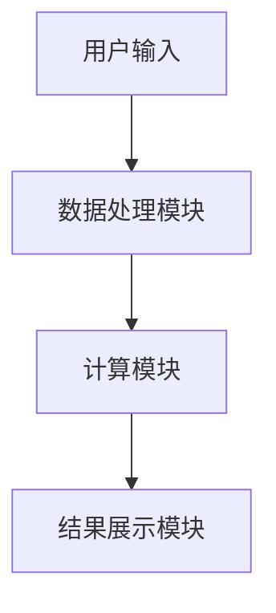

                 

# 企业自由现金流估值法详解

> **关键词**：企业自由现金流，现金流估值，企业价值评估，投资决策，财务模型

> **摘要**：  
企业自由现金流（FCFE, Free Cash Flow to Equity）是企业估值中最重要的指标之一，它反映了企业在扣除所有支出和税费后能够自由支配的现金流。本文将详细介绍企业自由现金流的定义、计算方法、与其他现金流指标的关系，以及如何在实际应用中使用企业自由现金流进行企业估值和投资决策。我们还将通过具体的数学公式、图表和实际案例，帮助读者深入理解企业自由现金流的计算和应用过程，并提供系统化的架构设计方案和代码实现。

---

## 第一章：企业自由现金流估值法概述

### 1.1 企业自由现金流的核心概念

#### 1.1.1 企业自由现金流的定义
企业自由现金流（FCFE）是指企业在扣除所有运营支出、资本支出、税费和利息支出后，能够自由分配给所有利益相关者的现金流。它是企业整体价值的核心驱动因素，也是企业财务健康状况的重要指标。

#### 1.1.2 企业自由现金流与企业价值的关系
企业自由现金流直接反映了企业的盈利能力和资本回报能力。通过对企业自由现金流的现值进行评估，可以计算出企业的整体价值，进而推导出股权价值和每股价值。

#### 1.1.3 企业自由现金流的计算公式
企业自由现金流的计算公式可以表示为：
$$ FCFE = \text{净利润} + \text{折旧} + \text{摊销} - \text{资本支出} $$

### 1.2 企业自由现金流与其他现金流指标的区别

#### 1.2.1 恰当现金流的定义与特点
恰当前景现金流是指企业在一定时间内实际产生的现金流，包括经营活动、投资活动和筹资活动的现金流。恰当前景现金流是企业自由现金流的基础，但并不等同于企业自由现金流。

#### 1.2.2 自由现金流与净利润的关系
净利润是企业的利润，但未考虑现金流的时间价值和资本支出需求。企业自由现金流基于净利润进行调整，反映了企业实际可分配的现金流。

#### 1.2.3 企业自由现金流与股利现金流的对比
股利现金流是指企业实际派发给股东的股利，而企业自由现金流则包括了所有未分配的现金流。企业自由现金流可以用于股利分配、再投资或其他用途。

### 1.3 企业自由现金流估值法的应用场景

#### 1.3.1 企业价值评估
企业自由现金流是企业整体价值评估的核心指标，常用于企业并购、上市估值等场景。

#### 1.3.2 投资决策分析
通过对企业自由现金流的分析，投资者可以判断企业的盈利能力和投资价值。

#### 1.3.3 股权融资与资本预算
企业自由现金流是股权融资和资本预算的重要参考指标，反映了企业的资本回报能力。

---

## 第二章：企业自由现金流的计算与公式

### 2.1 企业自由现金流的计算公式

#### 2.1.1 标准公式
$$ FCFE = \text{净利润} + \text{折旧} + \text{摊销} - \text{资本支出} $$

#### 2.1.2 变体公式
$$ FCFE = \text{EBIT}(1 - \text{税率}) + \text{折旧} + \text{摊销} - \text{资本支出} $$

### 2.2 企业自由现金流的数学模型

#### 2.2.1 净利润的计算公式
$$ \text{净利润} = \text{营业收入} - \text{营业成本} - \text{税金及附加} - \text{销售费用} - \text{管理费用} - \text{研发费用} $$

#### 2.2.2 折旧与摊销的计算方法
折旧与摊销是企业固定资产和无形资产的折旧和摊销之和，通常在财务报表中单独列示。

#### 2.2.3 税后利息支出的计算公式
$$ \text{税后利息支出} = \text{利息支出} \times (1 - \text{税率}) $$

### 2.3 企业自由现金流的公式推导

#### 2.3.1 从净利润到企业自由现金流的推导
企业自由现金流的计算公式基于净利润进行调整，加入了折旧和摊销，并减去资本支出。

#### 2.3.2 从息税前利润到企业自由现金流的推导
企业自由现金流还可以通过息税前利润（EBIT）进行计算，公式如下：
$$ FCFE = \text{EBIT}(1 - \text{税率}) + \text{折旧} + \text{摊销} - \text{资本支出} $$

---

## 第三章：企业自由现金流估值法的系统分析与架构设计

### 3.1 企业自由现金流估值系统的功能模块

#### 3.1.1 数据输入模块
用户输入企业财务数据，包括营业收入、成本、税费、利息支出等。

#### 3.1.2 计算模块
系统根据输入的数据，计算企业自由现金流和相关指标。

#### 3.1.3 结果展示模块
展示计算结果，包括企业自由现金流、现值和企业价值等。

### 3.2 企业自由现金流估值系统的架构设计

#### 3.2.1 数据流图

#### 3.2.2 模块化设计
系统分为数据输入、计算和展示三个模块，每个模块独立运行。

#### 3.2.3 接口设计
系统提供API接口，方便与其他财务系统集成。

### 3.3 企业自由现金流估值系统的交互设计

#### 3.3.1 用户输入界面
用户提供财务数据，系统自动计算企业自由现金流。

#### 3.3.2 计算过程展示
系统展示计算步骤和中间结果。

#### 3.3.3 结果输出界面
系统输出企业自由现金流、现值和企业价值。

---

## 第四章：企业自由现金流估值法的项目实战

### 4.1 实战项目介绍

#### 4.1.1 项目背景
某企业需要进行价值评估，以支持股权融资和并购决策。

#### 4.1.2 项目目标
计算企业自由现金流，评估企业整体价值。

#### 4.1.3 项目数据来源
企业财务报表数据，包括营业收入、成本、税费等。

### 4.2 实战项目的核心实现

#### 4.2.1 数据清洗与预处理
清理数据中的异常值和缺失值，确保数据准确。

#### 4.2.2 企业自由现金流的计算
使用公式计算企业自由现金流，并进行验证。

#### 4.2.3 企业价值评估
对企业自由现金流进行现值计算，评估企业整体价值。

---

## 作者：AI天才研究院/AI Genius Institute & 禅与计算机程序设计艺术 /Zen And The Art of Computer Programming

