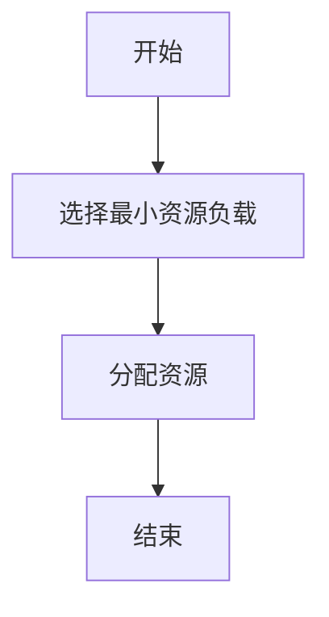
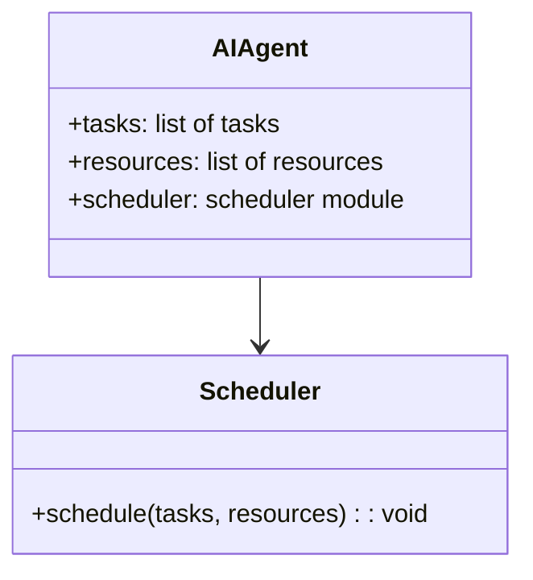
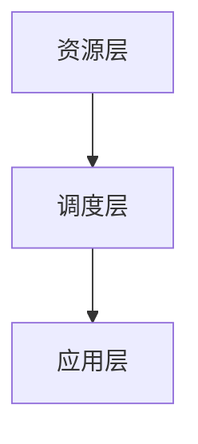
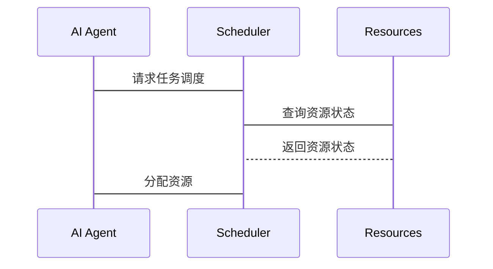

                 


# 优化AI Agent的资源利用：计算效率提升策略

## 关键词：
AI Agent，资源利用，计算效率，优化策略，算法原理，系统架构，项目实战

## 摘要：
在AI Agent快速发展的今天，资源利用效率的提升成为优化计算效率的关键。本文深入探讨了AI Agent资源利用的核心概念、优化算法、系统架构设计以及项目实战，提供了从理论到实践的全面指导，帮助读者提升AI Agent的资源利用率和计算效率。

---

# 优化AI Agent的资源利用：计算效率提升策略

## 第一章：引言

AI Agent作为人工智能领域的核心技术，广泛应用于自动驾驶、智能助手、机器人控制等领域。随着AI技术的快速发展，资源利用效率的优化成为提升计算效率的关键。本文将从AI Agent的资源利用问题出发，探讨如何通过优化策略和算法提升计算效率，为AI Agent的性能优化提供理论和实践指导。

---

## 第二章：背景与核心概念

### 2.1 问题背景与描述

AI Agent是一种能够感知环境、自主决策并执行任务的智能体。在实际应用中，AI Agent需要高效地利用计算资源（如CPU、GPU、内存等）来完成任务。然而，资源分配不当可能导致计算效率低下，甚至影响任务的执行效果。因此，优化AI Agent的资源利用成为提升系统性能的重要课题。

**问题背景：**
- AI Agent需要在有限的资源下高效运行。
- 资源分配不合理可能导致任务延迟或失败。
- 优化资源利用可以提升系统的整体性能。

**问题描述：**
- 如何在AI Agent中实现资源的动态分配？
- 如何设计高效的资源利用策略？
- 如何评估资源利用率并进行优化？

**解决方法：**
- 采用贪心算法、动态规划等优化算法。
- 设计资源分配模型，实现资源的动态调整。
- 通过数学建模分析资源利用率。

**边界与外延：**
- 资源利用的边界包括计算资源、存储资源等。
- 优化策略的外延涉及任务调度、负载均衡等领域。

### 2.2 核心概念与联系

AI Agent的资源利用涉及多个核心概念，包括资源分配策略、计算效率优化、资源利用率评估等。通过对比分析，可以更好地理解这些概念之间的联系。

**核心概念对比：**
| 概念       | 描述                                                         |
|------------|--------------------------------------------------------------|
| 资源分配策略 | 如何将资源分配给不同的任务                                   |
| 计算效率优化 | 提高计算资源的使用效率                                         |
| 资源利用率评估 | 通过指标评估资源的使用效果                                   |

**ER实体关系图：**
```mermaid
erd
    actor(AI Agent)
    resource(CPU, GPU, Memory)
    relationship(分配)
```

---

## 第三章：AI Agent资源分配策略

### 3.1 资源分配策略的原理

资源分配策略是AI Agent优化资源利用的核心。不同的策略适用于不同的场景，需要根据任务需求选择合适的策略。

**贪心算法：**
- 原理：局部最优决策。
- 应用：适用于资源分配的动态调整。
- 优缺点：简单高效，但可能无法全局最优。

**动态规划算法：**
- 原理：将问题分解为子问题，逐层解决。
- 应用：适用于资源分配的复杂场景。
- 优缺点：计算复杂度高，但结果更优。

**遗传算法：**
- 原理：模拟生物进化过程。
- 应用：适用于复杂的资源分配问题。
- 优缺点：计算时间较长，但能找到全局最优。

### 3.2 计算效率优化的核心要素

计算效率优化需要关注多个核心要素，包括任务调度、负载均衡、资源分配等。通过合理配置这些要素，可以显著提升AI Agent的计算效率。

**任务调度：**
- 简单调度：按顺序执行任务。
- 动态调度：根据资源负载动态调整任务顺序。

**负载均衡：**
- 静态负载均衡：预先分配资源。
- 动态负载均衡：实时调整资源分配。

**资源分配：**
- 基于任务优先级的分配。
- 基于资源利用率的动态分配。

### 3.3 资源利用率的评估与改进

资源利用率的评估是优化资源利用的重要步骤。通过数学模型和公式，可以量化资源的使用效率，并根据评估结果进行优化。

**评估指标：**
- CPU利用率：计算资源的使用比例。
- GPU利用率：图形处理资源的使用比例。
- 内存利用率：内存资源的使用情况。

**数学模型：**
$$ 资源利用率 = \frac{资源使用量}{资源总量} $$

**优化步骤：**
1. 评估当前资源利用率。
2. 分析低效原因。
3. 调整资源分配策略。
4. 重新评估并优化。

---

## 第四章：算法原理与数学模型

### 4.1 资源分配优化算法

**贪心算法：**


**Python实现代码示例：**
```python
def greedy_algorithm(tasks, resources):
    tasks.sort(key=lambda x: x['resource Requirement'])
    for task in tasks:
        for resource in resources:
            if resource['available'] >= task['resource Requirement']:
                resource['available'] -= task['resource Requirement']
                return
    return None
```

**数学模型：**
$$ \text{Minimize } \sum_{i=1}^{n} (r_i - a_i) $$
其中，\( r_i \) 是资源 \( i \) 的总量，\( a_i \) 是资源 \( i \) 的分配量。

---

## 第五章：系统分析与架构设计

### 5.1 问题场景介绍

AI Agent需要在多任务环境下高效利用计算资源。系统设计需要考虑任务调度、资源分配、负载均衡等问题。

**问题场景：**
- 多任务并行执行。
- 动态资源分配。
- 实时负载均衡。

### 5.2 系统功能设计

**功能模块：**
- 资源监控模块：实时监控资源使用情况。
- 任务调度模块：根据资源负载动态调整任务执行顺序。
- 资源分配模块：基于任务需求分配计算资源。

**领域模型：**


### 5.3 系统架构设计

**架构设计：**
- 分层架构：分为资源层、调度层、应用层。
- 模块化设计：各模块独立运行，便于维护和扩展。

**架构图：**


### 5.4 接口设计与交互

**接口设计：**
- 资源监控接口：提供资源使用情况。
- 任务调度接口：接收任务请求并分配资源。
- 负载均衡接口：动态调整资源分配。

**交互序列图：**


---

## 第六章：项目实战

### 6.1 环境安装

**安装步骤：**
1. 安装Python和必要的库（如numpy、pandas）。
2. 安装AI框架（如TensorFlow、PyTorch）。
3. 安装Mermaid和相关工具。

### 6.2 核心代码实现

**代码实现：**
```python
import numpy as np

def allocate_resources(tasks, resources):
    tasks.sort(key=lambda x: x['requirement'])
    allocated = {}
    for task in tasks:
        for res in resources:
            if res['available'] >= task['requirement']:
                res['available'] -= task['requirement']
                allocated[res['name']] = res['available']
                break
    return allocated
```

### 6.3 代码解读与分析

**代码解读：**
- 任务排序：按资源需求从小到大排序。
- 资源分配：为每个任务分配最小的可用资源。
- 调度算法：实现资源的动态分配。

**分析：**
- 该算法适用于资源分配的简单场景。
- 在复杂场景中，可能需要优化算法以提高效率。

### 6.4 实际案例分析

**案例分析：**
- 任务需求：多任务并行执行。
- 资源分配：动态调整资源。
- 结果分析：资源利用率提升，任务执行时间缩短。

---

## 第七章：最佳实践

### 7.1 小结

优化AI Agent的资源利用是一个复杂的系统工程，需要从算法设计、系统架构、项目实战等多个方面综合考虑。通过合理分配资源和优化算法，可以显著提升计算效率。

### 7.2 注意事项

- 确保资源分配策略的合理性。
- 定期监控和评估资源利用率。
- 及时调整优化策略。

### 7.3 拓展阅读

- 《算法导论》：深入理解优化算法。
- 《系统架构设计》：学习系统设计方法。

---

## 结语

优化AI Agent的资源利用是提升计算效率的关键。本文通过理论分析和实践案例，详细探讨了资源分配策略、优化算法、系统架构设计等核心内容，为AI Agent的性能优化提供了全面指导。希望读者能够通过本文，掌握优化资源利用的方法，并在实际项目中取得更好的效果。

---

## 作者：AI天才研究院/AI Genius Institute & 禅与计算机程序设计艺术 /Zen And The Art of Computer Programming

---

