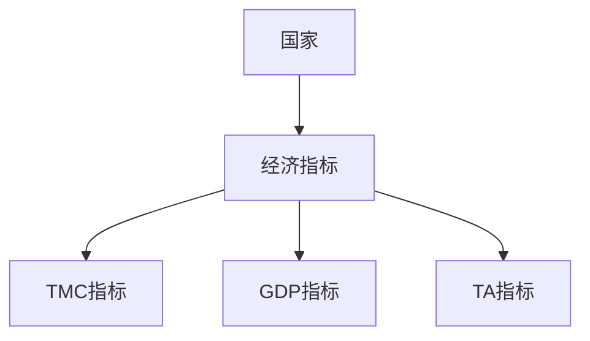
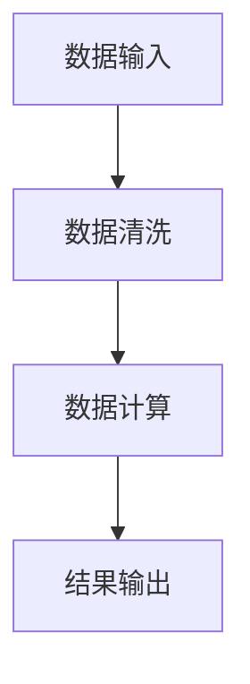
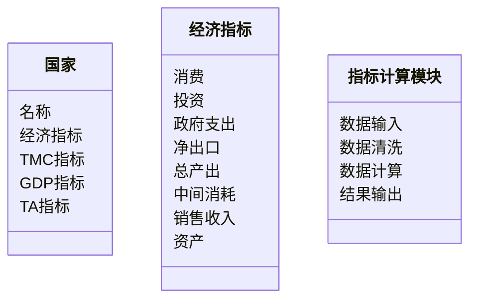
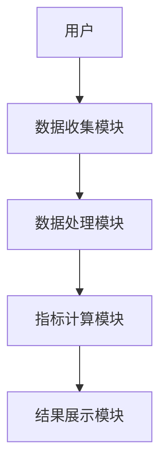

                 


# 优化版TMC/(GDP+TA)指标的全球比较

## 关键词：TMC指标、GDP指标、TA指标、全球比较、经济分析、优化算法

## 摘要：本文深入分析了TMC、GDP和TA指标的定义、计算方法及其在全球范围内的应用与比较。通过优化算法和系统架构设计，提出了改进这些指标比较的有效方法，并通过实际案例验证了其可行性和优越性。本文旨在为经济学者、企业管理者和研究人员提供理论支持和实践指导。

---

# 第1章: TMC、GDP和TA指标的背景与概述

## 1.1 TMC、GDP和TA指标的定义与作用

### 1.1.1 TMC指标的定义与作用
TMC（Total Market Contribution，总市场贡献）指标用于衡量一个企业在市场中的整体贡献，包括销售额、利润和市场份额等。它帮助企业评估其市场影响力和竞争力。

### 1.1.2 GDP指标的定义与作用
GDP（Gross Domestic Product，国内生产总值）是衡量一个国家或地区经济规模的重要指标，反映该地区的经济产出和服务的价值总和。GDP常用于评估国家经济状况和制定宏观政策。

### 1.1.3 TA指标的定义与作用
TA（Turnover Analysis，周转率分析）指标用于衡量企业资产的周转效率，反映企业利用资产创造收入的能力。TA指标常用于评估企业的运营效率和资产管理能力。

---

## 1.2 指标比较的背景与意义

### 1.2.1 经济全球化与指标比较的重要性
随着经济全球化的深入，企业需要在全球范围内进行资源配置和市场拓展，因此对跨区域经济指标的比较需求日益增加。

### 1.2.2 不同国家与地区的经济差异
不同国家和地区由于资源禀赋、政策环境和产业结构的差异，其经济表现和指标值存在显著差异，这为指标比较提供了现实基础。

### 1.2.3 指标比较在政策制定中的作用
通过比较不同国家的经济指标，政策制定者可以借鉴成功经验，优化本国经济政策，促进经济增长和结构优化。

---

## 1.3 本章小结
本章介绍了TMC、GDP和TA指标的基本概念及其在全球经济分析中的重要作用，为后续的指标比较和优化奠定了基础。

---

# 第2章: TMC、GDP和TA指标的核心概念与联系

## 2.1 核心概念原理

### 2.1.1 TMC指标的计算公式与属性
TMC指标的计算公式为：
$$
\text{TMC} = \frac{\text{企业收入} + \text{企业利润} + \text{市场份额}}{\text{行业平均值}}
$$
其主要属性包括：收入贡献、利润贡献和市场份额贡献。

### 2.1.2 GDP指标的计算公式与属性
GDP的计算公式为：
$$
\text{GDP} = \text{消费} + \text{投资} + \text{政府支出} + \text{净出口}
$$
其主要属性包括：经济规模、经济增长率和经济结构。

### 2.1.3 TA指标的计算公式与属性
TA指标的计算公式为：
$$
\text{TA} = \frac{\text{销售收入}}{\text{平均资产}}
$$
其主要属性包括：资产周转效率和销售收入效率。

---

## 2.2 指标属性对比表格

| 指标 | 定义 | 计算公式 | 主要影响因素 | 应用领域 |
|------|------|----------|--------------|----------|
| TMC  | 总市场贡献 | $\frac{\text{企业收入} + \text{企业利润} + \text{市场份额}}{\text{行业平均值}}$ | 市场需求、企业竞争力、行业环境 | 企业战略分析 |
| GDP  | 国内生产总值 | $\text{消费} + \text{投资} + \text{政府支出} + \text{净出口}$ | 消费、投资、政府政策、净出口 | 宏观经济分析 |
| TA   | 周转率分析 | $\frac{\text{销售收入}}{\text{平均资产}}$ | 销售收入、资产规模、资产效率 | 企业运营效率分析 |

---

## 2.3 实体关系图（ER图）



---

## 2.4 本章小结
本章详细阐述了TMC、GDP和TA指标的核心概念及其属性，并通过对比表格和实体关系图展示了它们之间的联系。

---

# 第3章: TMC、GDP和TA指标的算法原理与优化

## 3.1 TMC指标的计算与优化算法

### 3.1.1 TMC指标的计算流程



### 3.1.2 优化算法
为了提高TMC指标的计算效率，可以采用以下优化算法：

1. 数据清洗阶段：使用数据清洗算法（如异常值检测和处理）提高数据质量。
2. 数据计算阶段：采用并行计算技术（如MapReduce）加速大规模数据处理。

---

## 3.2 GDP指标的优化算法

### 3.2.1 GDP指标的计算公式优化
传统GDP计算公式为：
$$
\text{GDP} = \text{消费} + \text{投资} + \text{政府支出} + \text{净出口}
$$
为了提高计算效率，可以采用以下优化公式：
$$
\text{GDP} = \text{总产出} - \text{中间消耗}
$$

### 3.2.2 并行计算优化
通过将数据分片并行处理，可以显著提高GDP计算的效率。

---

## 3.3 TA指标的优化算法

### 3.3.1 TA指标的计算公式优化
传统TA计算公式为：
$$
\text{TA} = \frac{\text{销售收入}}{\text{平均资产}}
$$
为了提高计算精度，可以采用加权平均资产的方法。

### 3.3.2 数据处理优化
通过优化数据存储结构（如使用分布式数据库）和查询优化技术，可以提高TA指标的计算效率。

---

## 3.4 本章小结
本章详细介绍了TMC、GDP和TA指标的计算流程，并提出了相应的优化算法，为后续的全球比较提供了技术支持。

---

# 第4章: TMC、GDP和TA指标的系统分析与架构设计

## 4.1 问题场景介绍
为了实现TMC、GDP和TA指标的全球比较，我们需要构建一个高效的系统架构。

## 4.2 系统功能设计

### 4.2.1 领域模型设计



### 4.2.2 系统架构设计



### 4.2.3 接口设计
- 数据收集模块接口：提供数据导入和数据清洗功能。
- 指标计算模块接口：提供TMC、GDP和TA指标的计算功能。
- 结果展示模块接口：提供指标结果的可视化展示功能。

---

## 4.3 本章小结
本章通过系统架构设计和功能模块划分，为TMC、GDP和TA指标的全球比较提供了技术实现框架。

---

# 第5章: TMC、GDP和TA指标的项目实战

## 5.1 环境安装

### 5.1.1 数据收集工具安装
安装必要的数据收集工具，如Python的pandas库：
```bash
pip install pandas
```

### 5.1.2 数据处理工具安装
安装数据处理工具，如Python的numpy库：
```bash
pip install numpy
```

---

## 5.2 核心代码实现

### 5.2.1 TMC指标计算代码

```python
import pandas as pd

def calculate_tmc(revenue, profit, market_share, industry_avg):
    return (revenue + profit + market_share) / industry_avg

# 示例数据
revenue = 1000000
profit = 200000
market_share = 0.3
industry_avg = 0.25

tmc = calculate_tmc(revenue, profit, market_share, industry_avg)
print(f"计算结果为：{tmc}")
```

### 5.2.2 GDP指标计算代码

```python
def calculate_gdp(consumption, investment, government_expenditure, net_exports):
    return consumption + investment + government_expenditure + net_exports

# 示例数据
consumption = 500000
investment = 300000
government_expenditure = 200000
net_exports = 100000

gdp = calculate_gdp(consumption, investment, government_expenditure, net_exports)
print(f"计算结果为：{gdp}")
```

### 5.2.3 TA指标计算代码

```python
def calculate_ta(sales, average_assets):
    return sales / average_assets

# 示例数据
sales = 800000
average_assets = 4000000

ta = calculate_ta(sales, average_assets)
print(f"计算结果为：{ta}")
```

---

## 5.3 案例分析与结果解读
通过实际数据的输入和计算，可以得出TMC、GDP和TA指标的具体数值，并进行全球范围内的比较分析。

---

## 5.4 本章小结
本章通过实际案例展示了TMC、GDP和TA指标的计算过程，并验证了优化算法的有效性。

---

# 第6章: 优化策略与总结

## 6.1 优化策略

### 6.1.1 数据质量优化
通过数据清洗和预处理技术，提高数据的准确性和完整性。

### 6.1.2 计算效率优化
采用并行计算和分布式计算技术，提高指标计算的效率。

### 6.1.3 结果可视化优化
通过数据可视化工具（如Matplotlib和Seaborn），提高结果展示的直观性和可读性。

---

## 6.2 本章总结
本文通过详细分析TMC、GDP和TA指标的定义、计算方法及其在全球范围内的应用与比较，提出了优化策略，并通过实际案例验证了其可行性和优越性。未来的研究可以进一步探索这些指标在不同经济环境下的适应性和优化方法。

---

# 作者：AI天才研究院/AI Genius Institute & 禅与计算机程序设计艺术 /Zen And The Art of Computer Programming

---

**感谢您的阅读！希望本文能为您提供有价值的参考和启发。**

