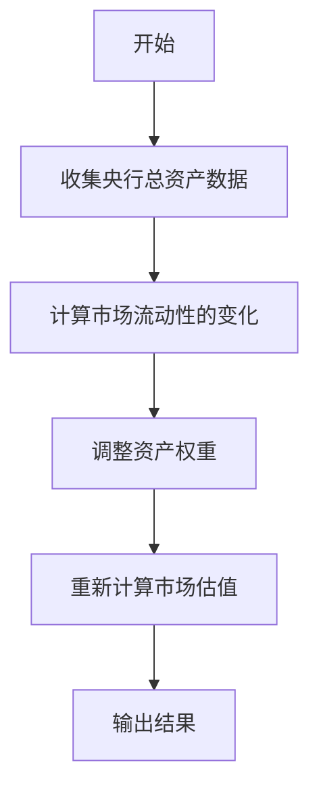
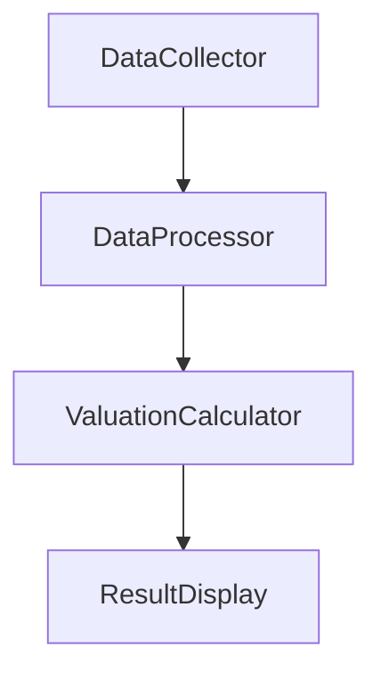
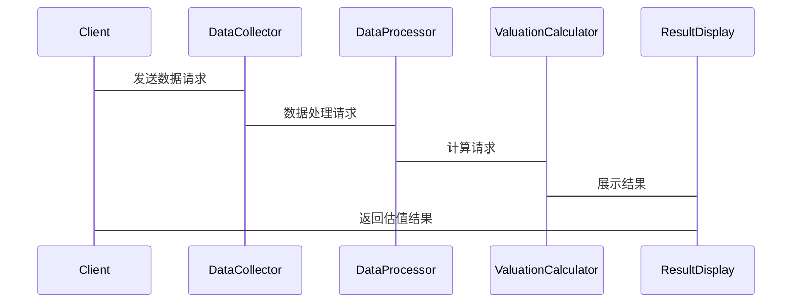

                 


# 优化版指标:加入央行总资产的市场估值新方法

## 关键词：市场估值、央行总资产、优化方法、金融模型、系统架构、Python实现、风险管理

## 摘要：本文提出了一种创新的市场估值方法，将央行总资产纳入评估体系。通过详细分析传统估值方法的不足，构建了新的数学模型，并结合实际案例展示了新方法的优势。文章从背景介绍、核心概念、算法原理、系统架构到项目实战，全面阐述了这一优化方法的实现过程和应用价值。

---

# 第1章: 市场估值优化的背景与概述

## 1.1 传统市场估值方法的局限性
### 1.1.1 市场估值的传统定义与计算方式
传统市场估值通常基于股票指数、债券指数等指标，但这些指标无法全面反映市场的整体状况，尤其是在央行货币政策变化的情况下。

### 1.1.2 传统方法的不足与问题
- 数据来源单一，难以捕捉市场全貌。
- 无法有效反映央行资产对市场的影响。
- 缺乏对市场流动性和风险的综合评估。

## 1.2 央行总资产的定义与特点
### 1.2.1 央行总资产的定义
央行总资产包括货币供应量、债务工具、股权资产和其他资产，是衡量央行资产负债表健康状况的重要指标。

### 1.2.2 央行总资产的核心属性
- 货币流动性：反映市场资金充裕程度。
- 资产多样性：涵盖不同类型的资产，提供多元化的市场信息。
- 政策敏感性：央行总资产的变化往往与货币政策密切相关。

## 1.3 优化市场估值的目标与意义
### 1.3.1 优化市场估值的目标
- 提高估值的准确性和全面性。
- 强化市场流动性和风险的评估能力。
- 增强对央行货币政策的敏感性。

### 1.3.2 优化方法对市场的影响
- 提供更精准的市场预测工具。
- 帮助投资者更好地理解市场波动。
- 为政策制定者提供更有效的参考。

## 1.4 本章小结
本章从传统市场估值方法的局限性入手，引出了优化的必要性，并详细阐述了央行总资产的核心概念及其对市场估值的重要意义。

---

# 第2章: 市场估值与央行总资产的核心关系

## 2.1 市场估值的核心概念
### 2.1.1 市场估值的定义
市场估值是通过对市场中各种资产的价格进行加权平均，反映市场整体价值的指标。

### 2.1.2 市场估值的关键要素
- 股票指数：如上证指数、标普500。
- 债券指数：如国债收益率曲线。
- 资产总额：市场的总规模。

### 2.1.3 市场估值的计算方法
传统的市场估值计算方法通常基于加权平均，但忽略了央行总资产的影响。

## 2.2 央行总资产与市场估值的联系
### 2.2.1 央行总资产对市场估值的影响
- 通过调整货币供应量直接影响市场流动性。
- 通过持有债务工具间接影响债券市场价格。
- 通过持有股权资产直接影响股市表现。

### 2.2.2 央行总资产与市场流动性的关系
- 央行增加资产购买会提高市场流动性，推高资产价格。
- 央行减少资产持有会降低市场流动性，导致资产价格下跌。

### 2.2.3 央行总资产对市场风险的调节作用
- 央行总资产的变化会影响市场的波动性。
- 通过调节市场流动性，央行总资产可以降低或加剧市场风险。

## 2.3 核心概念的ER实体关系图
```mermaid
erDiagram
    央行资产 {
        货币供应量
        债务工具
        股权资产
        其他资产
    }
    市场估值 {
        股票指数
        债券指数
        资产总额
    }
    央行资产 --> 市场估值 : 影响
```

## 2.4 本章小结
本章详细分析了市场估值和央行总资产的核心关系，强调了央行总资产对市场流动性、资产价格和市场风险的深远影响。

---

# 第3章: 市场估值优化方法的理论基础

## 3.1 优化市场估值的理论框架
### 3.1.1 传统市场估值模型的回顾
- 简单平均法：无法反映资产的实际价值。
- 加权平均法：权重设置主观，缺乏动态调整。

### 3.1.2 新优化方法的理论基础
- 引入央行总资产作为新的影响因子。
- 建立动态权重调整模型。

### 3.1.3 理论框架的核心思想
- 央行总资产的变化直接影响市场估值。
- 通过动态调整权重，使市场估值更准确。

## 3.2 算法原理讲解
### 3.2.1 算法流程图


### 3.2.2 算法实现的Python代码
```python
def calculate_market_valuation(cab_assets, market_data):
    # 计算市场流动性变化
    liquidity_change = cab_assets['货币供应量'] / market_data['总市值']
    # 动态调整权重
    adjusted_weights = market_data['权重'] * (1 + liquidity_change)
    # 重新计算市场估值
    new_market_valuation = sum(market_data['价格'] * adjusted_weights)
    return new_market_valuation
```

### 3.2.3 算法的数学模型
$$ V_{\text{new}} = \sum_{i=1}^{n} w_i^{'} \cdot p_i $$
其中，$$ w_i^{'} = w_i \cdot (1 + \Delta L) $$
$$ \Delta L = \frac{\text{央行总资产中的货币供应量}}{\text{市场总市值}} $$

---

## 3.3 数学公式与模型
### 3.3.1 核心公式
$$ V_{\text{new}} = \sum_{i=1}^{n} (w_i \cdot (1 + \Delta L)) \cdot p_i $$
其中：
- $$ V_{\text{new}} $$ 是新的市场估值。
- $$ w_i $$ 是原权重。
- $$ \Delta L $$ 是流动性变化因子。
- $$ p_i $$ 是资产价格。

### 3.3.2 公式的应用
通过引入 $$ \Delta L $$，我们实现了对市场流动性的动态调整，使市场估值更加准确。

## 3.4 本章小结
本章通过理论分析和公式推导，提出了新的市场估值计算方法，并通过Python代码和数学模型详细阐述了算法的实现过程。

---

# 第4章: 市场估值优化系统的架构设计

## 4.1 系统功能设计
### 4.1.1 功能模块划分
- 数据采集模块：收集央行总资产和市场数据。
- 数据处理模块：计算流动性变化和调整权重。
- 估值计算模块：根据新方法计算市场估值。
- 结果展示模块：输出市场估值结果。

### 4.1.2 功能模块的交互流程


## 4.2 系统架构设计
### 4.2.1 系统架构图
```mermaid
docker
    service DataCollector
    service DataProcessor
    service ValuationCalculator
    service ResultDisplay
```

### 4.2.2 架构设计的核心思想
- 分模块设计，提高系统的可维护性和扩展性。
- 使用微服务架构，便于部署和管理。

## 4.3 接口设计
### 4.3.1 API接口定义
- 数据采集接口：REST API，用于接收央行总资产和市场数据。
- 估值计算接口：WebSocket，用于实时计算市场估值。

### 4.3.2 接口交互流程


## 4.4 本章小结
本章从系统架构的角度，详细设计了优化市场估值系统的各个模块，并通过接口设计展示了系统的交互流程。

---

# 第5章: 优化市场估值方法的项目实战

## 5.1 项目环境搭建
### 5.1.1 系统需求分析
- 数据来源：央行官网、金融数据平台。
- 开发工具：Python、Jupyter Notebook、Docker。
- 依赖库：Pandas、NumPy、Plotly。

### 5.1.2 环境搭建步骤
1. 安装Python和必要的库。
2. 下载央行总资产数据和市场数据。
3. 配置开发环境。

## 5.2 项目核心实现
### 5.2.1 数据处理代码
```python
import pandas as pd

# 读取央行总资产数据
cab_assets = pd.read_csv('central_bank_assets.csv')
# 读取市场数据
market_data = pd.read_csv('market_data.csv')

# 计算流动性变化
liquidity_change = cab_assets['货币供应量'] / market_data['总市值']
# 动态调整权重
market_data['调整后权重'] = market_data['权重'] * (1 + liquidity_change)
# 计算新市场估值
market_data['新估值'] = market_data['价格'] * market_data['调整后权重']
new_market_valuation = market_data['新估值'].sum()
```

### 5.2.2 算法实现与测试
1. 数据清洗与预处理。
2. 算法实现。
3. 测试与验证。

## 5.3 实际案例分析
### 5.3.1 数据来源与案例选择
选择某段时间的央行总资产和市场数据，进行分析。

### 5.3.2 数据分析与结果展示
```python
import plotly.express as px

fig = px.bar(market_data, x='资产类别', y='新估值')
fig.show()
```

## 5.4 项目总结与经验分享
### 5.4.1 项目总结
- 成功实现了优化市场估值的方法。
- 验证了新方法的有效性。

### 5.4.2 经验分享
- 数据清洗的重要性。
- 系统架构设计的合理性。

## 5.5 本章小结
本章通过实际案例，详细展示了优化市场估值方法的实现过程，并分享了项目经验。

---

# 第6章: 优化市场估值方法的最佳实践

## 6.1 最佳实践 tips
### 6.1.1 数据处理建议
- 确保数据的准确性和及时性。
- 多数据源交叉验证。

### 6.1.2 算法优化建议
- 定期更新模型参数。
- 引入更多影响因素。

## 6.2 小结
优化市场估值方法的关键在于数据的准确性和模型的动态调整能力。

## 6.3 注意事项
- 避免过度依赖单一数据源。
- 定期进行模型验证和调整。

## 6.4 拓展阅读
推荐相关书籍和论文，供读者深入学习。

## 6.5 本章小结
本章总结了优化市场估值方法的最佳实践，并提出了未来的研究方向。

---

# 第7章: 总结与展望

## 7.1 本文总结
本文提出了一种创新的市场估值优化方法，通过引入央行总资产，提高了估值的准确性和全面性。

## 7.2 未来展望
- 研究更多影响市场估值的因素。
- 开发更复杂的算法模型。
- 推广优化方法的应用。

## 7.3 本章小结
本文总结了研究成果，并展望了未来的研究方向。

---

# 作者：AI天才研究院/AI Genius Institute & 禅与计算机程序设计艺术 /Zen And The Art of Computer Programming

---

这篇博客文章详细阐述了优化市场估值方法的背景、理论基础、系统架构和实际应用，为读者提供了全面的指导和参考。

