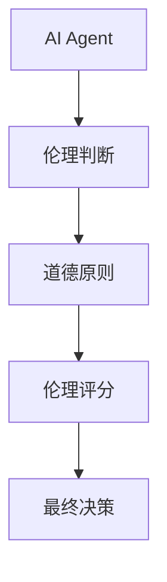
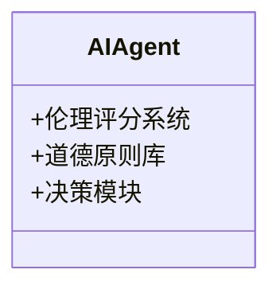
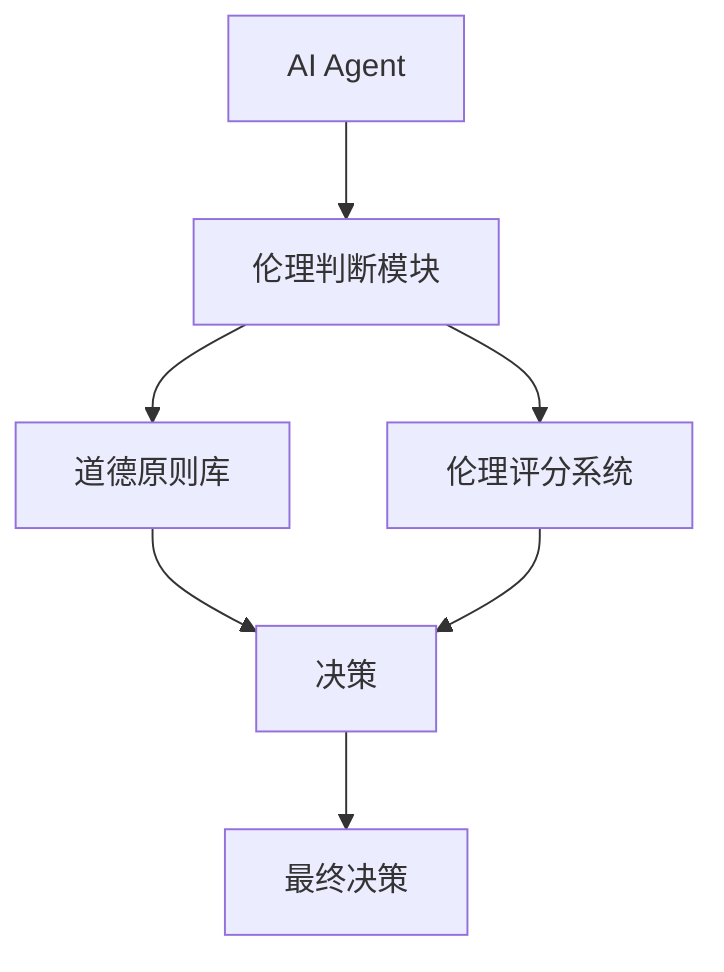
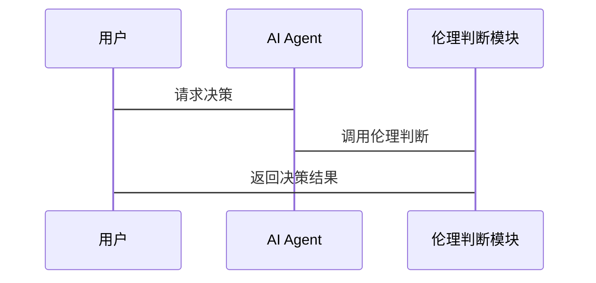

                 


# 伦理AI：设计符合道德标准的AI Agent

**关键词**：伦理AI、AI Agent、道德原则、伦理评分系统、价值敏感设计

**摘要**：  
本文深入探讨了如何设计符合道德标准的AI Agent，从伦理AI的背景、核心概念、算法原理到系统架构设计，再到实际项目实战，全面解析了伦理AI的实现路径。文章结合理论与实践，通过详细的数学公式、算法流程图和代码示例，帮助读者理解如何在AI系统中融入道德考量，确保AI Agent的行为符合伦理标准。文章最后还提供了最佳实践建议和未来研究方向。

---

# 第一部分: 伦理AI的背景与核心概念

## 第1章: 伦理AI的定义与问题背景

### 1.1 伦理AI的定义
#### 1.1.1 伦理AI的核心概念
伦理AI（Ethical AI）是指在设计和实现AI系统时，确保系统的行为符合人类社会的道德规范和价值观。AI Agent作为伦理AI的核心实体，需要在决策过程中考虑伦理因素，避免对人类社会造成负面影响。

#### 1.1.2 问题背景与问题描述
随着AI技术的快速发展，AI系统已经渗透到医疗、金融、交通、教育等领域。然而，AI系统的决策可能引发伦理问题，例如偏见、歧视、隐私侵犯等。这些问题不仅会影响用户体验，还可能引发法律和道德争议。

#### 1.1.3 伦理AI的目标与边界
伦理AI的目标是通过设计和实现符合道德标准的AI系统，确保AI Agent的行为在人类社会中被接受和信任。其边界包括但不限于：  
1. 避免对人类造成直接伤害。  
2. 保护用户隐私和数据安全。  
3. 避免算法偏见和不公平决策。  

### 1.2 伦理AI的必要性
#### 1.2.1 AI技术的快速发展与伦理挑战
AI技术的进步带来了巨大的社会价值，但也伴随着伦理问题。例如，自动驾驶汽车在紧急情况下如何做出决策？医疗AI系统如何在患者隐私和治疗效果之间权衡？这些问题需要通过伦理设计来解决。

#### 1.2.2 伦理问题对AI系统的影响
伦理问题可能影响AI系统的可信度和接受度。如果用户不信任AI系统，他们将不会使用这些系统，导致技术和商业上的失败。

#### 1.2.3 伦理AI的解决思路与方法
伦理AI的解决思路包括：  
1. 在系统设计阶段引入伦理考量。  
2. 使用伦理评分系统对AI行为进行评估。  
3. 通过价值敏感设计（Value Sensitive Design, VSD）确保系统符合人类价值观。

---

## 第2章: 伦理AI的核心概念与联系

### 2.1 伦理AI的核心原理
#### 2.1.1 道德原则与AI决策的关系
道德原则是伦理AI的核心，它们指导AI Agent的决策过程。例如，功利主义强调最大化整体利益，而义务论强调遵循明确的道德规则。

#### 2.1.2 伦理判断的逻辑框架
伦理判断的逻辑框架包括以下步骤：  
1. 确定问题场景。  
2. 分析可能的决策选项。  
3. 对每个选项进行伦理评分。  
4. 选择最优决策。

#### 2.1.3 伦理评分系统的工作原理
伦理评分系统通过量化方式评估AI行为的伦理风险。例如，$$伦理评分 = \alpha \times 目标影响 + \beta \times 伦理风险$$，其中$\alpha$和$\beta$是权重系数。

### 2.2 核心概念对比分析
#### 2.2.1 道德原则的属性特征对比
以下表格对比了几种主要道德原则的属性特征：

| 道德原则 | 理论基础 | 决策依据 | 适用场景 |
|----------|----------|----------|----------|
| 功利主义 | 整体利益最大化 | 预期结果 | 社会政策 |
| 义务论 | 道德规则 | 行为本身 | 医疗伦理 |
| 美德论 | 品德修养 | 内在动机 | 教育领域 |

#### 2.2.2 伦理AI与传统AI的对比
| 方面         | 伦理AI                 | 传统AI               |
|--------------|------------------------|----------------------|
| 设计目标     | 符合伦理标准            | 提高性能和效率        |
| 决策依据     | 道德原则和伦理评分       | 数据驱动和算法优化    |
| 应用范围     | 医疗、教育、自动驾驶等    | 数据分析、推荐系统等   |

#### 2.2.3 伦理AI与其他AI伦理框架的对比
| 框架         | 伦理AI                  | AI伦理框架（如IEEE）  |
|--------------|------------------------|----------------------|
| 核心目标     | 设计符合伦理的AI Agent  | 制定AI伦理规范        |
| 实现方式     | 算法嵌入伦理考量        | 制定伦理准则和标准    |
| 应用范围     | 具体AI系统设计          | 适用于所有AI系统      |

### 2.3 伦理AI的实体关系图


---

# 第二部分: 伦理AI的算法与数学模型

## 第3章: 伦理AI的算法原理

### 3.1 基于规则的伦理AI算法
#### 3.1.1 算法原理与流程
基于规则的伦理AI算法通过预定义的道德规则进行决策。例如，自动驾驶汽车可能遵循“避免伤害人类”的规则。

#### 3.1.2 代码实现示例
```python
def ethical_decision(rules, input):
    for rule in rules:
        if rule.matches(input):
            return rule.apply(input)
    return default_decision
```

### 3.2 基于效用的伦理AI算法
#### 3.2.1 算法原理与流程
基于效用的伦理AI算法通过计算不同决策的效用值进行排序，选择最优决策。

#### 3.2.2 代码实现示例
```python
def utility_based_decision(utilities, input):
    max_utility = max(utilities)
    for action, utility in utilities.items():
        if utility == max_utility:
            return action
    return default_decision
```

---

## 第4章: 伦理AI的数学模型

### 4.1 伦理评分系统
伦理评分系统通过量化方式评估AI行为的伦理风险。例如，$$伦理评分 = \alpha \times 目标影响 + \beta \times 伦理风险$$。

### 4.2 基于效用的伦理模型
基于效用的伦理模型通过最大化整体效用值来优化决策。例如，$$效用值 = \sum_{i=1}^{n} w_i \times f_i$$，其中$w_i$是权重，$f_i$是功能。

---

# 第三部分: 伦理AI的系统分析与架构设计

## 第5章: 系统分析与架构设计

### 5.1 系统功能设计
#### 5.1.1 领域模型


### 5.2 系统架构设计


### 5.3 系统接口设计
系统接口设计包括输入接口、输出接口和内部接口。例如，输入接口接收用户请求，输出接口返回决策结果。

### 5.4 系统交互流程


---

# 第四部分: 伦理AI的项目实战

## 第6章: 项目实战

### 6.1 环境配置
项目实战需要安装以下依赖：
- Python 3.8+
- Mermaid图生成工具
- 数据处理库（如Pandas）

### 6.2 核心实现
以下代码实现了一个简单的伦理评分系统：
```python
def calculate_ethical_score(action, weights):
    score = 0
    for i, (feature, weight) in enumerate(weights.items()):
        score += weight * getattr(action, feature)
    return score
```

### 6.3 功能解读
伦理评分系统通过计算每个决策的伦理得分，选择得分最高的决策作为最终结果。

### 6.4 案例分析
以自动驾驶汽车为例，系统需要在紧急情况下做出决策，例如选择碰撞行人还是自我牺牲。

---

## 第7章: 最佳实践与总结

### 7.1 最佳实践
- 在系统设计阶段引入伦理考量。  
- 定期更新伦理评分系统。  
- 通过用户反馈优化系统。

### 7.2 小结
伦理AI是AI技术发展的重要方向，通过本文的分析，读者可以理解如何在AI系统中融入伦理考量。

### 7.3 注意事项
- 避免算法偏见。  
- 保护用户隐私。  
- 定期审查伦理设计。

### 7.4 拓展阅读
- 《Value Sensitive Design for AI Systems》  
- 《Ethics in AI: Principles and Practices》

---

**作者**：AI天才研究院/AI Genius Institute & 禅与计算机程序设计艺术 /Zen And The Art of Computer Programming

