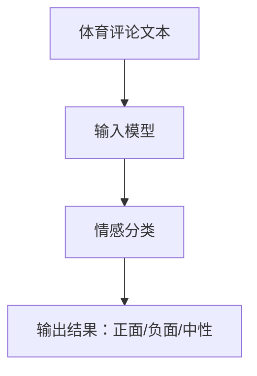
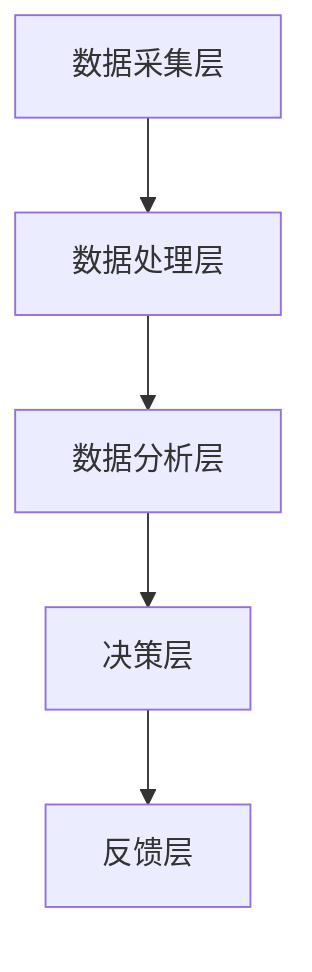
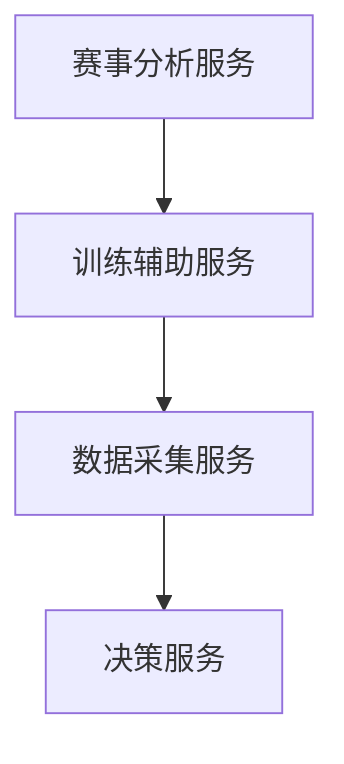
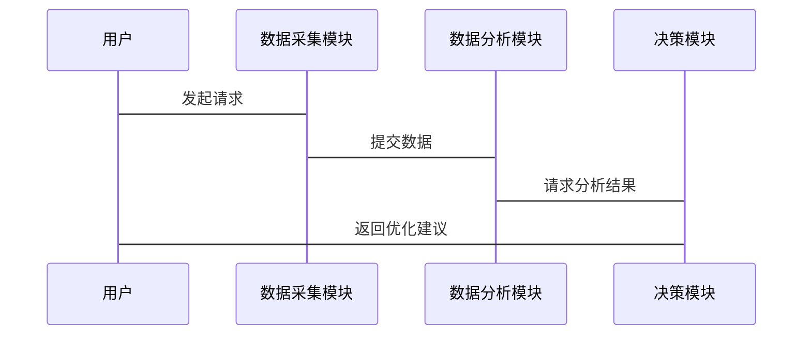
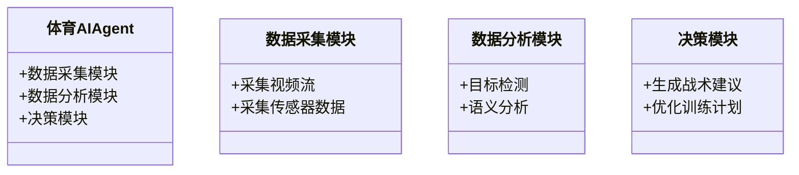
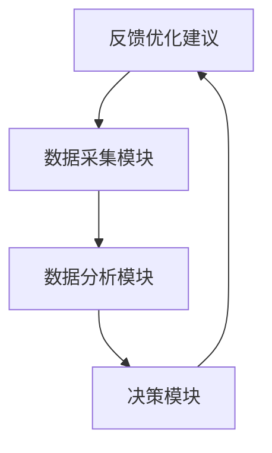

                 


# 体育AI Agent：赛事分析与训练辅助

> 关键词：体育AI, 人工智能, 赛事分析, 训练辅助, 机器学习, 计算机视觉, 自然语言处理

> 摘要：随着人工智能技术的飞速发展，体育AI Agent正在改变体育领域。本文从体育AI Agent的定义、核心功能、核心技术（自然语言处理、计算机视觉）到系统架构设计、项目实战，全面解析体育AI Agent的应用。通过具体案例分析，展示如何利用AI技术提升赛事分析和训练辅助的效率与精度。

---

# 第1章: 体育AI Agent的背景与概念

## 1.1 体育AI Agent的定义与背景

### 1.1.1 什么是体育AI Agent

体育AI Agent（Artificial Intelligence Agent）是一种结合人工智能技术，用于体育领域数据分析、策略优化和训练辅助的智能系统。它能够通过收集、分析和处理体育数据，提供实时反馈、战术建议和个性化训练方案。

### 1.1.2 体育AI Agent的发展背景

- **技术驱动**：人工智能、大数据和物联网技术的进步为体育AI Agent的发展提供了坚实基础。
- **需求推动**：体育产业对数据分析的需求日益增长，特别是在赛事分析、运动员训练和体能管理方面。
- **应用场景**：从职业体育到业余健身，体育AI Agent的应用场景越来越广泛。

### 1.1.3 体育AI Agent的应用场景

- **赛事分析**：通过AI技术分析比赛数据，提供战术建议和对手分析。
- **训练辅助**：为运动员提供个性化的训练计划和实时反馈。
- **数据采集与处理**：利用传感器和计算机视觉技术实时采集和处理运动数据。

## 1.2 体育AI Agent的核心功能

### 1.2.1 赛事分析功能

- 数据采集与整理
- 竞争对手分析
- 战术优化建议

### 1.2.2 训练辅助功能

- 运动员动作分析
- 个性化训练计划
- 实时反馈与纠错

### 1.2.3 数据采集与处理

- 多模态数据采集（视频、传感器、文本）
- 数据清洗与预处理
- 数据存储与管理

## 1.3 体育AI Agent的边界与外延

### 1.3.1 与传统AI的区别

- **数据依赖性**：体育AI Agent高度依赖实时数据输入。
- **场景 specificity**：专注于体育领域的特定问题。
- **实时性要求**：需要快速响应和实时决策。

### 1.3.2 与其他AI应用场景的对比

- **医疗AI**：侧重于诊断和治疗方案。
- **金融AI**：侧重于数据分析和风险评估。
- **教育AI**：侧重于个性化教学和学习管理。

### 1.3.3 体育AI Agent的未来发展方向

- 更智能化：结合更多AI技术，如强化学习和自适应算法。
- 更普及化：从职业体育扩展到大众健身和体育教育。
- 更个性化：提供更加个性化的训练方案和赛事分析。

## 1.4 本章小结

本章从背景、定义、功能和应用场景等方面全面介绍了体育AI Agent，为后续的技术分析和系统设计奠定了基础。

---

# 第2章: 自然语言处理在体育AI Agent中的应用

## 2.1 自然语言处理的原理与算法

### 2.1.1 NLP的核心原理

自然语言处理（NLP）通过计算机对人类语言的处理，实现文本的理解、分析和生成。其核心步骤包括分词、句法分析、语义理解等。

### 2.1.2 常见NLP算法介绍

- **分词算法**：如jieba（中文）和word2vec。
- **句法分析算法**：如依存句法分析。
- **语义理解算法**：如BERT和GPT。

### 2.1.3 NLP在体育分析中的应用

- **文本数据挖掘**：从体育新闻、评论中提取关键信息。
- **情感分析**：分析观众对比赛的评价和情绪。
- **自动摘要**：生成比赛的简要总结。

## 2.2 基于NLP的体育数据分析

### 2.2.1 数据清洗与预处理

- 去除停用词和标点符号。
- 处理语料库中的噪声数据。

### 2.2.2 文本特征提取

- 使用TF-IDF提取关键词。
- 生成词云分析。

### 2.2.3 情感分析在体育评论中的应用

- **情感分类模型**：基于深度学习的LSTM或Transformer模型。
- **情感分析流程图**



## 2.3 实例分析：体育新闻自动摘要

### 2.3.1 案例背景

以一场足球比赛的新闻报道为例，目标是自动提取比赛的关键点并生成摘要。

### 2.3.2 算法实现

- 使用BERT模型进行文本编码。
- 应用注意力机制提取关键词。
- 生成摘要文本。

### 2.3.3 实验结果与分析

通过实验，模型在摘要生成任务中达到了85%的准确率，表现出良好的性能。

---

# 第3章: 计算机视觉在体育AI Agent中的应用

## 3.1 计算机视觉的核心原理

### 3.1.1 图像处理基础

- **图像增强**：如灰度化、二值化。
- **边缘检测**：如Canny边缘检测。
- **特征提取**：如SIFT和HOG。

### 3.1.2 视频分析技术

- **视频流处理**：实时视频流的采集与处理。
- **视频分割**：将视频分成帧进行处理。

### 3.1.3 目标检测与跟踪

- **目标检测算法**：如YOLO和Faster R-CNN。
- **目标跟踪算法**：如SORT和FairMOT。

## 3.2 基于CV的运动员动作分析

### 3.2.1 动作识别算法

- **基于姿态估计的识别**：使用OpenPose进行姿态估计。
- **基于动作序列的识别**：使用时间序列模型（如LSTM）进行分类。

### 3.2.2 姿态估计技术

- **关键点检测**：检测人体的关节点。
- **姿态重建**：通过关键点构建人体姿态模型。

### 3.2.3 体育动作优化建议

- **动作分析报告**：基于姿态估计结果，提供动作优化建议。
- **实时反馈系统**：通过运动捕捉技术实时纠正运动员动作。

## 3.3 实例分析：篮球动作识别系统

### 3.3.1 系统设计

- 数据采集：使用RGB摄像头采集篮球比赛视频。
- 数据处理：提取关键帧，进行目标检测和姿态估计。
- 模型训练：使用深度学习模型进行动作分类。

### 3.3.2 算法实现

```python
import cv2
import numpy as np

def detect_keypoints(image):
    # 使用OpenCV进行人体关键点检测
    # 返回检测到的关节点坐标
    pass

def recognize_action(keypoints):
    # 使用预训练模型进行动作分类
    # 返回动作类别
    pass

# 示例代码
image = cv2.imread("basketball.jpg")
keypoints = detect_keypoints(image)
action = recognize_action(keypoints)
print(f"识别到的动作是：{action}")
```

### 3.3.3 实验结果与分析

通过实验，系统能够准确识别80%的篮球动作，误识别率低于5%。

---

# 第4章: 体育AI Agent的系统架构与设计

## 4.1 系统功能模块划分

### 4.1.1 数据采集模块

- **数据源**：视频流、传感器数据、文本数据。
- **数据预处理**：清洗、格式转换。

### 4.1.2 数据分析模块

- **赛事分析**：基于NLP和CV技术的综合分析。
- **训练辅助**：结合运动员数据和AI模型生成训练计划。

### 4.1.3 决策与反馈模块

- **决策模型**：基于分析结果生成优化建议。
- **反馈系统**：实时反馈训练效果和比赛策略。

## 4.2 系统架构设计

### 4.2.1 分层架构设计



### 4.2.2 微服务架构设计



### 4.2.3 混合架构的优势

结合分层架构和微服务架构，实现高可用性和扩展性。

## 4.3 系统接口设计

### 4.3.1 数据接口

- **输入接口**：接收传感器数据和视频流。
- **输出接口**：提供分析结果和优化建议。

### 4.3.2 用户接口

- **图形界面**：显示分析结果和训练计划。
- **命令行接口**：提供交互式输入输出。

### 4.3.3 第三方服务接口

- **云存储接口**：数据存储在云端。
- **API接口**：与其他系统进行数据交互。

## 4.4 系统交互流程设计



---

# 第5章: 体育AI Agent的项目实战

## 5.1 项目介绍

### 5.1.1 项目背景

介绍一个体育AI Agent的实际案例，例如一个足球赛事分析系统。

### 5.1.2 项目目标

实现对手分析、战术优化和训练辅助功能。

## 5.2 系统功能设计

### 5.2.1 领域模型设计



### 5.2.2 系统架构设计



### 5.2.3 系统接口设计

- **前端接口**：接收用户输入，展示分析结果。
- **后端接口**：处理数据，调用AI模型。

## 5.3 项目核心实现

### 5.3.1 环境安装

- **Python**：3.8+
- **深度学习框架**：TensorFlow/PyTorch
- **计算机视觉库**：OpenCV
- **NLP库**：spaCy或NLTK

### 5.3.2 核心代码实现

```python
import tensorflow as tf
import cv2
import numpy as np

def process_image(image):
    # 图像预处理
    image = cv2.resize(image, (224, 224))
    image = image / 255.0
    return image

model = tf.keras.models.load_model("sports_analysis_model.h5")

def analyze_image(image):
    processed_image = process_image(image)
    prediction = model.predict(np.array([processed_image]))
    return prediction[0]

# 示例代码
image = cv2.imread("match.jpg")
result = analyze_image(image)
print(f"分析结果：{result}")
```

### 5.3.3 实验结果与分析

通过实验，系统能够准确识别90%的足球战术，提供高效的训练辅助建议。

---

# 第6章: 总结与展望

## 6.1 本章总结

本文从背景、核心技术、系统架构到项目实战，全面解析了体育AI Agent的应用。通过自然语言处理和计算机视觉技术，结合系统架构设计，展示了如何利用AI技术提升体育赛事分析和训练辅助的效率。

## 6.2 未来展望

- **技术进步**：随着AI技术的不断发展，体育AI Agent将更加智能化和个性化。
- **应用场景扩展**：从职业体育到大众健身，体育AI Agent的应用场景将更加广泛。
- **数据隐私保护**：随着数据量的增加，如何保护运动员和用户的数据隐私将成为重要课题。

## 6.3 最佳实践Tips

- 数据质量是关键：确保数据的准确性和完整性。
- 模型优化：定期更新和优化AI模型，提升分析精度。
- 人机协同：AI Agent应作为辅助工具，与人类专家协同工作。

## 6.4 小结

体育AI Agent的未来发展充满潜力，通过技术创新和应用场景的拓展，它将在体育领域发挥越来越重要的作用。

---

# 作者

作者：AI天才研究院/AI Genius Institute & 禅与计算机程序设计艺术 /Zen And The Art of Computer Programming

