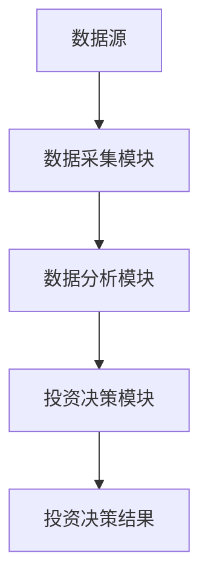

                 


# 何时卖出格雷厄姆特价股票

## 关键词：价值投资，格雷厄姆，特价股票，安全边际，卖出时机

## 摘要：  
《何时卖出格雷厄姆特价股票》一书深入探讨了价值投资的核心理念，特别是如何在适当的时候卖出特价股票。书中结合了格雷厄姆的经典理论，通过数学模型、系统架构和实际案例分析，为投资者提供了科学的决策方法。从价值投资的起源到安全边际的计算，从投资系统的架构设计到实际项目的实战分析，本书旨在帮助投资者在复杂的市场环境中做出明智的卖出决策。

---

## 第一部分：价值投资与特价股票基础

### 第1章：价值投资的起源与核心理念

#### 1.1 格雷厄姆与价值投资的起源

##### 1.1.1 格雷厄姆的生平简介
本杰明·格雷厄姆（Benjamin Graham）是20世纪著名的投资学家，被誉为“价值投资之父”。他出生于1894年，早年经历了家族破产，这使他对财务稳健和投资安全产生了浓厚兴趣。他曾在哥伦比亚大学教授证券分析，并培养了包括沃伦·巴菲特在内的众多投资大师。

##### 1.1.2 价值投资的核心理念
价值投资的核心在于寻找市场低估的股票。格雷厄姆认为，市场短期是投票机，长期才是称重机。投资者应关注企业的内在价值，而非市场的短期波动。

##### 1.1.3 格雷厄姆投资策略的特点
- **安全边际**：买入价格低于内在价值，确保投资的安全性。
- **长期持有**：避免频繁交易，降低交易成本。
- **逆向思维**：在市场恐慌时买入，在市场狂热时卖出。

#### 1.2 特价股票的定义与特征

##### 1.2.1 特价股票的定义
特价股票是指市场价格低于其内在价值的股票。这类股票通常被市场忽视或低估，具有较大的增值潜力。

##### 1.2.2 特价股票的市场特征
- **低市盈率**：市盈率低于行业平均水平。
- **低市净率**：市净率低于行业平均水平。
- **高股息率**：股息率较高，表明公司愿意将利润分配给股东。

##### 1.2.3 特价股票与非特价股票的对比分析
通过对比分析，我们可以发现特价股票在估值指标上具有显著优势。例如，假设A公司和B公司同行业，A的市盈率为10，B的市盈率为20，A可能是特价股票，而B可能是高估股票。

#### 1.3 价值投资中的安全边际

##### 1.3.1 安全边际的定义
安全边际是指买入价格与内在价值之间的差距。格雷厄姆建议买入价格应低于内在价值的一定比例，以确保投资的安全性。

##### 1.3.2 安全边际的计算方法
安全边际 = 内在价值 × (1 - 安全边际比例)  
例如，如果内在价值为100，安全边际比例为20%，则买入价格应低于80。

##### 1.3.3 安全边际在投资决策中的应用
安全边际是价值投资的核心要素。通过合理设置安全边际，投资者可以降低投资风险，提高投资收益。

---

## 第二部分：价值投资中的数学模型与分析方法

### 第2章：价值投资中的数学模型

#### 2.1 基本面分析的核心指标

##### 2.1.1 市盈率（P/E）的计算与分析
市盈率 = 股价 / 每股净利润  
例如，某公司股价为20元，每股净利润为5元，则市盈率为4倍。

##### 2.1.2 市净率（P/B）的计算与分析
市净率 = 股价 / 每股净资产  
例如，某公司股价为20元，每股净资产为10元，则市净率为2倍。

##### 2.1.3 股息率的计算与分析
股息率 = 每股股息 / 股价  
例如，某公司每股股息为2元，股价为20元，则股息率为10%。

#### 2.2 格雷厄姆的内在价值计算模型

##### 2.2.1 内在价值的定义
内在价值是股票的真正价值，不考虑市场波动，仅基于公司基本面计算。

##### 2.2.2 内在价值的计算公式
内在价值 = 预测现金流的现值  
例如，假设某公司未来5年的现金流分别为100、110、120、130、140，折现率为10%，则内在价值可以通过计算各年的现值总和得出。

##### 2.2.3 内在价值与市场价格的对比分析
通过对比内在价值和市场价格，投资者可以判断股票是否被低估或高估。

#### 2.3 安全边际的数学表达与应用

##### 2.3.1 安全边际的数学公式
安全边际 = 内在价值 × (1 - 安全边际比例)  
例如，内在价值为100，安全边际比例为20%，则安全边际为80。

##### 2.3.2 安全边际在投资决策中的应用实例
假设某股票的内在价值为100，安全边际为80，若当前股价为75，则具有较大的上涨潜力。若股价上涨至90，则接近内在价值，投资者可考虑卖出。

---

## 第三部分：价值投资中的系统架构与决策流程

### 第3章：价值投资系统的架构设计

#### 3.1 投资决策系统的组成模块

##### 3.1.1 数据采集模块
数据采集模块负责收集市场数据，包括股票价格、财务指标等。

##### 3.1.2 数据分析模块
数据分析模块对收集的数据进行处理，计算市盈率、市净率等指标。

##### 3.1.3 投资决策模块
投资决策模块基于分析结果，生成买入或卖出信号。

#### 3.2 数据流与决策流程

##### 3.2.1 数据采集流程
1. 收集市场数据。
2. 数据清洗与预处理。

##### 3.2.2 数据分析流程
1. 计算市盈率、市净率等指标。
2. 估算内在价值。

##### 3.2.3 投资决策流程
1. 确定安全边际。
2. 生成买入或卖出信号。

#### 3.3 系统架构的Mermaid图



---

## 第四部分：价值投资中的项目实战与案例分析

### 第4章：项目实战：格雷厄姆策略的应用

#### 4.1 环境安装与数据准备

##### 4.1.1 投资分析工具的安装
安装Python和相关库（如pandas、numpy）。

##### 4.1.2 数据源的选择与获取
从Yahoo Finance获取历史数据。

##### 4.1.3 数据清洗与预处理
处理缺失值和异常值。

#### 4.2 核心算法实现

##### 4.2.1 市盈率与市净率的计算
```python
import pandas as pd

# 假设df为股票数据
df['PE'] = df['Price'] / df['Net Income per Share']
df['PB'] = df['Price'] / df['Book Value per Share']
```

##### 4.2.2 内在价值的估算
```python
def calculate_intrinsic_value(cash_flows, discount_rate):
    present_value = sum(cash_flows / (1 + discount_rate) ** i for i in range(len(cash_flows)))
    return present_value
```

##### 4.2.3 安全边际的计算与应用
```python
safety_margin_ratio = 0.2  # 20%
intrinsic_value = calculate_intrinsic_value(...)
price_floor = intrinsic_value * (1 - safety_margin_ratio)
```

#### 4.3 实战案例分析

##### 4.3.1 某公司股票的分析
假设某公司的内在价值为100，安全边际为80，当前股价为75。根据格雷厄姆策略，该股票具有较大的上涨潜力。若股价上涨至90，则接近内在价值，投资者可考虑卖出。

---

## 第五部分：最佳实践与小结

### 第5章：最佳实践与小结

#### 5.1 核心要点总结
- 价值投资的核心是寻找被低估的股票。
- 安全边际是降低投资风险的重要工具。
- 市场波动和公司基本面变化是卖出决策的重要因素。

#### 5.2 投资策略中的关键点
- 长期投资：避免短期波动干扰。
- 安全边际：确保买入价格合理。
- 逆向思维：在市场恐慌时买入，在市场狂热时卖出。

#### 5.3 小结
价值投资是一种长期有效的策略，但需要投资者具备耐心和纪律。通过合理应用格雷厄姆的安全边际理论，投资者可以在适当的时候卖出特价股票，实现稳健的投资收益。

---

## 作者：AI天才研究院/AI Genius Institute & 禅与计算机程序设计艺术 /Zen And The Art of Computer Programming

