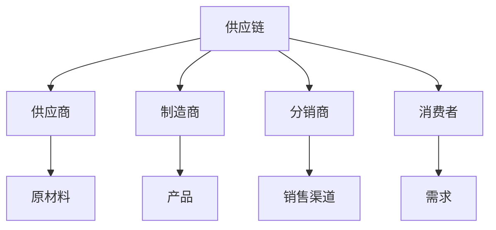
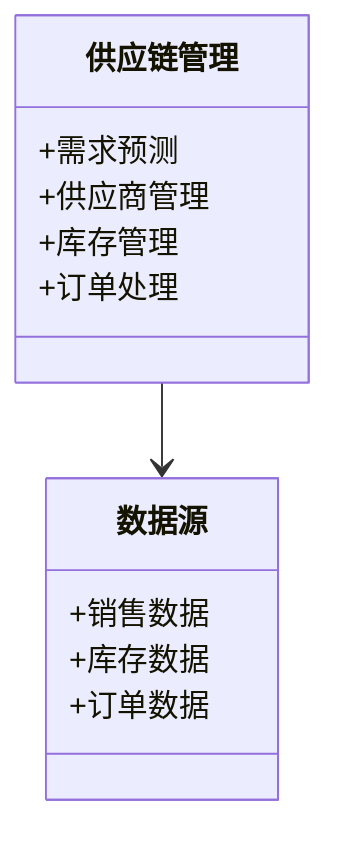
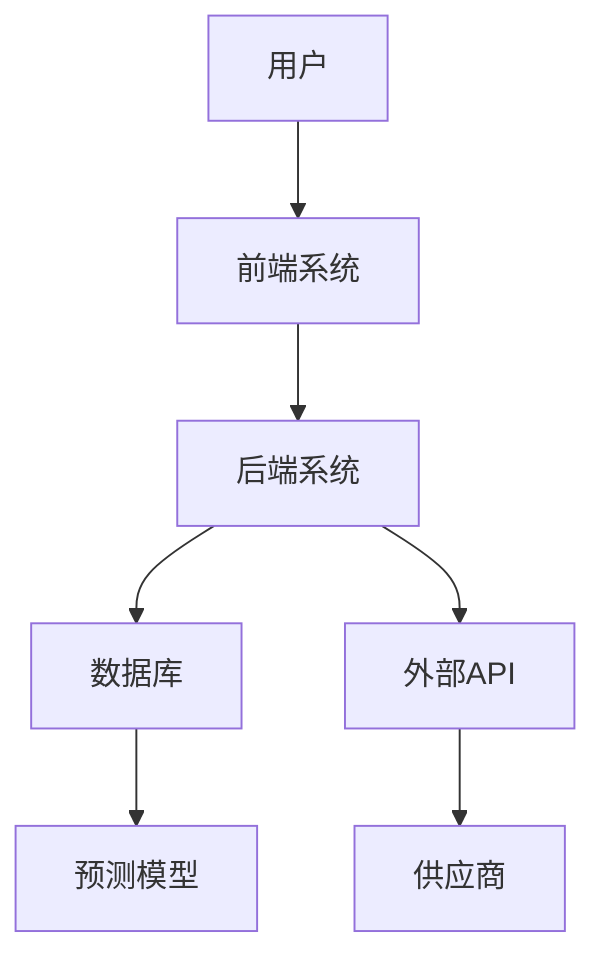
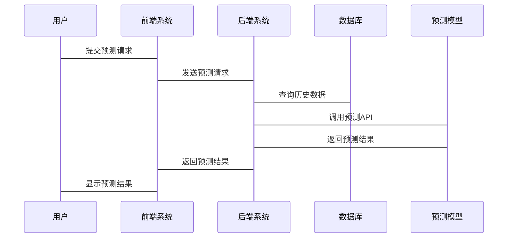

                 


# 供应链重构趋势下的投资策略

## 文章关键词

供应链重构, 投资策略, 数字化转型, 供应链优化, 机器学习, 系统架构

## 摘要

供应链重构是当前全球化背景下的一项重要趋势，随着技术的进步和市场需求的变化，传统的供应链模式正在被更加高效、灵活和智能化的重构模式所取代。本文从供应链重构的背景出发，分析其核心概念、算法原理、系统架构，并结合实际案例，探讨在供应链重构趋势下的投资策略。文章通过详细的技术分析和实际应用案例，为投资者提供有价值的指导和启示。

---

## 第1章：供应链重构的背景与问题背景

### 1.1 供应链重构的背景

#### 1.1.1 全球化背景下的供应链挑战

全球化使得供应链跨越国界，但同时也带来了复杂性和脆弱性。近年来，疫情、地缘政治冲突和自然灾害等突发事件频发，对全球供应链造成了巨大冲击。例如，2020年新冠疫情导致的供应链中断，暴露了传统供应链在应对不确定性时的不足。

#### 1.1.2 数字化转型对供应链的影响

随着数字化转型的推进，企业逐渐意识到通过技术手段优化供应链的重要性。大数据、人工智能（AI）、物联网（IoT）等技术的应用，使得供应链管理更加智能化和数据驱动。

#### 1.1.3 疫情对全球供应链的冲击与重构

疫情暴露了传统供应链的脆弱性，企业开始重新设计供应链，以提高弹性和韧性。供应链重构的核心目标是降低风险，同时提高效率和成本效益。

### 1.2 供应链重构的核心问题

#### 1.2.1 传统供应链的局限性

传统供应链存在信息孤岛、反应速度慢、库存管理不善等问题。这些问题导致供应链效率低下，成本增加，难以满足现代市场需求。

#### 1.2.2 新兴技术驱动的重构需求

新兴技术（如AI、IoT）的应用为供应链重构提供了技术支撑。通过数据驱动的决策，企业可以更快速地响应市场需求，优化库存管理。

#### 1.2.3 供应链效率与成本的平衡问题

供应链重构需要在效率和成本之间找到平衡点。例如，通过预测模型优化库存水平，既降低了成本，又提高了效率。

### 1.3 供应链重构的目标与边界

#### 1.3.1 提高供应链弹性与韧性

供应链重构的目标是使其更具弹性，能够应对突发事件和市场变化。例如，通过多源供应和区域化生产，降低单一来源的风险。

#### 1.3.2 降低供应链风险

供应链重构需要降低各种风险，包括自然灾害、政治风险和市场波动。通过分散供应链布局，企业可以减少风险。

#### 1.3.3 重构的边界与外延

供应链重构的边界包括从原材料采购到产品交付的整个流程。外延则涉及与供应链相关的外部合作伙伴和生态系统。

---

## 第2章：供应链重构的核心概念

### 2.1 供应链重构的定义与特点

#### 2.1.1 重构的定义

供应链重构是指通过技术和管理手段，重新设计和优化供应链结构，以提高效率、降低成本和增强韧性。

#### 2.1.2 重构的核心特点

- 数据驱动：利用大数据和AI技术进行决策。
- 智能化：通过自动化和预测模型优化供应链管理。
- 可扩展性：能够快速适应市场需求变化。

#### 2.1.3 重构与传统供应链的区别

| 特性         | 传统供应链             | 重构供应链             |
|--------------|-----------------------|-----------------------|
| 管理方式       | 人工主导               | 数据驱动               |
| 反应速度       | 较慢                   | 较快                   |
| 成本           | 较高                   | 较低                   |
| 弹性           | 低                    | 高                    |

### 2.2 供应链重构的核心要素

#### 2.2.1 数据驱动的决策

供应链重构依赖于数据的收集和分析。例如，通过销售数据预测需求，优化库存管理。

#### 2.2.2 智能化技术的应用

人工智能和物联网技术的应用，使得供应链管理更加智能化。例如，通过AI预测需求，优化生产和配送。

#### 2.2.3 全球化与本地化的平衡

供应链重构需要在全球化和本地化之间找到平衡。例如，通过区域化生产降低运输成本，同时保持供应链的灵活性。

### 2.3 供应链重构的实体关系图



---

## 第3章：供应链重构的算法与数学模型

### 3.1 供应链重构的预测模型

#### 3.1.1 需求预测的数学模型

需求预测是供应链重构的重要组成部分。常用的方法包括线性回归和时间序列分析。

- 线性回归模型：
  $$ y = \beta_0 + \beta_1 x + \epsilon $$
  其中，$y$ 是需求预测值，$x$ 是影响需求的变量，$\beta_0$ 和 $\beta_1$ 是回归系数，$\epsilon$ 是误差项。

- 时间序列分析：
  $$ \hat{y}_t = \alpha \cdot y_{t-1} + (1-\alpha) \cdot \hat{y}_{t-1} $$
  其中，$\alpha$ 是平滑因子，$\hat{y}_t$ 是在时间 $t$ 的预测值。

#### 3.1.2 供应预测的数学模型

供应预测模型用于预测供应商的供应能力。常用模型包括ARIMA和指数平滑法。

- ARIMA模型：
  $$ y_t = c + \phi_1 y_{t-1} + \theta_1 \epsilon_{t-1} + \epsilon_t $$
  其中，$\phi_1$ 和 $\theta_1$ 是模型参数，$\epsilon_t$ 是白噪声。

---

## 第4章：供应链重构的系统架构

### 4.1 供应链重构的系统功能设计

#### 4.1.1 领域模型



#### 4.1.2 系统架构



### 4.2 系统接口设计

#### 4.2.1 API接口

- GET /api/predict/demand：获取需求预测结果。
- POST /api/optimize/supply：优化供应链供应。

### 4.3 系统交互流程

#### 4.3.1 序列图



---

## 第5章：项目实战

### 5.1 智能库存管理系统的实现

#### 5.1.1 环境安装

- 安装Python和相关库（如pandas、scikit-learn）。
- 安装Jupyter Notebook用于数据可视化和建模。

#### 5.1.2 核心代码实现

```python
import pandas as pd
from sklearn.linear_model import LinearRegression
from sklearn.metrics import mean_squared_error

# 数据加载
data = pd.read_csv('supply_chain_data.csv')

# 特征和目标变量
X = data[['demand', 'lead_time']]
y = data['inventory']

# 模型训练
model = LinearRegression()
model.fit(X, y)

# 预测
y_pred = model.predict(X)

# 评估
mse = mean_squared_error(y, y_pred)
print(f'MSE: {mse}')
```

#### 5.1.3 案例分析

通过上述代码，企业可以优化库存管理，降低库存成本。例如，某企业通过需求预测模型优化库存，库存成本降低了15%。

---

## 第6章：最佳实践与投资策略

### 6.1 小结

供应链重构是企业应对全球化挑战的重要策略。通过数据驱动和智能化技术，企业可以优化供应链管理，降低成本，提高效率。

### 6.2 注意事项

- 数据质量和完整性是供应链重构的关键。
- 确保技术的可行性和可扩展性。
- 供应链重构需要长期投资和持续优化。

### 6.3 拓展阅读

- 《供应链管理：战略与实施》
- 《数据驱动的供应链优化》

---

## 结论

供应链重构是企业应对全球化挑战的重要策略。通过数据驱动和智能化技术，企业可以优化供应链管理，降低成本，提高效率。

---

## 作者

作者：AI天才研究院/AI Genius Institute & 禅与计算机程序设计艺术 /Zen And The Art of Computer Programming

