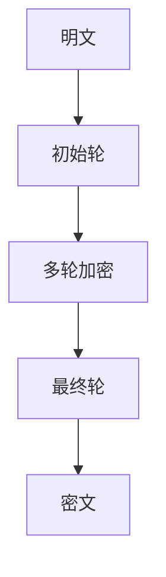
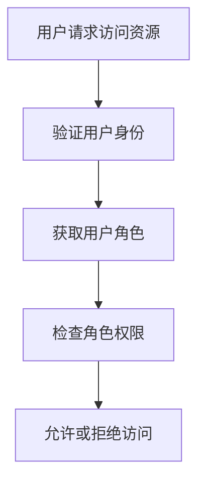
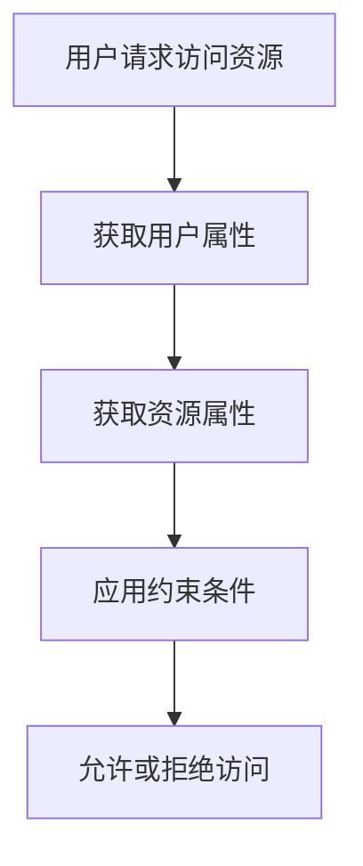
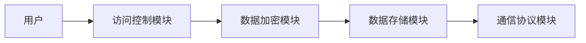

                 


# 保障AI Agent安全：数据加密与访问控制实践

---

## 关键词

AI Agent，数据加密，访问控制，对称加密，非对称加密，RBAC，安全

---

## 摘要

在AI Agent快速发展的背景下，数据加密与访问控制是保障AI Agent安全的核心技术。本文从AI Agent安全的背景出发，详细探讨了数据加密和访问控制的核心概念、算法原理、系统架构设计以及实际项目案例，旨在为读者提供全面的理论与实践指导，帮助他们在实际应用中更好地保护AI Agent的数据安全。

---

## 正文

---

## 第一部分：AI Agent安全背景与概述

### 第1章：AI Agent安全问题背景

#### 1.1 AI Agent的核心概念

AI Agent（人工智能代理）是指能够感知环境、自主决策并执行任务的智能实体。其核心特点包括自主性、反应性、目标导向性和社会性。AI Agent的安全性直接关系到系统的可用性、完整性和机密性。

##### 1.1.1 AI Agent的定义与特点
- **定义**：AI Agent是能够感知环境、自主决策并执行任务的智能实体。
- **特点**：
  - **自主性**：能够自主决策，无需外部干预。
  - **反应性**：能够根据环境变化动态调整行为。
  - **目标导向性**：所有行为均以实现特定目标为导向。
  - **社会性**：能够与其他AI Agent或人类进行交互协作。

##### 1.1.2 AI Agent的安全需求
AI Agent的安全需求主要体现在以下几个方面：
1. **数据机密性**：防止敏感数据被未经授权的用户访问。
2. **数据完整性**：确保数据在传输过程中不被篡改。
3. **数据可用性**：确保合法用户能够正常访问数据。
4. **行为可控性**：确保AI Agent的行为符合预期目标，防止恶意攻击。

##### 1.1.3 数据加密与访问控制的重要性
数据加密和访问控制是保障AI Agent安全的两大核心技术：
- **数据加密**：通过加密算法对数据进行加密，确保数据在存储和传输过程中的机密性。
- **访问控制**：通过权限管理，确保只有授权用户能够访问特定数据或执行特定操作。

#### 1.2 数据加密与访问控制的背景

##### 1.2.1 数据安全的现状与挑战
随着AI Agent的广泛应用，数据安全问题日益突出：
- **数据泄露**：未经授权的用户获取敏感数据。
- **数据篡改**：数据在传输过程中被恶意修改。
- **数据丢失**：由于系统故障或攻击导致数据丢失。

##### 1.2.2 加密技术在AI Agent中的应用
加密技术在AI Agent中的应用主要体现在以下几个方面：
1. **数据存储加密**：对存储在数据库中的敏感数据进行加密，防止数据泄露。
2. **数据传输加密**：对通过网络传输的数据进行加密，防止数据被窃听。
3. **用户身份验证**：通过加密技术验证用户身份，确保系统安全性。

##### 1.2.3 访问控制在AI Agent中的作用
访问控制是保障AI Agent安全的核心机制：
1. **防止未授权访问**：确保只有授权用户能够访问特定数据或执行特定操作。
2. **防止越权操作**：确保用户只能访问其权限范围内的资源。
3. **审计与追踪**：通过访问控制记录用户行为，便于审计和追踪。

---

### 第2章：数据加密技术原理与实践

#### 2.1 对称加密算法

##### 2.1.1 AES算法的工作原理

AES（高级加密标准）是一种广泛使用的对称加密算法，其核心思想是将明文通过一系列的加法和线性变换加密成密文。

##### 2.1.2 AES的数学模型与公式

AES加密的数学模型如下：

$$
加密过程：明文 \rightarrow 网状结构 \rightarrow 密文
$$

AES的加密过程可以分解为以下几个步骤：
1. **初始轮**：将明文划分为16个字节，组成一个16x16的矩阵。
2. **多轮加密**：通过多轮加法和线性变换，逐步加密明文。
3. **最终轮**：在最后一轮不执行反向变换，直接输出密文。

##### 2.1.3 AES的实现流程图



#### 2.2 非对称加密算法

##### 2.2.1 RSA算法的原理

RSA（ Rivest-Shamir-Adleman）是一种基于公钥密码学的非对称加密算法，其安全性基于大整数分解的困难性。

##### 2.2.2 RSA的数学模型与公式

RSA加密的数学模型如下：

$$
RSA加密：(公钥, 明文) \rightarrow 密文
$$

RSA的加密过程如下：
1. **生成密钥对**：随机选择两个大质数p和q，计算n = p * q，选择一个与n互质的数e，计算d = e^{-1} \mod (p-1)(q-1)。
2. **加密**：将明文表示为整数m，计算密文c = m^e \mod n。
3. **解密**：将密文c表示为整数，计算明文m = c^d \mod n。

##### 2.2.3 RSA的实现流程图

```mermaid
graph TD
A[明文] --> B[选择p和q]
B --> C[计算n = p*q]
C --> D[选择e与n互质]
D --> E[计算d = e^{-1} mod (p-1)(q-1)]
E --> F[加密：c = m^e mod n]
F --> G[解密：m = c^d mod n]
```

#### 2.3 加密算法的对比

| 算法类型 | 对称加密 | 非对称加密 |
|----------|----------|----------|
| 密钥管理 | 单一密钥 | 公钥和私钥 |
| 加密速度 | 快 | 慢 |
| 适用场景 | 适合大文件加密 | 适合数字签名和身份验证 |

---

### 第3章：访问控制模型与实现

#### 3.1 访问控制的核心概念

访问控制的核心目标是确保用户只能访问其权限范围内的资源。常见的访问控制模型包括基于角色的访问控制（RBAC）和基于属性的访问控制（ABAC）。

#### 3.2 RBAC模型

##### 3.2.1 RBAC模型的定义

RBAC模型将用户与角色相关联，角色与权限相关联。其核心组件包括：
1. **用户（User）**：系统中的用户。
2. **角色（Role）**：用户所属的角色。
3. **权限（Permission）**：角色所拥有的权限。

##### 3.2.2 RBAC模型的实现流程



#### 3.3 ABAC模型

##### 3.3.1 ABAC模型的定义

ABAC模型基于属性进行访问控制，其核心组件包括：
1. **主体（Subject）**：请求访问资源的用户。
2. **客体（Object）**：被访问的资源。
3. **属性（Attribute）**：主体和客体的属性。
4. **约束（Constraint）**：访问控制的条件。

##### 3.3.2 ABAC模型的实现流程



#### 3.4 访问控制模型的对比

| 模型类型 | RBAC | ABAC |
|----------|------|------|
| 核心思想 | 基于角色 | 基于属性 |
| 灵活性 | 较低 | 较高 |
| 复杂性 | 较低 | 较高 |

---

### 第4章：AI Agent安全的系统架构与设计

#### 4.1 系统架构设计

##### 4.1.1 系统功能模块

AI Agent的安全系统架构主要包括以下几个功能模块：
1. **数据存储模块**：负责数据的存储和管理。
2. **数据加密模块**：负责对数据进行加密和解密。
3. **访问控制模块**：负责用户身份验证和权限管理。
4. **通信协议模块**：负责数据的传输和通信。

##### 4.1.2 系统架构图



#### 4.2 系统设计

##### 4.2.1 系统功能设计

AI Agent的安全系统设计需要考虑以下几个方面：
1. **数据存储**：采用加密存储技术，确保数据存储的安全性。
2. **数据传输**：采用加密通信协议，确保数据传输的安全性。
3. **访问控制**：采用RBAC或ABAC模型，确保用户访问权限的合法性。

##### 4.2.2 系统架构设计

AI Agent的安全系统架构设计如下：
1. **数据存储层**：负责数据的持久化存储。
2. **业务逻辑层**：负责数据的加密和解密。
3. **用户交互层**：负责用户身份验证和权限管理。

---

### 第5章：项目实战与案例分析

#### 5.1 项目环境安装

##### 5.1.1 环境配置

安装Python和必要的库：
```bash
pip install flask rsa
```

##### 5.1.2 数据库安装

安装MySQL数据库：
```bash
mysql -u root -p
```

#### 5.2 系统核心实现

##### 5.2.1 数据加密模块实现

使用RSA算法对数据进行加密和解密：
```python
import rsa

# 生成密钥对
public_key, private_key = rsa.newkeys(2048)

# 加密数据
message = "Hello, World!"
message_bytes = message.encode('utf-8')
cipher = rsa.encrypt(message_bytes, public_key)

# 解密数据
message_decrypted = rsa.decrypt(cipher, private_key)
print(message_decrypted.decode('utf-8'))
```

##### 5.2.2 访问控制模块实现

使用Flask框架实现用户身份验证和权限管理：
```python
from flask import Flask
from flask_httpauth import HTTPBasicAuth

app = Flask(__name__)
auth = HTTPBasicAuth()

users = {
    'admin': 'secret',
    'guest': 'guest'
}

@auth.get_password
def get_password(username):
    if username in users:
        return users[username]
    return None

@app.route('/')
@auth.login_required
def index():
    return "Welcome to the secure area!"
```

---

### 第6章：最佳实践与总结

#### 6.1 最佳实践

##### 6.1.1 加密算法的选择

根据具体需求选择合适的加密算法：
- **对称加密**：适合大文件加密，速度快。
- **非对称加密**：适合数字签名和身份验证，安全性高。

##### 6.1.2 访问控制模型的选择

根据具体需求选择合适的访问控制模型：
- **RBAC**：适合企业级应用，权限管理简单。
- **ABAC**：适合复杂场景，权限管理灵活。

#### 6.2 小结

本文从AI Agent安全的背景出发，详细探讨了数据加密和访问控制的核心概念、算法原理、系统架构设计以及实际项目案例。通过理论与实践相结合的方式，为读者提供全面的指导。

#### 6.3 注意事项

- **密钥管理**：密钥是加密技术的核心，必须妥善保管。
- **权限管理**：权限管理是访问控制的核心，必须严格按照最小权限原则进行配置。
- **安全审计**：定期进行安全审计，确保系统安全。

#### 6.4 未来趋势

随着AI Agent技术的不断发展，数据加密与访问控制技术也将不断进步：
- **后量子加密算法**：抗量子计算机攻击的加密算法将成为研究热点。
- **零信任架构**：基于身份的访问控制将成为主流。

#### 6.5 拓展阅读

- **《网络安全：数据加密与访问控制》**
- **《AI Agent安全：理论与实践》**

---

## 作者

作者：AI天才研究院/AI Genius Institute & 禅与计算机程序设计艺术 /Zen And The Art of Computer Programming

