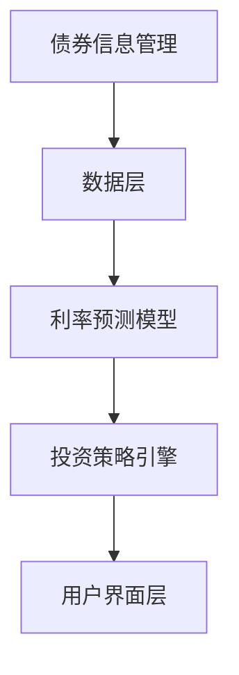

                 


# 债券市场前景：利率变化后的投资机会

## 关键词
债券市场，利率变化，投资策略，久期分析，收益率曲线，风险管理

## 摘要
本文深入探讨了债券市场在利率变化后的投资机会，分析了利率波动对债券价格和收益率的影响，并提出了相应的投资策略。通过久期分析、收益率曲线分析等方法，结合实际案例，帮助投资者制定有效的投资计划和风险管理措施，以抓住利率变化带来的投资机遇。

---

## 第一部分: 债券市场概述

### 第1章: 债券的基本概念与分类

#### 1.1 债券的定义与基本要素
债券是一种债务工具，发行人承诺在特定时间内向债券持有人支付利息，并在到期日偿还本金。主要要素包括面值、期限、票面利率和到期日。

#### 1.2 债券的分类
- **按发行主体分类**：政府债券、企业债券、金融债券。
- **按期限分类**：短期债券（1年以内）、中期债券（1-10年）、长期债券（10年以上）。
- **按计息方式分类**：零息债券、固定利率债券、浮动利率债券。

#### 1.3 债券的发行与交易
债券可以在一级市场发行和二级市场交易。一级市场的参与者包括发行人、承销商和投资者；二级市场则通过现券交易、回购交易和远期交易进行。

### 第2章: 债券市场的运行机制

#### 2.1 市场参与者
- **政府机构**：财政部和央行主导债券发行和监管。
- **金融机构**：商业银行、证券公司和保险公司是主要的市场参与者。
- **投资者**：包括个人和机构投资者。

#### 2.2 市场功能
- **资金融通**：为企业和个人提供资金。
- **价格发现**：通过市场供需确定债券价格。
- **风险管理**：通过多样化投资降低风险。

#### 2.3 监管框架
国内外监管机构如证监会、央行、国际证监会组织等共同维护市场秩序。

---

## 第二部分: 利率变化对债券市场的影响

### 第3章: 利率波动的宏观经济分析

#### 3.1 利率的决定因素
- **经济周期**：经济增长、通货膨胀和就业率影响利率。
- **货币政策**：央行通过调整利率和货币供应量干预市场。
- **市场预期**：投资者预期和市场情绪影响利率走势。

#### 3.2 利率波动的传导机制
- **信贷市场**：利率上升增加贷款成本，抑制投资。
- **资本市场**：利率上升导致债券收益率提高，可能分流股市资金。
- **汇率**：利率上升可能吸引外资流入，影响汇率。

### 第4章: 利率变化对债券价格的影响

#### 4.1 利率与债券价格的关系
- **正相关**：利率上升，债券价格下跌；利率下降，债券价格上涨。
- **久期分析**：久期衡量债券价格对利率变化的敏感性，久期越长，敏感性越高。

#### 4.2 利率风险的衡量
- **久期模型**：久期=（ΔP/P）≈-（Δy）/（1+y），其中y为到期收益率，Δy为利率变化。
- **收益率曲线**：陡峭的收益率曲线预示未来利率可能上升，平坦曲线预示可能下降。

### 第5章: 利率变化下的投资策略

#### 5.1 利率上升周期的投资策略
- **短期债券**：因期限短，受利率影响较小，价格波动小。
- **高信用评级债券**：信用风险低，市场需求稳定。
- **久期策略**：通过调整债券组合的久期，降低利率上升带来的损失。

#### 5.2 利率下降周期的投资策略
- **长期债券**：利率下降时，长期债券价格涨幅更大。
- **债券轮动**：通过不同期限和信用等级的债券轮动，捕捉价格上升机会。

#### 5.3 套利与对冲策略
- **息差套利**：在不同债券之间寻找价格差异，利用价差获利。
- **利率互换**：将固定利率债券转化为浮动利率债券，对冲利率风险。

---

## 第三部分: 投资策略与风险管理

### 第6章: 投资策略制定

#### 6.1 久期策略
- **久期匹配**：调整债券组合的久期与预期利率变化相匹配，以减少价格波动。
- **动态调整**：根据利率预测，定期调整债券组合的久期。

#### 6.2 梯度策略
- **梯度法**：通过分散投资于不同期限和信用等级的债券，降低整体风险。

#### 6.3 利率期权策略
- **期权对冲**：利用期权工具，对冲利率波动带来的风险。

### 第7章: 风险管理

#### 7.1 风险类型
- **信用风险**：债券发行人违约的风险。
- **市场风险**：市场波动导致债券价格下跌的风险。
- **流动性风险**：债券难以迅速变现的风险。

#### 7.2 风险评估与控制
- **信用评级**：选择高信用评级债券，降低违约风险。
- **分散投资**：通过多样化投资降低集中风险。
- **定期再平衡**：定期调整投资组合，维持目标风险水平。

### 第8章: 案例分析

#### 8.1 实际案例
- **案例1**：2019年美联储降息周期，长期债券价格上涨，投资者通过投资长期债券获得收益。
- **案例2**：2020年新冠疫情后的低利率环境，短期债券因利率上升预期面临价格波动，投资者通过久期策略降低风险。

---

## 第四部分: 系统分析与架构设计

### 第9章: 问题场景介绍

#### 9.1 问题背景
在利率变化的市场环境中，投资者需要制定有效的投资策略，以最大化收益并降低风险。

### 第10章: 项目介绍

#### 10.1 项目目标
构建一个基于利率变化的债券投资管理系统，帮助投资者制定和优化投资策略。

### 第11章: 系统功能设计

#### 11.1 领域模型
- **债券信息管理**：存储债券的基本信息和市场数据。
- **利率预测模型**：预测未来利率走势，辅助投资决策。
- **投资策略引擎**：根据利率预测和市场数据，生成投资建议。

#### 11.2 系统架构
- **数据层**：数据存储和管理。
- **业务逻辑层**：处理投资策略和风险管理。
- **用户界面层**：提供直观的操作界面。

### 第12章: 系统架构设计

#### 12.1 架构图


### 第13章: 系统接口设计

#### 13.1 API接口
- **获取债券信息**：`GET /bond-info`
- **预测利率走势**：`POST /rate-predict`
- **生成投资策略**：`POST /strategy-generator`

### 第14章: 系统交互设计

#### 14.1 交互流程
- **用户登录**：用户输入账号和密码，系统验证身份。
- **查看债券信息**：用户浏览债券列表，选择感兴趣债券。
- **制定投资策略**：用户输入预期持有期限和风险承受能力，系统生成投资策略。
- **监控市场变化**：系统实时更新市场数据，提醒用户潜在投资机会。

---

## 第五部分: 项目实战

### 第15章: 环境安装

#### 15.1 安装Python
```bash
python --version
pip install --upgrade pip
```

#### 15.2 安装依赖库
```bash
pip install numpy pandas matplotlib
```

### 第16章: 核心实现

#### 16.1 利率预测模型
```python
import numpy as np
import pandas as pd
from sklearn.linear_model import LinearRegression

# 示例数据
data = pd.DataFrame({
    'year': [2018, 2019, 2020, 2021, 2022],
    'interest_rate': [3.0, 2.5, 2.0, 1.5, 1.0]
})

# 训练线性回归模型
model = LinearRegression()
model.fit(data[['year']], data['interest_rate'])

# 预测2023年的利率
predicted_rate = model.predict([[2023]])
print(predicted_rate)
```

#### 16.2 投资策略引擎
```python
import numpy as np
import pandas as pd

def calculate_duration(bond_prices, coupon_rates, face_values, years):
    durations = []
    for i in range(len(bond_prices)):
        coupon = face_values[i] * coupon_rates[i] / 100
        price = bond_prices[i]
        duration = 0
        for j in range(years):
            cash_flow = coupon if j != years else (face_values[i] + coupon)
            discount_factor = (1 + coupon_rates[i]/100)**j
            duration += (cash_flow / (price * discount_factor)) * j
        duration /= years
        durations.append(duration)
    return durations

# 示例数据
bond_prices = [95, 98, 100, 97, 99]
coupon_rates = [5, 6, 5, 7, 6]
face_values = [100, 100, 100, 100, 100]
years = [1, 2, 3, 4, 5]

durations = calculate_duration(bond_prices, coupon_rates, face_values, years)
print(durations)
```

### 第17章: 案例分析

#### 17.1 案例1：2019年降息周期
- **背景**：2019年全球降息潮，长期债券价格上涨。
- **策略**：投资期限较长的债券，如10年期国债，收益率上升。

#### 17.2 案例2：2020年疫情后的低利率环境
- **背景**：央行实施宽松货币政策，短期债券收益率下降。
- **策略**：采用梯度策略，分散投资于不同期限债券，降低风险。

---

## 第六部分: 总结与展望

### 第18章: 总结

#### 18.1 核心内容回顾
- 利率变化对债券市场的影响机制。
- 久期分析、收益率曲线分析等工具的应用。
- 投资策略的制定与风险管理。

### 第19章: 未来展望

#### 19.1 技术发展
- 利用大数据和机器学习优化利率预测和投资策略。
- 发展智能投顾系统，为投资者提供个性化建议。

#### 19.2 市场趋势
- 绿色债券和可持续债券的兴起，关注环保和社会责任投资。
- 全球化债券市场的整合，跨国投资机会增加。

---

## 第七部分: 最佳实践与注意事项

### 第20章: 最佳实践

#### 20.1 投资策略
- **分散投资**：避免集中投资于单一债券或期限，降低风险。
- **定期再平衡**：根据市场变化和自身风险承受能力，调整投资组合。

#### 20.2 风险管理
- **监控市场**：定期跟踪债券价格和利率变化，及时调整投资策略。
- **使用工具**：借助久期模型和收益率曲线分析工具，辅助决策。

### 第21章: 小结

#### 21.1 重点回顾
- 利率变化对债券市场的深远影响。
- 投资策略的选择与优化。
- 风险管理的重要性。

### 第22章: 注意事项

#### 22.1 投资者需注意
- **市场风险**：债券价格受利率和市场供需影响，可能波动较大。
- **信用风险**：选择高信用评级债券，避免发行人违约。
- **流动性风险**：投资长期债券需考虑变现能力。

### 第23章: 拓展阅读

#### 23.1 推荐书籍
- 《债券市场分析》：深入分析债券市场的基本理论和实践。
- 《投资学》：系统介绍投资理论和策略。

---

## 作者：AI天才研究院/AI Genius Institute & 禅与计算机程序设计艺术 /Zen And The Art of Computer Programming

---

本文通过系统分析债券市场的基本概念、利率变化的影响、投资策略制定及风险管理，帮助投资者在利率变化的市场环境中抓住投资机会，降低投资风险。结合实际案例和系统架构设计，为投资者提供了全面的理论支持和实践指导。未来，随着技术的进步和市场的演变，债券投资将更加依赖于数据分析和智能工具，投资者需不断提升自身的知识和技能，以应对复杂多变的市场环境。

