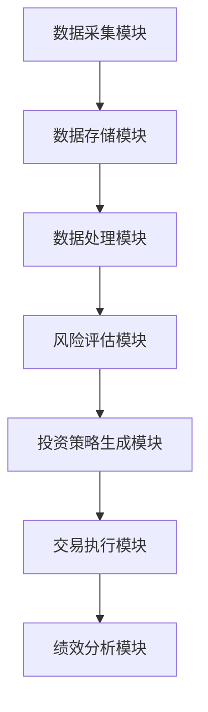
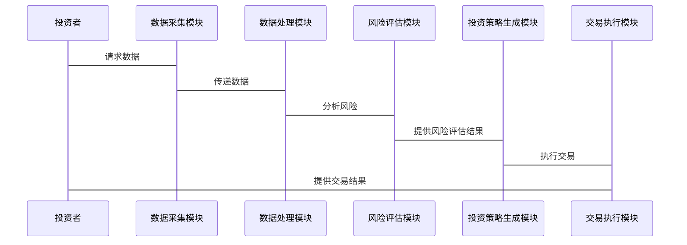

                 


# 债券投资策略：在低利率环境中寻求收益

## 关键词：债券投资、低利率环境、收益最大化、风险管理、组合优化、量化分析

## 摘要：在当前全球经济低利率环境下，债券投资策略显得尤为重要。本文详细分析了低利率环境对债券市场的影响，探讨了多种债券投资策略，包括久期分析、凸性、信用评级和量化方法，并结合实际案例，为投资者提供科学的投资决策参考。

---

## 第一部分：背景介绍

### 第1章：低利率环境下的债券投资背景

#### 1.1 低利率环境的背景与现状

低利率环境是当前全球经济的显著特征。近年来，全球主要经济体如美国、欧洲和日本的央行纷纷降低基准利率，甚至实施负利率政策。这种低利率环境对债券市场产生了深远影响，也为投资者提供了新的机遇和挑战。

- **1.1.1 全球利率趋势与低利率环境的形成**
  全球经济增速放缓、通货膨胀率下降以及央行政策转向宽松是低利率环境形成的主要原因。各国央行通过降低利率以刺激经济增长，导致债券收益率整体走低。

- **1.1.2 低利率环境对债券市场的影响**
  在低利率环境下，债券收益率普遍下降，但债券价格会上涨。同时，低利率也增加了债券的流动性溢价，使得部分优质债券的收益率相对稳定。

- **1.1.3 投资者在低利率环境下的挑战与机会**
  投资者面临再投资风险（Reinvestment Risk），即在低利率环境下，投资到期后可能无法以同样低的利率进行再投资。然而，低利率环境也提供了通过杠杆或长期债券投资来放大收益的机会。

#### 1.2 债券投资的基本概念

- **1.2.1 债券的定义与主要类型**
  债券是一种债务工具，发行人承诺在特定日期偿还本金，并按约定支付利息。主要类型包括政府债券、公司债券、可转换债券和零息债券。

- **1.2.2 债券收益率的计算方法**
  债券收益率包括票面利率、到期收益率和当期收益率。到期收益率是投资者购买债券并持有至到期所能获得的年化收益率，是债券定价的核心指标。

- **1.2.3 债券评级与信用风险**
  债券评级由专业机构如穆迪、标普等给出，从AAA（最高）到D（违约）不等。评级反映了债券的信用风险，评级越低，债券的违约风险越高。

#### 1.3 低利率环境下的投资策略

- **1.3.1 再投资风险与债券投资期限的选择**
  再投资风险是指在低利率环境下，投资到期后可能无法以同样低的利率进行再投资的风险。为应对这一风险，投资者可选择较长期限的债券或债券基金，以锁定当前低利率环境下的收益。

- **1.3.2 久期分析与债券价格波动**
  久期是衡量债券价格对利率变动敏感程度的指标。在低利率环境下，久期较长的债券价格波动较大，但可能带来更高的收益。投资者应根据自身风险承受能力选择合适的久期。

- **1.3.3 凸性对债券投资决策的影响**
  凸性（Convexity）是债券价格对利率变动的非线性反应。在低利率环境下，债券的凸性使得债券基金在利率下降时的收益超过久期预测的收益，这对投资者有利。

---

## 第二部分：低利率环境下的债券投资策略

### 第2章：债券投资策略的核心概念

#### 2.1 债券投资策略的分类

- **2.1.1 利率上升环境下的防御策略**
  在利率上升环境下，久期较长的债券价格会大幅下跌。投资者应选择久期较短的债券或短期债券基金，以减少利率上升带来的损失。

- **2.1.2 利率下降环境下的进攻策略**
  在利率下降环境下，久期较长的债券价格会上涨，投资者可通过投资长期债券或债券基金来获得资本利得。

- **2.1.3 信用风险与流动性风险的平衡**
  在低利率环境下，高收益债券（即垃圾债券）的信用风险较高，但收益率也相对较高。投资者需在信用风险和流动性风险之间进行权衡，选择合适的债券组合。

#### 2.2 低利率环境下的债券组合管理

- **2.2.1 组合构建的基本原则**
  债券组合管理的核心在于分散风险和优化收益。投资者应根据市场环境、自身风险承受能力和投资目标构建债券组合。

- **2.2.2 利率风险与信用风险的分散**
  通过投资不同期限、不同发行人和不同信用评级的债券，投资者可以分散利率风险和信用风险，降低组合的整体风险敞口。

- **2.2.3 久期与凸性的优化配置**
  在低利率环境下，久期较长的债券可能面临更大的利率上升风险，但其较高的凸性可能在利率下降时带来更高的收益。投资者需根据市场预期和自身目标优化久期和凸性的配置。

#### 2.3 债券投资中的量化分析

- **2.3.1 量化指标与债券筛选**
  量化分析通过数学模型和算法对债券进行筛选和排序，帮助投资者发现潜在的投资机会。常用指标包括信用利差、期限利差和债券评级等。

- **2.3.2 基于大数据的债券定价模型**
  大数据技术的应用使得债券定价更加精准。通过分析市场数据、经济指标和公司基本面信息，投资者可以构建量化定价模型，优化投资决策。

- **2.3.3 机器学习在债券投资中的应用**
  机器学习算法如支持向量机和神经网络可用于债券价格预测和风险评估。通过训练历史数据，机器学习模型可以识别复杂的市场模式，辅助投资者做出更科学的决策。

---

## 第三部分：系统分析与架构设计

### 第3章：债券投资系统的架构设计

#### 3.1 问题场景介绍

在低利率环境下，投资者需要一个高效的系统来辅助债券投资决策。该系统应具备数据采集、风险评估、策略生成和交易执行等功能。

#### 3.2 系统功能设计

- **3.2.1 数据采集模块**
  数据采集模块负责收集市场数据、经济指标和公司基本面信息。数据来源包括金融市场数据供应商、新闻网站和政府发布的经济报告。

- **3.2.2 风险评估模块**
  风险评估模块利用久期、凸性和信用评级等指标对债券组合的风险进行评估。模块输出包括利率风险、信用风险和流动性风险的评估结果。

- **3.2.3 投资策略生成模块**
  投资策略生成模块基于市场数据和风险评估结果，生成最优的债券投资策略。策略包括债券选择、投资比例和再平衡计划。

- **3.2.4 交易执行模块**
  交易执行模块根据生成的策略，执行具体的债券交易。模块支持手动和自动交易，并提供交易记录和绩效分析功能。

#### 3.3 系统架构设计

- **3.3.1 系统架构图**



- **3.3.2 接口设计**
  系统接口包括数据接口、用户界面和交易接口。数据接口负责与数据供应商的数据对接，用户界面提供给投资者进行操作，交易接口与交易执行系统对接。

- **3.3.3 交互流程**



---

## 第四部分：项目实战

### 第4章：低利率环境下的债券投资实战

#### 4.1 环境安装

为了进行债券投资实战，投资者需要安装以下环境：

- 数据分析工具：Python、Pandas、NumPy
- 可视化工具：Matplotlib、Seaborn
- 数据源：金融市场数据API（如Yahoo Finance、Quandl）

#### 4.2 核心实现源代码

以下是一个简单的债券收益率计算的Python代码示例：

```python
import pandas as pd
import numpy as np

# 假设我们有以下债券数据
data = {
    '债券名称': ['Bond 1', 'Bond 2', 'Bond 3'],
    '面值': [100, 100, 100],
    '票面利率': [5%, 6%, 7%],
    '剩余期限': [5, 10, 15],
    '到期收益率': [4%, 5%, 6%]
}

df = pd.DataFrame(data)

# 计算债券价格
df['债券价格'] = df['面值'] * (1 + df['票面利率']/100) ** (-df['剩余期限'])

print(df)
```

#### 4.3 代码应用解读与分析

上述代码计算了不同债券在不同到期收益率下的价格。债券价格与到期收益率呈负相关关系，即到期收益率越高，债券价格越低，反之亦然。这体现了债券的定价原理。

#### 4.4 实际案例分析

假设当前市场利率为3%，投资者购买一只面值为100元，票面利率为5%，剩余期限为10年的债券。债券的到期收益率为4%。计算债券价格：

$$
\text{债券价格} = 100 \times \left(1 + \frac{5\%}{100}\right)^{-10} \approx 132.18 \text{元}
$$

在低利率环境下，债券价格较高，投资者可以通过持有至到期获得较高的票面利息，或者在市场利率进一步下降时出售债券获得资本利得。

---

## 第五部分：总结与最佳实践

### 第5章：总结与最佳实践

#### 5.1 总结

在低利率环境下，债券投资策略需要灵活调整，注重久期、凸性和信用风险的管理。通过量化分析和系统辅助，投资者可以更好地应对市场变化，优化投资组合，实现收益最大化。

#### 5.2 最佳实践

- **风险管理**：投资者应定期评估和调整债券组合，分散投资风险，避免过度集中于某一种债券类型或发行人。
- **再投资策略**：在低利率环境下，选择较长期限的债券或债券基金可以锁定当前低利率环境下的收益。
- **量化分析**：利用大数据和机器学习技术进行债券筛选和定价，提高投资决策的科学性和准确性。

#### 5.3 小结

债券投资在低利率环境下具有其独特的机会和挑战。通过深入理解债券市场、合理配置债券组合、有效管理风险，投资者可以在低利率环境中实现稳健的收益。

---

## 作者：AI天才研究院 & 禅与计算机程序设计艺术

---

这篇文章通过详细分析低利率环境下的债券投资策略，结合理论与实际案例，为投资者提供了科学的投资决策参考。通过系统化的分析和量化方法的应用，投资者可以更好地应对市场变化，优化投资组合，实现收益最大化。

