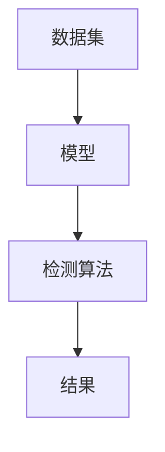

                 


# 偏见检测与缓解：确保AI Agent的公平性

## 关键词：偏见检测、公平性、AI Agent、机器学习、算法透明度

## 摘要：AI Agent的偏见检测与缓解是确保技术公平性的重要环节。本文从背景、核心概念、算法原理、系统架构、项目实战和最佳实践等多个维度，详细探讨如何识别和消除AI系统中的偏见，确保AI决策的公平性。

---

# 第一章: 偏见检测与缓解的背景介绍

## 1.1 偏见检测的定义与问题背景

### 1.1.1 什么是偏见

偏见是指在数据、算法或决策过程中存在的不公正或不合理的倾向，导致某些群体在AI系统中受到不公平的对待。例如，在招聘系统中，如果数据集中女性的比例较低，模型可能会倾向于优先选择男性候选人。

### 1.1.2 偏见在AI Agent中的具体表现

- 数据层面：训练数据中某些群体的代表性不足，导致模型对这些群体的预测不准确。
- 模型层面：算法设计中存在隐含的偏见，例如在推荐系统中，某些用户群体被系统忽视。
- 应用层面：AI Agent在实际应用中对某些群体的决策存在不公平性，例如在司法系统中，AI判决可能对某些种族或性别群体存在偏见。

### 1.1.3 偏见检测的必要性与重要性

- **必要性**：确保AI Agent的决策公平性，避免对特定群体的歧视。
- **重要性**：偏见检测是构建可信AI系统的基础，能够提升用户对AI系统的信任度。

## 1.2 偏见检测的核心问题

### 1.2.1 偏见的来源分析

- 数据层面：训练数据中的样本分布不均，例如某些群体的数据量较少。
- 算法层面：算法设计中的偏见，例如某些特征的权重过高。
- 社会层面：社会中存在的固有偏见可能被AI系统放大。

### 1.2.2 偏见检测的目标与边界

- **目标**：识别AI系统中存在的偏见，提出缓解策略。
- **边界**：偏见检测仅关注系统中存在的不公平性，不涉及主观的价值判断。

### 1.2.3 偏见检测的实现路径

- 数据分析：通过统计方法发现数据中的偏见。
- 模型分析：通过模型解释性工具识别模型中的偏见。
- 应用测试：通过实际应用中的测试发现偏见。

## 1.3 偏见检测与缓解的现状

### 1.3.1 当前技术挑战

- 数据多样性不足：许多AI系统在训练数据中缺乏多样性，导致偏见。
- 模型透明度低：复杂的模型难以解释，导致偏见难以被发现。
- 缓解方法有限：现有的偏见缓解方法在实际应用中效果有限。

### 1.3.2 学术研究进展

- 偏见检测算法：如统计测试方法、对抗训练方法等。
- 偏见缓解技术：如重新采样、对抗训练、公平性优化等。

### 1.3.3 工业界的应用情况

- 金融领域：检测贷款申请中的性别偏见。
- 招聘领域：检测简历筛选中的种族偏见。
- 司法领域：检测判决中的性别或种族偏见。

## 1.4 本章小结

本章介绍了偏见检测的定义、问题背景、核心问题和现状，为后续章节的深入探讨奠定了基础。

---

# 第二章: 偏见检测的核心概念与联系

## 2.1 偏见与公平性的定义

### 2.1.1 偏见的定义与特征

偏见是一种系统性的不公平性，通常与数据或算法中的不均衡分布有关。其特征包括：

- **不一致性**：不同群体在系统中的待遇不同。
- **不公平性**：某些群体受到不公正对待。

### 2.1.2 公平性的定义与层次

公平性是指AI系统在决策过程中对所有群体的公平对待。其层次包括：

- **个体公平性**：确保每个个体在系统中的待遇公平。
- **群体公平性**：确保不同群体在系统中的总体待遇公平。

### 2.1.3 偏见与公平性之间的关系

偏见是公平性的对立面，偏见的存在会导致不公平性。因此，检测和缓解偏见是实现公平性的关键。

## 2.2 偏见检测的关键维度

### 2.2.1 数据层面的偏见

- 数据分布不均：某些群体的数据量较少。
- 数据偏差：某些特征在数据中的分布存在偏见。

### 2.2.2 模型层面的偏见

- 模型预测偏差：模型对某些群体的预测存在偏见。
- 模型权重偏见：模型中某些特征的权重过高或过低。

### 2.2.3 应用层面的偏见

- 应用决策偏见：AI Agent在实际应用中的决策存在偏见。
- 用户感知偏见：用户感知到的偏见。

## 2.3 偏见检测的核心要素

### 2.3.1 数据预处理

- 数据清洗：去除噪声数据。
- 数据平衡：平衡不同群体的数据量。

### 2.3.2 模型训练

- 模型优化：优化模型以减少偏见。
- 模型评估：评估模型的公平性。

### 2.3.3 模型评估

- 公平性指标：如FPR (False Positive Rate) 差异、FNR (False Negative Rate) 差异等。
- 偏见检测工具：如AI Fairness 360。

## 2.4 偏见检测的实体关系图



## 2.5 本章小结

本章详细介绍了偏见和公平性的定义，分析了偏见检测的关键维度和核心要素，为后续章节的算法实现奠定了基础。

---

# 第三章: 偏见检测的算法原理

## 3.1 偏见检测的主要方法

### 3.1.1 统计测试方法

统计测试方法通过分析数据的分布情况，检测数据中的偏见。例如，通过卡方检验判断两个群体在某特征上的分布是否一致。

### 3.1.2 对抗训练方法

对抗训练方法通过设计对抗网络，检测模型中的偏见。例如，通过训练一个判别器，识别模型中是否存在偏见。

### 3.1.3 解释性分析方法

解释性分析方法通过分析模型的解释性特征，检测模型中的偏见。例如，通过SHAP值分析模型中每个特征的重要性。

## 3.2 统计测试方法的实现

### 3.2.1 方法概述

统计测试方法通过统计检验，判断数据中的偏见。例如，使用卡方检验判断两个群体在某特征上的分布是否一致。

### 3.2.2 实现步骤

1. 数据预处理：将数据分为不同群体。
2. 数据分析：计算每个群体在某特征上的分布情况。
3. 统计检验：通过卡方检验判断分布差异是否显著。

### 3.2.3 示例代码

```python
import numpy as np
from scipy.stats import chi2_contingency

# 示例数据：性别与贷款申请通过率
data = {
    'male': [100, 20],
    'female': [80, 30]
}

# 统计检验
chi2, p, _, _ = chi2_contingency(data)
print(f"p值为：{p}")
```

### 3.2.4 数学模型

卡方检验的统计量计算公式为：

$$
\chi^2 = \sum \frac{(O_{ij} - E_{ij})^2}{E_{ij}}
$$

其中，\(O_{ij}\) 是观察频数，\(E_{ij}\) 是期望频数。

## 3.3 对抗训练方法的实现

### 3.3.1 方法概述

对抗训练方法通过设计对抗网络，检测模型中的偏见。例如，通过训练一个判别器，识别模型中是否存在偏见。

### 3.3.2 实现步骤

1. 设计对抗网络：包括生成器和判别器。
2. 训练生成器：生成公平的数据分布。
3. 训练判别器：识别模型中的偏见。

### 3.3.3 示例代码

```python
import tensorflow as tf
from tensorflow.keras.layers import Dense, Input

# 输入层
input_layer = Input(shape=(input_dim,))
# 生成器
generator = Dense(64, activation='relu')(input_layer)
generator = Dense(1, activation='sigmoid')(generator)
# 判别器
discriminator = Dense(64, activation='relu')(input_layer)
discriminator = Dense(1, activation='sigmoid')(discriminator)
# 模型编译
generator_model = Model(inputs=input_layer, outputs=generator)
discriminator_model = Model(inputs=input_layer, outputs=discriminator)
generator_model.compile(optimizer='adam', loss='binary_crossentropy')
discriminator_model.compile(optimizer='adam', loss='binary_crossentropy')
```

### 3.3.4 数学模型

对抗训练的目标是最小化生成器和判别器的损失函数：

$$
\min_{G} \max_{D} \mathbb{E}_{x \sim P_{\text{data}}}[\log D(x)] + \mathbb{E}_{z \sim P_{z}}[\log (1 - D(G(z)))]
$$

---

通过以上章节，我们详细探讨了偏见检测的核心概念、算法原理和实现方法。接下来，我们将从系统架构、项目实战和最佳实践等方面，进一步深入探讨如何确保AI Agent的公平性。

