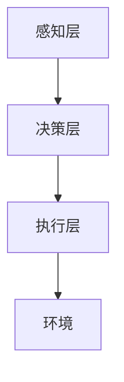
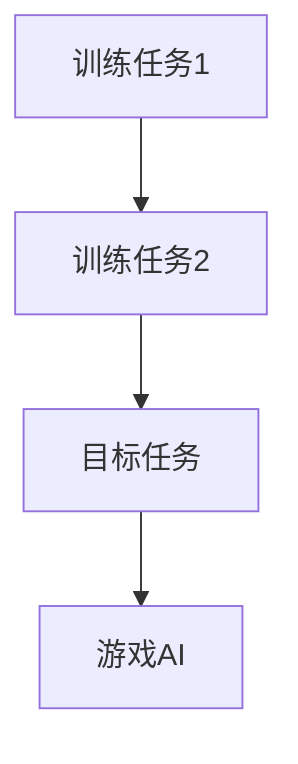
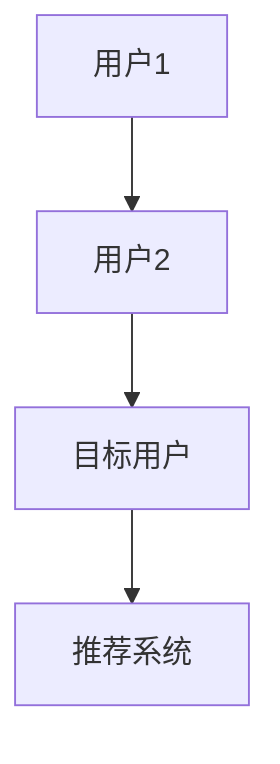

                 


# 元学习在AI Agent中的应用：快速适应新任务

> 关键词：元学习（Meta-Learning），AI Agent，快速适应，任务迁移，算法优化，系统架构

> 摘要：元学习（Meta-Learning）是一种新兴的机器学习范式，旨在通过学习如何学习，使模型能够在新任务上快速适应和表现优异。AI Agent作为具有自主决策和行动能力的智能体，其核心目标是通过与环境的交互，实现高效的任务执行和快速适应能力。本文深入探讨元学习在AI Agent中的应用，从理论基础到算法实现，再到系统设计，系统性地分析如何利用元学习提升AI Agent的快速适应能力。文章首先介绍元学习和AI Agent的基本概念，随后分析元学习的核心原理和算法，接着探讨AI Agent的系统架构设计，再通过实际案例展示元学习在AI Agent中的应用效果，最后总结元学习在AI Agent中的优势和未来发展方向。

---

## 第一部分：元学习与AI Agent的背景与概念

### 第1章：元学习与AI Agent的基本概念

#### 1.1 元学习的基本概念

元学习是一种机器学习的高级范式，其核心目标是通过“学习如何学习”，使模型能够在新任务上快速适应和表现优异。与传统机器学习不同，元学习不依赖于大量标注数据，而是通过在多个任务上的训练，提取跨任务的共同特征，从而实现对新任务的快速泛化。

**1.1.1 元学习的定义与核心思想**
元学习是指通过在多个相关任务上训练模型，使模型能够快速适应新任务的能力。其核心思想是“学会如何学习”，即模型在训练过程中不仅学习任务本身的知识，还学习如何从新任务中提取有用的特征和策略。

**1.1.2 元学习与传统机器学习的区别**
| 特性 | 传统机器学习 | 元学习 |
|------|--------------|--------|
| 数据需求 | 需要大量标注数据 | 通过多个任务训练，减少对新任务数据的依赖 |
| 适应性 | 适用于固定任务 | 能够快速适应新任务 |
| 知识迁移 | 依赖任务间的相似性 | 提取跨任务的共同特征 |

**1.1.3 元学习的应用场景**
元学习在多个领域都有广泛应用，例如：
- **图像分类**：在小样本数据上快速分类新类别。
- **自然语言处理**：在低资源语言上进行快速训练。
- **游戏AI**：在新环境中快速学习策略。

#### 1.2 AI Agent的基本概念

AI Agent（人工智能代理）是指能够感知环境、自主决策并采取行动的智能体。AI Agent的核心目标是通过与环境的交互，实现高效的任务执行和快速适应能力。

**1.2.1 AI Agent的定义与分类**
AI Agent可以分为以下几类：
- **简单反射型Agent**：基于当前感知做出反应，不依赖内部状态。
- **基于模型的反射型Agent**：维护环境的状态模型，并基于模型做出决策。
- **目标驱动型Agent**：具有明确的目标，并采取行动以实现目标。
- **效用驱动型Agent**：基于效用函数进行决策，最大化效用值。

**1.2.2 AI Agent的核心功能与特点**
AI Agent的核心功能包括：
- **感知**：通过传感器或接口获取环境信息。
- **决策**：基于感知信息和内部状态，制定行动策略。
- **行动**：执行决策的动作，与环境交互。
- **学习**：通过经验优化自身的决策模型。

**1.2.3 AI Agent在不同领域的应用**
- **自动驾驶**：通过感知环境和决策系统实现自主驾驶。
- **智能助手**：如Siri、Alexa，通过与用户的交互提供服务。
- **机器人控制**：在制造业中实现自动化操作。

#### 1.3 元学习与AI Agent的结合

元学习与AI Agent的结合，旨在提升AI Agent的快速适应能力，使其能够在新环境中快速学习并执行任务。

**1.3.1 元学习在AI Agent中的作用**
元学习通过提取跨任务的共同特征，帮助AI Agent在新任务上快速泛化，减少对新任务数据的依赖。

**1.3.2 元学习如何提升AI Agent的适应能力**
通过元学习，AI Agent能够在新任务上快速调整其决策模型，适应新的环境和目标。

**1.3.3 元学习在AI Agent中的应用前景**
元学习为AI Agent提供了强大的快速学习能力，未来将在更多领域得到广泛应用，例如动态环境中的自主决策、多任务学习等。

---

## 第二部分：元学习的核心概念与算法原理

### 第2章：元学习的核心概念

#### 2.1 元学习的原理与数学模型

元学习的数学模型通常包括两个层次：元任务和目标任务。通过在多个元任务上训练，模型能够在目标任务上快速适应。

**2.1.1 元学习的优化目标**
元学习的优化目标是通过优化元任务的损失函数，使得模型能够在目标任务上取得较低的损失。

$$ \text{元任务损失} = \sum_{i=1}^{N} \mathcal{L}_i(\theta) $$
$$ \text{目标任务损失} = \mathcal{L}_{\text{new}}(\theta') $$
$$ \theta' = \theta + \eta (\theta - \theta') $$

**2.1.2 元学习的数学公式与推导**
元学习通过在多个任务上优化参数，使得参数在目标任务上能够快速调整。

$$ \min_{\theta} \sum_{i=1}^{N} \mathcal{L}_i(\theta) + \lambda \mathcal{R}(\theta) $$
其中，$\mathcal{R}(\theta)$是正则化项，用于提取跨任务的共同特征。

**2.1.3 元学习的算法流程**
1. 在多个元任务上训练模型，提取跨任务的特征。
2. 在目标任务上，利用提取的特征快速调整模型参数。

#### 2.2 元学习与传统机器学习的对比

| 特性 | 传统机器学习 | 元学习 |
|------|--------------|--------|
| 数据需求 | 高 | 低 |
| 适应性 | 低 | 高 |
| 知识迁移 | 单任务 | 多任务 |

#### 2.3 元学习的算法实现

**2.3.1 元学习算法的实现步骤**
1. 选择多个元任务，进行训练。
2. 提取跨任务的共同特征。
3. 在目标任务上，利用提取的特征快速调整模型。

**2.3.2 元学习算法的代码实现**

```python
def meta_learning_algorithm(train_tasks, test_task):
    # 在多个训练任务上优化模型参数
    for task in train_tasks:
        optimize_model(task)
    # 在测试任务上进行微调
    optimize_model(test_task, fine_tune=True)
```

**2.3.3 元学习算法的优化技巧**
- 使用适应性学习率，减少目标任务上的调整时间。
- 通过正则化项，提取跨任务的共同特征。

---

## 第三部分：AI Agent的系统架构与设计

### 第3章：AI Agent的系统架构设计

#### 3.1 AI Agent的系统架构

AI Agent的系统架构通常包括感知层、决策层和执行层。元学习可以嵌入到决策层，通过快速调整决策模型，提升AI Agent的适应能力。

**3.1.1 AI Agent的系统架构图**



**3.1.2 元学习在AI Agent中的位置**
元学习主要应用于决策层，通过快速调整决策模型，提升AI Agent的适应能力。

---

## 第四部分：元学习在AI Agent中的应用

### 第4章：元学习在AI Agent中的实际应用

#### 4.1 游戏AI中的应用

元学习可以帮助游戏AI在新环境中快速学习策略，例如在《星际争霸》中快速适应新的战术。

**4.1.1 游戏AI的元学习训练流程**



#### 4.2 推荐系统中的应用

元学习可以帮助推荐系统在新用户或新物品上快速适应，提升推荐的准确率。

**4.2.1 推荐系统的元学习训练流程**



---

## 第五部分：项目实战与系统实现

### 第5章：系统实现

#### 5.1 环境配置

- Python 3.8+
- TensorFlow或PyTorch框架
- 其他依赖库，如numpy、pandas等。

#### 5.2 核心代码实现

```python
import tensorflow as tf

def meta_learning_model():
    # 元学习模型的定义
    model = tf.keras.Sequential([
        tf.keras.layers.Dense(128, activation='relu'),
        tf.keras.layers.Dense(10, activation='softmax')
    ])
    return model

def meta_learning_training(model, tasks):
    # 元学习训练过程
    for task in tasks:
        # 训练模型在当前任务上
        model.train(task)
        # 元学习优化
        meta_optimize(model)

# 示例用法
model = meta_learning_model()
tasks = [...]  # 元任务列表
meta_learning_training(model, tasks)
```

#### 5.3 系统接口设计

- 输入接口：接收环境感知数据。
- 输出接口：发送决策指令。

---

## 第六部分：总结与展望

### 第6章：总结与展望

#### 6.1 总结

元学习在AI Agent中的应用，显著提升了其快速适应新任务的能力。通过元学习，AI Agent能够在新环境中快速调整其决策模型，实现高效的任务执行。

#### 6.2 展望

未来，元学习在AI Agent中的应用将更加广泛。随着算法的优化和计算能力的提升，元学习将帮助AI Agent在更多领域实现快速学习和决策。

---

## 作者信息

作者：AI天才研究院/AI Genius Institute & 禅与计算机程序设计艺术 /Zen And The Art of Computer Programming

---

以上是《元学习在AI Agent中的应用：快速适应新任务》的技术博客文章的大纲和部分内容。完整文章将详细展开每一部分的内容，确保逻辑清晰、内容丰富且技术深度到位。

