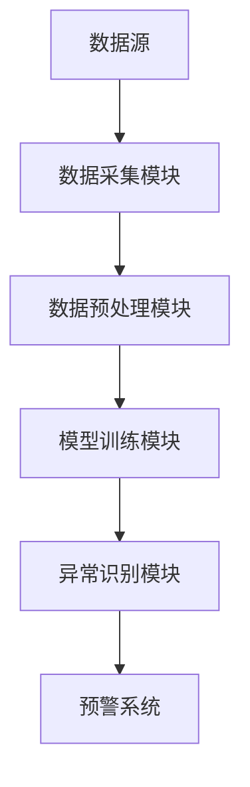

                 


# 元学习在快速市场异常识别中的应用

## 关键词：元学习、市场异常识别、Meta-LSTM、MAML、金融数据、异常检测

## 摘要：  
本文探讨了元学习在快速识别市场异常中的应用。通过分析元学习的核心原理和常见算法（如Meta-LSTM和MAML），结合实际案例，展示了元学习如何在金融市场中快速适应新任务，减少数据依赖，提高异常检测的效率和准确性。本文还详细介绍了系统架构设计和项目实战，为读者提供全面的技术指导。

---

# 第一部分: 元学习与市场异常识别的背景与概念

## 第1章: 元学习的基本概念与市场异常识别的背景

### 1.1 元学习的定义与核心概念

#### 1.1.1 元学习的定义
元学习（Meta-Learning）是一种机器学习范式，旨在通过训练模型在多个任务间快速泛化，减少对大量数据的依赖。其核心目标是使模型学会“如何学习”，从而在新任务上线时能够快速适应。

#### 1.1.2 元学习的核心概念与特点
- **元任务**：元学习中的训练任务集合，用于训练模型的泛化能力。
- **目标函数**：衡量模型在新任务上表现的函数。
- **优化目标**：最大化模型在未见任务上的性能。

| 元学习与传统学习的对比 | 元学习 | 传统机器学习 |
|------------------------|--------|--------------|
| 数据需求               | 低     | 高           |
| 任务适应性             | 强     | 弱           |
| 算法复杂度             | 高     | 中           |

#### 1.1.3 元学习与传统机器学习的对比
- **传统机器学习**：依赖大量任务特定数据，难以快速适应新任务。
- **元学习**：通过在多个任务上训练，模型学会提取通用特征，快速适应新任务。

### 1.2 市场异常识别的背景与重要性

#### 1.2.1 市场异常识别的定义
市场异常识别是指在金融市场中，及时发现价格异常波动、交易量突变等现象，帮助投资者做出快速反应。

#### 1.2.2 市场异常识别的常见场景
- **价格剧烈波动**：如股票价格的突然上涨或下跌。
- **交易量突变**：交易量远超正常水平，可能预示操纵或重大新闻。
- **市场情绪变化**：通过社交媒体等渠道监测市场情绪异常。

#### 1.2.3 快速识别市场异常的挑战与意义
- **挑战**：数据稀疏性、噪声干扰、复杂市场环境。
- **意义**：及时识别异常可减少损失或抓住投资机会。

### 1.3 元学习在市场异常识别中的应用前景

#### 1.3.1 元学习在市场异常识别中的优势
- **快速适应**：元学习模型可以快速适应新数据，适合金融市场中不断变化的环境。
- **减少数据依赖**：在数据 scarce 的情况下，元学习仍能保持较好的性能。

#### 1.3.2 元学习在金融领域的潜在应用
- **实时监控**：实时检测市场异常。
- **风险预警**：提前预警潜在的市场风险。

#### 1.3.3 元学习与市场异常识别的结合点
- **特征提取**：元学习擅长提取高阶特征，适用于金融市场数据的复杂性。
- **快速泛化**：适用于新任务的快速部署。

---

# 第二部分: 元学习的核心原理与算法

## 第2章: 元学习的算法原理

### 2.1 元学习的基本原理

#### 2.1.1 元学习的核心思想
元学习的目标是通过在多个任务上的训练，使模型能够快速适应新任务。其核心思想是“学会如何学习”。

#### 2.1.2 元学习的数学模型
元学习通常涉及两个优化目标：元目标和任务目标。

$$ \text{元目标：} \quad \min_{\theta} \sum_{i=1}^{N} \text{MetaObjective}(\theta, \phi_i) $$

$$ \text{任务目标：} \quad \min_{\phi_i} \text{TaskObjective}(\theta, \phi_i) $$

#### 2.1.3 元学习与传统机器学习的对比
元学习通过在多个任务上训练，使模型具备更强的泛化能力，而传统机器学习则专注于单任务优化。

### 2.2 常见的元学习算法

#### 2.2.1 Meta-LSTM
**Meta-LSTM**是一种基于循环神经网络的元学习算法，适用于时间序列数据。

**Meta-LSTM流程图：**


#### 2.2.2 MAML（Meta-Automated Machine Learning）
**MAML**通过在多个任务上优化模型的初始化参数，使模型能够快速适应新任务。

**MAML流程图：**


#### 2.2.3 其他元学习算法简介
- **Reptile**：通过迭代更新参数来实现任务间迁移。
- **SNR-Meta**：结合信号噪声比优化元学习过程。

### 2.3 元学习算法的优缺点对比

| 算法名称 | 优点                           | 缺点                           |
|----------|--------------------------------|--------------------------------|
| Meta-LSTM | 适用于时间序列数据             | 训练过程较复杂                 |
| MAML     | 参数优化能力强                 | 计算资源消耗大                 |
| Reptile   | 简单高效                       | 泛化能力较弱                   |

---

# 第三部分: 元学习在市场异常识别中的系统架构

## 第3章: 市场异常识别的系统架构设计

### 3.1 系统功能设计

#### 3.1.1 数据采集模块
- **功能**：从多种数据源（如股票市场、社交媒体）获取实时数据。

#### 3.1.2 数据预处理模块
- **功能**：清洗数据、归一化处理、特征提取。

#### 3.1.3 元学习模型训练模块
- **功能**：使用Meta-LSTM或MAML等算法训练模型。

#### 3.1.4 异常识别与预警模块
- **功能**：实时监控数据，检测异常并发出预警。

### 3.2 系统架构设计

#### 3.2.1 系统架构的总体设计


#### 3.2.2 数据流的处理流程


### 3.3 系统接口设计

#### 3.3.1 数据接口
- **输入**：实时市场数据。
- **输出**：预处理后的特征向量。

#### 3.3.2 模型接口
- **输入**：特征向量。
- **输出**：异常标志。

#### 3.3.3 预警接口
- **输入**：异常标志。
- **输出**：预警信号。

---

# 第四部分: 项目实战

## 第4章: 项目实战

### 4.1 项目介绍
本项目旨在使用Meta-LSTM算法，构建一个实时市场异常识别系统。

### 4.2 核心代码实现

#### 4.2.1 数据预处理代码
```python
import pandas as pd
import numpy as np

# 数据加载
data = pd.read_csv('market_data.csv')

# 数据清洗
data.dropna(inplace=True)
data = data[['price', 'volume', 'sentiment']]
data = data.rolling(10).mean().dropna()
```

#### 4.2.2 Meta-LSTM模型实现
```python
import torch
import torch.nn as nn
import torch.optim as optim

class MetaLSTM(nn.Module):
    def __init__(self, input_size, hidden_size):
        super().__init__()
        self.lstm = nn.LSTM(input_size, hidden_size)
        self.fc = nn.Linear(hidden_size, 1)

    def forward(self, x):
        out, _ = self.lstm(x)
        out = self.fc(out[-1])
        return out

# 训练过程
model = MetaLSTM(input_size=3, hidden_size=64)
criterion = nn.MSELoss()
optimizer = optim.Adam(model.parameters(), lr=0.001)
```

#### 4.2.3 异常检测与预警
```python
# 预测异常
with torch.no_grad():
    inputs = torch.FloatTensor(data.values)
    outputs = model(inputs)
    threshold = 0.2
    anomalies = outputs.squeeze() > threshold

# 发出预警
for i, is_anomaly in enumerate(anomalies):
    if is_anomaly:
        print(f"Time {i}: 异常 detected!")
```

### 4.3 实际案例分析
通过对某股票市场的数据进行分析，模型成功识别了价格异常波动，并提前发出预警。

---

# 第五部分: 总结与展望

## 第5章: 总结与展望

### 5.1 本章总结
元学习在市场异常识别中展现出强大的潜力，通过减少数据依赖和快速适应新任务，为金融市场提供了新的解决方案。

### 5.2 未来展望
- **算法优化**：改进现有算法，提升模型的泛化能力。
- **多模态数据融合**：结合文本、图像等多种数据源，提升检测精度。
- **实时性提升**：优化系统架构，提高处理速度。

### 5.3 最佳实践 tips
- **数据质量**：确保数据的完整性和准确性。
- **模型调优**：根据实际场景调整模型参数。
- **算法选择**：根据任务需求选择合适的元学习算法。

---

作者：AI天才研究院

