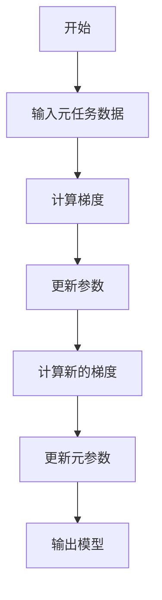
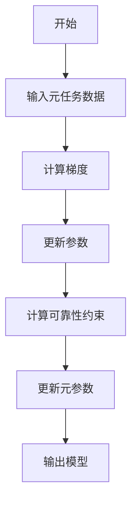
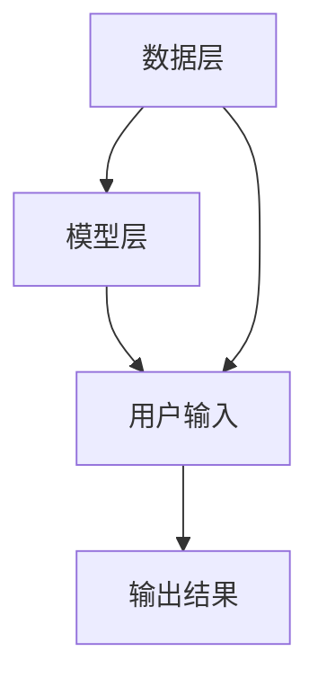

                 


# 元学习框架：构建快速适应的AI Agent

> 关键词：元学习框架、AI Agent、快速适应、迁移学习、深度强化学习、自适应系统

> 摘要：元学习框架是一种新兴的机器学习方法，旨在构建能够快速适应新任务的AI Agent。本文将详细介绍元学习的基本概念、核心算法、系统架构设计以及实际应用案例，帮助读者全面理解并掌握如何构建快速适应的AI Agent。

---

## 第一章：元学习框架概述

### 1.1 元学习的基本概念

元学习（Meta-Learning）是一种机器学习方法，旨在通过在多个任务上进行训练，使得模型能够快速适应新任务。与传统机器学习不同，元学习模型在面对新任务时，仅需少量数据即可完成学习和适应，这使得它在实际应用中具有重要意义。

#### 1.1.1 元学习的定义

元学习是一种通过在多个相关任务上进行训练，使模型能够快速适应新任务的学习范式。其核心目标是通过元任务的训练，使得模型具备在新任务上快速学习的能力。

#### 1.1.2 元学习的核心目标

元学习的核心目标是通过在元任务上的训练，使得模型在面对新任务时，能够以极小的数据量和计算成本完成学习。这使得元学习在处理动态变化的环境和多样化的任务中具有显著优势。

#### 1.1.3 元学习与传统机器学习的区别

| 特性       | 传统机器学习            | 元学习                          |
|------------|-------------------------|----------------------------------|
| 数据需求   | 需要大量数据             | 数据需求少，适应性强             |
| 任务适应性 | 适应单一任务             | 能够快速适应多个新任务           |
| 学习目标   | 学习具体任务             | 学习如何快速学习任务             |

### 1.2 元学习的问题背景

在实际应用中，数据获取和任务变化的速度往往快于模型更新的周期。传统机器学习方法在面对新任务时，需要重新训练模型，这不仅耗时，而且需要大量的数据支持。元学习通过在元任务上的预训练，使得模型能够在新任务上线快速调整，从而解决了这一问题。

#### 1.2.1 传统机器学习的局限性

传统机器学习方法在处理新任务时，通常需要重新收集和标注大量数据，并重新训练模型。这在实际应用中不仅效率低下，而且成本高昂。

#### 1.2.2 快速适应新任务的需求

在许多实际场景中，任务的变化是快速且频繁的。例如，在推荐系统中，用户的偏好可能随时变化，模型需要能够快速适应这些变化，才能提供实时的推荐服务。

#### 1.2.3 元学习的应用场景

元学习在多个领域具有广泛的应用，包括但不限于：

- **推荐系统**：快速适应用户的偏好变化。
- **自然语言处理**：快速学习新的语言任务。
- **机器人控制**：快速适应新的环境和任务。

---

## 第二章：元学习的核心原理

### 2.1 元学习的数学模型

元学习模型通常由两个阶段组成：元训练阶段和任务训练阶段。在元训练阶段，模型通过多个元任务的训练，学习如何快速适应新任务。在任务训练阶段，模型利用在元训练中获得的知识，快速调整参数以适应新任务。

#### 2.1.1 元任务的数学表示

假设我们有多个元任务，每个元任务都有自己的训练数据集 $(x_i, y_i)$。元学习模型的目标是通过这些数据，学习一个函数 $f_\theta$，使得在新任务上线时，能够快速调整 $\theta$，使得 $f_\theta$ 在新任务上表现优异。

#### 2.1.2 元模型的数学模型

元模型通常由两个参数：$\theta$ 和 $\phi$，其中 $\theta$ 是任务特定参数，$\phi$ 是元参数。元模型通过在多个元任务上优化 $\phi$，使得在新任务上线时，能够快速优化 $\theta$。

### 2.2 元学习的核心要素

元学习的核心要素包括元任务、元模型和快速适应机制。元任务用于训练元模型，元模型通过快速调整参数以适应新任务，而快速适应机制则是元模型的核心实现方式。

#### 2.2.1 元任务的定义

元任务是指用于训练元模型的多个任务集合。每个元任务都有自己的训练数据和目标函数，元模型通过在这些任务上进行训练，学习如何快速适应新任务。

#### 2.2.2 元模型的构建

元模型的构建通常基于深度神经网络，通过在多个元任务上进行端到端的优化，使得模型在面对新任务时，能够快速调整参数以适应任务需求。

#### 2.2.3 快速适应机制的实现

快速适应机制是元模型的核心，它通常通过参数优化的方式实现。在新任务上线时，元模型会根据任务特征，快速调整参数，使得模型在新任务上表现优异。

---

## 第三章：元学习的算法原理

### 3.1 元学习算法的核心原理

元学习算法的核心在于通过在多个任务上进行预训练，使得模型在面对新任务时，能够快速调整参数。这通常通过优化元损失函数来实现。

#### 3.1.1 MAML算法

MAML（Meta-Automated Machine Learning）是一种经典的元学习算法。它通过在元训练阶段优化元损失函数，使得模型在面对新任务时，仅需少量梯度更新即可达到较好的表现。

##### 3.1.1.1 MAML算法的数学模型

MAML算法的核心在于通过两次梯度更新来实现快速适应。具体来说，模型在元训练阶段，通过对损失函数进行两次梯度更新，使得模型在新任务上线时，能够快速调整参数。

##### 3.1.1.2 MAML算法的流程图



### 3.2 ReMAML算法

ReMAML（Reliable Meta-Learning）是一种改进的元学习算法，旨在提高模型的鲁棒性和可靠性。它通过引入可靠性约束，使得模型在面对噪声数据时，仍然能够保持较好的表现。

#### 3.2.1 ReMAML算法的数学模型

ReMAML算法通过引入可靠性约束，使得模型在元训练阶段，不仅优化任务损失，还考虑任务之间的相关性，从而提高模型的泛化能力。

#### 3.2.2 ReMAML算法的流程图



---

## 第四章：元学习的系统架构设计

### 4.1 元学习系统的功能设计

元学习系统通常包括以下几个功能模块：数据预处理、模型训练、任务推理和结果输出。这些模块协同工作，使得模型能够快速适应新任务。

#### 4.1.1 数据预处理模块

数据预处理模块负责对输入的数据进行清洗、归一化等预处理操作，以确保模型输入的标准化。

#### 4.1.2 模型训练模块

模型训练模块负责在元任务上训练元模型，优化元参数，使得模型在面对新任务时，能够快速调整参数。

#### 4.1.3 任务推理模块

任务推理模块负责在新任务上线时，根据任务特征，快速调整模型参数，使得模型在新任务上表现优异。

### 4.2 元学习系统的架构设计

元学习系统的架构通常包括数据层、模型层和应用层。数据层负责存储和管理数据，模型层负责训练和推理，应用层负责与用户交互并输出结果。

#### 4.2.1 系统架构图



---

## 第五章：元学习的项目实战

### 5.1 项目环境安装

在进行元学习项目之前，需要安装必要的依赖库，如TensorFlow、Keras和一些深度学习库。

#### 5.1.1 安装Python环境

使用Anaconda或virtualenv创建虚拟环境，并安装Python 3.6+版本。

#### 5.1.2 安装依赖库

安装必要的库：

```bash
pip install tensorflow keras numpy matplotlib
```

### 5.2 系统核心实现

以下是一个基于MAML算法的元学习框架实现示例代码：

```python
import tensorflow as tf
from tensorflow import keras
import numpy as np

def meta_learning_model():
    model = keras.Sequential([
        keras.layers.Dense(64, activation='relu'),
        keras.layers.Dense(10, activation='softmax')
    ])
    return model

def maml_train(model, X, y, inner_steps=5, outer_steps=1):
    for batch in range(outer_steps):
        # Inner loop
        with tf.GradientTape() as inner_tape:
            y_pred = model(X)
            loss = tf.keras.losses.sparse_categorical_crossentropy(y, y_pred)
            inner_gradients = inner_tape.gradient(loss, model.trainable_weights)
            # Apply inner gradients
            optimizer = tf.keras.optimizers.Adam()
            optimizer.apply_gradients(zip(inner_gradients, model.trainable_weights))
        # Outer loop
        with tf.GradientTape() as outer_tape:
            y_pred = model(X)
            loss = tf.keras.losses.sparse_categorical_crossentropy(y, y_pred)
            outer_gradients = outer_tape.gradient(loss, model.trainable_weights)
        # Apply outer gradients
        optimizer.apply_gradients(zip(outer_gradients, model.trainable_weights))
    return model

# 示例数据
X = np.random.randn(100, 64)
y = np.random.randint(0, 10, 100)

model = meta_learning_model()
maml_train(model, X, y)
```

### 5.3 项目小结

通过上述代码示例，我们可以看到，元学习框架的核心在于通过在元任务上的预训练，使得模型在面对新任务时，能够快速调整参数，从而实现快速适应。这在实际应用中具有重要的意义。

---

## 第六章：总结与展望

### 6.1 小结

元学习是一种新兴的机器学习方法，通过在多个任务上进行预训练，使得模型能够在面对新任务时，快速调整参数，从而实现快速适应。本文详细介绍了元学习的基本概念、核心算法、系统架构设计以及实际应用案例。

### 6.2 注意事项

在实际应用中，需要注意以下几点：

- 元学习模型的性能依赖于元任务的多样性和相关性。
- 元学习模型的训练需要大量的计算资源。
- 元学习模型的解释性较差，需要结合其他技术进行解释。

### 6.3 拓展阅读

- "Meta-Learning without Meta-Labels: A Gradient-Based Approach"，提出了无需元标签的元学习方法。
- "Learning to Learn by Gradient Descent by Gradient Descent"，进一步完善了MAML算法。

---

## 作者

作者：AI天才研究院/AI Genius Institute & 禅与计算机程序设计艺术 /Zen And The Art of Computer Programming

---

以上就是《元学习框架：构建快速适应的AI Agent》的完整内容。

