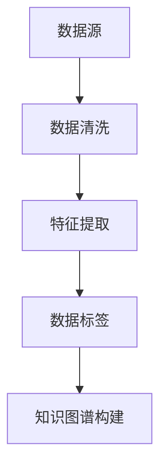
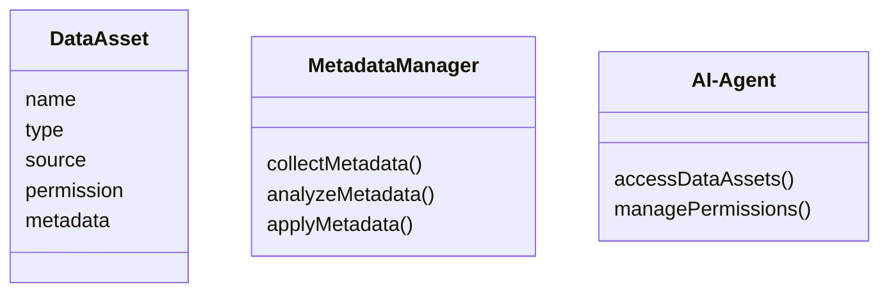

                 


# 元数据管理：组织和利用AI Agent的数据资产

## 关键词
元数据管理, AI Agent, 数据资产, 数据治理, 知识图谱, 数据架构

## 摘要
在当前数据爆炸的时代，AI Agent的应用日益广泛，如何有效地管理和利用数据资产成为关键问题。本文从元数据管理的基本概念出发，深入探讨其在AI Agent中的应用，结合实际案例和系统架构，详细分析了元数据管理的核心原理、算法实现、系统设计和最佳实践，为读者提供全面的解决方案。

---

## 第一章：元数据管理的背景与概念

### 1.1 元数据管理的定义与作用

#### 1.1.1 元数据的基本概念
元数据（Metadata）是对数据的描述性信息，用于帮助理解和管理数据。例如，一张图片的拍摄时间、分辨率等信息就是元数据。

#### 1.1.2 元数据在数据管理中的作用
元数据在数据管理中的作用包括数据的可追溯性、可理解性和可访问性。

#### 1.1.3 元数据与数据治理的关系
数据治理是通过元数据来实现数据的标准化、安全性和一致性管理。

### 1.2 元数据管理的背景与问题背景

#### 1.2.1 数据爆炸时代的挑战
数据量的快速增长导致数据管理和利用的难度增加。

#### 1.2.2 AI Agent的兴起与数据资产的重要性
AI Agent的应用依赖于高质量的数据资产，而元数据管理是确保数据资产有效利用的关键。

#### 1.2.3 元数据管理在企业中的必要性
企业需要通过元数据管理来实现数据资产的高效管理和利用。

### 1.3 元数据管理的核心目标

#### 1.3.1 数据的可追溯性与完整性
通过元数据记录数据的来源和变化，确保数据的完整性和可追溯性。

#### 1.3.2 数据的可理解性与一致性
通过元数据统一数据的描述和格式，确保数据的一致性和可理解性。

#### 1.3.3 数据的可访问性与安全性
通过元数据管理数据的访问权限和安全策略，确保数据的安全性和合规性。

---

## 第二章：元数据管理与AI Agent的关系

### 2.1 AI Agent的基本概念

#### 2.1.1 AI Agent的定义与分类
AI Agent是一种能够感知环境并执行任务的智能体，可以分为基于规则的AI Agent和基于模型的AI Agent。

#### 2.1.2 AI Agent的核心功能与应用场景
AI Agent的核心功能包括数据采集、数据处理和数据应用。应用场景包括智能客服、智能推荐和自动驾驶。

### 2.2 元数据在AI Agent中的作用

#### 2.2.1 数据资产的识别与分类
通过元数据管理，AI Agent能够准确识别和分类数据资产。

#### 2.2.2 数据资产的生命周期管理
元数据管理涵盖了数据的采集、存储、处理和应用等生命周期阶段。

#### 2.2.3 数据资产的访问控制与权限管理
元数据管理确保数据资产的访问权限符合企业的安全策略。

### 2.3 元数据管理对AI Agent的优化作用

#### 2.3.1 提高数据利用率
通过元数据管理，AI Agent能够快速定位和利用所需数据。

#### 2.3.2 降低数据管理成本
元数据管理通过自动化工具和标准化流程降低数据管理的成本。

#### 2.3.3 提升数据治理能力
元数据管理帮助AI Agent更好地实现数据治理，确保数据的质量和合规性。

---

## 第三章：元数据管理的核心概念与原理

### 3.1 元数据管理的核心原理

#### 3.1.1 元数据的采集与存储
元数据采集包括数据的来源、时间戳和格式等信息，存储在数据库或知识图谱中。

#### 3.1.2 元数据的处理与分析
通过数据清洗和特征提取，对元数据进行处理和分析，生成可用的元数据结构。

#### 3.1.3 元数据的应用与展示
将元数据应用于数据治理和知识图谱构建，并通过可视化工具展示元数据信息。

### 3.2 核心概念与联系

#### 3.2.1 元数据管理的核心概念对比
| 核心概念 | 描述 |
|----------|------|
| 数据源   | 数据的原始来源 |
| 数据格式 | 数据的存储格式 |
| 数据权限 | 数据的访问权限 |
| 数据标签 | 数据的分类标签 |

#### 3.2.2 元数据管理的ER实体关系图
```mermaid
er
actor: 用户
Metadata: 元数据
DataAsset: 数据资产
DataGovernance: 数据治理

actor --> Metadata: 查询元数据
Metadata --> DataAsset: 描述数据资产
DataAsset --> DataGovernance: 应用数据治理
```

---

## 第四章：元数据管理的算法原理

### 4.1 元数据管理的算法实现

#### 4.1.1 算法概述
基于图的元数据关联算法，用于构建数据资产的知识图谱。

#### 4.1.2 算法流程


#### 4.1.3 算法实现代码
```python
import networkx as nx

def build_metadata_graph(data_assets):
    G = nx.Graph()
    for asset in data_assets:
        G.add_node(asset['name'])
        for related_asset in asset['related_assets']:
            G.add_edge(asset['name'], related_asset['name'])
    return G
```

#### 4.1.4 算法数学模型
构建知识图谱的邻接矩阵表示：
$$
A_{ij} = \begin{cases}
1 & \text{如果数据资产 } i \text{ 和 } j \text{ 关联} \\
0 & \text{否则}
\end{cases}
$$

---

## 第五章：系统分析与架构设计

### 5.1 系统分析

#### 5.1.1 问题场景介绍
企业级数据治理中的数据资产管理问题。

#### 5.1.2 项目介绍
构建一个基于元数据管理的AI Agent数据管理系统。

### 5.2 系统功能设计

#### 5.2.1 领域模型类图


### 5.3 系统架构设计

#### 5.3.1 系统架构图


#### 5.3.2 系统接口设计
```mermaid
sequence
actor -> MetadataManager: 查询元数据
MetadataManager -> DataAssetStorage: 获取数据资产信息
DataAssetStorage -> MetadataManager: 返回数据资产信息
MetadataManager -> actor: 显示结果
```

---

## 第六章：项目实战

### 6.1 环境安装

#### 6.1.1 安装Python和依赖库
安装Python 3.8及以上版本，安装网络x库：
```bash
pip install networkx
```

### 6.2 核心代码实现

#### 6.2.1 数据采集与处理
```python
import requests

def collect_metadata(api_url):
    response = requests.get(api_url)
    return response.json()
```

#### 6.2.2 元数据应用
```python
def apply_metadata(metadata, assets):
    for asset in assets:
        asset['metadata'] = metadata[asset['name']]
    return assets
```

### 6.3 实际案例分析
通过一个企业数据治理案例，展示元数据管理在AI Agent中的实际应用。

---

## 第七章：最佳实践与总结

### 7.1 总结与小结

#### 7.1.1 元数据管理的关键点
数据的可追溯性、可理解性和可访问性是元数据管理的核心。

#### 7.1.2 元数据管理的未来方向
元数据管理将与区块链和知识图谱技术结合，进一步提升数据治理能力。

### 7.2 注意事项与Tips

#### 7.2.1 数据治理中的常见问题
确保元数据的准确性和及时性。

#### 7.2.2 元数据管理的实施建议
采用自动化工具和标准化流程。

### 7.3 拓展阅读

#### 7.3.1 相关书籍
《大数据治理：方法与实践》

#### 7.3.2 相关论文
“Metadata Management in AI-Driven Data Systems”

---

## 作者：AI天才研究院

本文作者：AI天才研究院  
文章出处：禅与计算机程序设计艺术  
邮箱：contact@aitaishu.com

