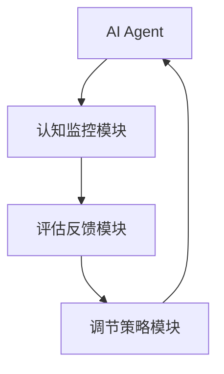

                 


# 元认知AI Agent：自我监控与调节

> 关键词：元认知AI Agent、自我监控、自我调节、AI代理、人工智能系统  
> 摘要：本文深入探讨了元认知AI Agent的核心概念、设计原理、系统架构及实际应用。通过分析元认知AI Agent的自我监控与调节机制，结合具体算法和系统设计，展示了其在提升AI系统性能和适应性中的重要作用。

---

## 第一部分：元认知AI Agent的背景与核心概念

### 第1章：元认知AI Agent的背景与问题背景

#### 1.1 元认知AI Agent的背景

元认知（Metacognition）是指个体对自身认知过程的认知和调控能力，包括对思维过程的监控、评估和调节。AI Agent（智能体）是一种能够感知环境并采取行动以实现特定目标的智能系统。元认知AI Agent的提出，将元认知能力引入AI Agent的设计中，使其具备自我监控与调节的能力，从而提升其智能性和适应性。

#### 1.2 元认知AI Agent的问题背景

传统的AI Agent通常依赖预设的规则和数据进行决策，缺乏对自身行为的反思和调整能力。在复杂多变的环境中，这种单一的决策机制容易导致适应性不足、错误累积等问题。例如，在动态任务分配或不确定性较高的场景中，传统AI Agent可能无法有效调整策略，导致效率低下或错误决策。

#### 1.3 元认知AI Agent的问题解决

元认知AI Agent通过引入元认知能力，能够实时监控自身的认知过程，评估当前策略的有效性，并根据评估结果动态调整行为。这种能力使得AI Agent能够更好地应对复杂环境中的挑战，例如动态任务切换、多目标优化等问题。

#### 1.4 元认知AI Agent的边界与外延

元认知AI Agent的研究范围主要集中在认知过程的监控与调节机制，其边界包括但不限于：  
1. 元认知AI Agent的设计与实现方法；  
2. 元认知能力在AI Agent中的具体应用；  
3. 元认知AI Agent与其他AI技术（如强化学习、知识图谱）的结合。  
其外延则包括：认知科学、人机交互、分布式AI系统等领域的交叉研究。

#### 1.5 元认知AI Agent的核心概念

元认知AI Agent的核心概念包括：  
- **元认知监控**：对AI Agent的认知过程进行实时监控，包括任务执行状态、策略选择、决策结果等。  
- **元认知评估**：对监控结果进行评估，判断当前行为的有效性。  
- **元认知调节**：根据评估结果，动态调整AI Agent的行为策略或认知模型。  
- **自适应学习**：通过元认知调节，实现AI Agent的自适应学习能力。

---

### 第2章：元认知AI Agent的核心概念与联系

#### 2.1 元认知AI Agent的核心原理

元认知AI Agent的核心原理在于将元认知能力与AI Agent的智能行为相结合，通过以下步骤实现自我监控与调节：  
1. **认知监控**：AI Agent实时监控自身的认知过程，包括感知、推理、决策等环节。  
2. **评估与反馈**：根据监控结果，评估当前行为的有效性，并生成反馈信息。  
3. **策略调整**：基于反馈信息，动态调整AI Agent的行为策略或认知模型。  

#### 2.2 元认知AI Agent的属性特征对比表

| 特性               | 传统AI Agent                 | 元认知AI Agent               |
|--------------------|------------------------------|-------------------------------|
| 监控能力           | 无或有限                     | 具备元认知监控能力           |
| 自适应性           | 基于固定规则或有限调整       | 基于元认知的动态自适应       |
| 策略调节           | 预设或静态调整               | 动态评估与调节               |

#### 2.3 元认知AI Agent的ER实体关系图

```mermaid
er
actor Role {
  id
  name
}

AI Agent {
  id
  name
  action
  status
}

Cognitive Process {
  id
  type
  description
}

Metacognitive Monitoring {
  id
  monitoring_time
  feedback
}

AI Agent -- "执行"--> Cognitive Process
Cognitive Process -- "生成"--> Metacognitive Monitoring
Metacognitive Monitoring -- "触发"--> Adjustment Strategy
```

---

## 第三部分：元认知AI Agent的算法原理讲解

### 第3章：元认知AI Agent的算法原理

#### 3.1 元认知AI Agent的核心算法

元认知AI Agent的核心算法包括：  
1. **元认知监控算法**：用于实时监控AI Agent的认知过程。  
2. **元认知评估算法**：基于监控结果进行评估和反馈。  
3. **元认知调节算法**：根据评估结果动态调整AI Agent的行为策略。

#### 3.2 元认知AI Agent的数学模型与公式

元认知AI Agent的评估与调节过程可以用以下数学模型表示：  

**评估函数**：  
$$ f(evaluation) = \alpha \cdot Q(s, a) + (1 - \alpha) \cdot R $$  
其中，$Q(s, a)$ 是传统的Q值，$R$ 是反馈奖励，$\alpha$ 是学习率。  

**调节函数**：  
$$ \pi(a|s) = \frac{e^{\beta \cdot Q(s, a)}}{\sum_{a'} e^{\beta \cdot Q(s, a')}} $$  
其中，$\beta$ 是调节参数，用于动态调整策略。

#### 3.3 元认知AI Agent的算法实现

以下是一个简单的元认知AI Agent算法的Python实现示例：

```python
class MetaCognitiveAgent:
    def __init__(self, state_space, action_space):
        self.state_space = state_space
        self.action_space = action_space
        self.Q = np.zeros((state_space, action_space))
        self.beta = 0.1

    def meta_cognitive_monitor(self, state, action, reward):
        # 元认知监控
        self.Q[state][action] = self.Q[state][action] + self.beta * (reward - self.Q[state][action])

    def meta_cognitive_adjust(self):
        # 元认知调节
        max_Q = np.max(self.Q, axis=1)
        adjustment = np.exp(self.Q / max_Q.mean())
        return adjustment

    def act(self, state):
        # 动作选择
        if np.random.random() < 0.1:
            return np.random.randint(self.action_space)
        else:
            return np.argmax(self.Q[state])
```

---

## 第四部分：元认知AI Agent的系统分析与架构设计

### 第4章：元认知AI Agent的系统分析与架构设计

#### 4.1 元认知AI Agent的系统功能设计

元认知AI Agent的系统功能包括：  
1. **认知监控模块**：实时监控AI Agent的认知过程。  
2. **评估反馈模块**：根据监控结果生成反馈信息。  
3. **策略调节模块**：基于反馈信息动态调整策略。  

#### 4.2 元认知AI Agent的系统架构设计



---

## 第五部分：元认知AI Agent的项目实战

### 第5章：元认知AI Agent的项目实战

#### 5.1 元认知AI Agent的环境安装

1. 安装必要的Python库：  
   ```bash
   pip install numpy matplotlib
   ```

2. 安装Mermaid图表生成工具：  
   ```bash
   npm install -g mermaid-js
   ```

#### 5.2 元认知AI Agent的核心代码实现

```python
import numpy as np
import matplotlib.pyplot as plt

class MetaCognitiveAgent:
    def __init__(self, state_space, action_space):
        self.state_space = state_space
        self.action_space = action_space
        self.Q = np.zeros((state_space, action_space))
        self.beta = 0.1

    def meta_cognitive_monitor(self, state, action, reward):
        self.Q[state][action] += self.beta * (reward - self.Q[state][action])

    def meta_cognitive_adjust(self):
        adjustment = np.exp(self.Q / np.mean(np.max(self.Q, axis=1)))
        return adjustment

    def act(self, state):
        if np.random.random() < 0.1:
            return np.random.randint(self.action_space)
        else:
            return np.argmax(self.Q[state])

# 示例环境
state_space = 5
action_space = 3
agent = MetaCognitiveAgent(state_space, action_space)

# 模拟运行
rewards = []
for _ in range(100):
    state = np.random.randint(state_space)
    action = agent.act(state)
    reward = np.random.randint(0, 10)
    agent.meta_cognitive_monitor(state, action, reward)
    rewards.append(reward)

plt.plot(rewards)
plt.xlabel('Time Step')
plt.ylabel('Reward')
plt.show()
```

---

## 第六部分：总结与展望

### 第6章：总结与展望

#### 6.1 元认知AI Agent的核心小结

元认知AI Agent通过引入元认知能力，显著提升了AI Agent的自我监控与调节能力，使其能够更好地应对复杂环境中的挑战。通过实时监控、评估和调节，元认知AI Agent实现了动态自适应，从而提高了系统的性能和适应性。

#### 6.2 元认知AI Agent的注意事项

在实际应用中，需要注意以下几点：  
1. 元认知AI Agent的设计需要结合具体场景和任务需求。  
2. 元认知监控和调节的实现需要平衡实时性和计算效率。  
3. 元认知AI Agent的模型和算法需要不断优化和迭代。

#### 6.3 元认知AI Agent的拓展阅读

1. 《强化学习：算法与应用》  
2. 《元认知与人工智能：理论与实践》  
3. 《自适应系统与动态环境》  

---

**作者：AI天才研究院/AI Genius Institute & 禅与计算机程序设计艺术 /Zen And The Art of Computer Programming**

