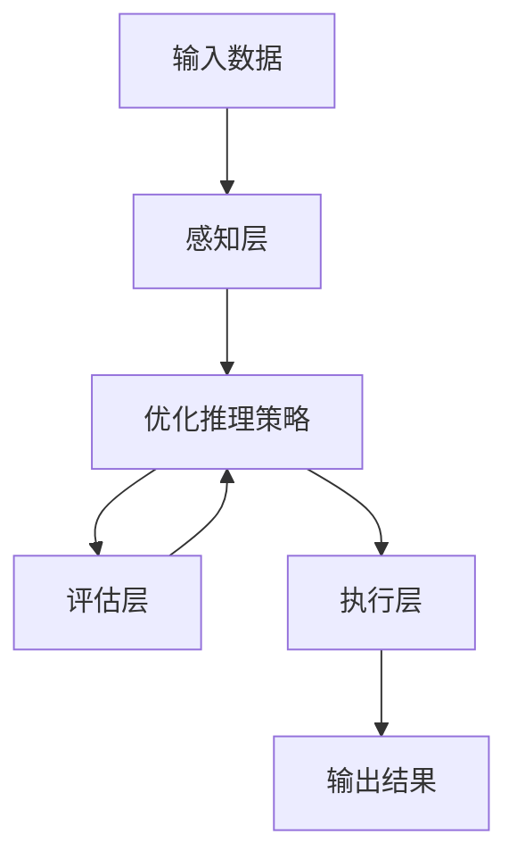

                 


# 元认知AI：具有自我评估能力的AI Agent

## 关键词：元认知AI，自我评估，AI Agent，元学习，自适应推理

## 摘要：  
元认知AI是一种具有自我评估能力的AI Agent，它能够通过元学习和自适应推理，动态优化自身的认知过程。本文从元认知AI的定义、核心原理、算法实现、系统架构到实际应用，全面探讨其技术细节和未来发展方向，帮助读者深入理解这一前沿领域的核心技术与应用潜力。

---

# 第1章 元认知AI的定义与背景

## 1.1 元认知AI的定义与背景

### 1.1.1 元认知AI的起源与发展  
元认知（Metacognition）一词最早由心理学家Flavell在20世纪70年代提出，指的是个体对自身认知过程的认知与调控能力。元认知AI的概念起源于对人脑认知机制的模拟，旨在赋予AI系统自我反思和优化的能力。随着深度学习和强化学习的快速发展，元认知AI逐渐从理论走向实践，成为AI领域的新兴研究方向。

### 1.1.2 元认知AI的核心概念  
元认知AI是一种能够对自身的认知过程进行监控、评估和优化的AI系统。它通过元学习（Meta-Learning）机制，能够在不同任务之间迁移知识，快速适应新的环境和问题。与传统AI不同，元认知AI不仅关注如何解决问题，还关注如何优化自身的解题过程。

### 1.1.3 元认知AI与传统AI的区别  
传统的AI系统（如基于规则的专家系统或深度学习模型）主要关注任务的解决，缺乏对自身认知过程的反思能力。而元认知AI则具备以下特点：  
- **自我监控**：能够实时监控自身的认知状态。  
- **自我评估**：能够对自身的决策过程进行评估和改进。  
- **自适应推理**：能够根据评估结果动态调整推理策略。  

---

## 1.2 元认知AI的背景与现状

### 1.2.1 AI发展的历史脉络  
AI的发展可以分为三个阶段：符号AI（基于规则）、统计AI（基于数据）和当前的生成式AI（基于大模型）。元认知AI是生成式AI的延伸，旨在赋予AI系统更强的自适应能力和自我优化能力。

### 1.2.2 当前AI技术的瓶颈与挑战  
尽管AI技术发展迅速，但在以下几个方面仍面临挑战：  
- **泛化能力不足**：AI模型在特定任务上表现优异，但在跨任务场景中适应性较差。  
- **数据依赖性强**：传统AI需要大量标注数据，难以应对小样本或零样本任务。  
- **可解释性不足**：复杂的AI模型难以解释其决策过程，影响实际应用的可信度。  

### 1.2.3 元认知AI的提出与意义  
元认知AI的提出为解决上述问题提供了新的思路。它通过自我评估和动态优化，能够提高AI系统的泛化能力、适应性和可解释性。元认知AI的核心在于其“元”能力：通过对自身认知过程的反思，实现更高效的任务处理和更灵活的环境适应。

---

# 第2章 元认知AI的核心概念与理论基础

## 2.1 元认知的基本原理

### 2.1.1 元认知的定义与特征  
元认知是指个体对自身认知过程的认知与调控能力。其核心特征包括：  
- **元认知意识**：对自身认知过程的觉察。  
- **元认知调控**：对认知过程的监控和调整。  
- **元认知评价**：对认知过程和结果的评估。  

### 2.1.2 元认知的三大核心功能  
1. **监控功能**：实时监控认知过程，识别问题和错误。  
2. **调节功能**：根据监控结果调整认知策略。  
3. **评估功能**：对认知过程和结果进行评估，总结经验教训。  

### 2.1.3 元认知与认知的关系  
元认知是对认知过程的“元”层次的思考，二者相辅相成。元认知能够指导认知过程，而认知过程的结果又为元认知提供反馈。

---

## 2.2 元认知AI的理论框架

### 2.2.1 元认知AI的系统架构  
元认知AI的系统架构通常包括以下模块：  
- **感知层**：负责接收输入数据并进行初步处理。  
- **认知层**：负责问题理解和推理。  
- **评估层**：负责对认知过程进行监控和评估。  
- **执行层**：根据评估结果调整行为策略。  

### 2.2.2 元认知AI的核心模块  
1. **元知识库**：存储元认知相关的知识和经验。  
2. **元学习引擎**：负责对认知过程进行优化。  
3. **自适应推理模块**：根据评估结果动态调整推理策略。  

### 2.2.3 元认知AI的运行机制  
1. **初始任务处理**：AI系统根据输入数据进行初步推理。  
2. **元评估**：元认知模块对推理过程进行监控和评估。  
3. **策略调整**：根据评估结果优化推理策略。  
4. **结果输出**：输出最终结果并存储经验。

---

## 2.3 元认知AI的数学模型与算法基础

### 2.3.1 元认知AI的数学模型  
元认知AI的数学模型通常基于元学习框架。以下是一个简化的元学习模型：

$$ L = \mathbb{E}_{(x,y) \sim D}[\mathcal{L}(f_\theta(x,y), y)] $$

其中，$L$ 是损失函数，$D$ 是数据分布，$\theta$ 是模型参数，$f_\theta$ 是模型。

### 2.3.2 元学习算法  
元学习的核心在于通过优化元损失函数（meta-objective function）来实现跨任务的参数更新。以下是一个简化的元学习更新公式：

$$ \theta_{t+1} = \theta_t - \eta \nabla_{\theta_t} \mathcal{L}_{\text{meta}}(\theta_t) $$

其中，$\eta$ 是学习率，$\mathcal{L}_{\text{meta}}$ 是元损失函数。

### 2.3.3 自适应推理算法  
自适应推理算法的核心在于动态调整推理策略。以下是一个自适应推理的伪代码示例：

```python
def adaptive_reasoning(input, knowledge_base):
    while not termination_condition:
        # 监控认知过程
        monitor = check_progress(input, knowledge_base)
        # 调整推理策略
        if monitor.error > threshold:
            knowledge_base.update()
            input = adjust_input(input)
    return result
```

---

## 2.4 元认知AI的系统架构与设计

### 2.4.1 系统架构  
以下是一个元认知AI系统的架构图（使用Mermaid语法）：



### 2.4.2 功能模块设计  
1. **感知层**：负责数据的输入和预处理。  
2. **认知层**：负责问题理解和初步推理。  
3. **评估层**：负责对推理过程进行监控和评估。  
4. **执行层**：根据评估结果优化行为策略。  

---

## 2.5 元认知AI的实现与应用

### 2.5.1 元认知AI的实现方法  
元认知AI的实现通常基于深度学习框架（如TensorFlow或PyTorch）。以下是一个简单的元学习代码示例：

```python
import tensorflow as tf

class MetaLearner(tf.keras.Model):
    def __init__(self):
        super(MetaLearner, self).__init__()
        self.base = tf.keras.Sequential([
            tf.keras.layers.Dense(64, activation='relu'),
            tf.keras.layers.Dense(10, activation='softmax')
        ])
        self.meta = tf.keras.Sequential([
            tf.keras.layers.Dense(64, activation='relu'),
            tf.keras.layers.Dense(10, activation='softmax')
        ])

    def call(self, inputs):
        base_logits = self.base(inputs)
        meta_logits = self.meta(base_logits)
        return base_logits, meta_logits

# 初始化元学习器
meta_learner = MetaLearner()
```

### 2.5.2 元认知AI的应用场景  
元认知AI目前在多个领域有广泛应用，如智能助手、教育科技和自动驾驶等。以下是一个智能助手的实现示例：

```python
def meta_assistant(question, knowledge_base):
    # 初始化元学习器
    meta_learner = MetaLearner()
    # 推理过程
    base_logits, meta_logits = meta_learner(question)
    # 根据元评估结果调整推理策略
    if meta_logits[0] > 0.5:
        knowledge_base.update()
    return base_logits
```

---

## 2.6 项目实战：基于元认知AI的智能助手开发

### 2.6.1 环境配置  
```bash
pip install tensorflow==2.5.0
pip install matplotlib==3.5.1
pip install numpy==1.21.2
```

### 2.6.2 核心代码实现  
```python
import tensorflow as tf
import numpy as np

class MetaLearner(tf.keras.Model):
    def __init__(self):
        super(MetaLearner, self).__init__()
        self.base = tf.keras.Sequential([
            tf.keras.layers.Dense(64, activation='relu'),
            tf.keras.layers.Dense(10, activation='softmax')
        ])
        self.meta = tf.keras.Sequential([
            tf.keras.layers.Dense(64, activation='relu'),
            tf.keras.layers.Dense(10, activation='softmax')
        ])

    def call(self, inputs):
        base_logits = self.base(inputs)
        meta_logits = self.meta(base_logits)
        return base_logits, meta_logits

# 定义损失函数
def meta_loss(y_true, y_pred, base_loss, meta_loss):
    total_loss = base_loss + meta_loss
    return total_loss

# 编译模型
meta_learner = MetaLearner()
meta_learner.compile(optimizer=tf.keras.optimizers.Adam(0.001), loss={'base': 'sparse_categorical_crossentropy', 'meta': 'sparse_categorical_crossentropy'})

# 训练模型
data = {'input': np.random.randn(100, 64), 'label': np.random.randint(0, 10, 100)}
history = meta_learner.fit(data['input'], {'base': data['label'], 'meta': data['label']}, epochs=10, verbose=1)
```

### 2.6.3 代码解读与优化  
- **MetaLearner类**：定义了元学习器的网络结构，包含基础网络和元网络。  
- **meta_loss函数**：定义了元损失函数，将基础任务损失和元任务损失结合。  
- **模型训练**：使用Adam优化器和交叉熵损失函数进行训练。  

### 2.6.4 测试与优化  
```python
# 测试模型
test_input = np.random.randn(1, 64)
base_logits, meta_logits = meta_learner(test_input)

# 输出结果
print("Base logits:", base_logits.numpy())
print("Meta logits:", meta_logits.numpy())
```

---

## 2.7 总结与展望

### 2.7.1 本章小结  
本章详细介绍了元认知AI的核心概念、理论基础和实现方法，并通过一个智能助手的开发案例，展示了元认知AI的实际应用。

### 2.7.2 未来展望  
未来，元认知AI将在以下方向进一步发展：  
1. **更高效的元学习算法**：探索更高效的元学习方法，降低对数据的依赖。  
2. **更强大的自适应能力**：提升AI系统在复杂环境中的自适应能力。  
3. **更高的可解释性**：通过可解释的元认知机制，增强AI系统的可信度。  

---

## 作者：AI天才研究院 & 禅与计算机程序设计艺术  
感谢您的阅读！如需进一步探讨，欢迎关注我们的公众号或访问官方网站。

