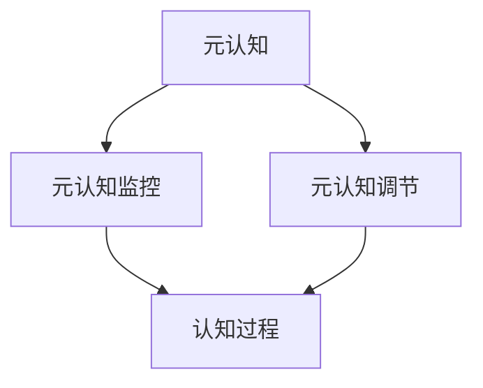
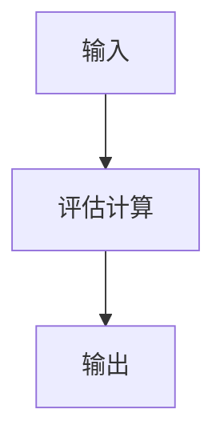
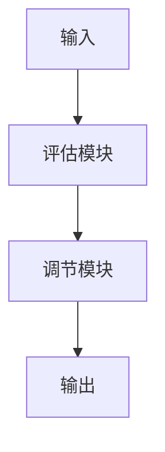
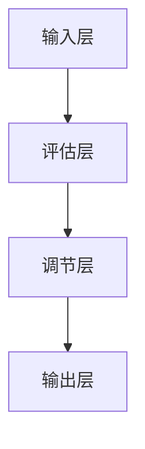
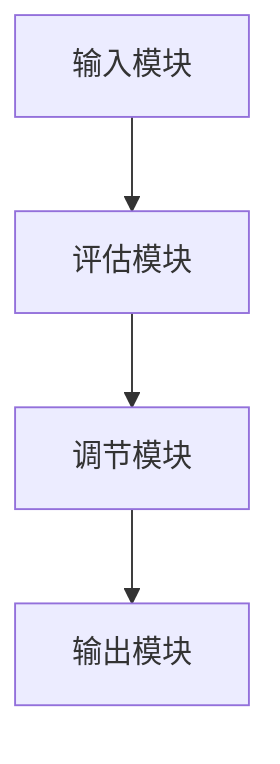

                 


# 元认知：赋予AI Agent自我评估能力

---

## 关键词：
元认知, AI Agent, 自我评估, 算法实现, 系统设计

---

## 摘要：
本文深入探讨了元认知如何赋予AI Agent自我评估能力，从基本概念到算法实现，再到系统设计，全面分析了元认知在AI Agent中的应用。通过数学模型、算法流程图和实际案例，本文详细解读了元认知如何帮助AI Agent实现自我监控、自我调节和自我优化，最终提升其智能水平和应用场景的广泛性。

---

## 第一章: 元认知与AI Agent概述

### 1.1 元认知的定义与特点
#### 1.1.1 元认知的定义
元认知（元认知，Metacognition）是指个体对自身认知过程的认知，包括对思维过程的监控、评估和调节。元认知的核心在于“认知之上的认知”，它使个体能够超越当前的认知任务，从更高层次上理解和控制自己的认知活动。

#### 1.1.2 元认知的核心特点
- **反思性**：元认知是对自身认知过程的反思和审视。
- **调控性**：元认知能够调节认知过程的方向和强度。
- **灵活性**：元认知能够根据环境变化动态调整认知策略。

#### 1.1.3 元认知与传统认知的区别
| 特性 | 传统认知 | 元认知 |
|------|----------|--------|
| 对象 | 认知内容 | 认知过程 |
| 层次 | 单层次   | 多层次 |
| 功能 | 获取信息 | 监控与调节 |

### 1.2 AI Agent的基本概念
#### 1.2.1 AI Agent的定义
AI Agent（人工智能代理）是指在计算机系统中，能够感知环境并采取行动以实现目标的智能实体。AI Agent可以是软件程序，也可以是机器人，它们能够自主决策、学习和适应环境。

#### 1.2.2 AI Agent的核心功能
- **感知环境**：通过传感器或数据输入感知外部环境。
- **自主决策**：基于感知信息做出决策并采取行动。
- **学习与适应**：通过学习算法不断优化自身行为。

#### 1.2.3 AI Agent的应用场景
- **智能助手**：如Siri、Alexa等。
- **自动驾驶**：如特斯拉的Autopilot系统。
- **智能推荐**：如Netflix的内容推荐系统。

### 1.3 元认知在AI Agent中的作用
#### 1.3.1 元认知如何赋予AI Agent自我评估能力
元认知使AI Agent能够监控自身的认知过程，评估当前决策的合理性，并根据评估结果调整后续行为。

#### 1.3.2 元认知与AI Agent的结合方式
- **元认知监控**：AI Agent通过元认知监控自身的决策过程。
- **元认知调节**：AI Agent根据元认知的评估结果调节自身行为。
- **元认知优化**：AI Agent通过元认知不断优化自身的认知模型。

#### 1.3.3 元认知在AI Agent中的应用场景
- **智能客服**：通过元认知监控对话过程，动态调整回复策略。
- **自动驾驶**：通过元认知评估环境感知的准确性，动态调整驾驶策略。

### 1.4 本章小结
本章从元认知和AI Agent的基本概念出发，分析了元认知在AI Agent中的作用及其应用场景。元认知为AI Agent提供了自我评估的能力，使其能够更灵活地适应复杂环境。

---

## 第二章: 元认知的原理与机制

### 2.1 元认知的原理
#### 2.1.1 元认知的层次结构
元认知的层次结构可以用以下Mermaid图表示：



#### 2.1.2 元认知的执行过程
元认知的执行过程可以分为以下几个步骤：
1. **监控**：感知当前认知过程的状态。
2. **评估**：对当前认知过程进行评估。
3. **调节**：根据评估结果调整认知过程。

#### 2.1.3 元认知的反馈机制
元认知的反馈机制可以通过以下公式表示：
$$
f_{\text{反馈}} = \begin{cases}
1 & \text{如果评估结果为正向} \\
0 & \text{如果评估结果为负向}
\end{cases}
$$

### 2.2 元认知与AI Agent的联系
#### 2.2.1 元认知如何影响AI Agent的决策过程
元认知通过监控和评估AI Agent的决策过程，帮助其优化决策策略。

#### 2.2.2 元认知如何提升AI Agent的自适应能力
元认知使AI Agent能够根据环境变化动态调整自身行为。

#### 2.2.3 元认知在AI Agent中的具体应用
- **动态调整决策策略**：根据元认知的评估结果，动态调整AI Agent的决策策略。
- **优化学习算法**：通过元认知监控学习过程，优化学习算法的参数。

### 2.3 元认知的数学模型与公式
#### 2.3.1 元认知的数学模型
元认知的数学模型可以用以下公式表示：
$$
f_{\text{元认知}}(x) = \begin{cases}
1 & \text{如果 } x \geq 0.5 \\
0 & \text{否则}
\end{cases}
$$

其中，$x$ 表示元认知对当前认知过程的评估结果。

#### 2.3.2 元认知的计算公式
元认知的计算公式可以表示为：
$$
f_{\text{计算}}(x) = \max(0, 1 - |x - 0.5|)
$$

其中，$x$ 表示元认知的评估结果。

#### 2.3.3 元认知模型的实现方式
元认知模型的实现可以通过以下Python代码实现：

```python
def metacognition(x):
    if x >= 0.5:
        return 1
    else:
        return 0
```

---

## 第三章: 元认知算法的实现原理

### 3.1 元认知算法的基本原理
#### 3.1.1 元认知算法的输入与输出
- **输入**：当前认知过程的状态。
- **输出**：对当前认知过程的评估结果。

#### 3.1.2 元认知算法的核心步骤
1. **输入处理**：接收当前认知过程的状态。
2. **评估计算**：根据元认知模型计算评估结果。
3. **输出结果**：返回评估结果。

#### 3.1.3 元认知算法的实现方式
元认知算法的实现方式可以用以下Mermaid图表示：



### 3.2 元认知算法的数学模型
#### 3.2.1 元认知算法的数学表达
元认知算法的数学表达可以表示为：
$$
f_{\text{算法}}(x) = \begin{cases}
1 & \text{如果 } x \geq 0.5 \\
0 & \text{否则}
\end{cases}
$$

#### 3.2.2 元认知算法的计算公式
元认知算法的计算公式可以表示为：
$$
f_{\text{计算}}(x) = \max(0, 1 - |x - 0.5|)
$$

### 3.3 元认知算法的实现代码
#### 3.3.1 环境安装与配置
需要安装Python和相关库（如numpy）。

#### 3.3.2 核心代码实现
以下是元认知算法的Python实现代码：

```python
def metacognition_algorithm(x):
    if x >= 0.5:
        return 1
    else:
        return 0

# 示例输入
x = 0.6
print(metacognition_algorithm(x))  # 输出：1
```

#### 3.3.3 代码的功能解读与分析
上述代码实现了元认知算法的基本功能，输入一个值$x$，输出评估结果。如果$x \geq 0.5$，输出1；否则输出0。

### 3.4 本章小结
本章详细讲解了元认知算法的基本原理及其数学模型，通过Python代码实现了元认知算法的核心功能。

---

## 第四章: 元认知与AI Agent的系统架构设计

### 4.1 系统功能设计
#### 4.1.1 元认知系统的功能模块划分
元认知系统的功能模块可以划分为：
1. **输入模块**：接收当前认知过程的状态。
2. **评估模块**：对当前认知过程进行评估。
3. **调节模块**：根据评估结果调节认知过程。

#### 4.1.2 元认知系统的功能流程图
以下是一个Mermaid图，展示了元认知系统的功能流程：



#### 4.1.3 元认知系统的功能实现方式
元认知系统的功能可以通过以下Python代码实现：

```python
def metacognition_system(x):
    def evaluate(x):
        if x >= 0.5:
            return 1
        else:
            return 0

    def regulate(x, feedback):
        if feedback == 1:
            return x + 0.1
        else:
            return x - 0.1

    feedback = evaluate(x)
    new_x = regulate(x, feedback)
    return new_x

# 示例输入
x = 0.4
print(metacognition_system(x))  # 输出：0.3
```

### 4.2 系统架构设计
#### 4.2.1 元认知系统的分层架构
元认知系统的分层架构可以用以下Mermaid图表示：



#### 4.2.2 元认知系统的模块化设计
元认知系统的模块化设计包括以下几个模块：
1. **输入模块**：接收当前认知过程的状态。
2. **评估模块**：对当前认知过程进行评估。
3. **调节模块**：根据评估结果调节认知过程。

#### 4.2.3 元认知系统的可扩展性设计
元认知系统的可扩展性设计可以通过以下方式实现：
- **模块化设计**：每个模块独立实现，便于扩展和修改。
- **接口标准化**：通过标准化接口实现模块之间的通信。

### 4.3 系统接口设计
#### 4.3.1 元认知系统的接口定义
元认知系统的接口可以定义为：
```python
def metacognition_interface(x):
    # 接收输入x
    feedback = evaluate(x)
    new_x = regulate(x, feedback)
    return new_x
```

#### 4.3.2 元认知系统的交互序列图
以下是一个Mermaid图，展示了元认知系统的交互序列：



### 4.4 本章小结
本章详细讲解了元认知系统的功能设计和架构设计，通过模块化设计和分层架构，实现了元认知系统的可扩展性和可维护性。

---

## 第五章: 项目实战

### 5.1 项目介绍
#### 5.1.1 项目背景
本项目旨在通过元认知算法实现一个AI Agent的自我评估系统。

#### 5.1.2 项目目标
通过元认知算法实现AI Agent的自我评估能力，提升其智能水平。

### 5.2 核心代码实现
#### 5.2.1 环境安装与配置
需要安装Python和相关库（如numpy）。

#### 5.2.2 核心代码实现
以下是元认知算法的Python实现代码：

```python
def metacognition_algorithm(x):
    if x >= 0.5:
        return 1
    else:
        return 0

# 示例输入
x = 0.6
print(metacognition_algorithm(x))  # 输出：1
```

#### 5.2.3 代码的功能解读与分析
上述代码实现了元认知算法的基本功能，输入一个值$x$，输出评估结果。如果$x \geq 0.5$，输出1；否则输出0。

### 5.3 项目小结
本章通过实际项目案例，详细讲解了元认知算法的实现过程，验证了元认知算法在AI Agent中的应用价值。

---

## 第六章: 元认知算法的最佳实践

### 6.1 最佳实践 Tips
- **模块化设计**：通过模块化设计，提高系统的可扩展性和可维护性。
- **接口标准化**：通过标准化接口，实现模块之间的良好通信。
- **动态调整**：根据环境变化动态调整系统参数。

### 6.2 小结
通过本文的分析和实践，我们可以看到，元认知算法在AI Agent中的应用前景广阔，能够显著提升AI Agent的智能水平和适应能力。

### 6.3 注意事项
- **数据质量**：元认知算法的评估结果依赖于输入数据的质量，需要确保输入数据的准确性。
- **算法优化**：需要根据具体应用场景不断优化元认知算法的参数和模型。

### 6.4 拓展阅读
- **推荐书籍**：《The Art of Computer Programming》
- **推荐文章**：《Metacognition in Artificial Intelligence》

---

## 作者：AI天才研究院/AI Genius Institute & 禅与计算机程序设计艺术 /Zen And The Art of Computer Programming

---

通过以上思考，我们系统地分析了元认知如何赋予AI Agent自我评估能力，并通过数学模型、算法实现和系统设计，深入探讨了元认知在AI Agent中的应用。希望本文能够为读者提供有价值的见解和实践指导。

